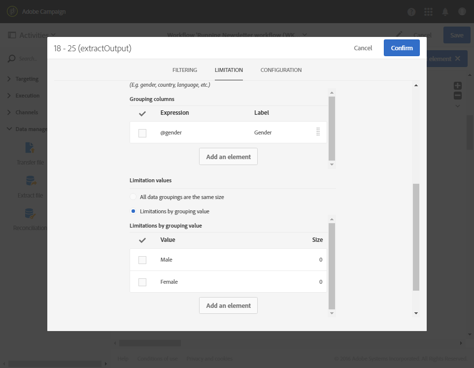

# Segmentering{#segmentation}

## Beskrivning {#description}

Med aktiviteten **[!UICONTROL Segmentation]** kan du skapa ett eller flera segment från en population som beräknas av aktiviteter som placerats tidigare i arbetsflödet.  I slutet av aktiviteten kan de bearbetas i en eller olika övergångar.

>[!NOTE]
>
>Som standard kan en användare i den inkommande populationen endast tillhöra ett segment.  Filtren läggs till i den ordning som segmenten i aktiviteten har.

**Relaterade ämnen:**
* [Användningsfall: Segmentering på plats](../../automating/using/workflow-segmentation-location.md)
* [Användningsfall: Segmentering efter åldersgrupper](../../automating/using/segmentation-age-groups.md)

## Kontext för användning {#context-of-use}

Aktiviteten **[!UICONTROL Segmentation]** placeras vanligtvis efter målaktiviteter (förfrågan, skärningspunkt, koppling, uteslutning etc.) för att definiera den standardpopulation som ska ligga till grund för segmenten.

**Relaterade ämnen**

* [Användningsfall: Segmentera profiler utifrån deras åldersgrupper](../../automating/using/segmentation-age-groups.md).

## Konfiguration {#configuration}

1. Dra och släpp en **[!UICONTROL Segmentation]**-aktivitet i arbetsflödet.
1. Markera aktiviteten och öppna den sedan med -knappen bland de snabbåtgärder som visas.
1. I **[!UICONTROL General]** väljer du **[!UICONTROL Resource type]** som segmenteringen ska genomföras på:

   * **[!UICONTROL Database resource]** om segmenteringen utförs på data som redan finns i databasen. Markera **[!UICONTROL Filtering dimension]** beroende på vilka data du vill segmentera. Som standard segmenteras **profilerna**.
   * **[!UICONTROL Temporary resource]** Om segmenteringen utförs på arbetsflödets tillfälliga data, markera den **[!UICONTROL Targeted set]** som innehåller den datan som ska segmenteras.  Detta kan inträffa när du har importerat en fil eller när data i databasen har berikats.

1. Välj den typ av utgående transition som du vill använda:

   * **[!UICONTROL Generate one transition per segment]**: en utgående transition läggs till för varje konfigurerat segment i slutet av aktiviteten.
   * **[!UICONTROL Generate all segments in one transition]**: samtliga konfigurerade segment grupperas om till en enda utgående transition.  Ange transitions-etiketten.  Medlemmarna i varje segment behåller den segmentkod som de har tilldelats.

1. Lägg till ett segment med knappen  eller **[!UICONTROL Add an element]** och ange standardegenskaperna:

   * **[!UICONTROL Do not activate the transition if the population is empty]**: segmentet aktiveras bara om data har hämtats.
   * **[!UICONTROL Filter initial population (query)]**: använder du för att filtrera segmentets population.
   * **[!UICONTROL Limit segment population]**: använder du för att begränsa storleken på segmentet.
   * **[!UICONTROL Filter and limit segment population]**: här kan du filtrera populationen av segmentet och begränsa dess storlek.
   * **[!UICONTROL Label]**: segmentets etikett.
   * **[!UICONTROL Segment code]**: kod som tilldelats segmentpopulationen.Segmentkoden kan anpassas med ett standarduttryck och händelsemariabler (se [den här sidan](../../automating/using/customizing-workflow-external-parameters.md)).
   * **[!UICONTROL Exclude segment from population]**: gör så att du kan utesluta det angivna segmentet från aktivitetens utgående population.  Det här alternativet kan endast användas om alternativet **[!UICONTROL Generate all segments in the same transition]** är markerat.

   

1. Öppna detaljvyn för segmentet för att komma åt segmentets konfigurationsalternativ.  Detta gör du genom att markera den relevanta rutan i aktivitetens segmentlista och sedan välja .
1. Om alternativet för att filtrera den inledande populationen är markerad så öppnar du fliken **[!UICONTROL Filter]** och anger segmentets population.  Filtren baseras på den filtreringsdimension som valts i steg 4.  Mer information om populationsfiltrering hittar du i avsnittet [Redigering av förfrågningar](../../automating/using/editing-queries.md) .

   Om segmenteringen utförs på en tillfällig resurs är antalet och förhandsgranskningen av populationen inte tillgänglig i den här fliken.

1. Om alternativet för att begränsa segmentstorleken är markerat öppnar du flik **[!UICONTROL Limitation]**.

   Välj först det **[!UICONTROL Type of limit]** som du vill använda:

   * **[!UICONTROL Random sampling]**: segmentpopulationen väljs vid behov slumpmässigt med **[!UICONTROL Filter]** flikens konfiguration i beaktning.
   * **[!UICONTROL Ordered sampling]**: segmentpopulationen väljs enligt sortering.  Du måste därför ange vilka kolumner som ska beaktas och vilken typ av sortering som ska användas.  Om du exempelvis markerar fältet **Ålder** som sorteringskolumn när du använder en **[!UICONTROL Descending sort]** och anger en gräns på 100 så behålls endast profilerna för de 100 äldsta personerna.

   Ange nu storleken **[!UICONTROL Limit]** av segmentet:

   * **[!UICONTROL Size (as a % of the initial population)]**: Ange segmentets storlek genom att använda en procentandel av aktivitetens ursprungliga population.
   * **[!UICONTROL Maximum size]**: Ange maximalt antal medlemmar för segmentpopulationen.
   * **[!UICONTROL By data grouping]**: Du kan begränsa segmentpopulationen enligt värdena för ett specifikt fält i den inkommande populationen.  Markera fältet för gruppering och ange sedan vilka värden som ska användas.
   * **[!UICONTROL By data grouping (as a %)]**: Du kan begränsa segmentpopulationen enligt värdena i ett specifikt fält för inkommande population genom att använda en procentandel.  Markera fältet som du vill använda grupperingen i och ange sedan vilka värden som ska användas.

      >[!NOTE]
      >
      >Olika begränsningar för varje enskilt värde kan användas.  Du kan exempelvis ange en gruppering för fält **[!UICONTROL Gender]** och begränsa populationen med **[!UICONTROL Male]**-medlemmar till 10 och **[!UICONTROL Female]**-medlemmar till 30 personer.  Om du använder flera fält för datagruppering måste alla grupperingar ha samma storlek.
   

1. Bekräfta konfigurationen av segmentet.
1. Lägg till så många segment som behövs genom att upprepa steg 6 till 10.
1. Redigera parametrarna i flik **[!UICONTROL Advanced options]** om det behövs:

   * Markera alternativet **[!UICONTROL Enable overlapping of outbound populations]** om du vill att en medlem i den inkommande populationen samtidigt ska tillhöra flera segment.  Den utgående population av aktiviteten kan överskrida den inkommande populationen.
   * Markera alternativet **[!UICONTROL Concatenate the code of each segment]** om den inkommande populationen redan har tilldelats en segmentkod som du vill behålla.  Segmentkoden som anges i aktiviteten läggs till i den inledande segmentkoden.
   * Markera alternativet **[!UICONTROL Generate complement]** om du vill utnyttja den återstående populationen. Se [Användningsfall: Skapa leveranser med ett komplement](../../automating/using/workflow-created-query-with-complement.md).

1. Bekräfta aktivitetens konfiguration och spara arbetsflödet.
