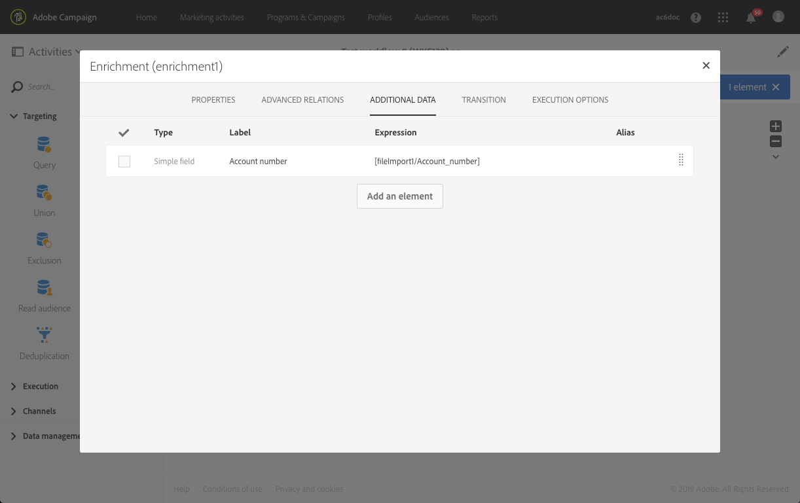

# Skicka ett e-postmeddelande med fördjupade fält {#sending-email-enriched-fields}

<!--A new example showing how to send an email containing additional data retrieved from a load file activity has been added. [Read more](example-2-email-with-enriched-fields)-->

Aktiviteten för att läsa in filer gör det även möjligt att skicka ett e-postmeddelande som har berikats med ytterligare data från en extern fil i samma arbetsflöde.

I exemplet nedan visas hur du skickar ett e-postmeddelande med ytterligare data som hämtats från en extern fil via inläsningsfilaktiviteten. I det här exemplet innehåller den externa filen en lista med profiler med tillhörande kontonummer. Du vill importera dessa data för att skicka ett e-postmeddelande till varje profil med deras kontonummer.

Så här skapar du arbetsflödet:

1. Dra och släpp en [Query](../../automating/using/query.md) -aktivitet i arbetsflödet och öppna den för att definiera huvudmålet.

   <!--The Query activity is presented in the [Query](../../automating/using/query.md) section.-->

1. Dra och släpp en [Läs in fil](../../automating/using/load-file.md) -aktivitet för att tilldela vissa data till en profil. I det här exemplet läser du in en fil som innehåller kontonummer som motsvarar vissa profiler i databasen.

   

1. Dra och släpp en [anrikningsaktivitet](../../automating/using/enrichment.md) i arbetsflödet och länka inläsningsfilen och frågeaktiviteterna till den.

1. På fliken **[!UICONTROL Advanced relations]** för anrikningsaktiviteten markerar du **[!UICONTROL 0 or 1 cardinality simple link]** och definierar fälten som ska användas för avstämning. Här använder vi efternamnet för att stämma av data med databasprofilerna.

   

1. Markera de element som du vill använda i e-postmeddelandet på **[!UICONTROL Additional data]** fliken. Här väljer du Kontonummer (kolumn från filen som du hämtade genom inläsningsfilaktiviteten).

   

   <!---->

   Mer information finns i [anrikningsavsnittet](../../automating/using/enrichment.md) .

1. Dra och släpp en [segmenteringsaktivitet](../../automating/using/segmentation.md) i arbetsflödet och öppna den för att förfina huvudmålet.

   

   Mer information finns i avsnittet [Segmentering](../../automating/using/segmentation.md) .

1. Dra och släpp en [e-postleveransaktivitet](../../automating/using/email-delivery.md) i arbetsflödet och öppna den.

   <!--The Email delivery activity is presented in the [Email delivery](../../automating/using/email-delivery.md) section.-->

1. Lägg till ett anpassningsfält och välj de ytterligare data som definieras i anrikningsaktiviteten (här kontonummer) från **[!UICONTROL Additional data (targetData)]** noden. Detta gör att kontonumret för varje profil i e-postinnehållet kan hämtas dynamiskt.

   

1. Spara e-postmeddelandet och starta arbetsflödet.

E-postmeddelandet skickas till målet. Varje profil får e-postmeddelandet med motsvarande kontonummer.

