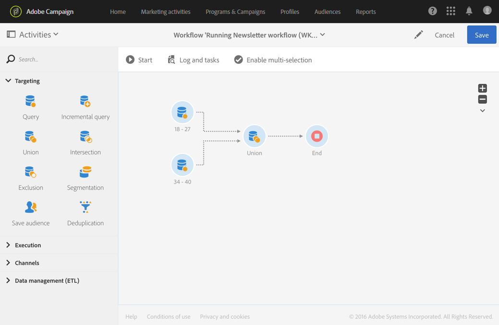

# Sammanslutning{#union}

## Beskrivning {#description}

Med den här **[!UICONTROL Union]** aktiviteten kan du gruppera om resultatet av flera aktiviteter till ett enda mål.

>[!NOTE]
>
>Uppsättningarna behöver inte nödvändigtvis vara homogena.

## Kontext för användning {#context-of-use}

Aktiviteten **[!UICONTROL Union]** används exempelvis för att kombinera populationer från inkommande övergångar när en segmentering utförs, en målgrupp definieras eller när ett meddelandemål förbereds.  

**Relaterade ämnen:**

* [Användningsexempel: Förena på två förfinade målgrupper](../../automating/using/union-on-two-refined-audiences.md)

## Konfiguration {#configuration}

1. Dra och släpp en **[!UICONTROL Union]**-aktivitet i arbetsflödet.
1. Koppla det till andra aktiviteter som kommer före det som exempelvis förfrågningar.
1. Markera aktiviteten och öppna den sedan med knappen  bland de snabbåtgärder som visas.
1. Välj **[!UICONTROL Reconciliation type]** för att definiera hur dubbletter från konfrontationer mellan inkommande populationer ska hanteras:

   * **[!UICONTROL Keys only]**: detta är standardläget.  Aktiviteten behåller endast ett element när element från olika inkommande övergångar har samma nyckel.  Detta alternativ kan endast användas om de inkommande populationerna är homogena.
   * **[!UICONTROL All shared columns]**: Data avstäms utifrån alla kolumner som är gemensamma med de inkommande övergångarna.  Du måste därför välja den primära uppsättning som ska behållas utifall att det finns en dubblett.  Det här alternativet kan användas om måldimensionerna för den inkommande populationen är olika.
   * **[!UICONTROL A selection of columns]**: Välj detta alternativ om du vill definiera listan med kolumner som datavstämningen ska tillämpas på. Du måste först markera den primära uppsättningen (som innehåller källdata) och sedan de kolumner som ska användas för kopplingen.

1. Markera rutan **[!UICONTROL Use common additional data only]** om du endast vill behålla den ytterligare data som finns i alla inkommande övergångar.
1. Om du vill begränsa storleken på den slutliga populationen markerar du ruta **[!UICONTROL Limit size of generated population]**.  Storleken kan anges i fält **[!UICONTROL Maximum number of records]**.
1. Hantera aktivitetens [övergångar](../../automating/using/activity-properties.md) vid behov för att komma åt de avancerade alternativen för den beräknade populationen.
1. Bekräfta aktivitetens konfiguration och spara arbetsflödet.

## Exempel {#example}

Följande exempel visar resultatet av två förfrågningsaktiviteter som syftar till att gruppera om profiler från Adobe Campaign-databasen som är mellan 18-27 år gamla och de som är mellan 34-40 år gamla.  Resultatet innehåller alla profiler för de två förfrågningarna eller det maximala antalet poster (om tillämpligt) som anges i konfigurationen.

