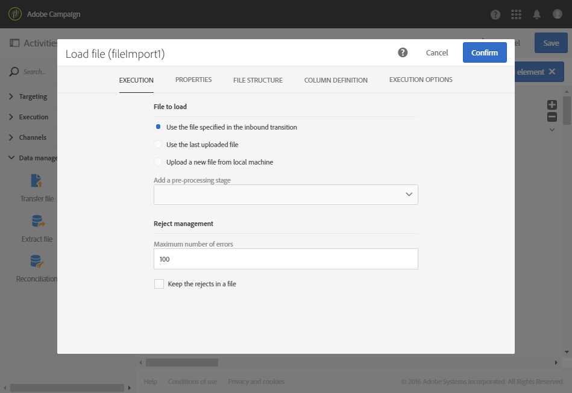

# Uppdatera data baserat på en automatisk filhämtning {#updating-data-automatic-file-download}

Aktiviteten för Inläsningsfilen strukturerar huvudsakligen data från en aktivitet av en överföringsfil för att integrera dem i befintlig data.

I följande exempel visas resultatet av en automatiskt nedladdad filaktivitet via en aktivitet för en överföringsfil följt av en aktivitet för uppdateringsdata.  Det här arbetsflödet syftar till att förbättra Adobe Campaign-databasen med nya profiler eller att uppdatera befintliga profiler med hjälp av data som har återställts från den importerade filen.

Så här skapar du arbetsflödet:

1. Dra och släpp en [överföringsfil](../../automating/using/transfer-file.md)-aktivitet i arbetsflödet.
1. Markera aktiviteten och öppna den sedan med knappen  bland de snabbåtgärder som visas.
1. Konfigurera aktiviteten så att den återställer filen som du vill ha. Välj **[!UICONTROL Protocol]** SFTP **i flik**.
1. Markera alternativet **. Använd anslutningsparametrar som har definierats i ett externt konto**.
1. Ange namnet på det externa kontot.
1. Ange **filsökvägen för fjärrservern**.

   

1. Bekräfta din aktivitet.
1. Dra och släpp en [Läs in fil](../../automating/using/load-file.md)-aktivitet i arbetsflödet och placera den efter **[!UICONTROL Transfer file]**-aktiviteten.
1. Markera aktiviteten och öppna den sedan med knappen  bland de snabbåtgärder som visas.
1. I **[!UICONTROL File to load]**-avsnittet på fliken **[!UICONTROL Execution]**, kryssa i **[!UICONTROL Use the file specified in the inbound transition]**-rutan.

   

1. Konfigurera din aktivitet enligt den tidigare specifikationen.
1. Dra och släpp en [Uppdatera data](../../automating/using/update-data.md)-aktivitet i ditt arbetsflöde och placera den efter **[!UICONTROL Load file]**-aktiviteten och konfigurera den.

När arbetsflödet har startats extraheras data från den överförda filen och används sedan för att utöka Adobe Campaign-databasen.
