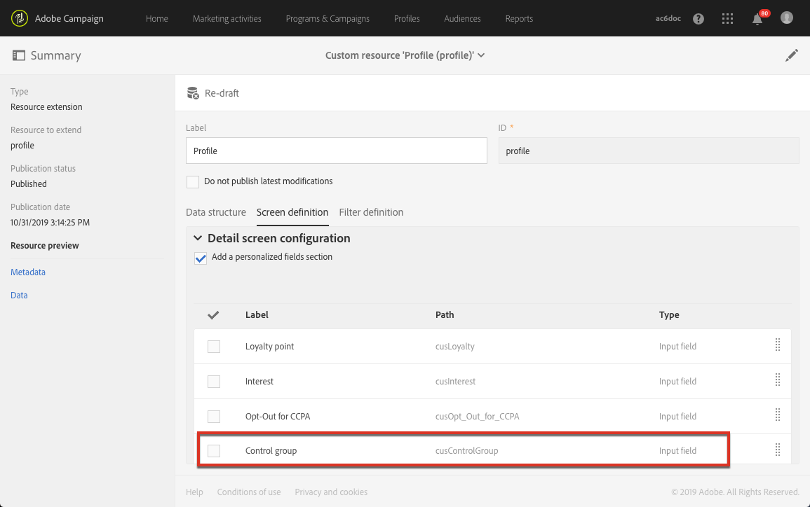
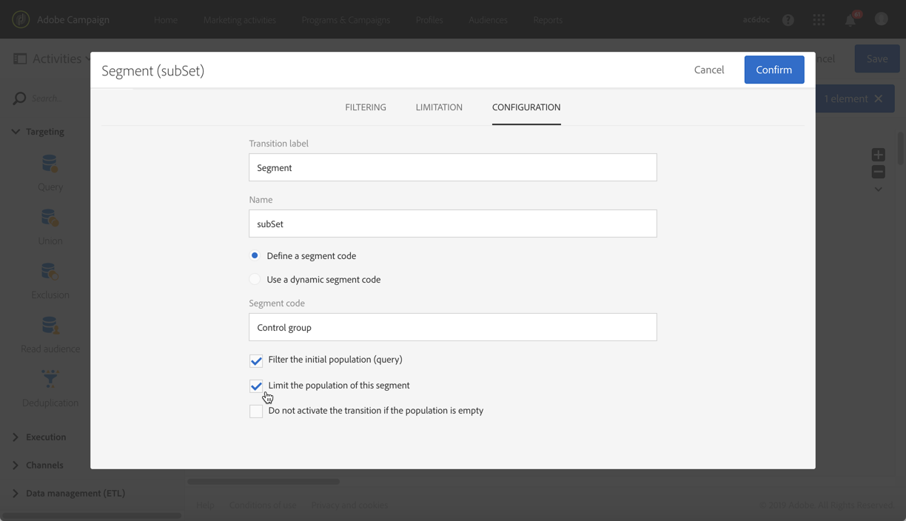

# Användningsfall för arbetsflöde: Bygga en kontrollgrupp {#building-control-group}

Om du vill mäta effekten av en leverans kanske du vill utesluta vissa profiler från målet så att de inte får ett visst meddelande. Den här kontrollgruppen kan användas för att göra en jämförelse med beteendet hos målpopulationen som tog emot meddelandet.

Om du vill göra det i Adobe Campaign Standard kan du skapa ett arbetsflöde med följande aktiviteter:
* En Query-aktivitet för att ange en angiven population som mål.
* En segmenteringsaktivitet för att isolera en slumpmässig kontrollgrupp från denna population.
* En e-postleveransaktivitet som skickar ett meddelande till huvudmålet.
* En Uppdatera dataaktivitet för att uppdatera de profiler som uteslöts från målet (den slumpmässiga kontrollgruppen).

## Utöka profilresursen {#extending-profile}

Först måste du utöka **[!UICONTROL Profile]** resursen med ett nytt fält som motsvarar kontrollgruppen. När arbetsflödet har körts kontrolleras det här fältet för de profiler som har uteslutits från målet.

1. Från **[!UICONTROL Administration]** > **[!UICONTROL Development]** > **[!UICONTROL Custom Resources]** klickar du **[!UICONTROL Create]**.
1. Om du inte har förlängt den än markerar du **[!UICONTROL Extend an existing resource]** och väljer **[!UICONTROL Profile]** resursen.
1. Lägg till ett nytt fält för kontrollgruppen på **[!UICONTROL Data structure]** fliken och välj **[!UICONTROL Boolean]** för **[!UICONTROL Type]** fältet.

   

1. Öppna **[!UICONTROL Screen definition]** **[!UICONTROL Detail screen configuration]** fliken och visa avsnittet som du just har skapat så att det visas för varje profil.

   

1. Spara ändringarna.
1. Uppdatera databasstrukturen för att publicera den **[!UICONTROL Profile]** utökade resursen. Se [Publicera en anpassad resurs](../../developing/using/updating-the-database-structure.md#publishing-a-custom-resource).

Mer information om hur du utökar en anpassad resurs finns i [Nyckelsteg för att lägga till en resurs](../../developing/using/key-steps-to-add-a-resource.md).

## Skapa ett arbetsflöde {#creating-a-workflow}

1. Klicka **[!UICONTROL Marketing Activities]** i **[!UICONTROL Create]** och markera **[!UICONTROL Workflow]**.
1. Välj **[!UICONTROL New Workflow]** som arbetsflödestyp och klicka på **[!UICONTROL Next]**.
1. Ange arbetsflödets egenskaper och klicka på **[!UICONTROL Create]**.

De detaljerade stegen för att skapa ett arbetsflöde visas i avsnittet [Skapa ett arbetsflöde](../../automating/using/building-a-workflow.md) .

## Skapa en frågeaktivitet {#create-a-query-activity}

1. I **[!UICONTROL Activities]** > **[!UICONTROL Targeting]** drar och släpper du en **[!UICONTROL Query activity]**.
1. Dubbelklicka på aktiviteten för att definiera ditt mål.
1. I **[!UICONTROL Shortcuts]** till exempel dra och släpp **[!UICONTROL Profile]** väljer du **[!UICONTROL Age]** med operatorn **[!UICONTROL Greater than]** och skriver 25 i **[!UICONTROL Value]** fältet.
1. Klicka på **[!UICONTROL Confirm]**.

De detaljerade stegen för att skapa en Query-aktivitet finns i avsnittet [Fråga](../../automating/using/query.md) .

## Skapa en segmenteringsaktivitet {#creating-a-segmentation-activity}

1. Dra och släpp en **[!UICONTROL Segmentation]** aktivitet och dubbelklicka på den.
1. Markera ett segment som du vill redigera på fliken **[!UICONTROL Segments]** .
1. Välj **[!UICONTROL Configuration]** alternativet på fliken **[!UICONTROL Limit the population of this segment]** i det segmentet.

   

1. Kontrollera att **[!UICONTROL Limitation]** alternativet är markerat på fliken **[!UICONTROL Random sampling]** .

   

1. Definiera en procentandel av den inledande populationen, till exempel 10 %, och klicka på **[!UICONTROL Confirm]**. Kontrollgruppen består av 10% från den målpopulation som väljs ut slumpmässigt.
1. Markera alternativet på **[!UICONTROL Advanced options]** fliken och fyll i **[!UICONTROL Generate complement]** fälten **[!UICONTROL Transition label]** och **[!UICONTROL Segment code]** .

   

1. Klicka på **[!UICONTROL Confirm]**.

De detaljerade stegen för att skapa en segmenteringsaktivitet finns i avsnittet [Segmentering](../../automating/using/segmentation.md) .

## Skapa en e-postaktivitet {#creating-an-email-activity}

1. I **[!UICONTROL Activities]** > **[!UICONTROL Channels]** drar och släpper du ett **[!UICONTROL Email Delivery]** efter huvudmålsegmentet.
1. Klicka på aktiviteten och välj  för att redigera den.
1. Markera **[!UICONTROL Single send email]** och klicka **[!UICONTROL Next]**.
1. Välj en e-postmall och klicka på **[!UICONTROL Next]**.
1. Ange e-postegenskaperna och klicka på **[!UICONTROL Next]**.
1. Om du vill skapa layouten för e-postmeddelandet klickar du på **[!UICONTROL Use the Email Designer]**.
1. Redigera och spara innehållet.
1. Avmarkera alternativet **[!UICONTROL Schedule]** [!UICONTROL-begäran som bekräftelse innan meddelanden skickas, **** i delen av meddelandekontrollpanelen.

De detaljerade stegen för att skapa en e-postaktivitet finns i avsnittet [E-postleverans](../../automating/using/email-delivery.md) .

## Skapa en datauppdateringsaktivitet {#creating-update-data-activity}

1. Dra och släpp en **[!UICONTROL Update data]** aktivitet efter kontrollgruppssegmentet.
1. Markera aktiviteten och öppna den sedan med knappen  bland de snabbåtgärder som visas.
1. Välj **[!UICONTROL General]** från **[!UICONTROL Update]** **[!UICONTROL Operation type]** listrutan på fliken.
1. Välj **[!UICONTROL Identification]** alternativet på **[!UICONTROL Directly using the targeting dimension]** fliken.
1. Välj den **[!UICONTROL Profile]** resurs som du tidigare har utökat som dimension att uppdatera.

   

1. På **[!UICONTROL Fields to update]** fliken väljer du kontrollgruppsfältet som du lade till i **[!UICONTROL Profile]** resursen som **[!UICONTROL Destination]** och anger true som villkor.

   

1. Klicka på **[!UICONTROL Confirm]**.

De detaljerade stegen för att skapa aktiviteten Uppdatera data finns i avsnittet [Uppdatera data](../../automating/using/update-data.md) .

## Köra arbetsflödet {#running-the-workflow}

Klicka **[!UICONTROL Start]** för att köra arbetsflödet.

När arbetsflödet har körts utesluts kontrollgruppens ifyllning och meddelandet skickas till det återstående huvudmålet.

Resursen **[!UICONTROL Profile]** uppdateras enligt följande: om en profil fanns i kontrollgruppen, kontrolleras motsvarande fält.

Du kan nu jämföra hur mottagarna av meddelandet kommer att reagera jämfört med den lilla grupp som uteslöts från meddelandet och inte fått det.

## Återanvända samma kontrollgrupp {#reusing-same-control-group}

I exemplet ovan kan du skapa en global kontrollgrupp eftersom den lagras som ett profilattribut oberoende av leveranser. Det nya kontrollgruppsfältet som skapades som en del av **[!UICONTROL Profile]** resurstillägget uppdateras när arbetsflödet ovan har körts.

Nästa gång du vill använda samma kontrollgrupp kan du alltså segmentera i det nya kontrollgruppsfältet i stället för att göra en slumpmässig segmentering.

Så här gör du:
1. När du skapar **[!UICONTROL Segmentation]** aktiviteten markerar du det segment som ska redigeras på **[!UICONTROL Segments]** fliken.
1. Se till att du inte markerar **[!UICONTROL Configuration]** alternativet på fliken **[!UICONTROL Limit the population of this segment]** för det segmentet.
1. Dra och släpp **[!UICONTROL Filtering]** till huvudarbetsytan på **[!UICONTROL Profiles (attributes)]** fliken.

   

1. I **[!UICONTROL Add a rule - Profiles (attributes)]** fönstret väljer du &quot;Kontrollgrupp&quot; (fältet som du lade till i **[!UICONTROL Profile]** resursen) och väljer **[!UICONTROL Yes]** som filtervillkor.

   