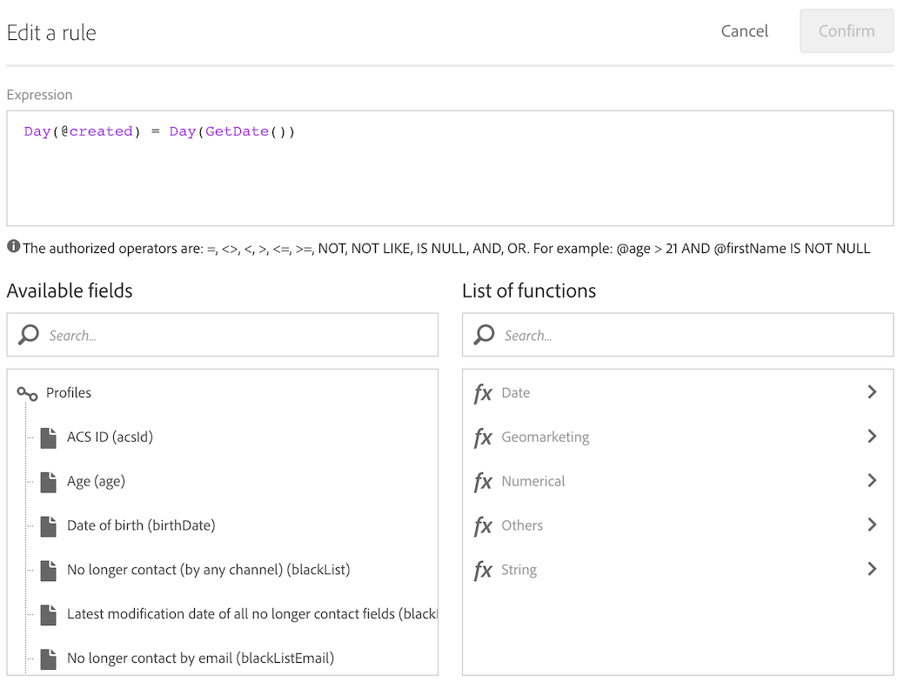

# Skapa leveranser på profilens skapandedatum {#creation-date-query}

Du kan skicka ett erbjudande via e-post samma dag som kundens profil skapas.

1. I **[!UICONTROL Marketing Activities]**, klicka på **[!UICONTROL Create]** och markera **[!UICONTROL Workflow]**.
1. Välj **[!UICONTROL New Workflow]** som arbetsflödestyp och klicka på **[!UICONTROL Next]**.
1. Ange arbetsflödets egenskaper och klicka på **[!UICONTROL Create]**.

## Skapa en schemaläggningsaktivitet {#creating-a-scheduler-activity}

1. I **[!UICONTROL Activities]** > **[!UICONTROL Execution]** drar och släpper du en [schemaläggaraktivitet](../../automating/using/scheduler.md).
1. Dubbelklicka på aktiviteten.
1. Konfigurera leveransen.
1. I **[!UICONTROL Execution frequency]** väljer du **[!UICONTROL Daily]**.
1. Välj en **[!UICONTROL Time]** och **[!UICONTROL Repetition frequency]** för körning för ditt arbetsflöde.
1. Välj ett **[!UICONTROL Start]**-datum och **[!UICONTROL Expiration]** för ditt arbetsflöde.
1. Bekräfta aktiviteten och spara arbetsflödet.

>[!NOTE]
>
>Om du vill starta arbetsflödet vid en viss tidszon ställer du in tidszonen för schemaläggaren i fältet **[!UICONTROL Time zone]** på fliken **[!UICONTROL Execution options]**. Som standard är den markerade tidszonen den som definieras i arbetsflödesegenskaperna (se [Skapa ett arbetsflöde](../../automating/using/building-a-workflow.md)).


## Skapa en förfrågningsaktivitet{#creating-a-query-activity}

1. Om du vill välja mottagare drar och släpper du en [Query](../../automating/using/query.md)-aktivitet och dubbelklickar på den.
1. Lägg till **[!UICONTROL Profiles]** och välj **[!UICONTROL no longer contact by email]** med värdet **[!UICONTROL no]**.

### Hämtar profiler som skapats samma dag som körningsdagen {#retrieving-profiles-created-on-the-same-day}

1. Dra och släpp fältet **[!UICONTROL Created]** i **[!UICONTROL Profile]**. och klicka på **[!UICONTROL Advanced Mode]**.
   
1. Dubbelklicka på **[!UICONTROL Day]** från noden **[!UICONTROL Date]** i **[!UICONTROL list of functions]**.
1. Infoga sedan fältet **[!UICONTROL Created]** som argument.
1. Välj **[!UICONTROL equals to (=)]** som operator.
1. För Värde väljer du **[!UICONTROL Day]** från noden **[!UICONTROL Date]** i **[!UICONTROL List of functions]**.
1. Infoga funktionen **[!UICONTROL GetDate()]** som argument.

Du har hämtat profiler där skapandedagen är lika med den aktuella dagen.

Du borde sluta med:

```Day(@created) = Day(GetDate())```



Klicka på **[!UICONTROL Confirm]**.

### Hämtar profiler som skapats samma månad som körningsmånaden{#retrieving-profiles-created-on-the-same-month}

1. Markera den första frågan och duplicera den i **[!UICONTROL Query]**-redigeraren.
1. Öppna dubbletten.
1. Ersätt **[!UICONTROL Day]** med **[!UICONTROL Month]** i frågan.
1. Klicka på **[!UICONTROL Confirm]**.


Du borde få det här:

``` Month(@created) = Month(GetDate()) ```

Den sista frågan visar:

```Day(@created) = Day(GetDate()) AND Month(@created) = Month(GetDate())```


## Skapa en e-postleverans{#creating-an-email-delivery}

1. Dra och släpp en [e-postleverans](../../automating/using/email-delivery.md)-aktivitet.
1. Klicka på aktiviteten och välj  för att redigera.
1. Markera **[!UICONTROL Recurring email]** och klicka på **[!UICONTROL Next]**.
1. Välj en e-postmall och klicka på **[!UICONTROL Next]**.
1. Ange e-postegenskaperna och klicka på **[!UICONTROL Next]**.
1. Om du vill skapa layouten för e-postmeddelandet klickar du på **[!UICONTROL Email Designer]**.
1. Infoga element eller välj en befintlig mall.
1. Anpassa e-postmeddelandet med fält och länkar.
Mer information finns i [Utforma ett e-postmeddelande](../../designing/using/designing-from-scratch.md#designing-an-email-content-from-scratch).
1. Klicka på **[!UICONTROL Preview]** för att kontrollera layouten.
1. Klicka på **[!UICONTROL Save]**.

**Relaterade ämnen:**

* [E-postkanal](../../channels/using/creating-an-email.md)
