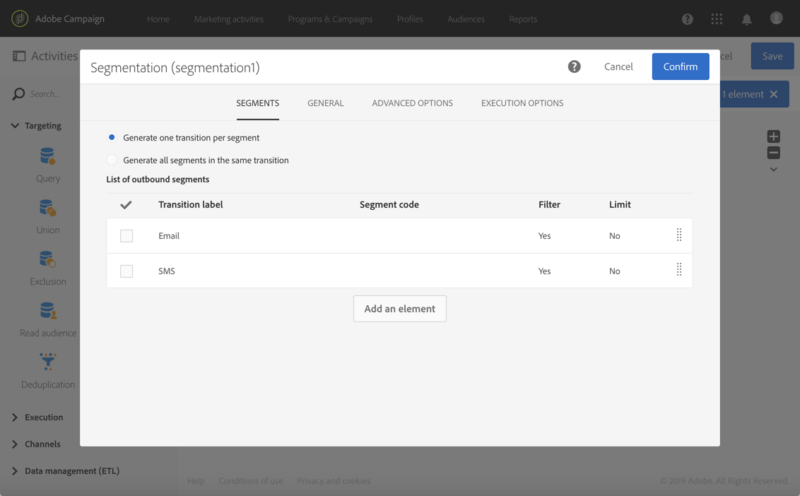
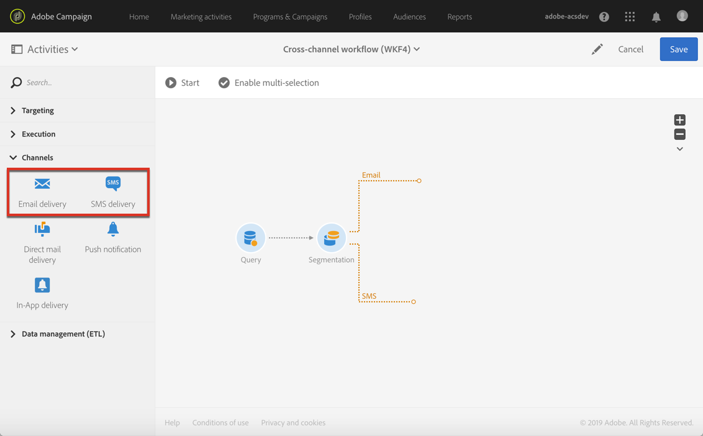

# Användningsfall för arbetsflöde: Skapa en flerkanalsleverans{#cross-channel-delivery}

I det här dokumentet kan du identifiera följande funktioner i Adobe Campaign via ett standardanvändningsexempel: skapa ett arbetsflöde för flerkanalsleverans.

Målet här är att välja en målgrupp bland mottagarna av databasen och segmentera dem i två olika grupper i syfte att skicka ett e-postmeddelande till den första gruppen och ett SMS-meddelande till den andra gruppen.

Mer information om arbetsflöden och de olika kanaler som är tillgängliga i Adobe Campaign finns i följande dokument:

* [Identifiera arbetsflöden](../../automating/using/get-started-workflows.md)
* [Identifiera kommunikationskanaler](../../channels/using/get-started-communication-channels.md)

## Skapa ett arbetsflöde {#creating-workflow}

Om du vill skicka två olika leveranser till en viss grupp måste du först definiera ditt mål.

För att kunna göra detta måste du skapa en fråga som identifierar mottagarna, och därför måste du skapa ett arbetsflöde.

Skapa ett nytt arbetsflöde i det program eller den kampanj du vill använda:

1. Klicka **[!UICONTROL Marketing Activities]** i **[!UICONTROL Create]** och markera **[!UICONTROL Workflow]**.
1. Välj **[!UICONTROL New Workflow]** som arbetsflödestyp och klicka på **[!UICONTROL Next]**.
1. Ange arbetsflödets egenskaper och klicka på **[!UICONTROL Create]**.

De detaljerade stegen för att skapa ett arbetsflöde visas i avsnittet [Skapa ett arbetsflöde](../../automating/using/building-a-workflow.md) .

## Skapa en frågeaktivitet {#creating-query-activity}

När arbetsflödet har skapats kan du komma åt dess gränssnitt.

Infoga en Query-aktivitet i arbetsflödet för att ange de profiler som ska ta emot dina leveranser som mål.

1. I **[!UICONTROL Activities]** > **[!UICONTROL Targeting]** drar och släpper du en **[!UICONTROL Query activity]**.
1. Dubbelklicka på aktiviteten.
1. Bläddra bland kortkommandona på **[!UICONTROL Target]** fliken och välj en av dina [målgrupper](../../audiences/using/about-audiences.md).
1. Dra och släpp kortkommandot i redigeringszonen. Beroende på vilken typ av genväg du väljer visas ett fönster.
1. Konfigurera målinriktningselementen och bekräfta sedan frågan.

Du kan skapa en fråga för ett eller flera element.

Använd knappen **[!UICONTROL Count]** för att se en uppskattning av antalet profiler som används av frågan.

De detaljerade stegen för att skapa en Query-aktivitet finns i avsnittet [Fråga](../../automating/using/query.md) .

## Skapa en segmenteringsaktivitet {#creating-segmentation-activity}

När målet har identifierats av aktiviteten Fråga måste du välja ett villkor för att segmentera målet i två olika populationer: en får ett mejl och den andra får ett SMS.

Du måste använda en segmenteringsaktivitet för att skapa ett eller flera segment från en population som beräknas uppströms i en fråga.

Gruppen **E-post** riktar sig till mottagare som har en definierad e-postadress men inget mobiltelefonnummer. Gruppen **SMS** kommer att innehålla de mottagare vars mobiltelefonnummer sparas i deras profil.

Så här konfigurerar du den första övergången (e-post):

1. Som standard finns det ett första segment på **[!UICONTROL Segments]** fliken. Redigera egenskaperna för att konfigurera det segmentet.

   

1. Välj profilens **[!UICONTROL Email]** filtervillkor.

   

1. I det nya fönstret som visas på skärmen väljer du **[!UICONTROL Is not empty]** operatorn .

   

1. Lägg till ett andra filtreringsvillkor **[!UICONTROL Mobile]** och välj operatorn **[!UICONTROL Is empty]**.

   

   Alla profiler som kommer från frågan och som har ett e-postmeddelande, men inte ett mobiltelefonnummer definierat, kommer att vara i den här övergången.

1. Om du vill göra arbetsflödet tydligare kan du redigera övergångsetiketten. Bekräfta ändringarna.

   

Din första övergång är konfigurerad. Så här konfigurerar du den andra övergången (SMS):

1. Klicka på **[!UICONTROL Add an element]** knappen för att lägga till en ny övergång.
1. Definiera ett villkor som gör att du kan hämta alla profiler vars mobiltelefonnummer har angetts. Det gör du genom att skapa en regel i **[!UICONTROL Mobile]** fältet med den **[!UICONTROL Is not empty]** logiska operatorn.

   

   Alla profiler som kommer från frågan och som har ett definierat mobiltelefonnummer kommer att vara i den här övergången.

1. Du kan redigera övergångens etikett. Bekräfta ändringarna.

Din andra övergång är nu också konfigurerad.

De detaljerade stegen för att skapa en segmenteringsaktivitet finns i avsnittet [Segmentering](../../automating/using/segmentation.md) .

## Skapa leveranser {#creating-deliveries}

När två övergångar redan har skapats måste du nu lägga till två typer av leveranser till de utgående övergångarna för segmenteringsaktiviteten: en **[!UICONTROL Email delivery]** och en **[!UICONTROL SMS delivery]**.

Med Adobe Campaign kan ni lägga till leveranser i ett arbetsflöde. Det gör du genom att välja en leverans i **[!UICONTROL Channels]** kategorin på aktivitetspaletten i arbetsflödet.

Så här skapar du en e-postleverans:

1. Dra och släpp ett **[!UICONTROL Email delivery]** efter det första segmentet.
1. Dubbelklicka på aktiviteten för att redigera den.
1. Välj **[!UICONTROL Simple email]**.
1. Markera **[!UICONTROL Add an outbound transition with the population]** och klicka **[!UICONTROL Next]**.

   

   Med den utgående övergången kan du återställa populationen och spårningsloggarna. Du kan till exempel använda det här alternativet för att skicka ett andra e-postmeddelande till personer som inte klickade i det första meddelandet.

1. Välj en e-postmall och klicka på **[!UICONTROL Next]**.
1. Ange e-postegenskaperna och klicka på **[!UICONTROL Next]**.
1. Om du vill skapa layouten för e-postmeddelandet väljer du **[!UICONTROL Use the Email Designer]**.
1. Redigera och spara innehållet.
1. Avmarkera alternativet **[!UICONTROL Schedule]** [!UICONTROL-begäran som bekräftelse innan meddelanden skickas, **** i delen av meddelandekontrollpanelen.

De detaljerade stegen för att skapa en e-postaktivitet finns i avsnittet [E-postleverans](../../automating/using/email-delivery.md) .

Så här skapar du en SMS-leverans:

1. Dra och släpp ett **[!UICONTROL SMS delivery]** efter det andra segmentet.
1. Dubbelklicka på aktiviteten för att redigera den.
1. Markera **[!UICONTROL SMS]** och klicka **[!UICONTROL Next]**.
1. Välj en SMS-mall och klicka på **[!UICONTROL Next]**.
1. Ange SMS-egenskaperna och klicka på **[!UICONTROL Next]**.
1. Redigera och spara innehållet.

De detaljerade stegen för att skapa en SMS-aktivitet finns i avsnittet [SMS-leverans](../../automating/using/sms-delivery.md) .

När leveransen har skapats och redigerats är arbetsflödet klart att startas.

## Köra arbetsflödet {#running-the-workflow}

När arbetsflödet har startats segmenteras den population som har valts av frågeaktiviteten för att ta emot en e-post- eller SMS-leverans.

Klicka på knappen i åtgärdsfältet för att köra arbetsflödet **[!UICONTROL Start]** .

Du kommer åt dina leveranser från menyn **[!UICONTROL Marketing plans]** > Avancerat **[!UICONTROL Marketing activities]** via Adobe Campaign-logotypen. Klicka på leveransmeddelandet och sedan på **[!UICONTROL Reports]** knappen för att komma åt [leveransrapporterna](../../reporting/using/about-dynamic-reports.md#accessing-dynamic-reports), till exempel leveranssammanfattningen, öppningsfrekvensen eller e-poståtergivningen enligt mottagarnas inkorg för meddelanden.