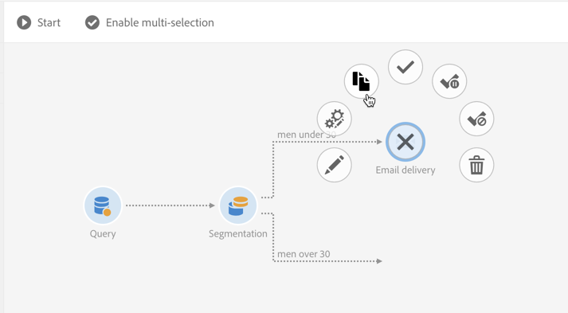

# Arbetsflödesgränssnitt{#workflow-interface}

Ni kan skapa arbetsflöden för att hantera hela processer i era kampanjer och program.

Skärmen för arbetsflödesredigering består av följande element:

* [Paletten](#palette) som refererar till tillgängliga aktiviteter.
* [Workspace](#workspace) där aktiviteterna är konfigurerade och ordnade.
* Åtgärdsfältet [Åtgärd](#action-bar), som består av knappar som gör att du kan interagera med arbetsflödet och/eller dess komponenter.
* Med [snabbåtgärderna](#quick-actions), som visas runt en markerad aktivitet, kan du interagera med den.

## Palett {#palette}

Paletten finns till vänster på skärmen. Alla tillgängliga aktiviteter är sorterade i flera kategorier:

* [Riktning](../../automating/using/about-targeting-activities.md): aktiviteter som är specifika för målgruppsanpassning, manipulering av populationsdata och filtrering
* [Körning](../../automating/using/about-execution-activities.md): aktiviteter som är specifika för att organisera och köra arbetsflöden
* [Kanaler](../../automating/using/about-channel-activities.md): aktiviteter som representerar olika tillgängliga kommunikationskanaler
* [Datahantering (ETL)](../../automating/using/about-data-management-activities.md): aktiviteter som är specifika för att hantera data

Om du vill använda en aktivitet från paletten i arbetsflödet drar och släpper du den på arbetsytan.

Du måste konfigurera varje aktivitet som läggs till från paletten innan du startar arbetsflödet.

## Workspace {#workspace}

Arbetsytan är den centrala zonen i arbetsflödesredigeraren. Det är i den här zonen som du kan släppa dina aktiviteter, länka samman dem med övergångar och konfigurera dem.

Om du vill länka två aktiviteter flyttar du pilslutet från den första aktiviteten till nästa tills de ansluter. Du kan också flytta aktiviteten mot pilen bakom för att länka den till föregående aktivitet. Om du flyttar någon av aktiviteterna kommer de att vara länkade.

Övergångar som följer på aktiviteter som behandlar data innehåller de mellanliggande populationerna. Du kan komma åt dem om du markerar alternativet **[!UICONTROL Keep interim results]** i avsnittet **[!UICONTROL Execution]** i arbetsflödesegenskaperna.

>[!CAUTION]
>
>Det här alternativet kräver mycket diskutrymme och är utformat för att hjälpa dig att skapa ett arbetsflöde och säkerställa korrekt konfiguration och beteende. Låt det vara omarkerat vid produktionsinstanser.

När en aktivitet är markerad visas snabbåtgärder runt aktiviteten så att du kan interagera med den. Om du till exempel vill konfigurera en aktivitet markerar du den och öppnar den sedan med knappen  i snabbåtgärderna.

Vissa funktioner är bara aktiverade på arbetsytan:

* Välj flera aktiviteter och övergångar genom att dra en zon runt dem.
* Tryck på **Ctrl** + vänsterklicka för att markera flera aktiviteter och/eller övergångar.
* Tryck på **Retur** om du vill visa detaljerna för den markerade aktiviteten eller övergången.
* Tryck på **Ta bort** om du vill ta bort den markerade aktiviteten.
* Tryck på **Ctrl + C** för att kopiera de markerade aktiviteterna och **Ctrl + V** för att klistra in dem på arbetsytan.

## Åtgärdsfält {#action-bar}

Beroende på vilka element som är markerade på arbetsytan eller arbetsflödets körningsstatus kan knapparna som är tillgängliga i åtgärdsfältet variera.

 **[!UICONTROL Open activity]** Gör att du kan redigera arbetsflödets egenskaper.

 **[!UICONTROL Start]** Startar arbetsflödet.

 **[!UICONTROL Pause]** Pausar arbetsflödet.

 **[!UICONTROL Stop]** Avbryter körningen av arbetsflödet. Det går inte att fortsätta från där den stoppades.

 **[!UICONTROL Restart]** Startar om arbetsflödet.

 **[!UICONTROL Log and tasks]** Öppnar arbetsflödets körningslogg.

 **[!UICONTROL Enable multi-selection]** Aktiverar flervalsläge. Arbetsflödet måste bestå av minst två aktiviteter.

 **[!UICONTROL Disable multi-selection]** Inaktiverar flervalsläge. 

 **[!UICONTROL Open transition]** Öppnar den markerade övergången. 

  **[!UICONTROL Normal execution]** Återaktiverar markeringen om den tidigare har inaktiverats eller markerats som pausad. 

 **[!UICONTROL Execution suspended]** Pausar arbetsflödet vid den valda aktiviteten. 

 **[!UICONTROL No execution]** Inaktiverar aktiviteten. 

 **[!UICONTROL Delete selection]** Tar bort de markerade aktiviteterna. 

 **[!UICONTROL Copy selection]** Kopierar de markerade aktiviteterna.

 **[!UICONTROL Paste]** Klistrar in de aktiviteter som har kopierats.

## Snabbåtgärder {#quick-actions}

När en aktivitet är markerad visas snabbåtgärdsknappar runt aktiviteten, så att du kan interagera med den.

 **[!UICONTROL Open activity]** Öppnar den markerade aktiviteten.

 **[!UICONTROL Copy selection]** Kopierar den markerade aktiviteten.

 **[!UICONTROL Open the activity's advanced options]** Öppnar de avancerade alternativen för den valda e-post- eller SMS-leveransaktiviteten.

 **[!UICONTROL Normal execution]** Återaktiverar markeringen om den tidigare har inaktiverats eller markerats som pausad.

 **[!UICONTROL Execution suspended]** Pausar arbetsflödet vid den valda aktiviteten.

 **[!UICONTROL No execution]** Inaktiverar aktiviteten.

 **[!UICONTROL Immediate execution]** Tvingar fram omedelbar bearbetning av markeringen. Den här knappen är bara tillgänglig för aktiviteterna Schemaläggaren och Vänta.

 **[!UICONTROL Delete selection]** Tar bort de aktiviteter som är markerade.

## Duplicera arbetsflödesaktiviteter {#duplicating-workflow-activities}

Med arbetsytan kan du duplicera arbetsflödesaktiviteter genom att kopiera och klistra in dem i samma arbetsflöde, eller i ett annat arbetsflöde från samma Campaign-instans.

När en aktivitet har duplicerats behålls hela dess konfiguration. För leveransaktiviteter (e-post, SMS, push-meddelanden..) dupliceras leveransobjektet som är kopplat till aktiviteten.

>[!NOTE]
>
>Arbetsflödesaktiviteter kan inte dupliceras från en instans till en annan. Aktiviteter från tekniska arbetsflöden kan inte dupliceras.

Så här duplicerar du en aktivitet:

1. Markera aktiviteten och klicka sedan på knappen **[!UICONTROL Copy selection]** bland snabbåtgärderna.

   Du kan också använda kortkommandot **Ctrl + C**.

   

1. Högerklicka på arbetsflödets målarbetsyta och klicka sedan på knappen **[!UICONTROL Paste]**.

   Du kan också använda kortkommandot **CTRL + V**.

   

1. Aktiviteten dupliceras med alla inställningar som har konfigurerats från början.

Det går också att kopiera och klistra in flera aktiviteter, så att du kan duplicera ett helt arbetsflöde.

Välj aktiviteter genom att rita en zon runt dem. Klicka sedan på knappen **[!UICONTROL Copy selection]** i åtgärdsfältet (eller tryck på **Ctrl + C**). Du kan sedan klistra in dem på önskad plats.

