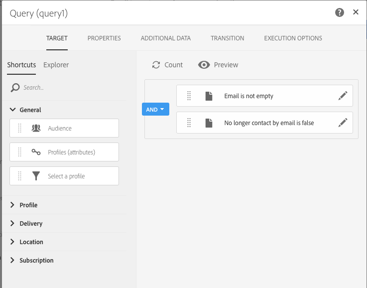

# Skapa en e-postleverans varje tisdag{#creating-email-every-tuesday}

Du kan skicka ett e-postmeddelande med specialerbjudanden varje tisdag till alla kunder.

1. I **[!UICONTROL Marketing Activities]**, klicka på **[!UICONTROL Create]** och markera **[!UICONTROL Workflow]**.
1. Välj **[!UICONTROL New Workflow]** som arbetsflödestyp och klicka på **[!UICONTROL Next]**.
1. Ange arbetsflödets egenskaper och klicka på **[!UICONTROL Create]**.

## Skapa en schemaläggningsaktivitet{#creating-a-scheduler-activity}

1. Dra och släpp en **[!UICONTROL Activities]** Schemaläggaren **[!UICONTROL Execution]**-aktivitet i [ > ](../../automating/using/scheduler.md).
1. Dubbelklicka på aktiviteten.
1. Konfigurera leveransen.
1. I **[!UICONTROL Execution frequency]** väljer du **[!UICONTROL Weekly]**.
1. Välj en **[!UICONTROL Time]** och en **[!UICONTROL Repetition frequency]** för leveranserna.
1. I **[!UICONTROL Days of the week]** väljer du **[!UICONTROL Tuesday]**.
1. Ange en **[!UICONTROL Start]** och en **[!UICONTROL Expiration]**-parameter för ditt arbetsflöde.
1. Bekräfta aktiviteten och spara arbetsflödet.

>[!NOTE]
>
>Om du vill starta arbetsflödet vid en specifik tidpunkt i **[!UICONTROL Time Zone]** ställer du in tidszonen för schemaläggaren i fältet Tidszon under **[!UICONTROL Execution options]**-fliken. Som standard är den markerade tidszonen den som definieras i arbetsflödesegenskaperna (se [Skapa ett arbetsflöde](../../automating/using/building-a-workflow.md)).

## Skapa en frågeaktivitet{#creating-a-query-activity}

1. I **[!UICONTROL Activities]** > **[!UICONTROL Targeting]** väljer du mottagare genom att dra och släppa en [Fråga](../../automating/using/query.md)-aktivitet och dubbelklicka på den.
1. I **[!UICONTROL Shortcuts]** > **[!UICONTROL Profile]**, dra och släpp **[!UICONTROL Email]**.
1. Välj **[!UICONTROL is not empty]** som operator.
1. I **[!UICONTROL Shortcuts]** > **[!UICONTROL General]**, lägg till profiler och välj **[!UICONTROL no longer contact by email]** med värdet **[!UICONTROL No]**.
1. Klicka på **[!UICONTROL Confirm]**.

## Skapa en e-postleverans{#creating-an-email-delivery}

1. Dra och släpp en **[!UICONTROL Activities]** e-postleveransaktivitet **[!UICONTROL Channels]** i [ > ](../../automating/using/email-delivery.md).
1. Klicka på aktiviteten och välj  för att redigera.
1. Markera **[!UICONTROL Recurring email]** och klicka på **[!UICONTROL Next]**.
1. Välj en e-postmall och klicka på **[!UICONTROL Next]**.
1. Ange e-postegenskaperna och klicka på **[!UICONTROL Next]**.
1. Om du vill skapa layouten för e-postmeddelandet klickar du på **[!UICONTROL Use Email Designer]**.
1. Infoga element eller välj en befintlig mall.
1. Anpassa e-postmeddelandet med fält och länkar.
1. Klicka på **[!UICONTROL Save]**.

Mer information finns i [Utforma ett e-postmeddelande](../../designing/using/designing-from-scratch.md#designing-an-email-content-from-scratch).

**Relaterade ämnen:**

* [E-postkanal](../../channels/using/creating-an-email.md)
