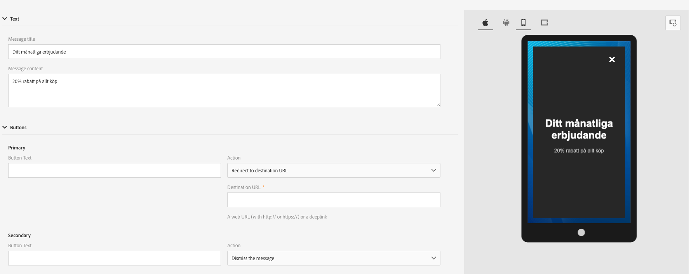

# Om app-meddelanden{#about-in-app-messaging}

App-meddelanden är en meddelandekanal som gör att du kan visa ett meddelande när användaren är aktiv i appen. Den här meddelandetypen är kostnadsfri för push-meddelanden som levereras som notifikation till mobilen. Mer information om kanalen för push-meddelande finns i det här [avsnittet](../../channels/using/about-push-notifications.md).

Den här kanalen kräver att mobil-appar integreras med Adobe Experience Platform SDK. Dessa program måste aktiveras i Adobe Experience Platform Launch innan de är tillgängliga i Adobe Campaign för leveranser i appen.

Om du vill börja skicka meddelanden via app-maddelanden till mobil-appar som använder Experience Platform SDK måste du uppfylla följande krav:

1. Kontrollera att du har åtkomst till kanalen **[!UICONTROL In-App]** i Adobe Campaign. Om du inte har tillgång till de här kanalerna kontaktar du kontoteamet.

1. För att kunna använda mobilanvändningsexempel i Adobe Campaign Standard med en Experience Cloud SDK-applikation måste en mobilapp skapas i Adobe Experience Platform Launch och konfigureras i Adobe Campaign Standard. Om du vill ha en steg för steg-guide läser du på den här [sidan](https://helpx.adobe.com/se/campaign/kb/configuring-app-sdk.html).

1. När du har konfigurerat det kan du nu förbereda ditt meddelande i appen. Mer information om detta hittar du p¨å den här [sidan](../../channels/using/preparing-and-sending-an-in-app-message.md#preparing-your-in-app-message).

1. Du kan sedan välja att skicka ett [meddelande](../../channels/using/customizing-an-in-app-message.md) i appen eller en [lokalt anpassad meddelandetyp](../../channels/using/customizing-an-in-app-message.md#customizing-a-local-notification-message-type).

1. Leveransen är nu klar att skickas. För att lära dig mer, läs på den här [sidan](../../channels/using/preparing-and-sending-an-in-app-message.md#sending-your-in-app-message).

**Relaterat innehåll:**

* [Rapport i appen](../../reporting/using/in-app-report.md)
* [Mobil användning som stöds av Adobe Campaign Standard](https://helpx.adobe.com/se/campaign/kb/configure-launch-rules-acs-use-cases.html)
* [Guide för Campaign Standard Mobile](https://helpx.adobe.com/se/campaign/kb/acs-mobile.html)

## Vanliga frågor om appar {#in-app-faq}

### Vad skulle vara användbara resursrekommendationer om du vill veta mer om In-App-kanalen i Adobe Campaign Standard? {#resources-inapp}

Läs resurserna nedan:

* [Video Tutorials](https://docs.adobe.com/content/help/en/campaign-standard-learn/tutorials/communication-channels/mobile/in-app/in-app-message-overview.html)
* [Blogginlägg](https://theblog.adobe.com/get-more-out-of-the-new-in-app-message-channel-from-adobe-campaign/)
* [Community-sida](https://experienceleaguecommunities.adobe.com/t5/adobe-campaign-standard/ct-p/adobe-campaign-standard-community)

### Vad är syftet med Campaign-tilläggs-API:erna setLinkageField och resetLinkageField? {#extensions-apis}

Eftersom meddelanden i appen hämtas av SDK från Campaign vill vi ha en säker mekanism som säkerställer att meddelanden i appen som innehåller PII-data inte hamnar i orätta händer. Därför har vi följande mekanism på plats för att säkerställa säker leverans av meddelanden till enheten:

* Kunderna anger fält för mobilprofiler (tabellen appSubscriberRcp) som personliga och känsliga om de vill säkerställa att informationen levereras på ett säkert sätt.
* Fält som markerats som sådana kan bara användas i profilmallen (inte i AppSubscriber-mallen eller sändningsmallen) som har ytterligare inbyggda säkerhetsfunktioner.
* Meddelanden som har skapats med hjälp av profilmallen kan bara hanteras när användaren har loggat in i appen.
* För att underlätta denna säkra handskakning bör utvecklare av mobilappar skicka ytterligare autentiseringsinformation med API:t setLinkageField. Observera att länkningsfältet är det som identifieras som länken mellan mobilprofilen och CRM-profilen när du utökar tabellen appSubscriberRcp.
* De bör tömma In-App-meddelanden som lagras på enheten och resetLinkagefält när användaren loggar ut från appen med resetLinkageField. Detta säkerställer att om en annan användare loggar in i appen, så ser han/hon inte meddelandena som är avsedda för en tidigare användare.
* Se [Mobile SDK API:er](https://aep-sdks.gitbook.io/docs/using-mobile-extensions/adobe-campaign-standard/adobe-campaign-standard-api-reference) för att implementera säkerhetsmekanismens klientsida.

### Vad måste jag göra för att aktivera rapportering i appen i Campaign? {#enable-inapp-reporting}

Du måste konfigurera återanslående i appen. Instruktioner finns [här](https://helpx.adobe.com/campaign/kb/config-app-in-launch.html#InApptrackingpostback).

För att implementera lokal meddelandespårning, se den här [sidan](../../administration/using/local-tracking.md).

### Vilka rapporter är tillgängliga för kanalen i appen? {#report-inapp}

En färdig rapport finns tillgänglig i Adobe Campaign för In-App-kanalen. Läs den här [dokumentationen](../../reporting/using/in-app-report.md).

Se den här [sidan](../../reporting/using/indicator-calculation.md#in-app-delivery) för att förstå hur varje värde i appen beräknas.

### Stöder du flerspråkiga innehållsvarianter för appar som liknar Push? {#multilingual-inapp}

Det finns inga flerspråkiga mallar tillgängliga för meddelanden i appen.

Om målet är att skicka ett meddelande i appen på ett annat språk än engelska, kan innehållet klistras in direkt i de tillgängliga textrutorna.

### Kan kampanjanpassningsfält läggas till i anpassad HTML? {#custom-html-inapp}

Nej, det stöds inte ännu.

### Jag har konfigurerat ett varningsmeddelande, men det visas inte på enheten. {#alert-message}

För varningsmeddelanden krävs minst en stängningsknapp (primär eller sekundär bör ha åtgärdsstängning). Annars går det att spara meddelandet, men det kommer inte att tas emot.

### Om lokala meddelanden iOS-anpassat ljud inte spelas upp, spelas standardljudet upp i stället? {#local-notification-sound}

För anpassat ljud på iOS måste du ange ett filnamn med filnamnstillägget när du skapar ett lokalt meddelande (till exempel sound.caf). Om det här tillägget inte anges används standardljudet.

### Stöds deplinks i meddelanden i appen? {#inapp-deeplinks}

Ja, deplinks stöds i meddelanden i appen. Deeplinks ska innehålla:

* språk som anger att leveransspårning måste inaktiveras för att länkarna ska fungera.
* Appsflyer with Branch as partners that can do the deplink tracking. Mer information om integrationen mellan grenar och Adobe Campaign Standard finns på den här [sidan](https://help.branch.io/using-branch/docs/adobe-campaign-standard-1).

### Kan ett meddelande i appen utlösas när användaren startar appen från ett push-meddelande? {#inapp-push-trigger}

Ja, de här meddelandena kallas även för meddelanden i kedjan. Följ processen nedan:

1. Skapa ett meddelande i appen.

1. Definiera en anpassad händelse och markera den som en händelseutlösare för denna IAM, t.ex. &quot;Trigger från fall-förhandsvisning Push&quot;.

1. När du skapar ditt push-meddelande definierar du en anpassad variabel vars värde kan anges som en händelse som används för att utlösa IAM, t.ex. Key = &quot;inappkey&quot; och value = &quot;Trigger from fall preview Push&quot;.

1. Implementera händelseutlösare på följande sätt i mobilappskoden:

   
