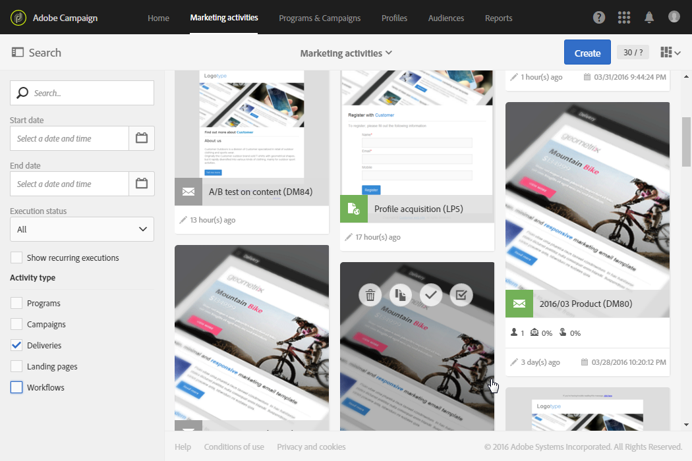

# Åtkomst till meddelanden{#accessing-messages}

Ni kan få tillgång till en uppsättning avancerade funktioner, från målinriktning, skapande och personalisering av meddelanden, utförande av kommunikation till tillhörande verksamhetsrapporter.

Du kan komma åt meddelanden:

* inom en kampanj
* från Adobe Campaign hemsida
* från förteckningen över marknadsföringsaktiviteter

## Åtkomst till meddelanden i kampanjer {#accessing-messages-in-campaigns}

Så här får du tillgång till en lista över en kampanjs marknadsföringsaktiviteter:

1. Gå till **[!UICONTROL Marketing activities]** från det övre navigeringsfältet.
1. Välj **[!UICONTROL Marketing activities > Marketing plans > Programs & Campaigns]**.

   Du kan också klicka direkt på **[!UICONTROL Programs & Campaigns]** kortet från startsidan. Mer information om kampanjer finns i avsnittet [Program och kampanjer](../../start/using/programs-and-campaigns.md) .

1. Välj ett program och sedan en kampanj.

   

1. Klicka på **[!UICONTROL Summary]** listrutan.
1. Klicka **[!UICONTROL Search]** för att filtrera hur meddelanden visas (efter namn, datum eller status).

   Om du vill filtrera återkommande meddelanden markerar du motsvarande ruta.

## Åtkomst till meddelandelistan {#accessing-the-message-list}

För att få tillgång till en fullständig lista över alla marknadsföringsaktiviteter från alla kampanjer i kombination:

1. Välj **[!UICONTROL Marketing activities]** i det övre navigeringsfältet.

   Du kan även komma åt den från **[!UICONTROL Marketing activities]** kortet på startsidan. Mer information om listan över marknadsföringsaktiviteter finns i avsnittet [Hantera marknadsföringsaktiviteter](../../start/using/marketing-activities.md#creating-a-marketing-activity) .

1. Använd fälten till vänster om listan över marknadsföringsaktiviteter om du vill filtrera marknadsföringsaktiviteterna (efter namn, datum, status eller aktivitetstyp). **[!UICONTROL Search]**

## Meddelandets livscykel {#message-life-cycle}

Ett meddelandes status representeras av en viss färg i listorna. Möjliga statusvärden är:

* **[!UICONTROL Editing]** (grå): meddelandet redigeras.
* **[!UICONTROL In progress]** (blått): meddelandet skickas.
* **[!UICONTROL Finished]** (grönt): sändningen har slutförts utan fel.
* **[!UICONTROL Erroneous]** (röd): sändningen avbröts eller så uppstod ett fel när meddelandet förbereddes eller skickades.

   >[!NOTE]
   >
   >En gul meddelandebanderoll kan visas ovanför kortet när en åtgärd krävs, t.ex. när du måste bekräfta att ett meddelande ska skickas.
