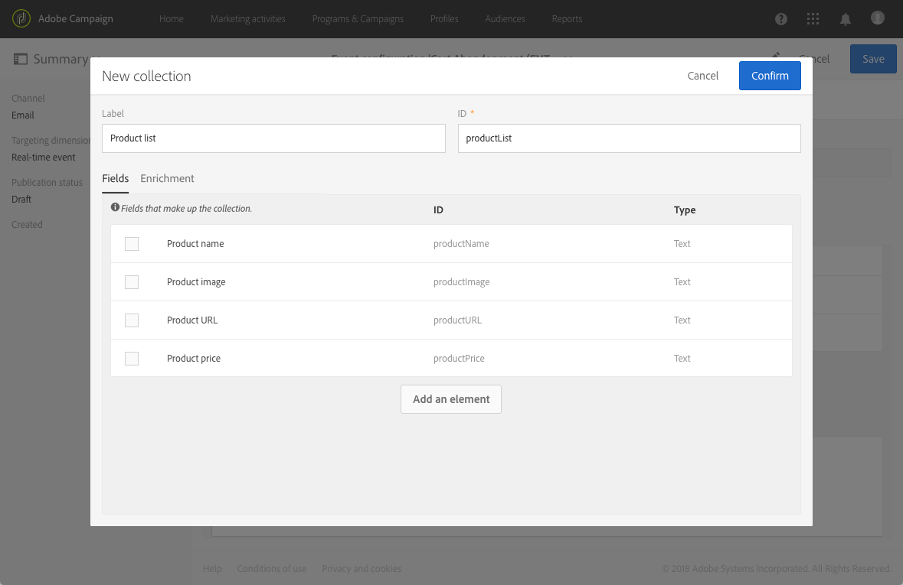

# Konfigurera en transaktionshändelse {#configuring-transactional-event}

Om du vill skicka ett transaktionsmeddelande med Adobe Campaign måste du först beskriva strukturen för händelsedata genom att skapa och konfigurera en händelse.

>[!IMPORTANT]
>
>Endast [Funktionsadministratörer](../../administration/using/users-management.md#functional-administrators) <!--being part of the **[!UICONTROL All]** [organizational unit](../../administration/using/organizational-units.md) -->har rätt behörighet att skapa och redigera händelsekonfigurationer.

Konfigurationen varierar beroende på [typ av transaktionsmeddelande](../../channels/using/getting-started-with-transactional-msg.md#transactional-message-types) som du vill skicka och på den kanal som ska användas. Mer information finns i [Specifika konfigurationer](#transactional-event-specific-configurations).

När konfigurationen är klar måste händelsen publiceras. Se [Publicera en transaktionshändelse](../../channels/using/publishing-transactional-event.md).

## Skapa en händelse {#creating-an-event}

Börja med att skapa den händelse som passar dina behov.

1. Klicka på **Adobe** logotyp, i det övre vänstra hörnet och välj **[!UICONTROL Marketing plans]** > **[!UICONTROL Transactional messages]** > **[!UICONTROL Event configuration]**.
1. Klicka på knappen **[!UICONTROL Create]**.
1. Ange **[!UICONTROL Label]** och **[!UICONTROL ID]** för händelsen. The **[!UICONTROL ID]** fältet är obligatoriskt och ska börja med prefixet&quot;EVT&quot;. Om du inte använder det här prefixet läggs det till automatiskt när du klickar på **[!UICONTROL Create]**.

   

   >[!IMPORTANT]
   >
   >ID:t får inte vara längre än 64 tecken, inklusive EVT-prefixet.

1. Välj kanalen som ska användas för att skicka transaktionsmeddelanden **[!UICONTROL Email]**, **[!UICONTROL Mobile (SMS)]** eller **[!UICONTROL Push notification]**. Endast en kanal kan användas för varje händelse och kan inte ändras i efterhand.

1. Välj den måldimension som motsvarar den önskade händelsekonfigurationen och klicka på **[!UICONTROL Create]**.

   Händelsebaserade transaktionsmeddelanden måldata i själva händelsen, medan profilbaserade transaktionsmeddelanden måldata i Adobe Campaign-databasen. Mer information finns i [Specifika konfigurationer](#transactional-event-specific-configurations).

>[!NOTE]
>
>Antalet transaktionshändelser kan påverka din plattform. För att få bästa möjliga prestanda bör du ta bort oanvända händelser. Se [Ta bort en händelse](../../channels/using/publishing-transactional-event.md#deleting-an-event).

## Definiera händelseattributen {#defining-the-event-attributes}

I **[!UICONTROL Fields]** definierar du de attribut som ska integreras i händelseinnehållet och sedan kan användas för att personalisera transaktionsmeddelandet.

Stegen för att lägga till och ändra fält är desamma som för [anpassade resurser](../../developing/using/configuring-the-resource-s-data-structure.md#adding-fields-to-a-resource).

>[!NOTE]
>
>Om du vill skapa ett flerspråkigt transaktionsmeddelande definierar du ett ytterligare händelseattribut med **[!UICONTROL AC_language]** ID. Detta gäller endast händelsetransaktionsmeddelanden. När händelsen har publicerats är stegen för att redigera innehållet i ett flerspråkigt transaktionsmeddelande samma som för ett flerspråkigt standardmeddelande. Se [Skapa ett flerspråkigt e-postmeddelande](../../channels/using/creating-a-multilingual-email.md).

## Definiera datainsamlingar {#defining-data-collections}

Du kan lägga till en samling element i händelseinnehållet, där varje element innehåller flera attribut.

Den här samlingen kan användas i ett transaktionsmejl för att lägga till [produktlistor](../../designing/using/using-product-listings.md) till innehållet i meddelandet, t.ex. en produktlista med pris, referensnummer, kvantitet osv. för varje produkt i listan.

1. I **[!UICONTROL Collections]** klickar du på **[!UICONTROL Create element]** -knappen.

   

1. Lägg till en etikett och ett ID för din samling.
1. Lägg till alla fält som du vill visa i transaktionsmeddelandet för varje produkt i listan.

   I det här exemplet har följande fält lagts till:

   

1. The **[!UICONTROL Enrichment]** kan du utöka varje objekt i samlingen. På så sätt kan du anpassa elementen i motsvarande produktlista med information från Adobe Campaign-databasen eller från andra resurser som du har skapat.

>[!NOTE]
>
>Stegen för att berika elementen i en samling är desamma som beskrivs i [Förbättra händelsen](#enriching-the-transactional-message-content) -avsnitt. Observera att du inte kan utöka en samling genom att berika händelsen: du behöver lägga till en berikning i själva samlingen i **[!UICONTROL Collections]** -avsnitt.

När händelsen och meddelandet har publicerats kan du använda den här samlingen i ditt transaktionsmeddelande.

Här är API-förhandsvisningen för det här exemplet:

**Relaterade ämnen:**

* [Förhandsgranska och publicera evenemanget](../../channels/using/publishing-transactional-event.md#previewing-and-publishing-the-event)
* [Använda produktlistor i ett transaktionsmeddelande](../../designing/using/using-product-listings.md)
* [Publicera ett transaktionsmeddelande](../../channels/using/publishing-transactional-message.md#publishing-a-transactional-message)

## Förbättra händelsen {#enriching-the-transactional-message-content}

Du kan utöka transaktionsmeddelandets innehåll med information från Adobe Campaign-databasen för att personalisera dina meddelanden. Från efternamnet eller CRM-ID:t för var och en av mottagarna kan du till exempel återställa data som adress eller födelsedatum eller andra anpassade fält som lagts till i profiltabellen, för att anpassa informationen som skickas till dem.

Det går att utöka transaktionsmeddelandets innehåll med information från utökade **[!UICONTROL Profile and services Ext API]**. Mer information finns i [Utöka API: Publicera tillägget](../../developing/using/step-2--publish-the-extension.md)

Den här informationen kan också lagras i nya resurser. I så fall måste resursen vara länkad till **[!UICONTROL Profile]** eller **[!UICONTROL Service]** resurser antingen direkt eller via en annan tabell. I konfigurationen nedan är det t.ex. möjligt att utöka transaktionsmeddelandets innehåll med information från **[!UICONTROL Product]** som produktkategorin eller ID, om **[!UICONTROL Product]** resursen är länkad till **[!UICONTROL Profile]** resurs.

Mer information om att skapa och publicera resurser finns i [det här avsnittet](../../developing/using/key-steps-to-add-a-resource.md).

1. I **[!UICONTROL Enrichment]** klickar du på **[!UICONTROL Create element]** -knappen.

   

1. Välj den resurs som du vill länka meddelandet med. I så fall väljer du **[!UICONTROL Profile]** resurs.

   

1. Använd **[!UICONTROL Create element]** om du vill länka ett fält från den valda resursen till ett av de fält som du tidigare lagt till i händelsen (se [Definiera händelseattributen](#defining-the-event-attributes)).

   

   >[!NOTE]
   >
   >Om du definierar ett villkor som skulle kunna göra det möjligt att markera flera mottagare (till exempel ett fält som kan ha samma värde för flera profiler), används bara en profil.

1. I det här exemplet förenar vi **[!UICONTROL Last name]** och **[!UICONTROL First name]** fält med motsvarande fält i **[!UICONTROL Profile]** resurs.

   

   Du kan även utöka transaktionsmeddelandets innehåll med **[!UICONTROL Service]** resurs. Mer information om tjänster finns i [det här avsnittet](../../audiences/using/creating-a-service.md).

1. Om du skapar eller redigerar en [profilbaserad händelse](#profile-based-transactional-messages), i **[!UICONTROL Targeting enrichment]** väljer du den anrikning som ska användas som meddelandemål under leveranskörningen.

   

   >[!NOTE]
   >
   >Skapa en berikning och välj en berikning som bygger på **[!UICONTROL Profile]** resurs är obligatorisk för profilbaserade händelser.

När händelsen och meddelandet har publicerats kan du med den här länken utöka innehållet i transaktionsmeddelandet.

**Relaterade ämnen:**

* [Förhandsgranska och publicera evenemanget](../../channels/using/publishing-transactional-event.md#previewing-and-publishing-the-event)
* [Anpassa ett transaktionsmeddelande](../../channels/using/editing-transactional-message.md#personalizing-a-transactional-message)
* [Publicera ett transaktionsmeddelande](../../channels/using/publishing-transactional-message.md#publishing-a-transactional-message)

## Söka efter transaktionshändelser {#searching-transactional-events}

Följ stegen nedan för att få tillgång till och söka efter transaktionshändelser som redan har skapats.

1. Klicka på **Adobe** logotyp, i det övre vänstra hörnet och välj **[!UICONTROL Marketing plans]** > **[!UICONTROL Transactional messages]** > **[!UICONTROL Event configuration]**.
1. Klicka på knappen **[!UICONTROL Show search]**.

   

1. Du kan filtrera på **[!UICONTROL Publication status]**. På så sätt kan du till exempel bara visa publicerade händelser.
1. Du kan också filtrera händelserna med **[!UICONTROL Last event received]**. Om du till exempel anger 10 visas bara de händelsekonfigurationer som innehåller den senaste händelsen som togs emot för 10 dagar sedan eller mer. Detta gör att du kan visa vilka händelser som har varit inaktiva under en viss period.

   

   >[!NOTE]
   >
   >Standardvärdet är 0. Därefter visas alla händelser.

## Specifika konfigurationer {#transactional-event-specific-configurations}

Konfiguration av transaktionshändelser kan variera beroende på [typ av transaktionsmeddelande](../../channels/using/getting-started-with-transactional-msg.md#transactional-message-types) du vill skicka (händelse eller profil) och på den kanal som ska användas.

I följande avsnitt beskrivs vilken specifik konfiguration som ska ställas in enligt önskat transaktionsmeddelande. Mer information om hur du konfigurerar en händelse finns i [Skapa en händelse](#creating-an-event).

### Händelsebaserade transaktionsmeddelanden {#event-based-transactional-messages}

Du kan skicka transaktionsmeddelanden för en händelse. Den här typen av transaktionsmeddelanden innehåller inte profilinformation: leveransmålet definieras av data som finns i själva händelsen.

Om du vill skicka ett händelsebaserat transaktionsmeddelande måste du först skapa och konfigurera en händelse som riktar sig till **data som finns i själva händelsen**.

1. När du skapar händelsekonfigurationen väljer du **[!UICONTROL Real-time event]** målinriktning (se [Skapa en händelse](#creating-an-event)).
1. Lägg till fält i händelsen för att kunna anpassa transaktionsmeddelandet (se [Definiera händelseattributen](#defining-the-event-attributes)).
1. Händelsebaserade transaktionsmeddelanden ska bara använda de data som finns i den skickade händelsen för att definiera mottagaren och meddelandets innehållspersonalisering.        

   Om du vill använda ytterligare information från Adobe Campaign-databasen kan du däremot utöka transaktionsmeddelandets innehåll (se [Förbättra transaktionens meddelandeinnehåll](#enriching-the-transactional-message-content)).

1. Förhandsgranska och publicera händelsen (se [Förhandsgranska och publicera evenemanget](../../channels/using/publishing-transactional-event.md#previewing-and-publishing-the-event)).

   När du förhandsgranskar händelsen innehåller REST API ett attribut som anger specifika attribut för e-postadress, mobiltelefon eller push-meddelanden enligt den valda kanalen.

   När händelsen har publicerats skapas automatiskt ett transaktionsmeddelande som är länkat till den nya händelsen. För att händelsen ska kunna utlösa att ett transaktionsmeddelande skickas måste du [ändra](../../channels/using/editing-transactional-message.md) och [publicera](../../channels/using/publishing-transactional-message.md) meddelandet som precis skapades.

1. Integrera evenemanget på webbplatsen (se [Integrera händelseutlösaren](../../channels/using/getting-started-with-transactional-msg.md#integrate-event-trigger)).

### Profilbaserade transaktionsmeddelanden {#profile-based-transactional-messages}

Ni kan skicka transaktionsmeddelanden baserat på kundprofiler, som gör att ni kan tillämpa typologiregler för marknadsföring, inkludera länken för att avbryta prenumerationen, lägga till meddelandet i den globala leveransrapporten och utnyttja det i kundresan.

Om du vill skicka ett profilbaserat transaktionsmeddelande måste du först skapa och konfigurera ett händelsemål **data från Adobe Campaign-databasen**.

1. När du skapar händelsekonfigurationen väljer du **[!UICONTROL Profile event]** målinriktning (se [Skapa en händelse](#creating-an-event)).
1. Lägg till fält i händelsen för att kunna anpassa transaktionsmeddelandet (se [Definiera händelseattributen](#defining-the-event-attributes)). Du måste lägga till minst ett fält för att skapa en anrikning. Du behöver inte skapa andra fält som **Förnamn** och **Efternamn** eftersom du kommer att kunna använda personaliseringsfält från Adobe Campaign-databasen.
1. Skapa en berikning för att länka evenemanget till **[!UICONTROL Profile]** resurs (se [Förbättra händelsen](#enriching-the-transactional-message-content)) och välj den här berikningen som **[!UICONTROL Targeting enrichment]**.

   >[!IMPORTANT]
   >
   >Det här steget är obligatoriskt för profilbaserade händelser.

1. Förhandsgranska och publicera händelsen (se [Förhandsgranska och publicera evenemanget](../../channels/using/publishing-transactional-event.md#previewing-and-publishing-the-event)).

   När händelsen förhandsgranskas innehåller REST API inte något attribut som anger specifika attribut för e-postadress, mobiltelefon eller push-meddelanden, eftersom det hämtas från **[!UICONTROL Profile]** resurs.

   När händelsen har publicerats skapas automatiskt ett transaktionsmeddelande som är länkat till den nya händelsen. För att händelsen ska kunna utlösa att ett transaktionsmeddelande skickas måste du [ändra](../../channels/using/editing-transactional-message.md) och [publicera](../../channels/using/publishing-transactional-message.md) meddelandet som precis skapades.

1. Integrera evenemanget på webbplatsen (se [Integrera händelseutlösaren](../../channels/using/getting-started-with-transactional-msg.md#integrate-event-trigger)).

<!--### Transactional SMS messages {#transactional-sms}

The steps to configure an  event to send an SMS transactional message are the same as for the email channel. The only differences are as follows:

* When creating the corresponding event, you need to select the **[!UICONTROL Mobile (SMS)]** channel.

* When previewing the event corresponding to an event-based transactional SMS, the REST API contains an attribute specifying the mobile phone instead of the email address.

* The specificities to edit the content of an SMS transactional message are the same as for a [standard SMS](../../channels/using/about-sms-and-push-content-design.md).-->

### Push-transaktionsmeddelanden {#transactional-push-notifications}

Du kan skicka två typer av push-meddelanden för transaktioner:
* Ett anonymt transaktionspush-meddelande till alla användare som har valt att ta emot meddelanden från ditt mobilprogram. Se [Konfigurera händelsebaserade push-meddelanden för transaktioner](../../channels/using/transactional-push-notifications.md#event-based-transactional-push-notifications).
* Ett transaktionsmeddelande till de Adobe Campaign-profiler som har prenumererat på ditt mobilprogram. Se [Konfigurera profilbaserade push-meddelanden för transaktioner](../../channels/using/transactional-push-notifications.md#profile-based-transactional-push-notifications).

>[!IMPORTANT]
>
>Om du vill kunna skicka push-meddelanden via transaktion måste du konfigurera Adobe Campaign i enlighet med detta. Se [Konfigurera ett mobilprogram](../../administration/using/configuring-a-mobile-application.md).

### Uppföljningsmeddelanden {#follow-up-messages}

Du kan skicka ett uppföljningsmeddelande till kunder som fått ett visst transaktionsmeddelande.

Stegen för att konfigurera en händelse som tillåter att ett uppföljningsmeddelande skickas finns i [det här avsnittet](../../channels/using/follow-up-messages.md#configuring-an-event-to-send-a-follow-up-message).
