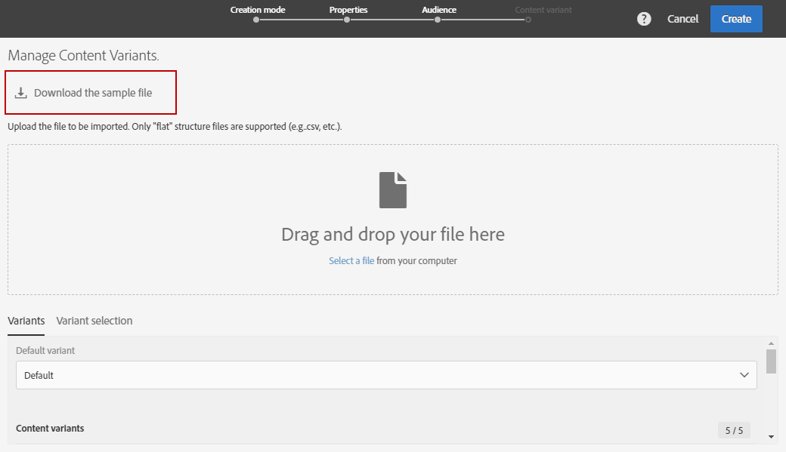
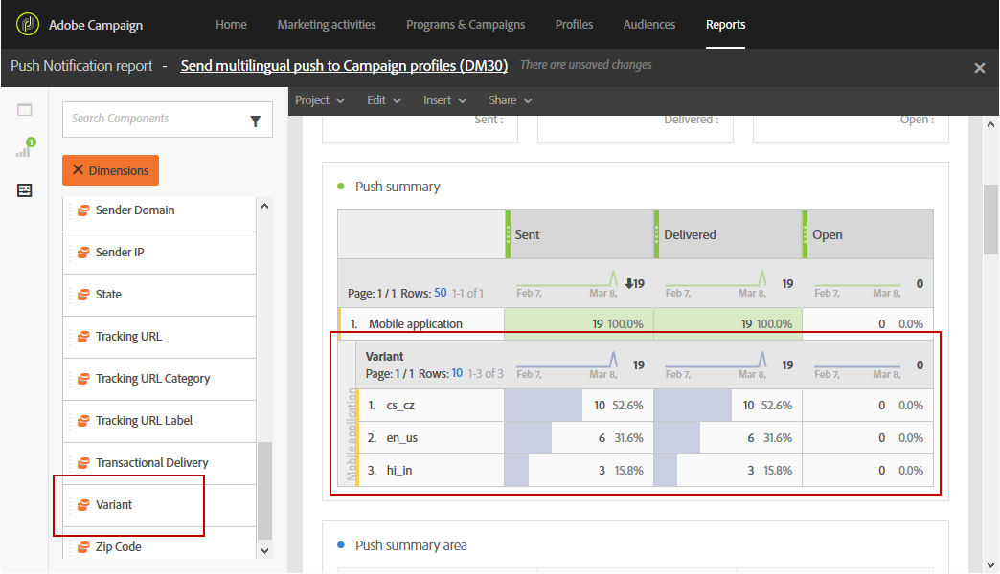

# Skapa ett flerspråkigt push-meddelande{#creating-a-multilingual-push-notification}

## Om flerspråkig push-meddelanden {#about-multilingual-push-notification}

Anpassa innehållet i push-meddelanden genom att skicka meddelanden baserat på de språk och regioner användarna föredrar. Du kan importera innehållsvarianter för flerspråkiga push-meddelanden direkt i innehållsredigeraren och skicka ett flerspråkigt push-meddelande i en enda leverans.

Den här funktionen utnyttjar antingen önskade språk som anges i mottagarnas profiler eller systemspråkinställningen för mobilappsprenumeranter beroende på leveransmallen som används för push-meddelanden. Om språkinställningen inte fylls i för en viss användare använder systemet standardvarianten som definieras när ett flerspråkigt push-meddelande skapas. Mer information om hur du hanterar dina profiler och prenumeranter finns i [handboken](../../audiences/using/get-started-profiles-and-audiences.md).

Följ de här stegen om du vill använda flerspråkiga innehållsvarianter för leverans av push-meddelanden:

* [Steg 1: Överför flerspråkig innehållsvariant](#step-1--upload-multilingual-content-variant)
* [Steg 2: Förhandsgranska och färdigställa ett push-meddelande med flerspråkiga innehållsvarianter](#step-2--preview-and-finalize-a-push-notification-using-multilingual-content-variants)
* [Steg 3: Skicka och analysera flerspråkig leverans av push-meddelanden](#step-3--send-and-analyze-multilingual-push-notification-delivery)

## Steg 1: Överför flerspråkig innehållsvariant {#step-1--upload-multilingual-content-variant}

Innan vi personaliserar ditt flerspråkiga push-meddelande måste vi först överföra innehållsvarianterna i en flerspråkig leveransmall och skapa leveransen.

>[!NOTE]
>
>Du kan också hoppa över det här steget om du vill skapa en variant manuellt för varje språkvariant.

1. Klicka på knappen **[!UICONTROL Create]** i **[!UICONTROL Marketing activities]** och välj sedan **[!UICONTROL Push notification]**.
1. Välj mallen **[!UICONTROL Send multilingual push to Campaign profiles]** om du vill ange Adobe Campaign-profilerna som prenumererar på ditt mobilprogram eller mallen **[!UICONTROL Send multilingual push to app subscriber]** som mål för att skicka ett push-meddelande till alla användare som har valt att ta emot meddelanden från ditt mobilprogram.

   

1. Ange dina egenskaper för push-meddelanden och välj din mobilapp i fältet **[!UICONTROL Associate a Mobile App to a delivery]**.

   Observera att listrutan kommer att visa både SDK V4- och Adobe Experience Platform SDK-program.

1. I **[!UICONTROL Audiences]**-fönstren drar och släpper du frågor för att finjustera målgruppen.

   Vilka frågor som läggs till beror på den valda mallen: om du väljer mallen **[!UICONTROL Send multilingual push to Campaign profiles]** kan du fråga kända mottagare av ditt mobilprogram. Om du väljer mallen **[!UICONTROL Send multilingual push to app subscriber]** kan du fråga alla prenumeranter på ett visst program som har valt att göra det.
   >[!NOTE]
   >
   >Om ni riktar er till målgrupper med specifika språk måste ni ange alla målspråk i CSV-filen.

   

1. I fönstret **[!UICONTROL Manage Content Variants]** drar och släpper du filen eller väljer en fil från datorn.

   Filen måste vara UTF8-kodad och måste ha en specifik layout som du kan hitta genom att klicka på alternativet **[!UICONTROL Download the sample file]**. Du bör också använda rätt syntax för nationella värden. Mer information om filformat och vilka språk som stöds finns på [sidan](../../channels/using/generating-csv-multilingual-push.md).

   

1. När du har överfört filen fylls språkvarianterna automatiskt i på fliken **[!UICONTROL Variants]**. Observera att du kan ange en **[!UICONTROL Default variant]** i filen som kommer att vara standardvariant av innehåll om inget önskat språk har angetts för målanvändaren.

   

1. Fliken **[!UICONTROL Variant selection]** innehåller ett skript som avgör vilka språkinställningar som ska beaktas beroende på leveransmallen. Det här är ett skript som inte finns i kartongen och som inte kräver att du gör några ändringar.
1. Om du vill lägga till fler varianter som inte finns i den importerade filen kan du göra det genom att klicka på knappen **[!UICONTROL Add an element]** och lägga till så många nya språkvarianter som behövs.

   Genom att lägga till andra varianter än de som överförts från filen kommer inget innehåll att länkas till det här språket. Du måste redigera innehållet direkt på kontrollpanelen för leverans.

   

1. Klicka på **[!UICONTROL Create]** när konfigurationen är klar. Du kan alltid gå tillbaka till fönstret **[!UICONTROL Content variant]** och göra några ändringar från kontrollpanelen för leverans.

   

Nu kan du börja personalisera ditt flerspråkiga push-meddelande.

## Steg 2: Förhandsgranska och färdigställa ett push-meddelande med flerspråkiga innehållsvarianter {#step-2--preview-and-finalize-a-push-notification-using-multilingual-content-variants}

När du har överfört filen som innehåller innehållsvarianter kan du nu förhandsgranska de olika varianterna från leveransen av push-meddelanden.

Det går också att skapa och redigera fler varianter utöver de som har överförts från filen.

1. I fönstret **[!UICONTROL Content]** från kontrollpanelen för leverans kan du förhandsgranska ditt push-meddelandeinnehåll beroende på det valda språket.

   

1. Om ingen innehållsvariant har angetts för ett visst språk klickar du på klockikonen under förhandsvisningen för att börja lägga till innehåll i den här språkvarianten.

   Genom att klicka på fönstret **[!UICONTROL Content]** representerar push-meddelandet innehållet från det språk som valts i listrutan. Ändringar som görs i det här fönstret påverkar bara ett språk.

1. Du kan också klicka på en innehållsvariant för att anpassa den ytterligare, till exempel med personaliseringsfält.

   Mer information om hur du anpassar push-meddelanden finns i det här [avsnittet](../../channels/using/customizing-a-push-notification.md).

   

1. Klicka på fönstret **[!UICONTROL Content variant]** om du vill lägga till eller ta bort språkvarianter.

   Observera att om du lägger till ett nytt språk måste du manuellt lägga till innehåll i push-meddelandet som är länkat till det tillagda språket.

   

Din flerspråkiga push-meddelandeleverans är nu klar att skickas.

## Steg 3: Skicka och analysera flerspråkig leverans av push-meddelanden {#step-3--send-and-analyze-multilingual-push-notification-delivery}

Dina flerspråkiga innehållsvariantmeddelanden kan nu skickas till dina användare.

1. Klicka på knappen **[!UICONTROL Prepare]** om du vill börja förbereda sändningen.
1. När du är klar med förberedelsen utan varningar kan du klicka på knappen **[!UICONTROL Confirm]** för att börja skicka din flerspråkiga push-funktion.

   

1. När du har skickat push-meddelandet klickar du på ikonen **[!UICONTROL Reports]** och sedan **[!UICONTROL Dynamic reports]** för att analysera om leveransen lyckades.

   

1. Välj **[!UICONTROL Push notification report]**.
1. Dra och släpp dimensionen **[!UICONTROL Variant]** på panelen för att börja filtrera dina data.

   

Nu kan du mäta effekten av den flerspråkiga push-meddelandeleveransen på mottagarna.

**Relaterade ämnen:**

* [Rapport om push-meddelanden](../../reporting/using/push-notification-report.md)
* [Skicka ett push-meddelande inom ett arbetsflöde](../../automating/using/push-notification-delivery.md)
