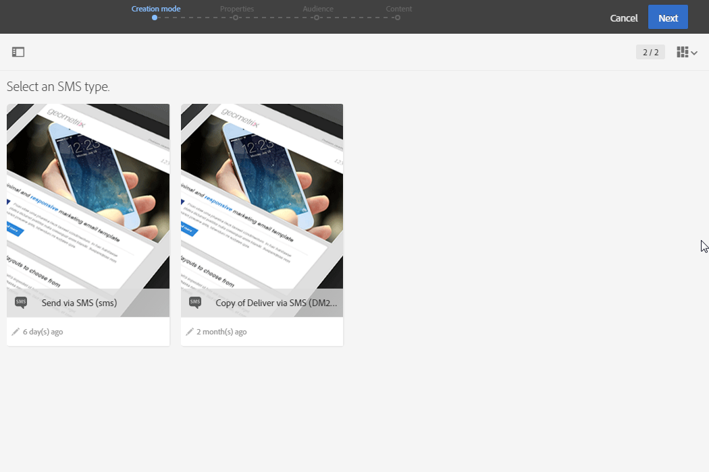
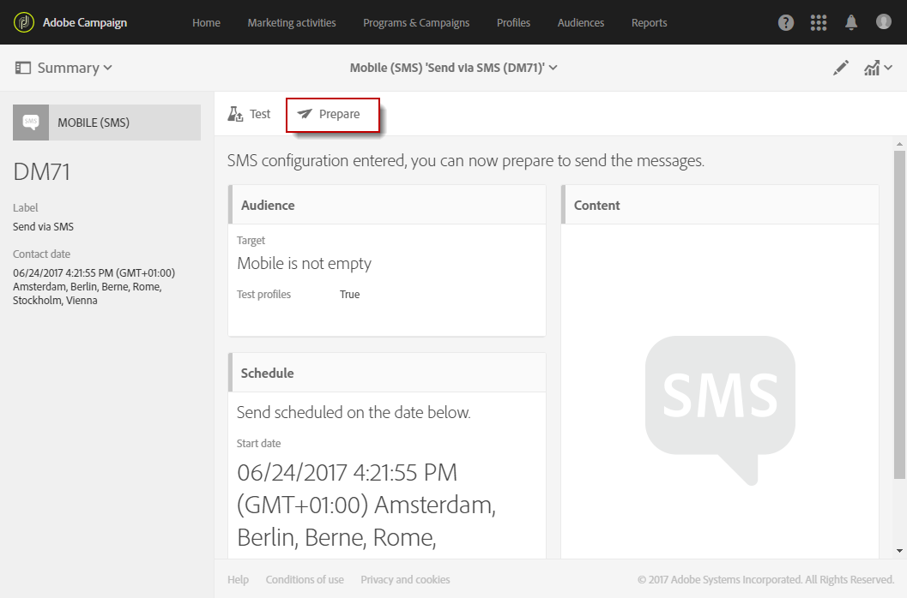

# Skapa ett SMS-meddelande{#creating-an-sms-message}

Att skapa en SMS-leverans påminner mycket om hur man skapar ett vanligt e-postmeddelande. I följande steg beskrivs konfigurationen som är specifik för den här kanalen. Mer information om andra alternativ finns i [Skapa ett e-postmeddelande](../../channels/using/creating-an-email.md).

Avancerade SMS-parametrar beskrivs i avsnittet [SMS-konfiguration](../../administration/using/configuring-sms-channel.md) .

 [Upptäck den här funktionen i en video](#video)

Om du vill skapa och skicka SMS-meddelanden till en mobiltelefon behöver du:

* Ett externt **[!UICONTROL Routing]**-konto som har konfigurerats i kanalen **[!UICONTROL Mobile (SMS)]** med läge **[!UICONTROL Bulk delivery]**. Mer information om detta hittar du i avsnittet [Dirigering](../../administration/using/configuring-sms-channel.md#defining-an-sms-routing) .
* En leveransmall som är korrekt länkad till det här externa kontot.

1. Skapa en SMS-leverans. Du kan göra det på Adobe Campaigns [hemsida](../../start/using/interface-description.md#home-page), i en [kampanj](../../start/using/marketing-activities.md#creating-a-marketing-activity) eller i [ listan med marknadsföringsaktiviter](../../start/using/programs-and-campaigns.md#creating-a-campaign).

   Du kan också lägga till en SMS-aktivitet i ett arbetsflöde. Mer information om detta hittar du i handboken [Arbetsflöden](../../automating/using/sms-delivery.md).

   När du skapar ett meddelande visas en guide som hjälper dig igenom de viktigaste stegen. Det som definieras i guiden kan fortfarande redigeras efteråt i kontrollpanelen för meddelanden.

1. Välj den mall som du vill använda. Du kan välja en färdig SMS-mall eller en av dina egna mallar.

   

   För att kunna leverera till en mobiltelefon måste leveransmallen vara korrekt länkad till SMS-dirigeringens externa konto.

1. Ange de allmänna egenskaperna för SMS:et.

   

   Både aktivitetsetikett och ID visas i gränssnittet men är inte synliga för meddelandemottagarna.

1. Ange målgruppen. Du kan välja en befintlig målgrupp eller rikta dig direkt mot en population genom att definiera och kombinera regler.

   

1. Lägg till innehåll i ditt SMS. Du kan också definiera innehållet genom att klicka på avsnittet **[!UICONTROL Content]** på kontrollpanelen när SMS-skapandet är klart. Se [Om design av SMS-innehåll](../../channels/using/about-sms-and-push-content-design.md).

   Om du har infogat ett anpassningsfält eller villkorlig text i innehållet av SMS-meddelandet kan meddelandets längd variera från en mottagare till en annan. Dessa faktorer kan medföra tecken som inte beaktas av GSM-kodningen. Därför måste meddelandets längd utvärderas när personaliseringen har utförts. Se [Anpassa SMS-meddelanden](../../channels/using/personalizing-sms-messages.md).

   

1. Bekräfta att meddelandet har skapats. Därefter visas kontrollpanelen.
1. Schemalägg sändningen. SMS:et kan skickas manuellt direkt efter förberedelsen av meddelandet eller automatiskt vid ett schemalagt datum. Se [Schemaläggning av meddelanden](../../sending/using/about-scheduling-messages.md).
1. Förbered meddelandet för att analysera dess giltighet, personalisering och målgruppsanpassning.

   

   >[!NOTE]
   >
   >Du kan ange globala fatigue-regler för intersektionskanaler som automatiskt utesluter överdimensionerade profiler från kampanjer. Se [Fatigue-regler](../../sending/using/fatigue-rules.md).

1. Skicka korrektur för att kontrollera och validera meddelandet och övervaka återgivningen i inkorgen. Se avsnittet [Skicka korrektur](../../sending/using/sending-proofs.md) .
1. Bekräfta att meddelandet har skickats. Sändningen startar enligt det schema som du har definierat.

   

Meddelandet skickas. Du kan kontrollera leveransen via kontrollpanelen för meddelanden och loggarna.

När sändningen är klar kan du börja mäta effekten av meddelandet med inbyggda eller anpassade leveransrapporter.

**Relaterade ämnen:**

* [Om SMS och push-innehållsutgåva](../../channels/using/about-sms-and-push-content-design.md)
* [Hantera mallar](../../start/using/marketing-activity-templates.md)

## Självstudievideo {#video}

I den här videon visas hur du skapar en SMS-leverans.

>[!VIDEO](https://video.tv.adobe.com/v/25265/?quality=12)

Ytterligare Campaign Standard om instruktionsvideor finns [här](https://experienceleague.adobe.com/docs/campaign-standard-learn/tutorials/overview.html?lang=sv).
