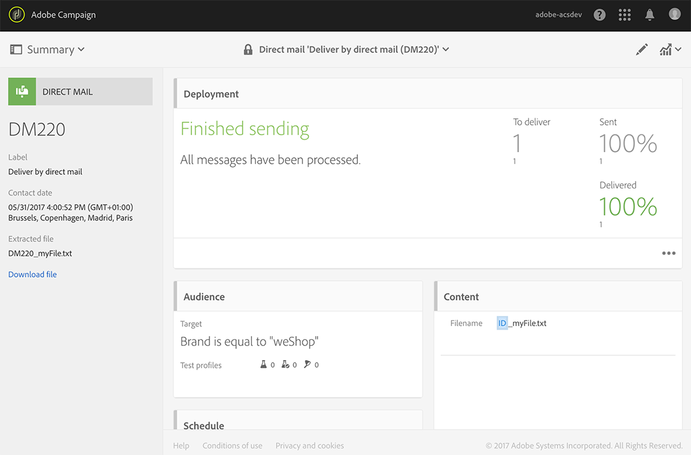

# Skapa direktmeddelandet{#creating-the-direct-mail}

Processen för att skapa ett direktmeddelande är väldigt lik processen för att skapa ett vanligt e-postmeddelande. I följande steg beskrivs konfigurationen som är specifik för den här kanalen. Mer information om andra alternativ finns i [Skapa ett e-postmeddelande](../../channels/using/creating-an-email.md).

1. Skapa en ny leverans av direktmeddelande. Du kan skapa en från Adobe Campaigns [startsida](../../start/using/interface-description.md#home-page), i en [kampanj](../../start/using/marketing-activities.md#creating-a-marketing-activity) eller i en [lista över marknadsföringsaktiviteter](../../start/using/programs-and-campaigns.md#creating-a-campaign).

   >[!NOTE]
   >
   >Du kan också lägga till en aktivitet för direktmeddelanden i ett arbetsflöde. Mer information om detta hittar du i handboken [Arbetsflöden](../../automating/using/direct-mail-delivery.md).

   

1. Välj en färdig **[!UICONTROL Direct mail]**-mall eller någon av dina egna mallar. Mer information om mallar finns i avsnittet [Hantera mallar](../../start/using/marketing-activity-templates.md).

   

1. Ange de allmänna egenskaperna för leveransen.

   

1. Definiera målgruppen som du vill inkludera i extraktionsfilen samt test- och svällningsprofilerna. Se [Definiera målgrupp för direktmeddelanden](../../channels/using/defining-the-direct-mail-audience.md).

   

   >[!NOTE]
   >
   >Målgruppsdefinitionen påminner mycket om den som används för att definiera en vanlig målgrupp för e-post. Se [Skapa målgrupper](../../audiences/using/creating-audiences.md).

1. Redigera innehållet i filen: Kolumner ska inkluderas för varje profil, filstruktur, sidhuvud och sidfot. Se [Definiera innehåll för direktmeddelanden](../../channels/using/defining-the-direct-mail-content.md).

   

1. Klicka på avsnittet **[!UICONTROL Schedule]** på kontrollpanelen för leverans för att definiera kontaktdatumet. För direktmeddelanden är kontaktdatumet obligatoriskt. Mer information finns i [Schemalägga sändningen](../../sending/using/about-scheduling-messages.md).

   

1. Om du har lagt till testprofiler (se [Lägga till test- och trapprofiler](../../channels/using/defining-the-direct-mail-audience.md#adding-test-and-trap-profiles)) kan du testa leveransen innan du förbereder den slutliga filen. Du kan skapa en exempelfil som endast innehåller de valda testprofilerna.

   Klicka på **[!UICONTROL Test]** för att generera exempelfilen. Klicka på **[!UICONTROL Summary]**, i det övre vänstra hörnet, och välj sedan **[!UICONTROL Proofs]**. Markera korrekturläsning till vänster på skärmen och klicka på **[!UICONTROL Download file]**.

   >[!NOTE]
   >
   >Rollen **[!UICONTROL Export]** krävs för att Adobe Campaign ska kunna exportera filen och göra den tillgänglig för hämtning. Kontakta administratören.

   

1. När du har definierat leveransinnehåll, målgrupp och kontaktdatum klickar du på knappen **[!UICONTROL Prepare]** på kontrollpanelen.

   

   Typologiregler används. Alla ospecificerade postadresser är till exempel uteslutna från målet. Därför måste du se till att du har markerat rutan **[!UICONTROL Address specified]** i profilinformationen (se [Rekommendationer](../../channels/using/about-direct-mail.md#recommendations)). Den används även här om du har definierat en **[!UICONTROL Maximum volume of message]**-post i egenskaperna för direktmeddelande eller på mallnivå.

   

   >[!NOTE]
   >
   >Du kan ange globala fatigue-regler för intersektionskanaler som automatiskt utesluter överdimensionerade profiler från kampanjer. Se [Fatigue-regler](../../sending/using/fatigue-rules.md).

1. Klicka på **[!UICONTROL Explore file]** för att förhandsgranska de första 100 raderna i filen.

   

   Den fullständiga filen kan hämtas lokalt till vänster på skärmen. När du laddar ned filen skapas en loggpost på **[!UICONTROL Export audits]**-menyn. Mer information om exportgranskningar finns i avsnittet [Granska exportering](../../administration/using/auditing-export-logs.md).

   >[!NOTE]
   >
   >Rollen **[!UICONTROL Export]** krävs för att Adobe Campaign ska kunna exportera filen och göra den tillgänglig för hämtning. Kontakta administratören.

   Om du behöver ändra leveransinnehållet behöver du bara klicka på **[!UICONTROL Regenerate file]**-knappen för att ta hänsyn till ändringen. Du behöver inte gå igenom förberedelsen igen.

   

1. Bekräfta att filen är slutgiltig genom att klicka på **[!UICONTROL Confirm]** på kontrollpanelen.

   

Du kan nu skicka extraktionsfilen till din leverantör av direktmeddelanden. Det finns flera alternativ:

* Skicka det via vanlig e-post, med filen bifogad
* Skicka via Campaign: Skicka ditt direktmeddelande i ett [kampanjarbetsflöde](../../automating/using/direct-mail-delivery.md) och lägg till en **[!UICONTROL Transfer file]** som kan skicka filen via till exempel FTP. Se [Överför fil](../../automating/using/transfer-file.md).

Leverantören hämtar listan över felaktiga adresser och skickar den här informationen till Adobe Campaign som automatiskt blocklist de felaktiga adresserna. Se [Återgå till avsändaren](../../channels/using/return-to-sender.md).
