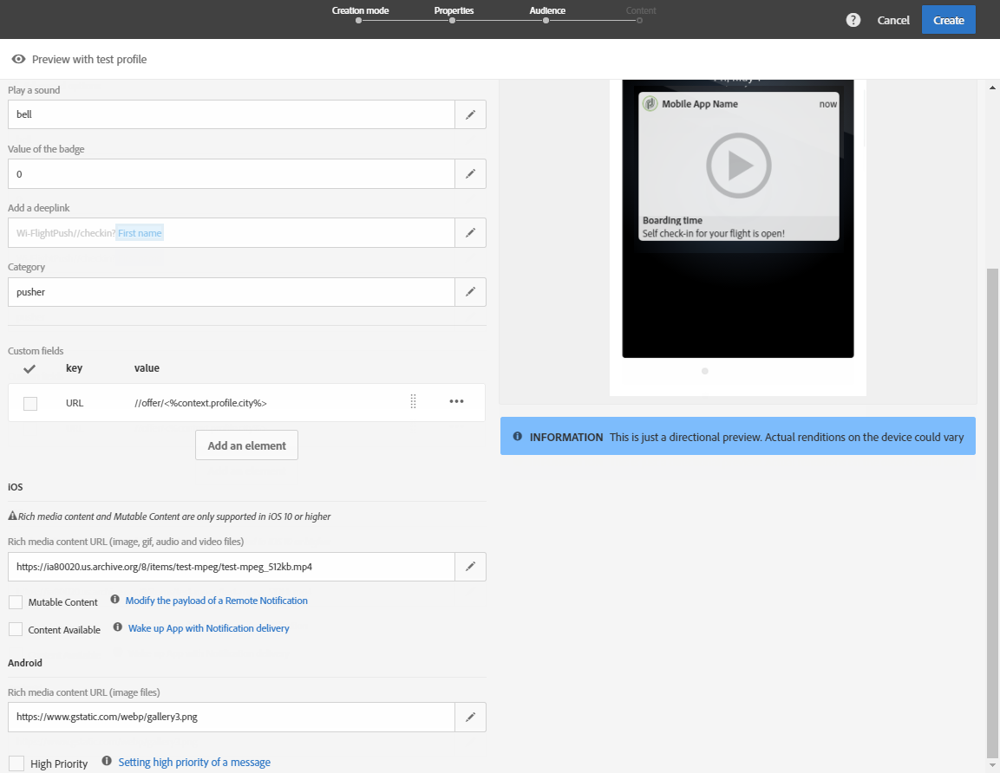
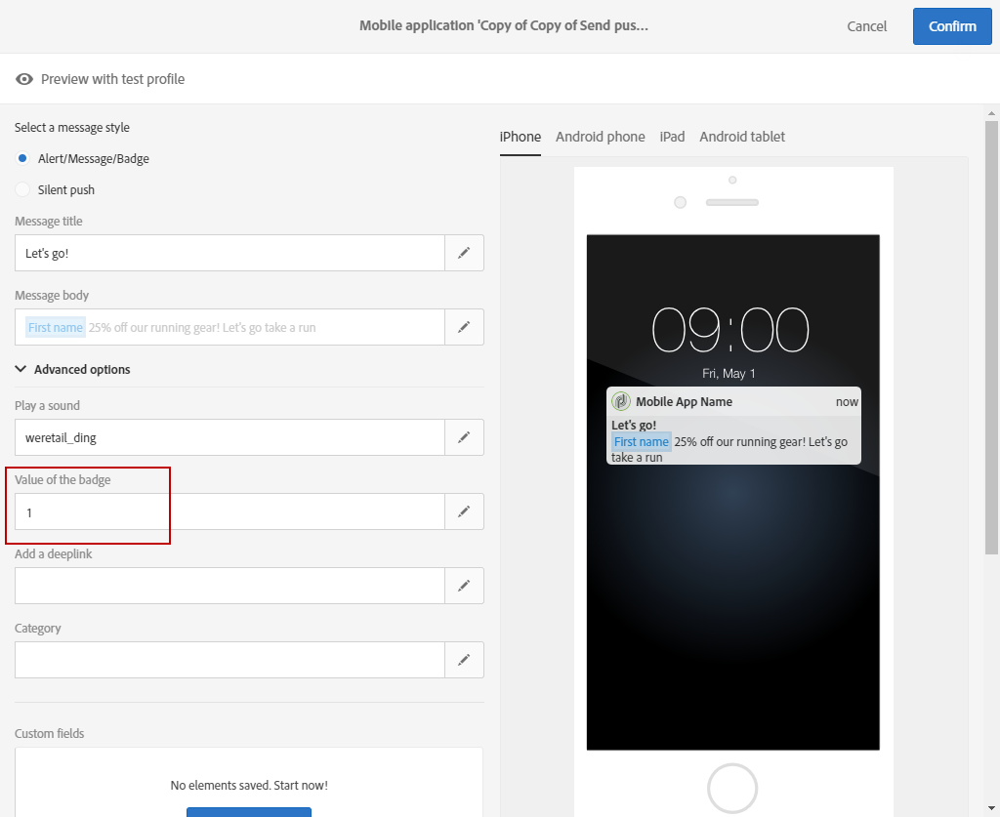
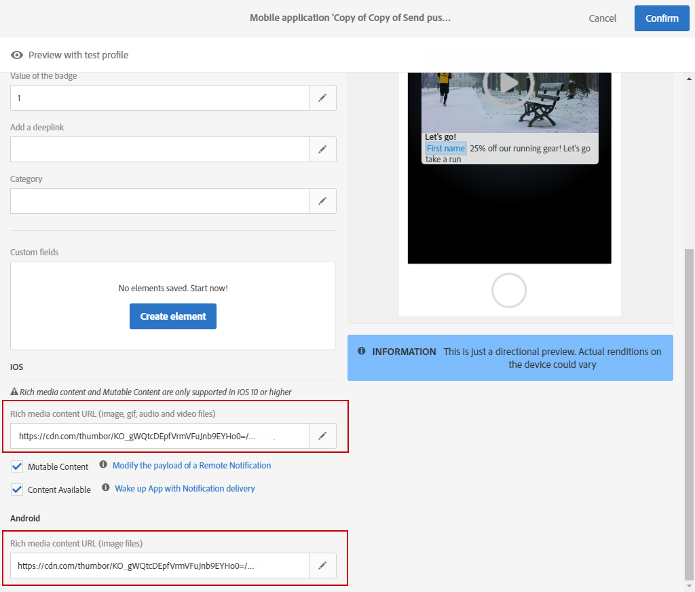
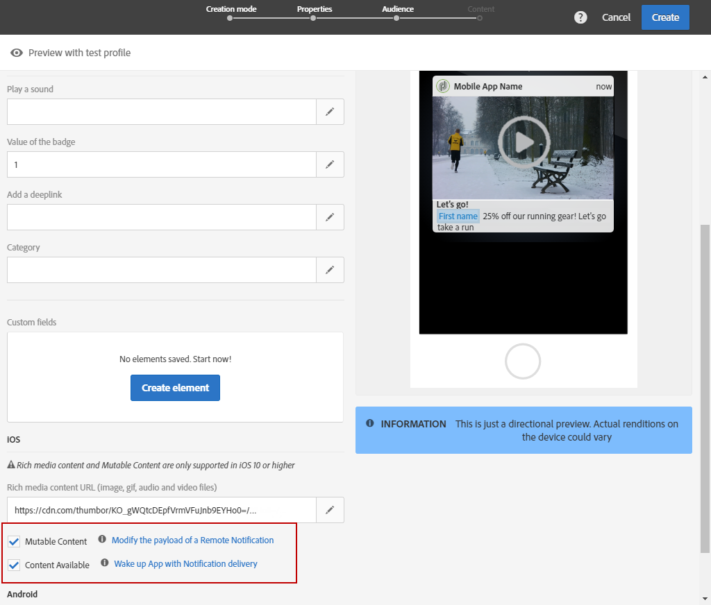

# Anpassa ett push-meddelande{#customizing-a-push-notification}

Med Adobe Campaign kan du finjustera push-meddelanden och få åtkomst till en uppsättning avancerade alternativ när du utformar ett push-meddelande.

Om du är avancerad användare och vill konfigurera mobilprogram i Adobe Campaign, ska du läsa följande tekniska information [Information om strukturen på nyttolasten för Campaign Standard Push-meddelanden](../../administration/using/push-payload.md).

**Relaterat innehåll:**

* [Rapport om push-meddelanden](../../reporting/using/push-notification-report.md)
* [Skicka ett push-meddelande inom ett arbetsflöde](../../automating/using/push-notification-delivery.md)

## Spela upp ett ljud {#play-a-sound}

Med funktionen **[!UICONTROL Play a sound]** kan programmet spela upp ljud på enheten med ett push-meddelande när programmet inte körs.

Ett ljud varnar användarna om ett push-meddelande och ger det mer synlighet. Så här inkluderar du ett ljud i din mobilapp:

1. Öppna push-meddelandet och gå till avsnittet **[!UICONTROL Advanced options]**.
1. I **[!UICONTROL Play a sound]**-fältet anger du filnamnet på ljudfilen, utan tillägget, som ska spelas upp av den mobila enheten när meddelandet tas emot.

   Mer information om vilka medieformat som stöds finns i [Apple](https://support.apple.com/kb/PH16864?locale=en_US)- och [Android](https://developer.android.com/guide/topics/media/media-formats)-dokumentationen.

   

1. Ljudfilen spelas upp när meddelandet skickas om filen är definierad i mobilprogrammets paket. Du kan ställa in det på **standard** om du vill spela upp enhetens standardljud.

   Om fältet **[!UICONTROL Play a sound]** lämnas tomt spelas inget ljud upp.

Användaren får sedan push-meddelandet och ljudet endast om telefonen inte är avstängd.

## Uppdatera märkordsvärdet {#refresh-the-badge-value}

Ett märke används för att visa antalet nya olästa uppgifter direkt på programikonen. Märkesvärdet försvinner när användaren öppnar eller läser det nya innehållet från programmet.

När ett meddelande tas emot på en enhet kan det uppdatera eller lägga till ett märkesvärde för den relaterade appen. Så här skickar du ett märkesvärde från serversidan:

1. Öppna push-meddelandet och gå till avsnittet **[!UICONTROL Advanced options]**.
1. Märkesvärdet måste vara ett heltal och kan uppdateras på olika sätt:

   * Om du vill uppdatera märket anger du 0 i **[!UICONTROL Value of the badge]**-fältet. Detta tar bort märket från programikonen.
   * Om du vill lägga till ett märkesvärde anger du valfritt antal i **[!UICONTROL Value of the badge]**-fältet. Det här numret visas automatiskt på märket så snart användaren fått push-meddelandet.
   * Om fältet är tomt eller inte innehåller något heltal ändras inte märkesvärdet.

   Här angav vi 1 i **[!UICONTROL Value of the badge]**-fältet för att meddela användarna att de har en ny information i sina program.

   

1. När du har skickat meddelandet får användarna push-meddelandet och deras program visar automatiskt det nya märkesvärdet.

   

## Lägg till en deeplink {#add-a-deeplink}

Med en djuplänk kan du dirigera användarna direkt till innehåll som finns inuti programmet (i stället för att öppna en webbläsarsida).

En djuplänk kan innehålla anpassningsdata för en anpassad upplevelse i appen. Mottagarens förnamn anges till exempel automatiskt på sidan som de dirigeras till.

Så här lägger du till en länk i ett push-meddelande:

1. Öppna push-meddelandet och gå till avsnittet **[!UICONTROL Advanced options]**.
1. Ange länken i **[!UICONTROL Add a deeplink]**-fältet.

   

1. När du har skickat meddelandet får användarna push-meddelandet och kommer åt den specifika sidan i appen genom att interagera med meddelandet, t.ex. genom att trycka på eller klicka på knappen för uppmaning till åtgärd.

   

## Definiera en åtgärd {#define-an-action}

Du kan lägga till ett kategori-ID om det finns i mobilprogrammet och sedan visa åtgärdsknappar. Dessa meddelanden ger användaren ett snabbare sätt att utföra olika åtgärder som svar på ett meddelande utan att öppna eller navigera i programmet.

Dialogrutan som visas på användarens telefon kräver ett beslut för att fortsätta. När användaren väljer en av åtgärderna meddelas programmet så att det kan utföra alla associerade åtgärder.

Så här lägger du till en kategori i ett push-meddelande:

1. Öppna push-meddelandet och gå till avsnittet **[!UICONTROL Advanced options]**.
1. Ange ett fördefinierat kategorinamn i **[!UICONTROL Category]**-fältet för att visa interaktiva knappar när push-meddelandet tas emot.

   Utvecklaren av mobilprogrammet måste definiera kategori-ID och knapparnas förväntade beteende i programmet. Mer information om detta hittar du i [Apple Developer-dokumentationen](https://developer.apple.com/library/content/documentation/NetworkingInternet/Conceptual/RemoteNotificationsPG/SupportingNotificationsinYourApp.html) (avsnittet **Konfigurera kategorier och interaktiva meddelanden**) eller [Dokumentationen för Android-utvecklare](https://developer.android.com/guide/topics/ui/notifiers/notifications.html).

   

1. När du har skickat ett push-meddelande får användarna det och måste vidta åtgärder med de tidigare konfigurerade interaktiva knapparna.

   

Beroende på användarens åtgärd meddelas programmet så att det kan utföra alla associerade åtgärder.

## Lägg till ett förfallodatum {#add-expiration-date}

Om du anger ett förfallodatum för ditt push-meddelande kan du ange ett specifikt förfallodatum där meddelandet inte längre skickas av Apple ([APNS](https://developer.apple.com/documentation/usernotifications/setting_up_a_remote_notification_server/sending_notification_requests_to_apns)) eller Android ([FCM](https://firebase.google.com/docs/cloud-messaging/concept-options)).

Så här lägger du till ett förfallodatum i ditt push-meddelande:

1. Markera alternativet **[!UICONTROL Expire message]**: genom att välja alternativet **[!UICONTROL Expire message]** anges längden automatiskt till 0. Om du inte ändrar värdet försöker både APNS och FCM skicka meddelandet direkt. Om det misslyckas skickas inte meddelandet igen.

1. Välj giltigheten för push-meddelandet i **[!UICONTROL Duration]**-fältet.

   

1. När du har skickat ditt push-meddelande skickas push-meddelandet fortfarande inom tidsgränsen för förfallodatum om användaren inte fick det direkt på grund av att telefonen inte var på eller inte hade någon signal.

Observera att push-meddelandet ignoreras om det inte har skickats före förfallodatumet.

## Lägg till anpassade fält {#add-custom-fields}

Med anpassade fält kan du skicka anpassade data i nyttolasten i form av ett nyckelvärdepar. Det här alternativet kan användas för att skicka ytterligare data till programmet utöver de fördefinierade tangenterna.

För att göra detta:

1. Öppna push-meddelandet och gå till avsnittet **[!UICONTROL Advanced options]**.
1. Klicka på knappen **[!UICONTROL Add an element]** i kategorin **[!UICONTROL Custom fields]**.
1. Ange **[!UICONTROL Keys]** sedan den **[!UICONTROL Values]** som är associerad med respektive nyckel.

   

1. Hanteringen och syftet med anpassade fält är helt och hållet upp till mobilappen. I push-meddelandet nedan har anpassade fält använts av appen för att visa knappetiketter för push-meddelandet.

   

## Lägg in multimediematerial {#add-rich-media-content}

Med multimediematerial kan du skapa bättre användarengagemang, vilket innebär att användaren blir mer benägen att öppna push-meddelanden.

Du kan inkludera en bild-, gif-, ljud- eller videofil som ska spelas upp eller visas i själva meddelandet. Appanvändarna behöver inte öppna programmet för att kunna se det.

Så här inkluderar du multimedia i push-meddelanden:

1. Öppna push-meddelandet och gå till avsnittet **[!UICONTROL Advanced options]**.
1. Ange URL-adressen till filen i **[!UICONTROL Rich media content URL]**-fältet för varje format: iOS och Android.

   För iOS 10 eller senare versioner kan du infoga bild-, gif-, ljud- och videofiler. I tidigare iOS-versioner visas push-meddelandet utan omfattande innehåll. Detaljerade steg för hur du visar en bild från ett push-meddelande för Adobe Campaign på en iOS-enhet finns på den här [sidan](../../administration/using/image-push-notification.md).

   För Android kan du bara inkludera bilder.

   

1. När du har skickat meddelandet får användaren ditt push-meddelande och kan visa multimediainnehållet.

   

## Ändra meddelandebeteende för iOS {#change-the-notification-behavior-for-ios}

För iOS 10 eller senare versioner finns ytterligare två alternativ i avsnittet **[!UICONTROL Advanced options]** med push-meddelanden: **[!UICONTROL Mutable content]** och **[!UICONTROL Content available]**.

När **[!UICONTROL Mutable content]**-alternativet är markerat och/eller en URL för multimediainnehåll läggs till, skickas flaggan för innehåll som kan tystas i push-nyttolasten. Det innebär att innehållet i push-meddelande kan ändras med ett apptillägg för en meddelandetjänst som finns i iOS SDK. Mer information om detta hittar du i [Apples dokumentation för utvecklare](https://developer.apple.com/library/content/documentation/NetworkingInternet/Conceptual/RemoteNotificationsPG/ModifyingNotifications.html).

Sedan kan du utnyttja dina mobilappstillägg för att ytterligare ändra innehållet eller presentationen av inkommande push-meddelanden som skickas från Adobe Campaign. Användare kan till exempel utnyttja det här alternativet för att:

* dekryptera data som levererats i krypterat format
* hämta bilder eller andra mediefiler och lägg till dem som bilagor i ett meddelande
* ändra brödtexten eller rubriktexten i ett meddelande
* lägga till en trådidentifierare i ett meddelande

När **[!UICONTROL Content available]** är markerat skickas flaggan för tillgängligt innehåll i push-nyttolasten för att säkerställa att appen aktiveras så fort den får push-meddelandet, vilket innebär att appen har åtkomst till dessa nyttolastdata. Detta fungerar även om appen körs i bakgrunden och utan att användaren behöver göra något (som t.ex. trycka på ett push-meddelande), men detta gäller inte om appen inte körs. Mer information om detta hittar du i [Apples dokumentation för utvecklare](https://developer.apple.com/library/content/documentation/NetworkingInternet/Conceptual/RemoteNotificationsPG/CreatingtheNotificationPayload.html).

## Ändra meddelandebeteende för Android {#change-the-notification-behavior-for-android}

För Android kan du ange URL-adressen till filen i URL-fältet för **multimediainnehåll**. För Android kan du med iOS-versionen bara inkludera bilder och inte gif-, ljud- eller videofiler.

Med **[!UICONTROL High priority]**-kryssrutan kan du ange en hög eller normal prioritet för dina push-meddelanden. Mer information om meddelandeprioritet finns i [Googles dokumentation för utvecklare](https://firebase.google.com/docs/cloud-messaging/concept-options#setting-the-priority-of-a-message).

