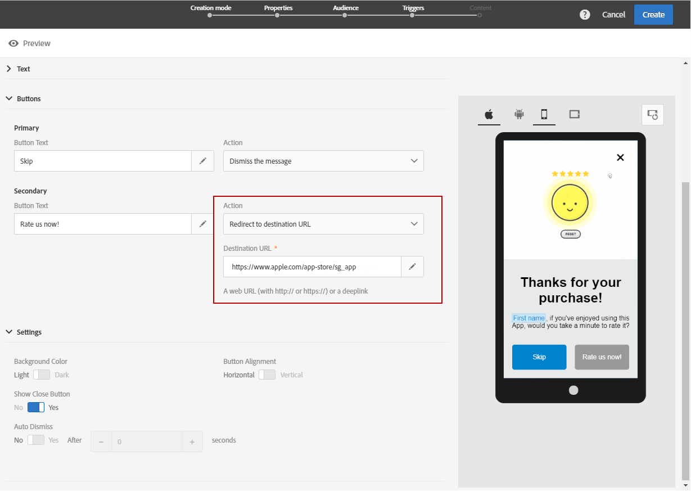

# Anpassa ett meddelande i appen{#customizing-an-in-app-message}

Om du vill finjustera ditt meddelande i appen kan du använda Adobe Campaign för att få tillgång till en uppsättning avancerade alternativ när du utformar en app.

Med innehållsredigeraren i appen kan du välja mellan två meddelandelägen i appen:

* [Meddelandemall](#customizing-with-a-message-template): Med den här mallen kan du anpassa In-App-programmet helt med bilder eller videoklipp och åtgärdsknappar.
* [Anpassat meddelande](#customizing-with-a-custom-html-message): Med den här mallen kan du importera egen HTML-kod.

**Relaterade ämnen:**

* [Skicka ditt meddelande i appen](../../channels/using/preparing-and-sending-an-in-app-message.md#sending-your-in-app-message)
* [Rapportering i appen](../../reporting/using/in-app-report.md)
* [Implementera lokal meddelandespårning](https://helpx.adobe.com/campaign/kb/local-notification-tracking.html)

## Anpassa med en meddelandemall {#customizing-with-a-message-template}

### Layout {#layout}

I den **[!UICONTROL Layout]** nedrullningsbara listan finns fyra olika alternativ att välja mellan beroende på vilka meddelandebehov du har:

* **[!UICONTROL Full page]**: Den här typen av layout täcker hela skärmen på målenheterna.

   Den stöder medie- (bild, video), text- och knappkomponenter.

* **[!UICONTROL Large modal]**: Layouten visas i ett stort varningsfönster och programmet visas fortfarande i bakgrunden.

   Den stöder medie- (bild, video), text- och knappkomponenter.

* **[!UICONTROL Small modal]**: Den här layouten visas som ett litet fönster med en viss typ av varning. Programmet visas fortfarande i bakgrunden.

   Den stöder medie- (bild, video), text- och knappkomponenter.

* **[!UICONTROL Alert]**: Den här typen av layout visas som ett systemspecifikt varningsmeddelande.

   Det har bara stöd för text- och knappkomponenter.

* **[!UICONTROL Local notification]**: Den här typen av layout visas som ett banderollmeddelande.

   Det kan bara hantera ljud, text och mål. Mer information om lokala meddelanden finns i [Anpassa en lokal meddelandetyp](#customizing-a-local-notification-message-type).

Varje typ av layouter kan förhandsgranskas på olika enheter, t.ex. telefon, surfplatta, plattform, t.ex. Android eller iOS, och orientering, t.ex. liggande eller stående i det högra fönstret i innehållsredigeraren.

### Media {#media}

I den **[!UICONTROL Media]** nedrullningsbara listan kan du lägga till media i dina meddelanden i appen för att skapa en övertygande upplevelse för slutanvändaren.

1. Välj **[!UICONTROL Media Type]** mellan bild och video.
1. För medietypen anger du din URL i **[!UICONTROL Image]** **[!UICONTROL Media URL]** fältet baserat på de format som stöds.

   Om det behövs kan du även ange sökvägen till en **[!UICONTROL Bundled image]** som kan användas om enheten är offline.

   

1. Ange din URL-adress i **[!UICONTROL Video]** fältet som **[!UICONTROL Media URL]** medietyp.

   Ange sedan den information som ska användas när videon hämtas på målenheterna eller tills användarna trycker på uppspelningsknappen. **[!UICONTROL Video poster]**

   

### Text {#text}

Om det behövs kan du även lägga till en meddelandetitel och innehåll i meddelandet i appen. Om du vill anpassa ditt meddelande i appen bättre kan du lägga till olika fält för anpassning, innehållsblock och dynamisk text i innehållet.

1. Lägg till en titel i **[!UICONTROL Text]** **[!UICONTROL Message title]** fältet i listrutan.

   

1. Lägg till ditt innehåll i **[!UICONTROL Message content]** fältet.
1. Om du vill anpassa texten ytterligare klickar du på  ikonen för att lägga till anpassningsfält.

   

1. Skriv ditt meddelandeinnehåll och lägg till dina anpassningsfält om det behövs.

   Mer information om anpassningsfält finns i det här [avsnittet](../../designing/using/personalization.md#inserting-a-personalization-field).

   

1. Kontrollera meddelandeinnehållet i förhandsgranskningsfönstret.

   

### Knappar {#buttons}

Du kan lägga till upp till två knappar i meddelandet i appen.

1. I den **[!UICONTROL Buttons]** nedrullningsbara listrutan anger du texten för den första knappen i **[!UICONTROL Primary]** kategorin.

   

1. Välj vilken av de två åtgärderna **[!UICONTROL Dismiss]** **[!UICONTROL Redirect]** som ska tilldelas till den primära knappen.
1. I **[!UICONTROL Secondary]** kategorin lägger du till en andra knapp i appen om det behövs genom att ange texten.
1. Välj den åtgärd som är kopplad till den andra knappen.
1. Om du väljer **[!UICONTROL Redirect]** åtgärden anger du webb-URL:en eller länken bryts ned i **[!UICONTROL Destination URL]** fältet.

   

1. Ange din webb-URL eller deplink i **[!UICONTROL Destination URL]** fältet, om du väljer **[!UICONTROL Redirect]** åtgärden,
1. Kontrollera meddelandeinnehållet i förhandsgranskningsfönstret eller genom att klicka på knappen Förhandsgranska.

   Se [Förhandsgranska meddelandesidan](#previewing-the-in-app-message) i appen.

   

### Inställningar {#settings}

1. Välj bakgrundsfärg mellan ljust och mörkt i **[!UICONTROL Settings]** kategorin.
1. Välj om du vill visa eller inte visa en stängningsknapp med alternativet **[!UICONTROL Show close button]** att ge användarna ett sätt att stänga meddelandet i appen.
1. Välj om knappjusteringen ska vara vågrät eller lodrät med **[!UICONTROL Button alignment]** alternativet.
1. Välj om ditt meddelande i appen kan stängas automatiskt eller inte efter några sekunder.

   

## Anpassa en lokal meddelandetyp {#customizing-a-local-notification-message-type}

Lokala meddelanden kan bara aktiveras av ett program vid en viss tidpunkt och beroende på en händelse. De kommer att varna användarna om att något händer i deras app, även utan att ha tillgång till Internet.
Mer information om hur du spårar lokala meddelanden finns på den här [sidan](https://helpx.adobe.com/campaign/kb/local-notification-tracking.html).

Så här anpassar du ett lokalt meddelande:

1. Välj **[!UICONTROL Content]** i **[!UICONTROL Local notification]** kategorin på din **[!UICONTROL Layout]** sida

   

1. Under **[!UICONTROL Text]** kategorin skriver du ned **[!UICONTROL Message title]** och **[!UICONTROL Message content]**.

   

1. Under **[!UICONTROL Advanced option]** kategorin i **[!UICONTROL Wait to display]** fältet väljer du hur länge i sekunder ditt lokala meddelande ska visas på skärmen när händelsen har utlösts.
1. I **[!UICONTROL Sound]** fältet anger du filnamnet på ljudfilen, med tillägget, som ska spelas upp av den mobila enheten när det lokala meddelandet tas emot.

   Ljudfilen spelas upp när meddelandet skickas om filen är definierad i mobilprogrammets paket. Annars spelas enhetens standardljud upp.

   

1. Ange en destination som omdirigerar användarna när de interagerar med ditt lokala meddelande i **[!UICONTROL Deeplink URL]** fältet.
1. Om du vill skicka anpassade data i nyttolasten i form av ett nyckelvärdepar kan du lägga till anpassade fält i det lokala meddelandet. Klicka på **[!UICONTROL Custom fields]** knappen i **[!UICONTROL Create an element]** kategorin.
1. Ange **[!UICONTROL Keys]** sedan den **[!UICONTROL Values]** som är associerad med respektive tangent.

   Observera att hanteringen och syftet med anpassade fält helt och hållet är mobilappen som bestämmer.

1. I **[!UICONTROL Apple options]** **[!UICONTROL Category]** kategorin fyller du i fälten för att lägga till ett kategori-ID för anpassade åtgärder, om sådana finns i ditt Apple-mobilprogram.

## Anpassa med ett anpassat HTML-meddelande {#customizing-with-a-custom-html-message}

>[!NOTE]
>
>Anpassat HTML-meddelande stöder inte innehållspersonalisering.

I **[!UICONTROL Custom message]** läget kan du importera ett av dina förkonfigurerade HTML-meddelanden direkt.

Om du vill göra det behöver du bara dra och släppa eller välja filen från datorn.

Filen måste ha en viss layout som du kan hitta genom att klicka på **Hämta exempelfilen** .

Du kan också hitta en lista med anpassade HTML-krav för en lyckad import i Adobe Campaign.

När HTML-koden har importerats kan du förhandsgranska filen på olika enheter i förhandsgranskningsfönstret.

## Förhandsgranska meddelandet i appen {#previewing-the-in-app-message}

Innan du skickar ditt meddelande i appen kan du testa med testprofilerna för att kontrollera vad målgruppen kommer att se när de får leveransen.

1. Klicka på **[!UICONTROL Preview]** knappen.

   

1. Klicka på **[!UICONTROL Select a test profile]** knappen och välj en av testprofilerna för att förhandsgranska leveransen. Mer information om testprofiler finns i det här [avsnittet](../../audiences/using/managing-test-profiles.md).
1. Kontrollera meddelandet på olika enheter som Android, iPhone-telefoner och till och med surfplattor. Du kan också kontrollera om dina anpassningsfält hämtar rätt data.

   

1. Du kan nu skicka ditt meddelande och mäta dess effekt med leveransrapporter. For more on reporting, refer to [this section](../../reporting/using/in-app-report.md).

