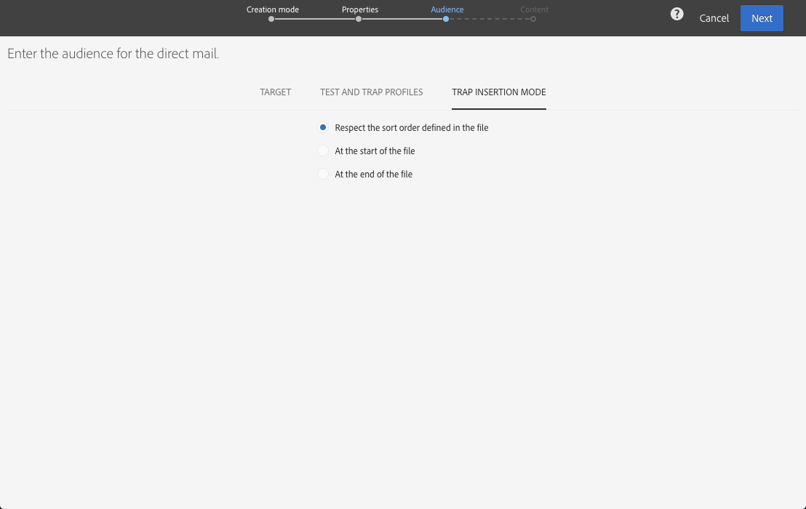

# Definiera målgruppen för direktreklam{#defining-the-direct-mail-audience}

Du kan antingen definiera målgruppen i guiden Skapa eller genom att klicka på **målgruppsdelen** i kontrollpanelen för leverans.

## Definiera huvudmålet {#defining-the-main-target}

För direktreklam är målprofilerna de som kommer att inkluderas i extraheringsfilen som du skickar till din direktreklamleverantör.

För varje målprofil läggs en ny rad till i extraheringsfilen. Mängden profilinformation som ska inkluderas för varje mottagare definieras i [Definiera extraheringsskärmen](../../channels/using/defining-the-direct-mail-content.md#defining-the-extraction) .

>[!CAUTION]
>
>Se till att dina profiler innehåller en postadress eftersom den här informationen är viktig för direktreklamleverantören. Se även till att du har markerat **[!UICONTROL Address specified]** rutan i profilinformationen. Se [Rekommendationer](../../channels/using/about-direct-mail.md#recommendations).

## Lägga till test- och svällningsprofiler {#adding-test-and-trap-profiles}

Lägg till testprofiler så att du kan testa filen med ett litet antal profiler. Du kan snabbt skapa ett filexempel för att testa och validera strukturen innan du förbereder den faktiska filen. Se [Hantera testprofiler](../../audiences/using/managing-test-profiles.md).

Användning av fällor är avgörande för direktreklam. De gör det möjligt för dig att verifiera att direktreklamleverantören verkligen skickar kommunikationen och att de inte skickar din klientlista till en annan leverantör. Se [Använda svällningar](../../sending/using/using-traps.md).

För direktutskick läggs svällningar till under extraheringen och blandas i utdatadokumentet. Som standard infogas de i sorteringsordningen för utdatafilen, men du kan välja att infoga dem i slutet eller början av filen. När du definierar målgruppen väljer du önskat alternativ på **[!UICONTROL Trap insertion mode]** fliken.

