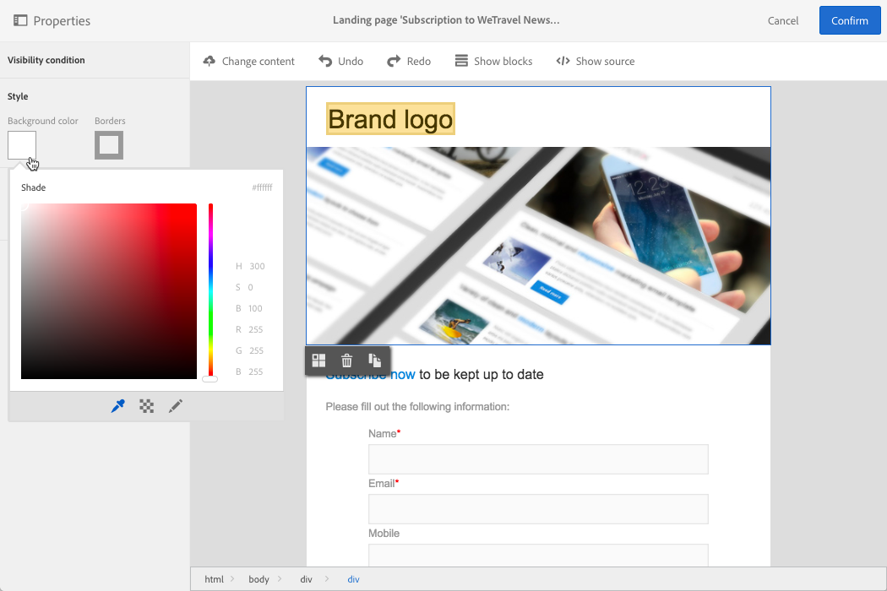
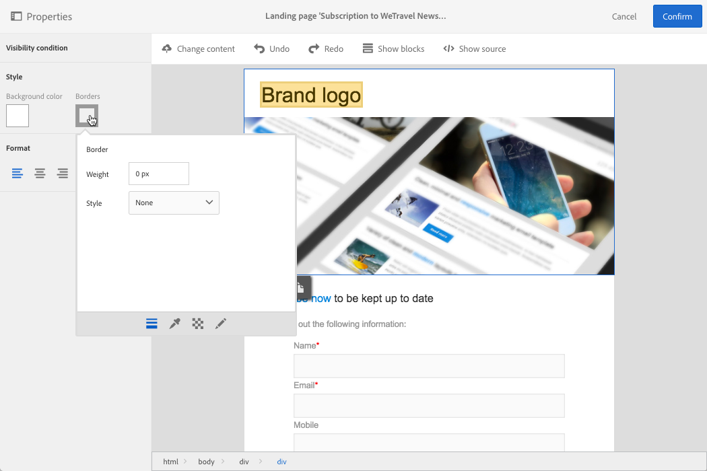

# Utforma en landningssida{#designing-a-landing-page}

## Innehållsdesign för landningssidans innehåll {#about-content-design}

Landningssidor skapas på samma sätt som alla andra [marknadsföringsaktiviteter](../../start/using/marketing-activities.md#about-marketing-activities).

När du utformar en landningssida måste du definiera innehållet på själva sidan, bekräftelsesidan och felsidan. Använd väljaren under åtgärdsfältet för att visa och konfigurera varje sida.

Innehållet på landningssidor utformas med Campaign-innehållsredigeraren.

>[!NOTE]
>
>Om din instans installerades före Adobe Campaign Standard 19.0-utgåvan har du fortfarande tillgång till den äldre e-postredigeraren för e-postdesign. Gränssnittet, principerna för användning och konfiguration är i princip desamma som beskrivs nedan för landningssidor. Alla funktioner kanske inte är tillgängliga eller underhålls i den äldre redigeraren för e-postinnehåll, som är inaktuell från och med version 19.0. Om du snabbt vill redigera e-postinnehåll via ett dra och släpp-gränssnitt med utökade funktioner använder du [E-postdesigner](../../designing/using/designing-content-in-adobe-campaign.md).

Den här sidan beskriver egenskaperna för redigeraren för landningssidans innehåll. Mer information om åtgärder som är gemensamma för en eller flera marknadsföringsaktiviteter finns i följande avsnitt i guiden **Designa e-postinnehåll**:

* [Infoga ett anpassningsfält](../../designing/using/personalization.md#inserting-a-personalization-field)
* [Lägga till ett innehållsblock](../../designing/using/personalization.md#adding-a-content-block)
* [Infoga en länk](../../designing/using/links.md#inserting-a-link)
* [Infoga bilder](../../designing/using/images.md)
* [Allmänna bästa metoder för innehållsdesign](../../designing/using/designing-content-in-adobe-campaign.md#content-design-best-practices)

>[!NOTE]
>Om du har en landningssida som redan är fördefinierad i HTML-format kan du importera den direkt med knappen **[!UICONTROL Change content]**.
>
>Innan du importerar en HTML-sida i Adobe Campaign måste du se till att den öppnas och visas korrekt i de olika webbläsarna. Om HTML-sidan innehåller JavaScript-skript måste de köras utan fel utanför redigeraren. Generellt sett bör du undvika att använda skript i meddelandeinnehåll för att se till att det behandlas korrekt av e-postklienter.

## Gränssnitt för redigering av sidinnehåll{#landing-page-content-editor-interface}

Med redigeraren för innehåll på landningssidan kan du enkelt definiera, ändra och anpassa innehåll i Adobe Campaign. Du öppnar det genom att klicka på **[!UICONTROL Content]**-blocket på en kontrollpanel för landningssidan.

Innehållsredigeraren är indelad i tre olika avsnitt. I de här avsnitten kan du visa och redigera innehållet.

1. Med **paletten** till vänster på skärmen kan du ändra de allmänna alternativ som är kopplad till ett markerat block. De alternativ som kan ändras är: bakgrundsfärg, kantlinje, textjustering, synlighetsvillkor, o.s.v. Se [Infoga ett personaliserat fält](../../designing/using/personalization.md#inserting-a-personalization-field).
1. I **åtgärdsfältet** finns de allmänna alternativen för sidan. Du kan välja en mall och ändra visningsläget.
1. I den primära **redigeringszonen** kan du interagera direkt med innehållet via det kontextberoende verktygsfältet: infoga en länk i en bild, ändra teckensnitt, ta bort ett fält, o.s.v.

**Åtgärdsfältet** har olika knappar som gör att du kan interagera med innehållet som skapas.

<table> 
 <thead> 
  <tr> 
   <th> Ikon  </th> 
   <th> Knappnamn  </th> 
   <th> Kanal  </th> 
   <th> Beskrivning  </th> 
  </tr> 
 </thead> 
 <tbody> 
  <tr> 
   <td>    </td> 
   <td> Ändra innehåll   </td> 
   <td> Landningssida och e-post  </td> 
   <td> Kan användas om du vill välja färdigt innehåll eller importera ditt eget HTML-innehåll. Se <a href="../../designing/using/using-existing-content.md">Läsa in befintligt innehåll</a>.  </td> 
  </tr> 
  <tr> 
   <td>    </td> 
   <td> Ångra   </td> 
   <td> Alla  </td> 
   <td> Avbryter den senaste åtgärden som utfördes.  </td> 
  </tr> 
  <tr> 
   <td>    </td> 
   <td> Gör om   </td> 
   <td> Alla  </td> 
   <td> Gör om den senaste åtgärden som du avbröt.  </td> 
  </tr> 
  <tr> 
   <td>    </td> 
   <td> Visa block   </td> 
   <td> Landningssida och e-post  </td> 
   <td> Gör att du kan visa rutorna runt innehållsblocken (motsvarar <strong>&lt;div&gt;</strong> HTML-taggen).  </td> 
  </tr> 
  <tr> 
   <td>    </td> 
   <td> Visa källa   </td> 
   <td> Landningssida och e-post  </td> 
   <td> Gör att du kan visa sidans HTML-källkod.  </td> 
  </tr> 
 </tbody> 
</table>

**Verktygsfältet** är ett kontextelement i redigeringsgränssnittet som innehåller olika funktioner beroende på vilken zon som är markerad. Den innehåller åtgärdsknappar och knappar som du kan användas för att ändra textens format. De ändringar som görs gäller alltid för den markerade zonen. När du har markerat ett block kan du t.ex. ta bort eller duplicera det. När du har markerat texten i ett block kan du göra om den till en länk eller göra den fet.

>[!IMPORTANT]
>
>Du kan formatera HTML-innehållet med vissa verktygsfältsfunktioner. Om sidan innehåller en CSS-formatmall kan **instruktionerna** från formatmallen emellertid ha **högre prioritet** än instruktionerna som har angetts via verktygsfältet.

<table> 
 <thead> 
  <tr> 
   <th> Ikon  </th> 
   <th> Knappnamn  </th> 
   <th> Kontext  </th> 
   <th> Beskrivning  </th> 
  </tr> 
 </thead> 
 <tbody> 
  <tr> 
   <td>    </td> 
   <td> Länk till en extern URL   </td> 
   <td> Alla element  </td> 
   <td> Kan användas om du vill lägga till en länk till en URL. Information om hur du konfigurerar en länk finns i avsnittet <a href="../../designing/using/links.md#inserting-a-link">Infoga en länk</a>.  </td> 
  </tr> 
  <tr> 
   <td>    </td> 
   <td> Länk till en landningssida   </td> 
   <td> Alla element  </td> 
   <td> Ger åtkomst till en Adobe Campaign-landningssida. Information om hur du konfigurerar en länk finns i avsnittet <a href="../../designing/using/links.md#inserting-a-link">Infoga en länk</a>.  </td> 
  </tr> 
  <tr> 
   <td>    </td> 
   <td> Prenumerationslänk   </td> 
   <td> Alla element  </td> 
   <td> Gör att du kan infoga en prenumerationslänk. Information om hur du konfigurerar en länk finns i avsnittet <a href="../../designing/using/links.md#inserting-a-link">Infoga en länk</a>.  </td> 
  </tr> 
  <tr> 
   <td>    </td> 
   <td> Avprenumerationslänk   </td> 
   <td> Alla element  </td> 
   <td> Gör att du kan infoga en avprenumerationslänk. Information om hur du konfigurerar en länk finns i avsnittet <a href="../../designing/using/links.md#inserting-a-link">Infoga en länk</a>.  </td> 
  </tr> 
  <tr> 
   <td>    </td> 
   <td> Ta bort länk   </td> 
   <td> Länk  </td> 
   <td> Gör att du kan ta bort länken och alla konfigurationer som är kopplade till den efter att du har bekräftat.  </td> 
  </tr> 
  <tr> 
   <td>    </td> 
   <td> Infoga ett anpassningsfält   </td> 
   <td> Textelement  </td> 
   <td> Gör så att du kan lägga till ett fält från databasen till innehållet. Se <a href="../../designing/using/personalization.md#inserting-a-personalization-field">Infoga ett personaliserat fält</a>.  </td> 
  </tr> 
  <tr> 
   <td>    </td> 
   <td> Infoga ett innehållsblock   </td> 
   <td> Textelement  </td> 
   <td> Gör så att du kan lägga till ett personaliserat block i innehållet. Se <a href="../../designing/using/personalization.md#adding-a-content-block">Lägga till ett innehållsblock</a>.  </td> 
  </tr> 
  <tr> 
   <td>    </td> 
   <td> Aktivera dynamiskt innehåll   </td> 
   <td> Textelement  </td> 
   <td> Gör att du kan infoga dynamiskt innehåll i innehållet. Mer information finns i <a href="../../channels/using/designing-a-landing-page.md#defining-dynamic-content-in-a-landing-page">Definiera dynamiskt innehåll</a>.  </td> 
  </tr> 
  <tr> 
   <td>    </td> 
   <td> Inaktivera dynamiskt innehåll   </td> 
   <td> Textelement  </td> 
   <td> Gör att du kan ta bort dynamiskt innehåll.  </td> 
  </tr> 
  <tr> 
   <td>    </td> 
   <td> Förstora teckensnitt   </td> 
   <td> Textelement  </td> 
   <td> Ökar storleken på den markerade texten (lägger till <strong>&lt;span style="font-size:"&gt;</strong>).  </td> 
  </tr> 
  <tr> 
   <td>    </td> 
   <td> Minska teckensnitt   </td> 
   <td> Textelement  </td> 
   <td> Minskar storleken på den markerade texten (lägger till <strong>&lt;span style="font-size:"&gt;</strong>).  </td> 
  </tr> 
  <tr> 
   <td>    </td> 
   <td> Fet   </td> 
   <td> Textelement  </td> 
   <td> Lägger till fetstil i den markerade texten (radbryter texten med taggarna <strong>&lt;strong&gt;</strong><strong>&lt;/strong&gt;</strong>).  </td> 
  </tr> 
  <tr> 
   <td>    </td> 
   <td> Kursiv   </td> 
   <td> Textelement  </td> 
   <td> Lägger till kursiv stil i den markerade texten (radbryter texten med <strong>&lt;em&gt;</strong><strong>&lt;/em&gt;</strong>-taggarna).  </td> 
  </tr> 
  <tr> 
   <td>    </td> 
   <td> Understreck   </td> 
   <td> Textelement  </td> 
   <td> Stryker under den markerade texten (radbryter den markerade texten med <strong>&lt;span style="text-decoration: underline;"&gt;</strong>-taggen).  </td> 
  </tr> 
  <tr> 
   <td>    </td> 
   <td> Ändra bakgrundsfärg   </td> 
   <td> Textelement  </td> 
   <td> Gör att du kan ändra bakgrundsfärgen för det markerade blocket (lägger till style="background-color: rgba(170, 86, 255, 0.87)).  </td> 
  </tr> 
  <tr> 
   <td>    </td> 
   <td> Ändra teckensnittsfärg   </td> 
   <td> Textelement  </td> 
   <td> Gör att du kan ändra färgen på all text i blocket eller bara på den text som är markerad i blocket (<strong>&lt;span style="color: #56ff56;"&gt;</strong>).  </td> 
  </tr> 
  <tr> 
   <td>    </td> 
   <td> Bild   </td> 
   <td> Block som innehåller en bild  </td> 
   <td> Gör att du kan infoga en bild från en fil som har sparats lokalt.  </td> 
  </tr> 
  <tr> 
   <td>    </td> 
   <td> Ta bort   </td> 
   <td> Alla block  </td> 
   <td> Tar bort blocket och dess innehåll.  </td> 
  </tr> 
  <tr> 
   <td>    </td> 
   <td> Duplicera   </td> 
   <td> Alla block  </td> 
   <td> Duplicerar blocket inklusive eventuella format som är kopplade till det.  </td> 
  </tr> 
 </tbody> 
</table>

## Hantera landningssidans struktur och stil{#managing-landing-page-structure-and-style}

### Hantera block i innehållsredigeraren {#managing-blocks-in-the-content-editor}

De olika elementen för HTML-innehåll visas på landningssidan som block, vilket motsvarar taggen **&lt;div>** **&lt;/div>**. Markera ett block som du vill interagera med. Därefter omges den av en blå ruta.

Om ett block är markerat visas de överordnade objekten för motsvarande HTML-element i en synlig sökväg som finns längst ned i redigeringszonen.

När musen hålls över ett av de synliga elementen markeras det aktuella elementet. Du kan därför enkelt navigera mellan de olika blocken och välja exakt det HTML-element som du vill ändra.

Använd alternativen från paletten och det kontextberoende verktygsfältet för att ändra, ta bort eller duplicera blocket.

För de block som innehåller text klickar du igen i blocket om du vill aktivera textredigeringsläget. Bildrutan runt blocket blir grön. Sedan kan du markera eller skriva text. Använd alternativen från paletten och det kontextberoende verktygsfältet för att lägga till en länk eller ändra textformateringen.

De parametrar som definieras för ett element i ett block (länkar, anpassningsfält, innehållsblock, o.s.v.) kan ändras när som helst från paletten.

### Lägga till en kantlinje och en bakgrund i innehållsredigeraren {#adding-a-border-and-a-background-in-the-content-editor}

Du kan också definiera en **bakgrundsfärg** genom att välja en färg i diagrammet. Den här färgen används på det markerade blocket.

Du kan lägga till en **kantlinje** i det markerade blocket.

### Ändra textformatet i innehållsredigeraren {#changing-the-text-style-in-the-content-editor}

Om du vill ändra textens format måste du klicka inuti ett textblock.

Om du vill ändra textjusteringen väljer du en av följande tre ikoner på paletten till vänster:

* **Vänsterjustera**: Justerar texten till vänster om det markerade blocket (lägger till style=&quot;text-align: left;&quot;).
* **Centrera**: Centrerar texten i det markerade blocket (lägger till style=&quot;text-align: center;&quot;).
* **Högerjustera**: Justerar texten till höger om det markerade blocket (lägger till style=&quot;text-align: right;&quot;).

Du kan också använda verktygsfältet för att ändra teckensnittsattributen: Anpassa teckenstorleken, gör texten fet eller kursiv, stryk under eller ändra textens färg. Se [det här avsnittet](../../channels/using/designing-a-landing-page.md#landing-page-content-editor-interface).

### Infoga bilder på en landningssida {#inserting-images-in-a-landing-page}

1. Markera ett block som innehåller en bild i innehållet på en landningssida.
1. Markera knappen **[!UICONTROL Insert]**.

   

1. Välj **[!UICONTROL Local image]** i det kontextberoende verktygsfältet.

   

1. Välj en fil.

   

1. Justera bildegenskaperna efter behov.

   

## Definiera dynamiskt innehåll på en landningssida{#defining-dynamic-content-in-a-landing-page}

Om du vill definiera dynamiskt innehåll på en landningssida markerar du ett block med hjälp av en synlig sökväg eller genom att klicka direkt på ett element.

Vissa block, till exempel bilder, kan inte markeras direkt. Då väljer du det överordnade blocket med hjälp av den synliga sökvägen. Sedan kan du ändra alla element som finns i det överordnade elementet, inklusive bilder. Villkoret tillämpas på alla underordnade element inom det överordnade blocket.

Den synliga sökvägen finns i avsnittet [Hantera block](../../channels/using/designing-a-landing-page.md#managing-landing-page-structure-and-style).

Nästa steg för att definiera dynamiskt innehåll på en landningssida liknar de steg som ska följas för ett e-postmeddelande. Se [det här avsnittet](../../designing/using/personalization.md#defining-dynamic-content-in-an-email).

>[!NOTE]
>
>Om ett variantelement har röda konturer innebär det att ett uttryck ännu inte har definierats.

Du kan navigera mellan det olika dynamiska innehållet i ett block. Så här gör du:

1. Markera blocket.

   Pilar visas till höger och vänster om bilden.

1. Klicka på högerpilen för att bläddra igenom det tillgängliga dynamiska innehållet.

   

   Pilarna på varje sida som tonas ned beroende på om du har nått det sista eller första tillgängliga dynamiska innehållet.

   

1. Om du vill ta bort alla villkor som används för ett block markerar du blocket och klickar på **[!UICONTROL Disable dynamic content]**-ikonen.
1. Markera det dynamiska innehåll som du vill behålla.

   

I paletten:

* Innehållet som har ett uttryck angivet visas inte längre i rött, utan i grått.
* Innehållet som är markerat visas i blått.

