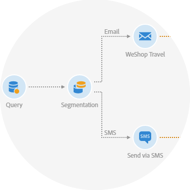

# Identifiera kommunikationskanaler{#discovering-communication-channels}

Med Adobe Campaign kan ni lansera, mäta och automatisera kampanjer i alla kanaler.
Att harmonisera alla era marknadsföringskanaler är inte en omöjlig uppgift. Med hjälp av Adobe Campaign kan ni samla kunddata från olika system, enheter och kanaler i en enda profil. Leverera sedan aktuella och relevanta kampanjer som möter era kunder på rätt plats och på rätt sätt under kundresan.

Det finns fem kommunikationskanaler i Adobe Campaign:

* E-post, som presenteras i avsnittet [Skapa ett e-postmeddelande](../../channels/using/about-emails.md) .
* SMS, presenteras i avsnittet [Skapa ett SMS-meddelande](../../channels/using/about-sms-messages.md) .
* Push-meddelanden, som visas i avsnittet [Skapa ett push-meddelande](../../channels/using/about-push-notifications.md) .
* Meddelanden i appen som presenteras i [avsnittet Skapa ett meddelande](../../channels/using/about-in-app-messaging.md) i appen.
* Direktreklam, som presenteras i avsnittet [Skapa direktreklam](../../channels/using/about-direct-mail.md) .

Alla marknadsföringsaktiviteter baseras på en [mall](../../start/using/marketing-activity-templates.md). Mallar kan användas för att konfigurera egenskaper så att du kan få tid och enhetlighet i din meddelandestrategi.

För e-postmeddelanden kan till exempel den funktionsadministratör som ansvarar för att konfigurera mallarna definiera:

* Standardparametrarna för ett e-postmeddelande, till exempel målgrupp, schema eller innehåll.
* De avancerade parametrarna för sändning, giltighet, spårning osv.
* Parametrar före konfigurering för målinriktning och personalisering (målgruppskontext).

## Relaterade ämnen

| Användbara sidor | Ytterligare resurser |
|---|---|
| [Skapa mallar](../../start/using/marketing-activity-templates.md) | [Optimera leveransen](../../sending/using/about-deliverability.md) |
| [Utforma ett e-postinnehåll](../../designing/using/designing-content-in-adobe-campaign.md) | [Bästa praxis](https://helpx.adobe.com/campaign/kb/delivery-best-practices.html) |
| [Skapa ett flerspråkigt push-meddelande](../../channels/using/creating-a-multilingual-push-notification.md) | [Utforma landningssidor](../../channels/using/getting-started-with-landing-pages.md) |
| [Transaktionsmeddelanden](../../channels/using/about-transactional-messaging.md) | [Importera ett AEM-innehåll](../../integrating/using/creating-email-experience-manager.md) |
| [Kom igång med e-post](https://helpx.adobe.com/campaign/kb/acs-get-started-with-emails.html) | [Skicka meddelanden med arbetsflöden](../../automating/using/about-channel-activities.md) |
