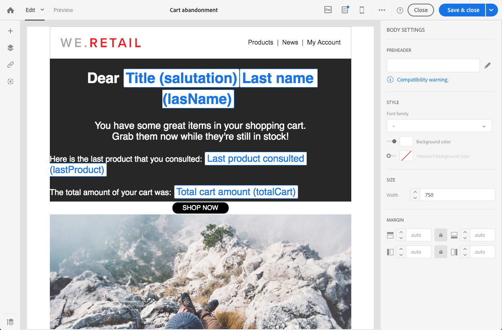
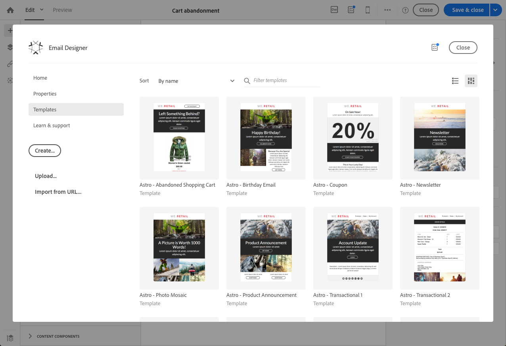

# Redigera ett transaktionsmeddelande {#editing-transactional-message}

När du har skapat och publicerat en händelse<!--(the cart abandonment example as explained in [this section](../../channels/using/getting-started-with-transactional-msg.md#transactional-messaging-operating-principle))--> skapas motsvarande transaktionsmeddelande automatiskt.

Stegen för att konfigurera och publicera händelsen beskrivs i avsnittet [Konfigurera en transaktionshändelse](../../channels/using/configuring-transactional-event.md) och [Publicera en transaktionshändelse](../../channels/using/publishing-transactional-event.md).

Stegen för att komma åt, redigera och anpassa det här meddelandet beskrivs nedan.

>[!IMPORTANT]
>
>Endast användare med rollen [Administration](../../administration/using/users-management.md#functional-administrators) kan komma åt och redigera transaktionsmeddelanden.

När meddelandet är klart kan det testas och publiceras. Se [Testa ett transaktionsmeddelande](../../channels/using/testing-transactional-message.md) och [Livslängd för transaktionsmeddelande](../../channels/using/publishing-transactional-message.md).

## Åtkomst till transaktionsmeddelanden {#accessing-transactional-messages}

Så här kommer du åt transaktionsmeddelandet som du har skapat:

1. Klicka på logotypen **Adobe** i det övre vänstra hörnet.
1. Välj **[!UICONTROL Marketing plans]** > **[!UICONTROL Transactional messages]** > **[!UICONTROL Transactional messages]**.

   

1. Klicka på det meddelande du vill redigera.

   

Du kan även få direkt åtkomst till ett transaktionsmeddelande via länken till vänster i motsvarande händelsekonfigurationsfönster. Se [Förhandsgranska och publicera en händelse](../../channels/using/publishing-transactional-event.md#previewing-and-publishing-the-event)

## Anpassa ett transaktionsmeddelande {#personalizing-a-transactional-message}

Följ stegen nedan om du vill redigera och anpassa ett transaktionsmeddelande.

>[!NOTE]
>
>I det här avsnittet beskrivs hur du redigerar ett **händelsebaserat** transaktionsmeddelande. Specifikationerna för **profilbaserade** transaktionsmeddelanden beskrivs [nedan](#profile-transactional-message-specificities).
>
>Konfigurationsstegen för att skapa ett händelsebaserat transaktionsmeddelande visas i [det här avsnittet](../../channels/using/configuring-transactional-event.md#event-based-transactional-messages).

Du vill till exempel skicka ett meddelande till webbplatsanvändare som har lagt till produkter i kundvagnen och lämnat webbplatsen utan att gå igenom sina inköp. Det här exemplet presenteras i [Transactional messaging operating policy](../../channels/using/getting-started-with-transactional-msg.md#transactional-messaging-operating-principle)-avsnittet.

1. Klicka på **[!UICONTROL Content]**-blocket för att ändra meddelandets ämne och innehåll. I det här exemplet väljer du en mall som innehåller bilder och text. Mer information om mallar för e-postinnehåll finns i [Designa e-postmeddelanden med mallar](../../designing/using/using-reusable-content.md#designing-templates).

   

1. Lägg till ett ämne och redigera meddelandeinnehållet efter dina behov.

   >[!NOTE]
   >
   >Länken till den övergivna kundvagnen är en länk till en extern URL som dirigerar om personen till kundvagnen. Den här parametern hanteras inte i Adobe Campaign.

1. I det här exemplet lägger du till tre fält som du definierade när du [skapade händelsen](../../channels/using/configuring-transactional-event.md): Förnamn, efternamn, efternamn, kundvagnens totalbelopp. Du gör det genom att [infoga ett anpassningsfält](../../designing/using/personalization.md#inserting-a-personalization-field) i meddelandeinnehållet.

1. Bläddra till fälten genom **[!UICONTROL Context]** > **[!UICONTROL Real-time event]** > **[!UICONTROL Event context]**.

   

1. Du kan också förbättra innehållet i ditt meddelande. Det gör du genom att lägga till fält från tabellen som du länkade till händelsekonfigurationen (se [Förbättra händelsen](../../channels/using/configuring-transactional-event.md#enriching-the-transactional-message-content)). I det här exemplet väljer du fältet **[!UICONTROL Title (salutation)]** från tabellen **[!UICONTROL Profile]** via **[!UICONTROL Context]** > **[!UICONTROL Real-time event]** > **[!UICONTROL Event context]**.

   

1. Infoga alla fält som behövs.

   

1. Förhandsgranska meddelandet genom att välja den profil som du har definierat för den här händelsen.

   Stegen för att förhandsgranska ett meddelande finns i avsnittet [Förhandsgranska meddelanden](../../sending/using/previewing-messages.md).

   

   Du kan kontrollera att anpassningsfälten matchar informationen som anges i testprofilen. Mer information finns i [Definiera en specifik testprofil](../../channels/using/testing-transactional-message.md#defining-specific-test-profile).

<!--## Using product listings in a transactional message {#using-product-listings-in-a-transactional-message}

When editing the content of a transactional email, you can create product listings referencing one or more data collections. For example, in a cart abandonment email, you can include a list of all products that were in the users' carts when they left your website, with an image, the price, and a link to each product.

>[!IMPORTANT]
>
>Product listings are only available for the email channel, when editing transactional email content through the [Email Designer](../../designing/using/designing-content-in-adobe-campaign.md#email-designer-interface) interface.

To add a list of abandoned products in a transactional message, follow the steps below.

You can also watch [this set of videos](https://experienceleague.adobe.com/docs/campaign-standard-learn/tutorials/designing-content/product-listings-in-transactional-email.html?lang=en#configure-product-listings-in-transactional-emails) explaining the steps that are required to configure product listings in a transactional email.

>[!NOTE]
>
>Adobe Campaign does not support nested product listings, meaning that you cannot include a product listing inside another one.

### Defining a product listing {#defining-a-product-listing}

Before being able to use a product listing in a transactional message, you need to define at the event level the list of products and the fields for each product of the list you want to display. For more on this, see [Defining data collections](../../channels/using/configuring-transactional-event.md#defining-data-collections).

1. In the transactional message, click the **[!UICONTROL Content]** block to modify the email content.
1. Drag and drop a structure component to the workspace. For more on this, see [Defining the email structure](../../designing/using/designing-from-scratch.md#defining-the-email-structure).

   For example, select a one-column structure component and add a text component, an image component and a button component. For more on this, see [Using content components](../../designing/using/designing-from-scratch.md#about-content-components).

1. Select the structure component you just created and click the **[!UICONTROL Enable product listing]** icon from the contextual toolbar.

   

   The structure component is highlighted with an orange frame and the **[!UICONTROL Product listing]** settings are displayed in the left palette.

   

1. Select how the elements of the collection will be displayed:

    * **[!UICONTROL Row]**: horizontally, meaning each element on one row under the other.
    * **[!UICONTROL Column]**: vertically, meaning each element next to the other on the same row.

   >[!NOTE]
   >
   >The **[!UICONTROL Column]** option is only available when using a multicolumn structure component ( **[!UICONTROL 2:2 column]**, **[!UICONTROL 3:3 column]** and **[!UICONTROL 4:4 column]** ). When editing the product listing, only fill in the first column: the other columns will not be taken into account. For more on selecting structure components, see [Defining the email structure](../../designing/using/designing-from-scratch.md#defining-the-email-structure).

1. Select the data collection you created when configuring the event related to the transactional message. You can find it under the **[!UICONTROL Context]** > **[!UICONTROL Real-time event]** > **[!UICONTROL Event context]** node.

   

   For more on configuring the event, see [Defining data collections](../../channels/using/configuring-transactional-event.md#defining-data-collections).

1. Use the **[!UICONTROL First item]** drop-down list to select which element will start the list displayed in the email.

   For example, if you select 2, the first item of the collection will not be displayed in the email. The product listing will start on the second item.

1. Select the maximum number of items to display in the list.

   >[!NOTE]
   >
   >If you want the elements of your list to be displayed vertically ( **[!UICONTROL Column]** ), the maximum number of items is limited according to the selected structure component (2, 3 or 4 columns). For more on selecting structure components, see [Editing the email structure](../../designing/using/designing-from-scratch.md#defining-the-email-structure).

### Populating the product listing {#populating-the-product-listing}

To display a list of products coming from the event linked to the transactional email, follow the steps below.

For more on creating a collection and related fields when configuring the event, see [Defining data collections](../../channels/using/configuring-transactional-event.md#defining-data-collections).

1. Select the image component you inserted, select **[!UICONTROL Enable personalization]** and click the pencil in the Settings pane.

   

1. Select **[!UICONTROL Add personalization field]** in the **[!UICONTROL Image source URL]** window that opens.

   From the **[!UICONTROL Context]** > **[!UICONTROL Real-time event]** > **[!UICONTROL Event context]** node, open the node corresponding to the collection that you created (here **[!UICONTROL Product list]** ) and select the image field that you defined (here **[!UICONTROL Product image]** ). Click **[!UICONTROL Save]**.

   

   The personalization field that you selected is now displayed in the Settings pane.

1. At the desired position, select **[!UICONTROL Insert personalization field]** from the contextual toolbar.

   

1. From the **[!UICONTROL Context]** > **[!UICONTROL Real-time event]** > **[!UICONTROL Event context]** node, open the node corresponding to the collection that you created (here **[!UICONTROL Product list]** ) and select the field that you created (here **[!UICONTROL Product name]** ). Click **[!UICONTROL Confirm]**.

   

   The personalization field that you selected is now displayed at the desired position in the email content.

1. Proceed similarly to insert the price.
1. Select some text and select **[!UICONTROL Insert link]** from the contextual toolbar.

   

1. Select **[!UICONTROL Add personalization field]** in the **[!UICONTROL Insert link]** window that opens.

   From the **[!UICONTROL Context]** > **[!UICONTROL Real-time event]** > **[!UICONTROL Event context]** node, open the node corresponding to the collection that you created (here **[!UICONTROL Product list]** ) and select the URL field that you created (here **[!UICONTROL Product URL]** ). Click **[!UICONTROL Save]**.

   >[!IMPORTANT]
   >
   >For security reasons, make sure you insert the personalization field inside a link starting with a proper static domain name.

   

   The personalization field that you selected is now displayed in the Settings pane.

1. Select the structure component on which the product listing is applied and select **[!UICONTROL Show fallback]** to define a default content.

   

1. Drag one or more content components and edit them as needed.

   

   The fallback content will be displayed if the collection is empty when the event is triggered, for example if a customer has nothing in his cart.

1. From the Settings pane, edit the styles for the product listing. For more on this, see [Managing email styles](../../designing/using/styles.md).
1. Preview the email using a test profile linked to the relevant transactional event and for which you defined collection data. For example, add the following information in the **[!UICONTROL Event data]** section for the test profile you want to use:

   

   For more on defining a test profile in a transactional message, see [this section](../../channels/using/testing-transactional-message.md#defining-specific-test-profile).-->

## Specifikationer för profilbaserade transaktionsmeddelanden {#profile-transactional-message-specificities}

Du kan skicka transaktionsmeddelanden baserat på kundmarknadsföringsprofiler, vilket gör att du kan använda all profilinformation för att anpassa meddelandeinnehållet, använda länken för att ta bort prenumerationen och tillämpa typologiregler för marknadsföring som [trötthetsregler](../../sending/using/fatigue-rules.md).

* Mer information om skillnaderna mellan händelsebaserade och profilbaserade transaktionsmeddelanden finns i [det här avsnittet](../../channels/using/getting-started-with-transactional-msg.md#transactional-message-types).

* Konfigurationsstegen för att skapa ett profilbaserat transaktionsmeddelande beskrivs i [det här avsnittet](../../channels/using/configuring-transactional-event.md#profile-based-transactional-messages).

Stegen för att skapa, redigera och personalisera ett profiltransaktionsmeddelande är i huvudsak desamma som för ett händelsetransaktionsmeddelande.

Skillnaderna mellan dessa anges nedan.

1. [Gå till transaktionsmeddelandet som skapades för att redigera det.](#accessing-transactional-messages)
1. Klicka på **[!UICONTROL Content]**-avsnittet i transaktionsmeddelandet.  Förutom e-postmallar för transaktioner kan du även välja valfri e-postmall för resursen **[!UICONTROL Profile]**.

   

1. Välj standardmall för e-post. Liknar alla marknadsföringsmejl innehåller den en **länk för att avbryta prenumerationen**.

   

   Mer information om mallar finns i [det här avsnittet](../../designing/using/using-reusable-content.md#content-templates).

1. Till skillnad från konfigurationer som baseras på realtidshändelser har du **direkt åtkomst till all profilinformation** för att anpassa ditt meddelande. Du kan lägga till [anpassningsfält](../../designing/using/personalization.md#inserting-a-personalization-field) på samma sätt som du gör för andra vanliga marknadsföringsmeddelanden.

1. Spara ändringarna innan du publicerar meddelandet. Mer information finns i [Publicera ett transaktionsmeddelande](../../channels/using/publishing-transactional-message.md#publishing-a-transactional-message).

<!--### Monitoring a profile transactional message delivery {#monitoring-a-profile-transactional-message-delivery}

Once the message is published and your site integration is done, you can monitor the delivery.

1. To view the message delivery log, click the icon at the bottom right of the **[!UICONTROL Deployment]** block.

1. Click the **[!UICONTROL Execution list]** tab.

   

1. Select the latest execution delivery.

   An **execution delivery** is a non-actionable and non-functional technical message created once a month for each transactional message, and each time a transactional message is edited and published again

1. Select the **[!UICONTROL Sending logs]** tab. In the **[!UICONTROL Status]** column, **[!UICONTROL Sent]** indicates that a profile has opted in.

   

1. Select the **[!UICONTROL Exclusions logs]** tab to view recipients who have been excluded from the message target, such as addresses on denylist.

   

>[!NOTE]
>
>For more information on accessing and using the logs, see [Monitoring a delivery](../../sending/using/monitoring-a-delivery.md).

For any profile that has opted out, the **[!UICONTROL Address on denylist]** typology rule excluded the corresponding recipient.

This rule is part of a specific typology that applies to all transactional messages based on the **[!UICONTROL Profile]** table.

**Related topics**:

* [Integrate the event triggering](../../channels/using/getting-started-with-transactional-msg.md#integrate-event-trigger)
* [About typologies and typology rules](../../sending/using/about-typology-rules.md)-->
