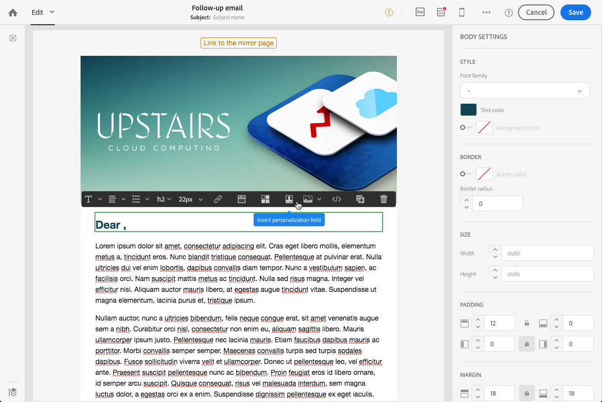

# Uppföljningsmeddelanden {#follow-up-messages}

Ett uppföljningsmeddelande är en fördefinierad mall för marknadsföringsleverans som kan användas i ett arbetsflöde för att skicka ytterligare en kommunikation till mottagarna av ett visst transaktionsmeddelande.

Vi återanvänder exemplet som beskrivs i [Transactional messaging operating policy policy](../../channels/using/getting-started-with-transactional-msg.md#transactional-messaging-operating-principle) avsnitt: ett e-postmeddelande om att kunden överger en varukorg skickas till webbplatsanvändare som har lagt till produkter i kundvagnen, men som har lämnat webbplatsen utan att behöva göra något av sina inköp.

Du vill skicka en påminnelse till alla kunder som fick meddelande om att kunden övergett kundvagnen men som inte öppnade den efter tre dagar. De får ett uppföljningsmeddelande baserat på samma data som användes i det första e-postmeddelandet som skickades.

## Konfigurera en händelse för att skicka ett uppföljningsmeddelande {#configuring-an-event-to-send-a-follow-up-message}

Om du vill skicka ett uppföljningsmeddelande måste du först konfigurera händelsen som motsvarar det transaktionsmeddelande som redan har tagits emot.

1. Använd samma händelsekonfiguration som du skapade för att skicka ett händelsetransaktionsmeddelande. Se [Konfigurera en transaktionshändelse](../../channels/using/configuring-transactional-event.md).
1. Kontrollera **[!UICONTROL Create follow-up delivery template for this event]** innan händelsen publiceras.

   

1. [Förhandsgranska och publicera händelsen](../../channels/using/publishing-transactional-event.md#previewing-and-publishing-the-event).

När händelsen har publicerats skapas automatiskt ett transaktionsmeddelande och en uppföljningsleveransmall som är länkad till den nya händelsen. Stegen för att skicka uppföljningsmeddelandet finns i [det här avsnittet](#sending-a-follow-up-message).

## Åtkomst till uppföljningsmeddelanden {#accessing-the-follow-up-messages}

För att hantera en händelse i ett arbetsflöde krävs en leveransmall. När händelsen publiceras är dock [transaktionsmeddelande](../../channels/using/editing-transactional-message.md) som har skapats kan inte användas som mall. Därför måste du skapa en särskild mall för uppföljningsleverans som är utformad för att stödja den här händelsetypen och ska användas som mall i ett arbetsflöde.

Så här kommer du åt mallen:

1. Klicka på **Adobe** logotyp i det övre vänstra hörnet.
1. Välj **[!UICONTROL Resources]** > **[!UICONTROL Templates]** > **[!UICONTROL Delivery templates]**.
1. Kontrollera **[!UICONTROL Follow-up messages]** i den vänstra rutan.

   

Endast uppföljningsmeddelanden visas.

>[!IMPORTANT]
>
>Endast användare med [Administration](../../administration/using/users-management.md#functional-administrators) roller kan komma åt och redigera transaktionsmeddelanden.

## Skicka ett uppföljningsmeddelande {#sending-a-follow-up-message}

När du har skapat leveransmallen för uppföljning kan du använda den i ett arbetsflöde för att skicka ett uppföljningsmeddelande.

<!--You need to set up a workflow targeting the event corresponding to the transactional message that was already received.-->

1. Få tillgång till listan över marknadsföringsaktiviteter och skapa ett nytt arbetsflöde.

   Se [Skapa ett arbetsflöde](../../automating/using/building-a-workflow.md#creating-a-workflow).

1. Dra och släpp en **[!UICONTROL Scheduler]** -aktivitet i ditt arbetsflöde och öppna det. Ställ in körningsfrekvensen på en gång om dagen.

   Aktiviteten Schemaläggaren visas i [Schemaläggare](../../automating/using/scheduler.md) -avsnitt.

1. Dra och släpp en **[!UICONTROL Query]** -aktivitet i ditt arbetsflöde och öppna det.

   Frågeaktiviteten visas i [Fråga](../../automating/using/query.md) -avsnitt.

1. Om du vill köra frågan på en annan resurs än profilresursen går du till aktivitetens **[!UICONTROL Properties]** och klicka på **[!UICONTROL Resource]** listruta.

   

   >[!NOTE]
   >
   >Som standard så är aktiviteten förkonfigurerad för att söka efter profiler.

1. Markera händelsen som du vill rikta in dig på så att du bara kommer åt data från den här händelsen.

   

1. Gå till aktivitetens **[!UICONTROL Target]** och dra och släppa **[!UICONTROL Delivery logs (logs)]** från paletten till arbetsytan.

   

   Välj **[!UICONTROL Exists]** för att rikta sig till alla kunder som fick e-postmeddelandet.

   

1. Flytta **[!UICONTROL Tracking logs (tracking)]** från paletten till arbetsytan och välj **[!UICONTROL Does not exist]** för att rikta sig till alla kunder som inte öppnade e-postmeddelandet.

   

1. Dra och släpp den händelse som du riktar dig mot (**Övergivna kundvagnar** i detta exempel) från paletten till arbetsytan. Definiera sedan en regel för att rikta alla meddelanden som skickades för tre dagar sedan.

   

   Det innebär att alla mottagare som har tagit emot transaktionsmeddelandet tre dagar innan arbetsflödet kördes och fortfarande inte har öppnat det, får det som mål.

   Klicka **[!UICONTROL Confirm]** för att spara frågan.

1. Dra och släpp en **E-postleverans** i arbetsflödet.

   Aktiviteten för e-postleverans visas i [E-postleverans](../../automating/using/email-delivery.md) -avsnitt.

   

   Du kan också använda en [SMS-leverans](../../automating/using/sms-delivery.md) eller en [Leverans av push-meddelanden](../../automating/using/push-notification-delivery.md) aktivitet. I så fall måste du markera **[!UICONTROL Mobile (SMS)]** eller **[!UICONTROL Mobile application]** kanal när du skapar en händelsekonfiguration. Se [Skapa en händelse](../../channels/using/configuring-transactional-event.md#creating-an-event).

1. Öppna **E-postleverans** aktivitet. I guiden markerar du **[!UICONTROL Follow-up messages]** och välj den uppföljningsleveransmall som skapades när händelsen publicerades.

   

1. I det uppföljande meddelandeinnehållet kan du utnyttja innehållet i din händelse genom att lägga till anpassningsfält.

   

1. Hitta fälten som du definierade när du skapar en händelse genom att välja **[!UICONTROL Context]** > **[!UICONTROL Real-time event]** > **[!UICONTROL Event context]**. Se [Anpassa ett transaktionsmeddelande](../../channels/using/editing-transactional-message.md#personalizing-a-transactional-message).

   

   Det innebär att ni kan utnyttja samma innehåll, inklusive berikade data, som användes första gången händelsen skickades, för att skapa en personlig, användarvänlig påminnelse.

1. Spara aktiviteten och starta arbetsflödet.

När arbetsflödet väl har startats får alla kunder som fått ett meddelande om att kundvagnen har slutat gälla för tre dagar sedan men inte öppnat det ett uppföljningsmeddelande baserat på samma data.

>[!NOTE]
>
>Om du valde **[!UICONTROL Profile]** målgruppsdimensionen när händelsetabellen skapas kommer uppföljningsmeddelandet också att utnyttja Adobe Campaign marknadsföringsdatabas. Se [profilbaserade transaktionsmeddelanden](../../channels/using/editing-transactional-message.md#profile-transactional-message-specificities).
