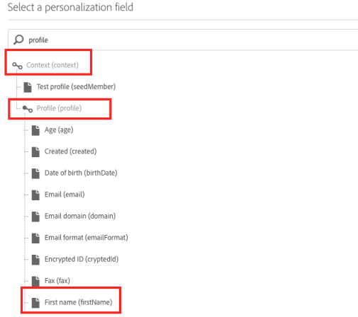

# Generera en CSV-fil för flerspråkiga push-meddelanden{#generating-csv-multilingual-push}

Att överföra en CSV-fil för att generera innehåll för leverans är en funktion som stöder flerspråkiga push-meddelanden. Formatet på CSV-filen måste följa vissa riktlinjer för att filöverföringen ska lyckas och därmed kunna skapa en leverans. I följande avsnitt beskrivs filformatet och övervägandena om detta.

## Filformat {#file-format}

Flerspråkig push kräver 14 kolumner i CSV-filen:

1. title
1. messageBody
1. ljud
1. skugga
1. deeplinkURI
1. kategori
1. iosMediaAttachmentURL
1. androidMediaAttachmentURL
1. isContentAvailable
1. isMutableContent
1. customFields
1. locale
1. language
1. silentPush

Kontrollera CSV-exemplet genom att klicka på **[!UICONTROL Download a sample file]** i fönstret **[!UICONTROL Manage Content Variants]**. Mer information finns i [avsnittet](../../channels/using/creating-a-multilingual-push-notification.md).

* **title, messageBody, sound, badge, deplinkURI, category, iosMediaAttachmentURL, androidMediaAttachmentURL**: regelbundet push-nyttolastinnehåll. Du måste ange den här informationen på liknande sätt som när du skapar push-leveranser.
* **Anpassade fält**: använda JSON-format för anpassade fält, t.ex.  `{"key1":"value1","key2":"value2"}`. I exempelfilen ovan finns ett exempel på anpassade fält.
* **isContentAvailable**: -flagga för kontroll av tillgängligt innehåll, värde 1 betyder true, värde 0 betyder false. Standardvärdet är 0. Om du lämnar den här kolumnen tom räknas värdet som 0.
* **isMutableContent**: -flagga för Mutable Content, value 1 betyder true, value 0 betyder false. Standardvärdet är 0. Om du lämnar den här kolumnen tom räknas värdet som 0.
* **locale**: språkinställning är fältet för språkvarianter, t.ex. &quot;en_us&quot; för amerikansk-engelska och &quot;fr_fr&quot; för Frankrike-franska.
* **språk**: namnet på det språk som är associerat med språkinställningen. Om språkinställningen till exempel är &quot;en_us&quot; ska namnet på språket vara &quot; English-United States&quot;.
* **silentPush**: -flagga för push-meddelandetypen. Om det är ett vanligt push-meddelande ska värdet vara 0. Om det är en tyst överföring ska värdet vara 1. Standardvärdet är 0. Om du lämnar den här kolumnen tom räknas värdet som 0.

## Begränsningar och riktlinjer för att skapa en CSV-fil {#constraints-guideline-csv}

**Namnet på varje kolumn är fast**.
Du bör inkludera namnet på varje kolumn i CSV-filen, om du inte använder några kolumner för innehållet, lämna det tomt.

**Spalterna&quot;locale&quot; och&quot;language&quot; är obligatoriska och värdet är unikt för varje rad.**
Om du anger ett tomt värde för den här kolumnen misslyckas filöverföringen.

**Kolumnordningen har betydelse**. Kolumnernas ordning i den överförda filen måste följa samma format som exempelfilen.

**Offertkolumninnehåll**. Eftersom det här är en CSV-fil (står för Comma-Separated Values) måste allt kolumninnehåll som innehåller kommatecken (,) anges. Till exempel&quot;Hej, Tom!&quot;

**UTF-8-kodning krävs för internationella tecken.**

**Om du genererar filen med oformaterad text avgränsar du varje kolumn med &quot;,&quot;.**

**Variantfel.** Om du använder innehållsblock och målgrupper med specifika språk måste du visa alla målspråk i CSV-filen, annars får du fel när du skickar leveransen.

## Infogning av anpassningsfält i csv-filen {#personalization-field-csv}

Om du vill använda anpassningsfält bör du inkludera taggen <span> i filen.

Om du vill infoga anpassningsfältet&quot;firstName&quot; i messageBody måste meddelandet vara:

```
 "Hello <span class="nl-dce-field nl-dce-done"  data-nl-expr="/context/profile/firstName">First name</span>, this is message".
```

&quot;firstName&quot;-fältet representeras av:

```
 <span class="nl-dce-field nl-dce-done" data-nl-expr="/context/profile/firstName">First name</span>
```

I intervallet finns två obligatoriska attribut:

* En är en klass som är statisk. Oberoende av vilket anpassningsfält du tänker använda så kommer det alltid att vara class=&quot;nl-dce-field nl-dce-made&quot;.

* Ett annat är data-nl-expr, som är sökvägen till personaliseringsfältet. Om du till exempel infogar anpassningsfältet&quot;firstName&quot; från användargränssnittet, kommer navigeringssökvägen att vara **[!UICONTROL Context (context)]** > **[!UICONTROL Profile (profile)]** > **[!UICONTROL First name (firstName)]** (vilket visas i bilden nedan). I det här fallet blir sökvägen

   ```
   /context/profile/firstName. data-nl-expr="/context/profile/firstName".
   ```



## Språk- och språknamn {#locale-language-names}

Följande språk stöds:

| locale | språk |
|:-:|:-:|
| af_za | Afrikaans - Sydafrika |
| sq_al | Albanska - Albanien |
| ar_dz | Arabiska - Algeriet |
| ar_bh | Arabiska - Bahrain |
| ar_iq | Arabiska - Irak |
| ar_il | Arabiska - Israel |
| ar_jo | Arabiska - Jordanien |
| ar_kw | Arabiska - Kuwait |
| ar_lb | Arabiska - Libanon |
| ar_ma | Arabiska - Marocko |
| ar_om | Arabiska - Oman |
| ar_qa | Arabiska - Qatar |
| ar_sa | Arabiska - Saudiarabien |
| ar_sy | Arabiska - Syrien |
| ar_tn | Arabiska - Tunisien |
| ar_ae | Arabiska - Förenade Arabemiraten |
| ar_ye | Arabiska - Jemen |
| hy_am | Armeniska - Armenien |
| az_az | Azerbajdzjanska - Azerbajdzjan |
| be_by | Vitryska - Vitryssland |
| bs_ba | Bosniska - Bosnien |
| bg_bg | Bulgariska - Bulgarien |
| ca_es | Katalanska - Spanien |
| zh_cn | Kinesiska (förenklad) - Kina |
| zh_sg | Kinesiska (förenklad) - Singapore |
| zh_hk | Kinesiska (traditionell) - Hongkong SAR of China |
| zh_tw | Kinesiska (traditionell) - regionen Taiwan |
| hr_hr | Kroatiska - Kroatien |
| cs_cz | Tjeckiska - Czechia |
| da_dk | Danska - Danmark |
| nl_be | Nederländska - Belgien |
| nl_nl | Nederländska - Nederländerna |
| en_au | Engelska - Australien |
| en_bz | Engelska - Belize |
| en_ca | Engelska - Kanada |
| en_in | Engelska - Indien |
| en_ie | Engelska - Irland |
| en_jm | Engelska - Jamaica |
| en_nz | Engelska - Nya Zeeland |
| en_ph | Engelska - Filippinerna |
| en_za | Engelska - Sydafrika |
| en_tt | Engelska - Trinidad och Tobago |
| en_gb | Engelska - Storbritannien |
| en_us | Engelska - USA |
| en_zw | Engelska - Zimbabwe |
| _Ange | Estniska - Estland |
| fi_fi | Finska - Finland |
| fr_be | Franska - Belgien |
| fr_ca | Franska - Kanada |
| fr_fr | Franska - Frankrike |
| fr_lu | Franska - Luxemburg |
| fr_ch | Franska - Schweiz |
| de_at | Tyska - Österrike |
| de_de | Tyska - Tyskland |
| de_lu | Tyska - Luxemburg |
| de_ch | Tyska - Schweiz |
| el_cy | Grekiska - Cypern |
| el_gr | Grekiska - Grekland |
| gu_in | Gujarati - Indien |
| he_il | Hebreiska - Israel |
| hi_in | Hindi - Indien |
| hu_hu | Ungerska - Ungern |
| is_is | Isländska - Island |
| id_id | Indonesiska - Indonesien |
| it_it | Italienska - Italien |
| it_ch | Italienska - Schweiz |
| ja_jp | Japanska - Japan |
| kn_in | Kannada - Indien |
| k_kz | Kazakiska - Kazakstan |
| ko_kr | Koreanska - Sydkorea |
| lv_lv | Lettiska - Lettland |
| lt_lt | Litauiska - Litauen |
| mk_mk | Makedonska - Makedonien |
| ms_my | Malajiska - Malaysia |
| M_in | Marathi - Indien |
| no_no | Norska - Norge |
| pl_pl | Polska - Polen |
| pt_br | Portugisiska - Brasilien |
| pt_pt | Portugisiska - Portugal |
| pa_in | Punjabi - Indien |
| ro_md | Rumänska - Moldavien |
| ro_ro | Rumänska - Rumänien |
| ru_kz | Ryska - Kazakstan |
| ru_ru | Ryska - Ryssland |
| ru_ua | Ryska - Ukraina |
| a_in | Sanskrit - Indien |
| sr_ba | Serbiska - Bosnien |
| sr_rs | Serbiska - Serbien |
| sk_sk | Slovakiska - Slovakien |
| sl_si | Slovenska - Slovenien |
| es_ar | Spanska - Argentina |
| es_bo | Spanska - Bolivia |
| es_cl | Spanska - Chile |
| es_co | Spanska - Colombia |
| es_cr | Spanska - Costa Rica |
| es_do | Spanska - Dominikanska republiken |
| es_ec | Spanska - Ecuador |
| es_sv | Spanska - El Salvador |
| es_gt | Spanska - Guatemala |
| es_hn | Spanska - Honduras |
| es_mx | Spanska - Mexiko |
| es_ni | Spanska - Nicaragua |
| es_pa | Spanska - Panama |
| es_py | Spanska - Paraguay |
| es_pe | Spanska - Peru |
| es_pr | Spanska - Puerto Rico |
| es_es | Spanska - Spanien |
| es_uy | Spanska - Uruguay |
| es_ve | Spanska - Venezuela |
| sw_ke | Swahili - Kenya |
| sv_fi | Svenska - Finland |
| sv_se | Svenska - Sverige |
| ta_in | Tamil - Indien |
| tt_ru | Tatariska - ryska |
| te_in | Telugu - Indien |
| th_th | Thailändska - Thailand |
| tr_cy | Turkiska - Cypern |
| tr_tr | Turkiska - Turkiet |
| uk_ua | Ukrainska - Ukraina |
| ur_in | Urdu - Indien |
| ur_pk | Urdu - Pakistan |
| vi_vn | Vietnamesiska - Vietnam |
