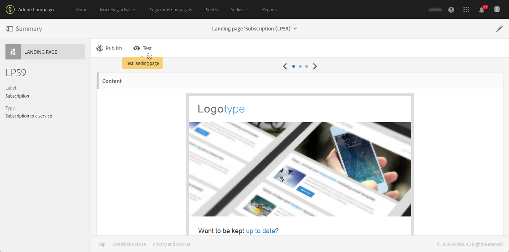

# Komma igång med landningssidor {#getting-started-with-landing-pages}

Huvudstegen när du ställer in landningssidor är följande:

På den här sidan hittar du information om vart och ett av de här stegen samt referenser till de dedikerade dokumenten för mer information.

 [Upptäck hur du skapar landningssidor i video](#video)

**Relaterade ämnen:**

* [Skapa en tjänst](../../audiences/using/creating-a-service.md)
* [Konfigurera en process för dubbel anmälan](setting-up-a-double-opt-in-process.md)

## Begränsningar för landningssidor{#landing-page-limitations}

I avsnittet nedan listas de begränsningar som du bör känna till innan du börjar konfigurera landningssidor.

**Skriva och uppdatera data**

* Landningssidor är begränsade till endast **[!UICONTROL Profile]** och **[!UICONTROL Subscription]**-resurser.  Posten kan sparas och uppdateras från **[!UICONTROL Profile]** och en prenumeration/avprenumeration till en **[!UICONTROL Service]**.
Mer information om resurskonfigurationen hittar du i [Konfigurera resursens datastruktur](../../developing/using/configuring-the-resource-s-data-structure.md).

>[!IMPORTANT]
>
>En landningssida kan inte visa eller uppdatera data från någon annan resurs än **[!UICONTROL Profile]** och **[!UICONTROL Subscription]**.

**Förinläsning**

* Landningssidan kan inte automatiskt visa en lista med poster. Den kan inte heller visa tjänster som profiler redan prenumererar på.  Mer information om tjänster hittar du på den här [sidan](../../audiences/using/creating-a-service.md).

* Landningssida med ett förifyllt formulär (datan är förinläst på sidan) kan endast nås via ett Adobe Campaign e-postmeddelande. Det går inte att komma åt sådana formulär via en hemsida.

**Avstämning**

* Avstämningsbeteendet fungerar så här: så snart en matchning hittas så avbryts avstämningsprocessen.    Detta innebär att avstämning endast kan göras för en profilpost och inte för flera poster när det finns dubbletter.

Om du till exempel vill skicka en följande kundvärvningssida till dina profiler för att uppdatera Campaign-databasen med dina profilers mobiltelefonnummer.

Om en av dina profiler fyller i din landningssida med ny information men har en duplicerad profil, kommer den matchande profilen med det tidigaste skapningsdatumet att uppdateras eftersom profilerna prioriteras beroende på när de skapades.

Här har bara den första profilen uppdaterats då det var den äldsta posten.

**Testa landningssidor**

* Landningssidor fungerar bara på riktiga profiler, inte på testprofiler. Detta innebär att landningssidor inte kan testas som en del av testmeddelanden

## Steg 1 - Konfigurera mallen för landningssidan{#configure-the-landing-page-template}

Innan du skapar en landningssida så är det första steget att konfigurera en mall för landningssidor som passar dina behov.  När mallen är klar så kommer alla landningssidor som är baserade på den att förkonfigureras med de valda parametrarna.

1. I den avancerade menyn som du via Adobe Campaign-logotypen, så väljer du **[!UICONTROL Resources]** / **[!UICONTROL Templates]** / **[!UICONTROL Landing page templates]** och duplicerar sedan mallen som du vill använda.
1. I egenskaperna för mallen anger du alla parametrar som landningssidorna måste ha gemensamt.    Till exempel: målgruppsdimensionen, sidans åtkomstparametrar för identifierade eller icke identifierade besökare, åtgärder som är specifika för en besökares formulärvalidering, varumärket/logotypen som ska användas i innehållet etc.        Mer information om egenskaper för landningssidor hittar du i [det här avsnittet](../../channels/using/configuring-landing-page.md).
1. Spara ändringarna.

Mer information om mallar för landningssidor hittar du i[det här avsnittet](../../channels/using/getting-started-with-landing-pages.md).

## Steg 2 - Skapa och konfigurera landningssidan {#create-and-configure-the-landing-page}

Skapa en ny landningssida i ett program eller en kampanj från den mall som definierades i det föregående steget.

1. Skapa landningssidan baserat på önskad mall.
1. Ange de allmänna parametrarna för landningssidan (etikett, beskrivning etc.).
1. Sedan kommer du åt kontrollpanelen för landningssidan.    Redigera egenskaperna för landningssidan om det behövs (se [Konfigurera en landningssida](../../channels/using/configuring-landing-page.md)).    Som standard är egenskaperna de som konfigurerats i mallen för landningssidan.
Av säkerhetsskäl och på grund av plattformsprestanda rekommenderar vi att du anger ett förfallodatum i egenskaperna för landningssidan.        När du är klar avpubliceras landningssidan automatiskt på det valda datumet.        Mer information om validitetsparametrar hittar du i [det här avsnittet](../../channels/using/testing-publishing-landing-page.md#setting-up-validity-parameters).

   

>[!NOTE]
>
>Ändringarna gäller endast för den landningssidan som redigeras.  Om du vill tillämpa dessa ändringar på andra landningssidor så kan du utföra dem i en dedikerad mall och sedan skapa andra landningssidor från den mallen.

## Steg 3 - Utforma landningssidan {#design-the-landing-page}

Nu kan du definiera innehållet på landningssidan.  Som standard innehåller landningssidan tre sidor som du kan komma åt via rullgardinspilarna: sidan för huvudinnehåll, en bekräftelsesida och en sida som visas vid fel.

Flera fält konfigureras som standard på varje sida.    Om det behövs så kan du redigera deras egenskaper och mappning.

Du kan också konfigurera hur bekräftelseknappen fungerar när en profil klickar på den och anpassa innehållet efter dina behov (bild, anpassningsfält etc.).  Du kan exempelvis infoga en profils förnamn på bekräftelsesidan på landningssidan och visa upp ett tackmeddelande för att denne har registrerat sig.

Mer information om design av landningssidor hittar du i [det här avsnittet](../../channels/using/designing-a-landing-page.md).

## Steg 4 - Testa landningssidan {#test-the-landing-page}

När landningssidan har definierats kan du simulera hur den kommer att köras och bete sig när den är tillgänglig online.

>[!IMPORTANT]
>
>Testerna på landningssidan kan endast utföras med profiler och inte med testprofiler.    När formuläret skickas så uppdateras den valda profilens data på riktigt.  Undvik att ändra riktiga profiler genom att använda en falsk kundprofil.

Om du är nöjd med hur landningssidan fungerar kan du publicera den så att den blir tillgänglig online.

Mer information om hur du testar en landningssida hittar du i [detta avsnittet](../../channels/using/testing-publishing-landing-page.md#testing-the-landing-page-).

## Steg 5 - Publicera landningssidan {#publish-the-landing-page}

När testerna har slutförts kan du publicera landningssidan med knappen **[!UICONTROL Publish]** i åtgärdsfältet på instrumentpanelen.    En övervakningspanel visar publiceringens förlopp och status.

Genom att publicera landningssidan blir den tillgänglig online.    När publiceringen är klar kan du alltid uppdatera den: Om du vill göra detta måste du publicera den igen efter varje ändring.        Du kan också när som helst avpublicera en landningssida så att den inte längre finns tillgänglig.

När landningssidan har publicerats är den klar att användas.    Du kan sedan införa olika mekanismer som gör att du kan komma åt den för att hämta nya profiler i databasen, eller för att få ytterligare information om befintliga profiler.

Mer information om publicering av landningssidor hittar du i [det här avsnittet](../../channels/using/testing-publishing-landing-page.md#publishing-a-landing-page).

## Självstudievideo {#video}

I den här videon visas hur du skapar och redigerar en landningssida.

>[!VIDEO](https://video.tv.adobe.com/v/24093?quality=12)

Ytterligare Campaign Standard om instruktionsvideor finns [här](https://experienceleague.adobe.com/docs/campaign-standard-learn/tutorials/overview.html?lang=sv).
