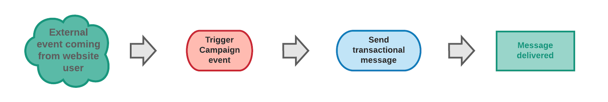

# Komma igång med transaktionsmeddelanden {#getting-started-with-transactional-messaging}

Ett transaktionsmeddelande är en individ och en unik kommunikation som skickas i realtid av en leverantör, till exempel en webbplats. Det är särskilt väntat eftersom det innehåller viktig information som mottagaren vill kontrollera eller bekräfta.

* **När ska det vara klart?** Eftersom det här meddelandet innehåller viktig information förväntar sig användaren att det skickas i realtid. Följaktligen måste fördröjningen mellan den händelse som utlöses och det meddelande som anländer vara mycket kort.

* **Varför är det viktigt?** Vanligtvis har ett transaktionsmeddelande höga öppningsfrekvenser. Den bör därför utformas noggrant, eftersom den kan ha stor inverkan på kundernas beteende när den definierar kundrelationen.

* **Exempel?** Det kan vara ett välkomstmeddelande när du har skapat ett konto, en bekräftelse på att en beställning har skickats, en faktura, ett meddelande som bekräftar en lösenordsändring eller ett meddelande efter att en kund har bläddrat på din webbplats osv.

Med Adobe Campaign kan ni integrera den här funktionen med ett informationssystem som skickar händelser som ska omvandlas till anpassade transaktionsmeddelanden.

Transaktionsmeddelanden kan skickas via e-post, SMS eller [push-meddelande](../../channels/using/transactional-push-notifications.md), beroende på vilka alternativ du har. Kontrollera licensavtalet.

>[!NOTE]
>
>Adobe Campaign prioriterar bearbetning av transaktionsmeddelanden framför annan leverans.

<!--Guidelines to implement transactional messaging capabilities in your website are detailed in [this section](../../api/using/managing-transactional-messages.md).-->

Innan du börjar med transaktionsmeddelanden bör du kontrollera att du har läst motsvarande [bästa praxis och begränsningar](../../channels/using/transactional-messaging-limitations.md).

## Driftspolicy för transaktionsmeddelanden {#transactional-messaging-operating-principle}

Den övergripande processen för transaktionsmeddelanden beskrivs på följande sätt:

Tänk dig att du är ett företag med en webbplats där kunderna kan köpa produkter.

Med Adobe Campaign kan du skicka ett e-postmeddelande till kunder som har lagt till produkter i kundvagnen. När någon av dem lämnar er webbplats utan att gå igenom sina inköp (en extern händelse som utlöser en Campaign-händelse) skickas ett e-postmeddelande om att kunden överger en kundvagn automatiskt till dem (leverans av transaktionsmeddelanden).

De viktigaste stegen för att implementera detta beskrivs nedan i [det här avsnittet](#key-steps).

## Transaktionsmeddelandetyper {#transactional-message-types}

Det finns två typer av transaktionsmeddelanden i Adobe Campaign.

**Transaktionsmeddelanden för händelser** måldata som finns i själva händelsen. Dessa meddelanden:
* Innehåller ingen profilinformation och kan därför inte innehålla länkar för att avbryta prenumerationen.
* Är inte kompatibla med trötthetsregler (även om det gäller en anrikning med profiler).
* Låt leveransmålet definieras av data som finns i själva händelsen.

Du kanske vill skicka ett transaktionsmeddelande för en händelse till en kund som till exempel behöver hämta ett glömt lösenord eller bekräfta en beställning. Du vill inte att mottagaren ska avbeställa den här typen av kommunikation, och det här meddelandet ska inte läggas till som en del av en trötthetsregel i utskicksmeddelandet.

**Profiltransaktionsmeddelanden** målprofiler från Campaign-marknadsföringsdatabasen. Med den här typen av meddelanden kan du:
* Utnyttja data i Adobe Campaign-databasen.
* Anpassa meddelandet med profilinformation genom att lägga till en [berikning](../../channels/using/configuring-transactional-event.md#enriching-the-transactional-message-content) till händelsekonfigurationen.
* Använd [typologiregler för marknadsföring](../../sending/using/managing-typology-rules.md) eller [trötthetsregler](../../sending/using/fatigue-rules.md).
* Inkludera avprenumerations-länken i meddelandena.
* Lägga till transaktionsmeddelanden i den globala leveransrapporten.
* Använda transaktionsmeddelanden i kundresan.

Du kan till exempel använda den här typen av meddelanden när du kontaktar dina kunder efter att de har lämnat kundvagnen på din webbplats för att uppmuntra dem att fortsätta med köpet. På så sätt kan ni enklare personalisera ert budskap med direkt åtkomst till all information från er profildatabas, tillämpa marknadsföringsregler och inkludera det här meddelandet i den globala kundresan och rapportera för att få en bättre bild av kundbeteendet.

Meddelandetypen definieras när händelsen som ska omvandlas till ett transaktionsmeddelande konfigureras.        Se [Händelsebaserade transaktionsmeddelanden](../../channels/using/configuring-transactional-event.md#event-based-transactional-messages) och [Profilbaserade transaktionsmeddelanden](../../channels/using/configuring-transactional-event.md#profile-based-transactional-messages) konfigurationsavsnitt.

## Viktiga steg {#key-steps}

De viktigaste stegen när du skapar och hanterar personaliserade transaktionsmeddelanden i Adobe Campaign sammanfattas i schemat nedan.

Dessa steg beskrivs närmare nedan.

>[!IMPORTANT]
>
>Endast användare med [Administration](../../administration/using/users-management.md#functional-administrators) kan konfigurera transaktionshändelser och få åtkomst till transaktionsmeddelanden.

### Steg 1 - Skapa och publicera händelsekonfigurationen {#create-event-configuration}

<!---->

| Skapa en händelse | Användare | Åtgärd | Resultat |
| --- |--- |--- |--- |
|  | Det här steget måste utföras av en administratör som har [administrationsrättigheter](../../administration/using/users-management.md#functional-administrators). | Konfigurera en händelse med namnet&quot;Avsluta kundvagn&quot; och publicera händelsekonfigurationen. | Det API som kommer att användas av webbplatsutvecklaren distribueras och ett transaktionsmeddelande skapas automatiskt. |

Skapa och publicera en händelse presenteras i [Konfigurera en transaktionshändelse](../../channels/using/configuring-transactional-event.md) och [Publicera en transaktionshändelse](../../channels/using/publishing-transactional-event.md) -avsnitt.

### Steg 2 - Redigera och publicera transaktionsmeddelandet {#create-transactional-message}

<!---->

| Redigera meddelandet | Användare | Åtgärd | Resultat |
| --- |--- |--- |--- |
|  | Detta steg kan utföras av en marknadsföringsanvändare som innehar [administrationsrättigheter](../../administration/using/users-management.md#functional-administrators). | Redigera och anpassa transaktionsmeddelandet, testa det och publicera det sedan. | Transaktionsmeddelandet är sedan klart att skickas. |

Mer information om hur du redigerar och publicerar ett transaktionsmeddelande finns i [Redigera transaktionsmeddelanden](../../channels/using/editing-transactional-message.md) och [Livscykel för transaktionsmeddelande](../../channels/using/publishing-transactional-message.md).

### Steg 3 - Integrera den händelseutlösande händelsen {#integrate-event-trigger}

<!---->

När du har skapat en händelse måste du integrera den som utlöser händelsen på webbplatsen.<!--In this example, you want a "Cart abandonment" event to be triggered whenever one of your clients leaves your website before purchasing the products in their cart.--> För att göra detta måste webbutvecklaren använda **ADOBE CAMPAIGN STANDARD REST API**.

| Implementera utlösaren | Användare | Åtgärd | Resultat |
| --- |--- |--- |--- |
|  | Det här steget utförs av utvecklaren av din webbplats. | Använd REST Transactional Messages API för att integrera händelsen på din webbplats. | Händelsen utlöses när en kund överger sin kundvagn. |

Mer information om hur du använder Campaign REST API för att hantera transaktionsmeddelanden finns i [REST API-dokumentation](../../api/using/managing-transactional-messages.md).

### Steg 4 - Leverans av meddelanden {#message-delivery}

<!---->

När alla steg ovan har utförts kan meddelandet levereras.

| Leverera meddelandet | Användare | Åtgärd | Resultat |
| --- |--- |--- |--- |
|  | Det här steget utförs av kunder som besöker din webbplats. | Så snart en användare lämnar webbplatsen utan att beställa produkterna i kundvagnen utlöses motsvarande Campaign-händelse. | Användaren får automatiskt ett e-postmeddelande. |

## Relaterade ämnen

* [Huvudstegen för att skicka ett meddelande](../../channels/using/key-steps-to-send-a-message.md)
* [Kom igång med kommunikationskanaler](../../channels/using/get-started-communication-channels.md)
* [Push-transaktionsmeddelanden](../../channels/using/transactional-push-notifications.md)
* [Uppföljningsmeddelanden](../../channels/using/follow-up-messages.md)
