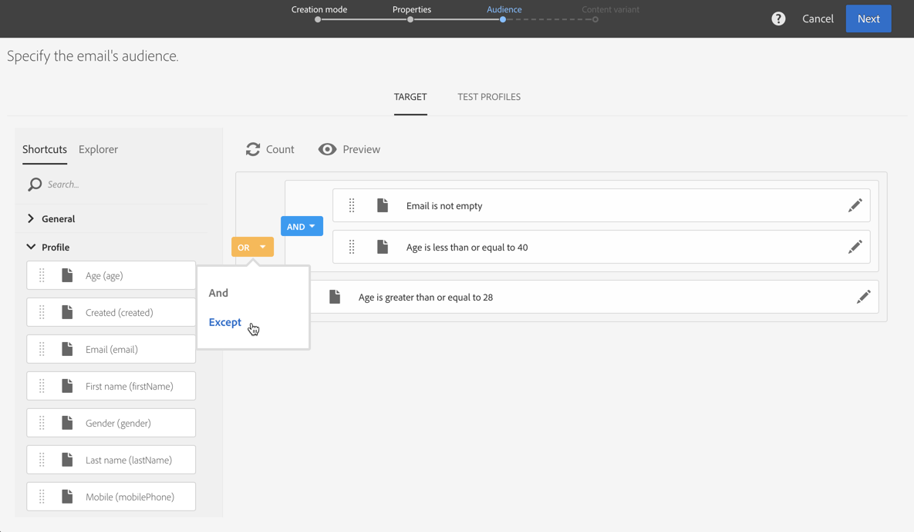
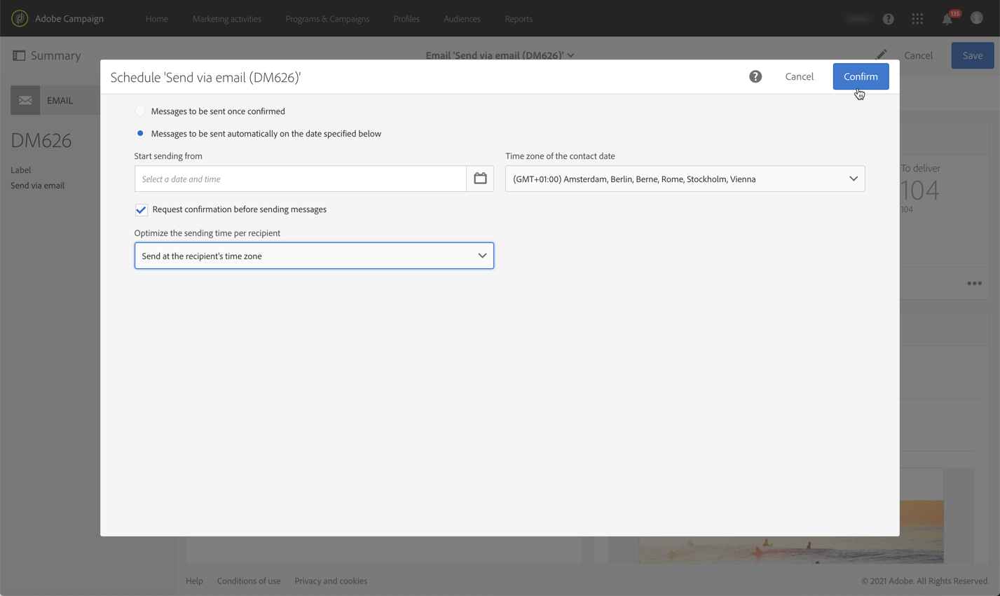

# Huvudstegen för att skicka ett meddelande{#key-steps-to-send-a-message}

I det här avsnittet får du lära dig att skapa och skicka personaliserade meddelanden till en viss målgrupp med Adobe Campaign Standard.

Specifik information om hur du skapar och konfigurerar varje kommunikationskanal finns i följande avsnitt:

* [Skapa ett e-postmeddelande](../../channels/using/creating-an-email.md)
* [Skapa ett SMS](../../channels/using/creating-an-sms-message.md)
* [Skapa direktutskick](../../channels/using/creating-the-direct-mail.md)
* [Skapa ett push-meddelande](../../channels/using/preparing-and-sending-a-push-notification.md).
* [Förbereda och skicka ett meddelande i appen](../../channels/using/preparing-and-sending-an-in-app-message.md)

Om du vill veta mer om de effektivaste strategierna för leverans kan du läsa [Bästa praxis för leverans](../../sending/using/delivery-best-practices.md) -avsnitt.

## Skapa ett meddelande

Utnyttja Campaign Standard [marknadsföringsverksamhet](../../start/using/marketing-activities.md) för att skapa e-post, SMS, direktreklam, push-meddelanden eller meddelanden i appen.

Meddelanden kan skapas antingen från listan över marknadsföringsaktiviteter eller från ett arbetsflöde med [dedikerad verksamhet](../../automating/using/about-channel-activities.md).

## Definiera målgruppen

Definiera mottagarna av meddelandet. Använd [frågeredigerare](../../automating/using/editing-queries.md) från den vänstra rutan för att filtrera data i databasen och skapa regler som riktar sig till er målgrupp.

Det finns flera olika typer av målgrupper:

* **[!UICONTROL Target]** är huvudmålet för ditt e-postmeddelande,
* **[!UICONTROL Test profiles]** är profilerna som används för att testa och validera din e-post (se [Hantera testprofiler](../../audiences/using/managing-test-profiles.md)).

## Designa och personalisera innehåll

I **[!UICONTROL Content]** blockera, utforma och anpassa innehållet i meddelandet med hjälp av fält från databasen. Mer information om hur du utformar innehåll för en viss kanal finns i avsnitten högst upp på den här sidan.

## Förbered och testa

[Förbered](../../sending/using/preparing-the-send.md) meddelandet. Den här processen beräknar målpopulationen och förbereder det personaliserade meddelandet.

**Kontrollera och testa meddelandet** innan du skickar det med Campaign Standard: förhandsgranskning, e-poståtergivning, korrektur osv. Mer information om detta finns i [det här avsnittet](../../sending/using/previewing-messages.md).

Använd **[!UICONTROL Schedule]** block för att definiera när meddelanden ska skickas (se [Schemaläggningsmeddelanden](../../sending/using/about-scheduling-messages.md)).

## Skicka och spåra

När meddelandet är klart kan du bekräfta det. The **[!UICONTROL Deployment]** -blocket visar sändningsförloppet och resultatet.

Det finns flera loggar som hjälper dig att övervaka hur dina meddelanden levereras (se [övervaka en leverans](../../sending/using/monitoring-a-delivery.md)). Du kan också spåra leveransmottagarnas beteende tack vare Campaign Standardens [spårningsfunktioner](../../sending/using/tracking-messages.md).

Mät hur effektiva era meddelanden är och hur era utskick och kampanjer har utvecklats med hjälp av olika indikatorer och diagram (se [Åtkomst till rapporter](../../reporting/using/about-dynamic-reports.md)).

