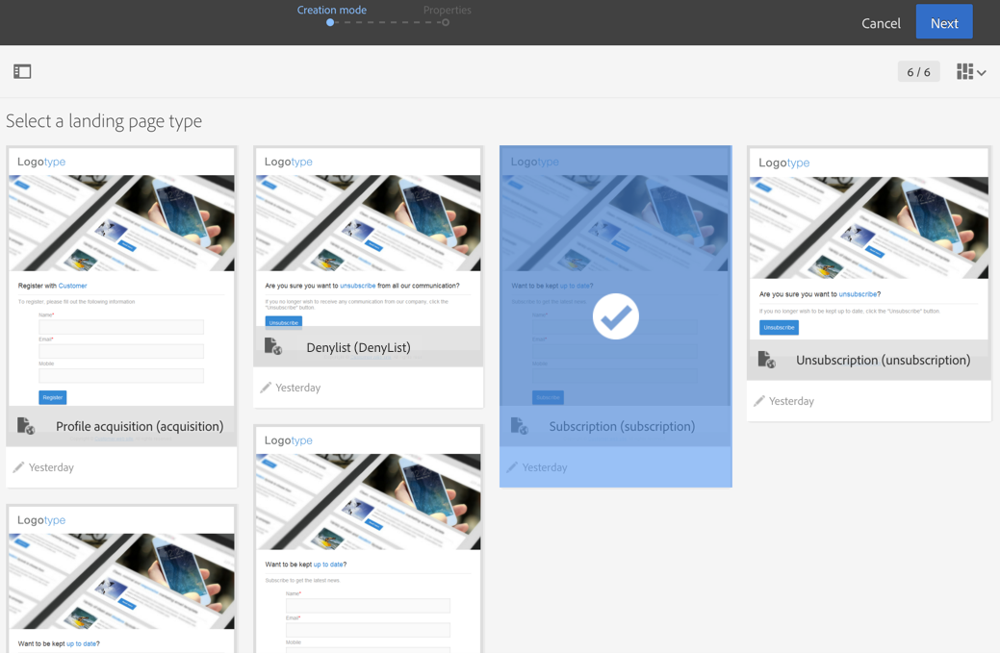

# Om mallar för landningssidor {#landing-page-templates}

Campaign har en uppsättning inbyggda mallar för landningssidor:

* **[!UICONTROL Acquisition]**: Det här är standardmallen för landningssidor, som gör att du kan hämta och uppdatera data i Campaign-databasen.
* **[!UICONTROL Subscription]**: Den här mallen ska användas för att erbjuda prenumerationer på en tjänst.
* **[!UICONTROL Unsubscription]**: Den här mallen kan kopplas från ett e-postmeddelande som skickas till prenumeranter till en tjänst, så att de kan avbryta prenumerationen på tjänsten.
* **[!UICONTROL Denylist]**: Den här mallen ska användas när en profil inte längre vill bli kontaktad av Campaign. For more about denylist management, refer to [About opt-in and opt-out in Campaign](../../audiences/using/about-opt-in-and-opt-out-in-campaign.md).

Dessa mallar föreslås som standard när en ny landningssida skapas.



Om du vill ha åtkomst till mallar för landningssidor klickar du på Adobe Campaign-logotypen i det övre vänstra hörnet och väljer **[!UICONTROL Resources]** > **[!UICONTROL Templates]** > **[!UICONTROL Landing page templates]**.

>[!NOTE]
>
>Adobe rekommenderar att du skapar egna mallar genom att duplicera en inbyggd mall. Vissa parametrar kan bara anges i mallar för landningssidor och kan inte ändras direkt på landningssidor.

När du skapar en mall rekommenderar vi att du lägger till ett **&quot;type&quot;**-attribut till taggar. Den här informationen bearbetas av redigeraren och hjälper användaren att koppla ett databasfält till formulärfältet när webbprogrammet konfigureras.

Exempel på HTML-kod i mallen:

```
<input id="email" type="email" name="email"/>
```

Den officiella listan med &quot;type&quot;-attribut finns på följande adress: [https://www.w3schools.com/tags/att_input_type.asp](https://www.w3schools.com/tags/att_input_type.asp)

