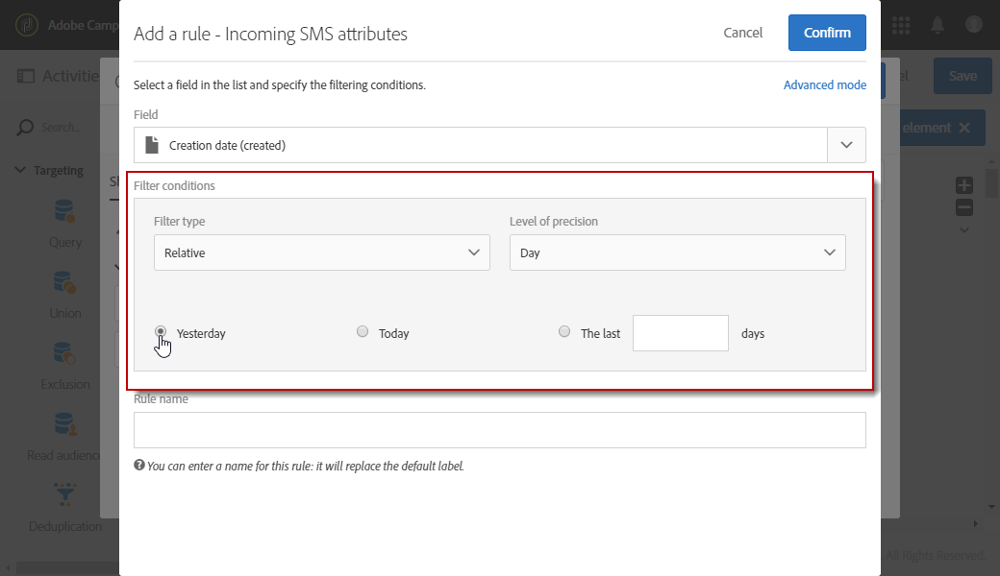

# Hantera inkommande SMS{#managing-incoming-sms}

## Hantera STOP SMS {#managing-stop-sms}

När en profil svarar på ett SMS-meddelande som skickades via Campaign kan ni konfigurera meddelanden som automatiskt skickas tillbaka till dem samt vilken åtgärd som ska utföras.

Den här konfigurationen definieras i **[!UICONTROL Automatic reply sent to the MO]** i [Externt SMS-routningskonto](../../administration/using/configuring-sms-channel.md#defining-an-sms-routing). MO står för&quot;Mobile Originated&quot;, vilket betyder att du kan konfigurera ett automatiskt svar till den mobil som skickade SMS:et.

För att göra detta:

1. På den avancerade menyn, via Adobe Campaign logotyp, väljer du **[!UICONTROL Administration > Application settings > External accounts]** sedan **[!UICONTROL SMS routing via SMPP]** externt konto.
1. Under **[!UICONTROL Automatic reply sent to the MO]** kategori, klicka på **[!UICONTROL Create element]** för att börja konfigurera ditt automatiska svar.

   

1. Välj det nyckelord som ska utlösa det här automatiska svaret. Nyckelorden är inte skiftlägeskänsliga. Om mottagarna till exempel skickar nyckelordet &quot;STOP&quot; får de det automatiska svaret här.

   Lämna den här kolumnen tom om du vill skicka samma svar oavsett nyckelordet.

   >[!IMPORTANT]
   >
   >Endast alfanumeriska tecken tillåts.

   

1. I **[!UICONTROL Short code]** anger du ett nummer som vanligtvis används för att skicka leveranser och som fungerar som avsändarnamn. Du kan också bestämma dig för att lämna **[!UICONTROL Short code]** tom kolumn, om du vill skicka samma svar oavsett den korta koden.

   

1. Skriv in det svar som du vill skicka till mottagarna i fältet **[!UICONTROL Reply]**.

   Om du vill utföra en åtgärd utan att skicka ett svar lämnar du dialogrutan **[!UICONTROL Reply]** kolumnen är tom. På så sätt kan du till exempel ta bort telefonnumret för en användare som svarar med ett annat meddelande än&quot;STOP&quot; från karantänen.

   

1. I **[!UICONTROL Additional action]** fält, länka en åtgärd till ditt automatiska svar:

   * The **[!UICONTROL Send to quarantine]** åtgärden sätter automatiskt telefonnumret till profilen i karantän.
   * The **[!UICONTROL Remove from quarantine]** åtgärd tar bort profilens telefonnummer från karantän.
   * The **[!UICONTROL None]** gör att du bara kan skicka meddelandet till mottagarna utan att utföra någon åtgärd.

   Om mottagarna skickar nyckelordet &quot;STOP&quot; i konfigurationen nedan får de automatiskt en bekräftelse om att prenumerationen har avbrutits och deras telefonnummer skickas till karantänen tillsammans med **[!UICONTROL On denylist]** status. Denna status avser endast telefonnumret, profilen är så att användaren fortsätter att ta emot e-postmeddelanden.

   

1. Klicka på **[!UICONTROL Save]**.

1. Från **[!UICONTROL Advanced parameters]** din SMS-leverans **[!UICONTROL Properties]** kan du ange en specifik **[!UICONTROL Short code]** för att automatiskt exkludera mottagare som avanmälde sig. Mer information finns i [det här avsnittet](../../administration/using/configuring-sms-channel.md#configuring-sms-properties).

Mottagarna kan nu automatiskt avbeställa prenumerationen på dina meddelanden och skickas till karantän med detta automatiska svar. Mottagarna i karantän listas i **[!UICONTROL Addresses]** tabellen tillgänglig via **[!UICONTROL Administration]** > **[!UICONTROL Channels]** > **[!UICONTROL Quarantines]** -menyn. Mer information om karantäner finns i [section](../../sending/using/understanding-quarantine-management.md).

Dessa inkommande SMS kan lagras vid behov. Mer information finns i [section](#storing-incoming-sms).

## Lagra inkommande SMS {#storing-incoming-sms}

I **[!UICONTROL SMS routing via SMPP]** externt konto kan du välja att lagra inkommande meddelanden, t.ex. när en prenumerant svarar&quot;STOP&quot; på ett SMS-meddelande för att kunna tas bort från mottagarlistorna.

Efter kontroll **[!UICONTROL Store incoming MO in the database]** i **[!UICONTROL SMPP channel settings]** kommer all SMS att lagras i InSMS-tabellen och kan hämtas via en frågeaktivitet i ett arbetsflöde.

För att göra detta:

1. I **[!UICONTROL SMPP channel settings]** fält, kontrollera **[!UICONTROL Store incoming MO in the database]**.

   

1. I **[!UICONTROL Marketing activities]** flik, klicka **[!UICONTROL Create]** välj **[!UICONTROL Workflow]**.

   

1. Välj arbetsflödestyp.
1. Redigera arbetsflödets egenskaper och klicka sedan på **[!UICONTROL Create]**. Mer information om hur du skapar arbetsflöden finns i [section](../../automating/using/building-a-workflow.md).
1. Dra och släpp en **[!UICONTROL Query]** och dubbelklicka på aktiviteten.
1. I **[!UICONTROL Properties]** fliken för frågan, välj **[!UICONTROL Incoming SMS (inSMS)]** i **[!UICONTROL Resource]** fält.

   

1. Sedan i **[!UICONTROL Target]** tabben, dra och släppa **[!UICONTROL Incoming SMS attributes]** regel.

   

1. Här vill vi rikta in alla inkommande meddelanden från dagen innan. I **[!UICONTROL Field]** kategori, välj **[!UICONTROL Creation date (created)]**.
1. I **[!UICONTROL Filter type]**, markera **[!UICONTROL Relative]** sedan in **[!UICONTROL Level of precision]**, välja **[!UICONTROL Day]**.

   

1. Du kan sedan välja att hämta data från idag, dagen före eller de sista dagarna. Klicka **[!UICONTROL Confirm]** när frågan har konfigurerats.

Den här frågan hämtar alla STOP-meddelanden som tas emot beroende på valt tidsintervall.

Med den här aktiviteten kan du till exempel skapa en population och bättre anpassa leveranser.
