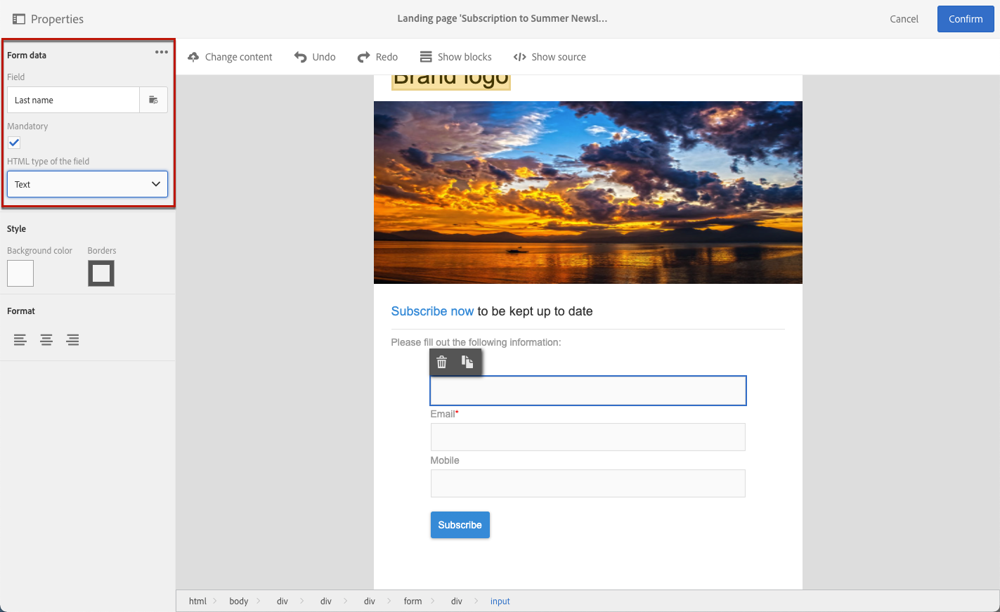
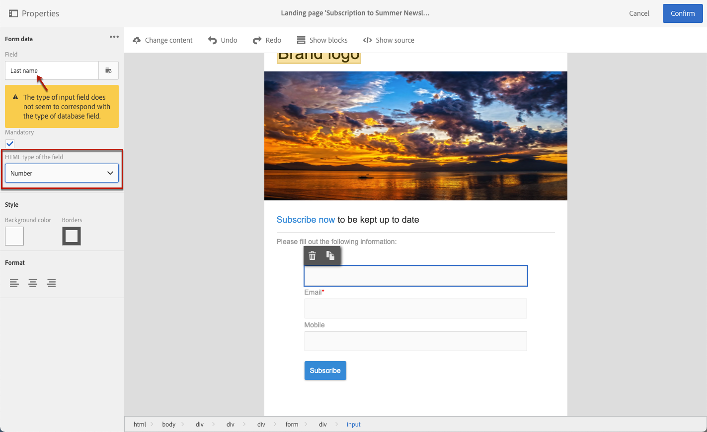

# Hantera formulärdata på landningssida{#managing-landing-page-form-data}

I innehållet på landningssidan används inmatningsfält för att lagra eller uppdatera data från Campaign-databasen.

För att göra detta måste dessa fält mappas till databasfält.

Du kan definiera och hantera deras mappning via **[!UICONTROL Form data]** till vänster.

## Mappa formulärfält {#mapping-form-fields}

Om du vill uppdatera Campaign-databasen efter dina behov länkar du relevanta databasfält till textblock för indatazon, alternativknapp eller kryssruta på landningssidan.

Gör så här:

1. Markera ett block i innehållet på landningssidan.

   >[!NOTE]
   >
   >Standardfälten för de inbyggda landningssidorna är förkonfigurerade.  Du kan ändra dessa efter behov.

1. Öppna **[!UICONTROL Form data]** till vänster.

1. Om du vill ändra fälttyp väljer du ett värde på menyn **[!UICONTROL HTML type of the field]** listruta.

   

   >[!NOTE]
   >
   >Mer information om hur du använder kryssrutetypen på en landningssida finns i [Uppdatera flera serviceabonnemang](#multiple-subscriptions) och [Kryssruta för avtal](#agreement-checkbox) -avsnitt.

1. Om du väljer en fälttyp som inte är kompatibel med det databasfält som är markerat i dialogrutan **[!UICONTROL Field]** visas ett varningsmeddelande. Välj ett lämpligt värde för optimal mappning.

   

1. Använd **[!UICONTROL Field]** för att markera ett databasfält som ska länkas till formulärfältet.

   

   >[!NOTE]
   >
   >Det går endast att mappa landningssidor med **[!UICONTROL Profiles]** eller **[!UICONTROL Service]** resurser.

   I det här exemplet mappar du **Namn** landningssidans fält till **[!UICONTROL Last name]** fält för **[!UICONTROL Profiles]** resurs.

   

1. Markera **[!UICONTROL Mandatory]**-alternativet om det behövs.  I så fall kan landningssidan endast skickas om användaren har fyllt i detta fält.

   

   Om ett obligatoriskt fält inte är ifyllt visas ett felmeddelande när användaren skickar sidan.

1. Klicka **[!UICONTROL Confirm]** för att spara ändringarna.

<!--If you choose a mandatory **[!UICONTROL Checkbox]**, make sure that it is of **[!UICONTROL Field]** type.-->

## Datalagring och avstämning{#data-storage-and-reconciliation}

Med dataavstämningsparametrar så kan du definiera hur data som anges på landningssidan ska hanteras när de har skickats av en användare.

Så här gör du:

1. Redigera landningssidans egenskaper som du kommer åt via -ikonen på kontrollpanelen för landningssidan och visa **[!UICONTROL Job]**-parametrarna.

   

1. Välj **[!UICONTROL Reconciliation key]**: det här databasfältet används för att avgöra om besökaren har en profil som redan är känd i Adobe Campaign-databasen. Det kan till exempel vara e-post, förnamn och efternamn. Med avstämningsnyckeln kan du uppdatera eller skapa en profil enligt **[!UICONTROL Update strategy]** parametern definieras nedan.

1. Definiera **[!UICONTROL Form parameter mapping]**: I denna del kan du mappa fältparametrar för landningssidor och de som används i avstämningsnyckeln.

1. Välj **[!UICONTROL Update strategy]**: Om avstämningsnyckeln återställer en befintlig databasprofil kan du välja att den här profilen ska uppdateras med data som anges i formuläret, eller i stället förhindra att den uppdateras.

   

## Flera serviceabonnemang {#multiple-subscriptions}

Du kan använda flera kryssrutor på en enda landningssida för att tillåta användare att prenumerera eller avbryta prenumerationen på flera tjänster.

Gör så här:

1. När landningssidan utformas:

   * Markera ett block och gå till **[!UICONTROL Form data]** avsnitt, välja **[!UICONTROL Checkbox]** som fälttyp.

     

   * Om du känner till HTML kan du även infoga en kryssruta manuellt med hjälp av **[!UICONTROL Show source]** -knappen.

     

     På så sätt kan du infoga kryssrutan när det passar på sidan.

     

1. Kontrollera att kryssrutan är markerad i innehållet. The **[!UICONTROL Type]** listrutan visas i **[!UICONTROL Form data]** i den vänstra paletten. Välj **[!UICONTROL Service and subscription]** från listan.

   

1. Välj ett alternativ på menyn **[!UICONTROL Behavior]** listruta.

   

1. Välj en [service](../../audiences/using/creating-a-service.md) från motsvarande lista.

   

1. Se till att **[!UICONTROL Mandatory]** alternativet är inte markerat. Annars har användarna inget val.

   

1. Om du vill lägga till fler kryssrutor som gör det möjligt att prenumerera på andra tjänster upprepar du stegen ovan så många gånger som behövs.

   

När landningssidan har publicerats kan användarna välja flera kryssrutor för att prenumerera på flera nyhetsbrev från samma sida.

## Kryssruta för avtal {#agreement-checkbox}

Du kan lägga till en kryssruta som profilen måste kontrollera innan du skickar in landningssidan.

Detta gör till exempel att du kan begära användarens samtycke för sekretesspolicy eller få dem att acceptera dina villkor innan de skickar in formuläret.

>[!IMPORTANT]
>
>Det är obligatoriskt för användarna att markera den här kryssrutan. Om de inte väljs kommer de inte att kunna skicka landningssidan.

Så här infogar och konfigurerar du den här kryssrutan:

1. När landningssidan utformas:

   * Markera ett block och gå till **[!UICONTROL Form data]** avsnitt, välja **[!UICONTROL Checkbox]** som fälttyp.

     

   * Om du känner till HTML kan du även infoga en kryssruta manuellt med hjälp av **[!UICONTROL Show source]** -knappen.

     

     <!--Manually insert a checkbox, such as in the example below:

      <!--Click **[!UICONTROL Hide source]**.-->

1. Kontrollera att kryssrutan är markerad.

   

1. The **[!UICONTROL Type]** listrutan visas i **[!UICONTROL Form data]** i den vänstra paletten. Välj **[!UICONTROL Agreement]** från listan.

   

   >[!NOTE]
   >
   >The **[!UICONTROL Agreement]** -elementet är inte mappat till ett fält i Campaign-databasen.

1. Klicka på  ikon bredvid **[!UICONTROL Form data]** för att komma åt kryssrutans avancerade egenskaper.

1. Du kan redigera meddelandet om det behövs.

   

   Den här texten visas som en varning om användaren inte markerar kryssrutan innan formuläret skickas.

   >[!NOTE]
   >
   >Den här åtgärden är obligatorisk som standard och kan inte ändras.

1. Klicka på **[!UICONTROL Confirm]**.

Varje gång landningssidan visas måste användaren markera den här kryssrutan innan formuläret skickas. Annars visas varningen och användaren kan inte skicka formuläret förrän kryssrutan är aktiverad.