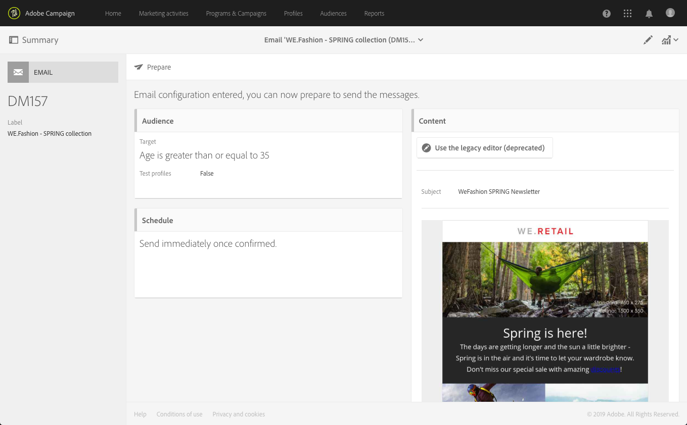

# Kontrollpanel för meddelanden{#message-dashboard}

Kontrollpanelen för meddelanden är en arbetsyta som består av olika ikoner, som grupperats i ett åtgärdsfält, och olika funktionsblock som gör att du kan fastställa meddelandets parametrar och skicka det. Dessa element presenteras nedan.

## Grå stapel {#gray-bar}

I det grå fältet grupperas olika ikoner som är länkade till ditt meddelande.

* **[!UICONTROL Summary]**: visar/döljer den viktigaste informationen om meddelandet.
* **[!UICONTROL Edit properties]**: gör att du kan redigera meddelandenas [avancerade parametrar](../../administration/using/configuring-email-channel.md#list-of-email-properties).
* **[!UICONTROL Reports]**: ger dig tillgång till de rapporter som hör till meddelandet.

**Relaterade ämnen:**

* [Konfigurera kanaler](../../administration/using/about-channel-configuration.md)
* [Åtkomst till rapporter](../../reporting/using/about-dynamic-reports.md)

## Åtgärdsfält {#action-bar}

Åtgärdsfältet har olika ikoner som gör att du kan interagera med meddelandet.

Beroende på vilka parametrar som har ställts in och vilka framsteg som har gjorts, kanske vissa ikoner inte är tillgängliga.

* **[!UICONTROL Show proofs]**: visar/döljer listan med korrektur som har skickats, om sådana finns. Den här knappen aktiveras endast när du har skickat korrektur.

   Mer information om korrektur finns i [Skicka korrektur](../../sending/using/sending-proofs.md).

* **[!UICONTROL Send a test]**: Med kan du välja vilket godkännandeläge som ska användas: **[!UICONTROL Email rendering]** (endast e-post), **[!UICONTROL Proof]** eller båda. Mer information om testprofiler finns i [Skicka korrektur](../../sending/using/sending-proofs.md). Den här knappen aktiveras endast när du har skapat testprofiler.

* **[!UICONTROL Prepare send]**: börjar förbereda sändningen. The **[!UICONTROL Deployment]** -blocket visas och visar resultatet av beredningen. Den här knappen visas bara när målet har angetts. Du kan när som helst avbryta beredningen med motsvarande knapp. Mer information om meddelandeförberedelse finns i [Förbereder sändningen](../../sending/using/preparing-the-send.md).

* **[!UICONTROL Confirm send]**: bekräftar att meddelandet har skickats. Sändningsstatistik visas i **[!UICONTROL Deployment]** -block. Den här knappen visas bara när sändningen har förberetts. Du kan när som helst stoppa eller pausa sändningen med **Stoppa sändning** och **[!UICONTROL Pause]** knappar. Mer information om hur du bekräftar sändning finns i [Skicka meddelanden](../../sending/using/confirming-the-send.md).

## Block {#blocks}

Huvudskärmen består av olika block. Klicka i ett block för att komma åt motsvarande parameterskärm:

* **[!UICONTROL Deployment]**: gör att du kan spåra förloppet för meddelandeförberedelsen eller sändningen. Klicka på knappen i det nedre högra avsnittet av det här blocket för att komma åt sändning- och analysloggarna. Blocket visas bara när sändningen har förberetts. Mer om detta. Se [Bekräfta sändning](../../sending/using/confirming-the-send.md).
* **[!UICONTROL Audience]**: gör att du kan fastställa meddelandets huvudmål samt testprofilerna. Se [Skapa målgrupper](../../audiences/using/creating-audiences.md).
* **[!UICONTROL Schedule]**: I kan du ange det datum då meddelandet ska skickas. Se [Schemaläggning](../../sending/using/about-scheduling-messages.md).
* **[!UICONTROL Content]**: Med kan du definiera meddelandets innehåll och förhandsgranska det. Se [Viktiga steg för att skicka ett meddelande](../../channels/using/key-steps-to-send-a-message.md).

## Varningar {#warnings}

I vissa fall kan en varning visas i en gul banderoll ovanpå kontrollpanelen för meddelanden.

Nedan visas en lista med meddelanden som kan visas:

* *&quot;Testläget SMTP är aktiverat för det här e-postmeddelandet: inga meddelanden skickas.&quot;*

   Mer information finns i [det här avsnittet](../../administration/using/configuring-email-channel.md#smtp-test-mode).

* *&quot;Det externa kontot för routning har inaktiverats.&quot;*

   Mer information finns i [Externa konton](../../administration/using/external-accounts.md).

* *&quot;Det går inte att skicka meddelanden eftersom den aktuella IP-tillhörigheten inte hanteras av någon sändningsprocess.&quot;*

   Om det här meddelandet visas uppstår ett problem på definitionsnivån för IP-tillhörighet eller på överföringsprocessnivån. Kontakta Adobe-administratören.

* *&quot;Det här är en körklar mall för transaktionsmeddelanden. Om du vill ändra den måste du duplicera den och arbeta med kopian.&quot;*

   Vissa av dessa färdiga mallar för transaktionsmeddelanden är inbyggda mallar för landningssidor. Mer information finns i [det här avsnittet](../../channels/using/landing-page-templates.md).

* *&quot;Det här meddelandet är en teknisk mall för transaktionsmeddelanden. Du kan inte ändra eller publicera den.&quot;*

   Den här varningen visas i tomma transaktionsmeddelandemallar som inte kan redigeras. Mer information om transaktionsmeddelanden finns i [det här avsnittet](../../channels/using/getting-started-with-transactional-msg.md).
