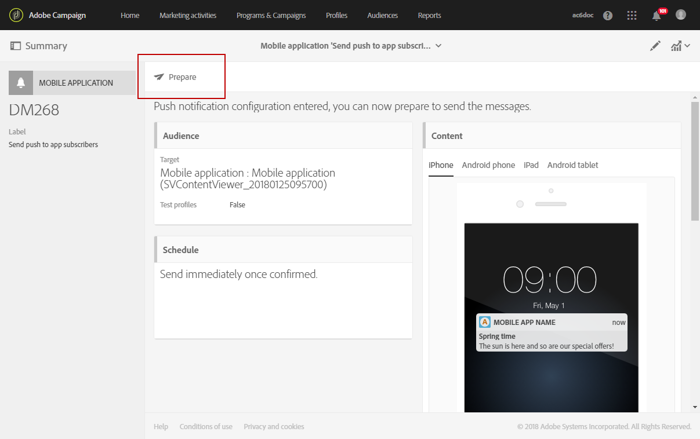

# Förbereda och skicka ett push-meddelande{#preparing-and-sending-a-push-notification}

## Förbereda anmälan {#preparing-the-notification}

Stegen för att skapa ett push-meddelande med Adobe Campaign är:

1. Från **[!UICONTROL Marketing activities]** fönster, [skapa en ny marknadsföringsaktivitet](../../start/using/marketing-activities.md#creating-a-marketing-activity).

   Observera att ett enda push-meddelande också kan skapas från en [kampanj](../../start/using/marketing-activities.md#creating-a-marketing-activity) eller från Adobe Campaign [hemsida](../../start/using/interface-description.md#home-page).

   Du kan också använda en leveransaktivitet för push-meddelanden i ett arbetsflöde. Denna aktivitet presenteras i [Leverans av push-meddelanden](../../automating/using/push-notification-delivery.md) -avsnitt.

1. Välj **[!UICONTROL Push notification]**.
1. Välj en mall.

   

   Som standard kan du välja någon av följande två mallar:

   * **[!UICONTROL Send push to Campaign profiles]**: använd den här mallen för att rikta sig till de Adobe Campaign CRM-profiler som har prenumererat på ditt mobilprogram och som har valt att ta emot push-meddelanden. Du kan infoga [personalisering](../../designing/using/personalization.md#inserting-a-personalization-field) fält i ditt push-meddelande, till exempel mottagarens förnamn.
   * **[!UICONTROL Send push to app subscribers]**: använd den här mallen för att skicka ett push-meddelande till alla kända och anonyma mobilprogramanvändare som har valt att ta emot meddelanden från ditt program. Ni kan personalisera dessa meddelanden med data som samlats in från ert mobilprogram.

   Du kan också välja flerspråkiga mallar. Mer information finns i [Skapa ett flerspråkigt push-meddelande](../../channels/using/creating-a-multilingual-push-notification.md).

   Mer om mallar finns i avsnittet [Hantera mallar](../../start/using/marketing-activity-templates.md).

1. Ange dina egenskaper för push-meddelanden och välj din mobilapp i **[!UICONTROL Associate a Mobile App to a delivery]** fält.

   Observera att listrutan kommer att visa både SDK V4- och Experience Platform SDK-program.

   

   Du kan länka push-meddelandet till en kampanj. Det gör du genom att välja det bland de kampanjer som redan har skapats.

1. På följande skärm kan du ange en målgrupp, till exempel alla VIP som prenumererar på ett visst mobilprogram. Mer information finns i [Skapa målgrupper](../../audiences/using/creating-audiences.md).

   Din målgrupp filtreras automatiskt baserat på det mobilprogram som valdes i föregående steg.

   

1. Du kan nu anpassa ditt push-meddelande. Välj först meddelandeformat: **[!UICONTROL Alert/Message/Badge]** eller **[!UICONTROL Silent push]**. Typerna för push-meddelanden beskrivs i [Om push-meddelanden](../../channels/using/about-push-notifications.md) -avsnitt.

   Redigera innehållet i ditt push-meddelande och definiera de avancerade alternativen. Se [Anpassa ett push-meddelande](../../channels/using/customizing-a-push-notification.md).

   

   Innehållet och alternativen för push-meddelanden som konfigureras här skickas till din mobilapp i form av en nyttolast. Nyttolastens detaljerade struktur beskrivs i [Förstå nyttolaststrukturen för push-meddelanden för Campaign Standard](../../administration/using/push-payload.md) Tech.

1. Klicka på **[!UICONTROL Create]**.

   

1. Innan du skickar meddelandet kan du testa det med testprofiler och sedan se exakt vad mottagarna ser innan leveransen skickas. Välj **[!UICONTROL Audiences]** i leveranssammanfattningen och klicka på **[!UICONTROL Test profiles]** -fliken.

   Mer information om hur du skickar tester finns i [Testprofiler](../../sending/using/sending-proofs.md).

1. Välj testprofiler och klicka på **[!UICONTROL Preview]** för att visa meddelandet: innehållet anpassas efter testprofilens data.
1. Kontrollera layouten för push-meddelanden på olika enheter: välj iPhone, Android-telefon, iPad- eller Android-surfplatta för att förhandsgranska återgivningen.

   

1. The **[!UICONTROL Estimated Payload Size]** är en uppskattning baserad på testprofildata. Den faktiska nyttolaststorleken kan variera. Meddelandets gräns är 4 kB.

   >[!CAUTION]
   >
   >Om nyttolastens storlek överskrider 4 kB-gränsen kommer meddelandet inte att levereras.

Observera att personaliseringsdata påverkar meddelandets storlek.

## Skicka meddelandet {#sending-the-notification}

Push-meddelanden kan skickas till en viss målgrupp i Adobe Campaign genom att målgruppskriterierna definieras. I exemplet nedan består vår valda målgrupp av fyra målgruppsprenumeranter på mobilappar.

1. Klicka **[!UICONTROL Prepare]** för att beräkna målet och generera meddelanden.

   

1. När förberedelsen är klar visar fönstret **[!UICONTROL Deployment]** följande nyckeltal: **[!UICONTROL Target]** och **[!UICONTROL To deliver]**. Observera att antalet för **[!UICONTROL To deliver]** är lägre än för **[!UICONTROL Targeted]** på grund av undantag, som du kan visas genom att klicka på knappen  längst ned i fönstret **[!UICONTROL Deployment]**.

   

1. I **[!UICONTROL Exclusion logs]** finns en lista med alla meddelanden som har uteslutits från det skickade målet och orsaken till detta undantag.

   Här ser vi att en av våra mobilappsprenumeranter har uteslutits eftersom adressen låg på blockeringslista och de andra prenumeranterna eftersom profilen var en dubblett.

   

1. Klicka på **[!UICONTROL Exclusion causes]** för att visa volymen för uteslutna meddelanden.

   

1. Nu kan du klicka **[!UICONTROL Confirm]** för att börja skicka push-meddelanden.
1. Kontrollera leveransstatus via meddelandepanelen och loggarna. Mer information finns i [Skicka meddelanden](../../sending/using/confirming-the-send.md) och [Leveransloggar](../../sending/using/monitoring-a-delivery.md#delivery-logs).

   I det här exemplet visar meddelandekontrollpanelen att Adobe Campaign försökte skicka två push-meddelanden: en levererades till enheten och en annan misslyckades. Om du vill veta varför leveransen innehåller fel klickar du på  längst ned på **[!UICONTROL Deployment]** -fönstret.

   

1. Från **[!UICONTROL Deployment]** klickar du på **[!UICONTROL Sending logs]** för att komma åt listan över skickade push-meddelanden och deras status. För den här leveransen har ett push-meddelande skickats och det andra misslyckades på grund av en felaktig enhetstoken. Den här prenumeranten läggs sedan till blockeringslista från ytterligare leveranser.

   >[!NOTE]
   >
   >Orsaker kan vara ett misslyckande längre ned till Adobe Campaign. Vid fel från leverantörer som apns och fcm kommer orsaken också att återspegla detta. Mer information om misslyckade providrar finns i [Apple](https://developer.apple.com/library/content/documentation/NetworkingInternet/Conceptual/RemoteNotificationsPG/CommunicatingwithAPNs.html) och [Android](https://firebase.google.com/docs/cloud-messaging/http-server-ref) dokumentation.

   

Nu kan du mäta effekten av push-meddelanden med dynamiska rapporter.

**Relaterade ämnen:**

* [Rapport om push-meddelanden](../../reporting/using/push-notification-report.md)
* [Skicka ett push-meddelande inom ett arbetsflöde](../../automating/using/push-notification-delivery.md)
