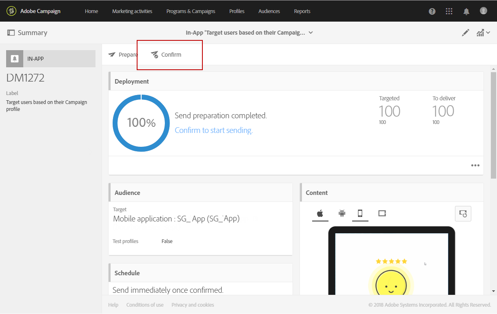
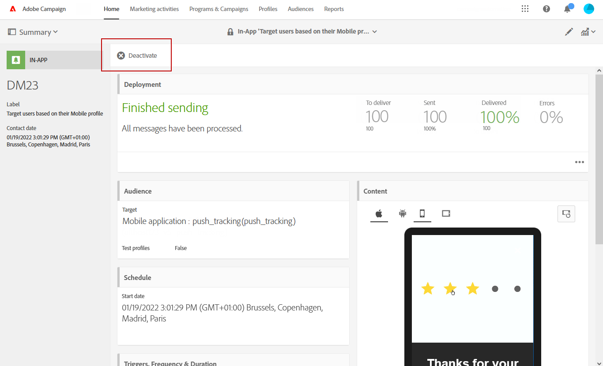
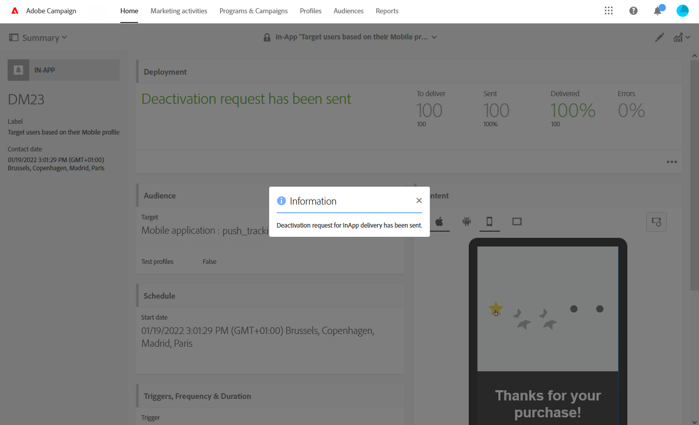

# Förbereda och skicka ett meddelande i appen{#preparing-and-sending-an-in-app-message}

Det finns tre typer av meddelanden i appen i Adobe Campaign:

* **[!UICONTROL Target users based on their Campaign profile (inAppProfile)]**: Den här meddelandetypen gör att du kan ange Adobe Campaign-profiler (CRM-profiler) som prenumererar på ditt mobilprogram som mål. Den här meddelandetypen kan anpassas med alla tillgängliga profilattribut i Adobe Campaign, men kräver en säker handskakning mellan Mobile SDK och Campaigns meddelandetjänst i appen för att säkerställa att meddelanden med personlig och känslig information endast används av behöriga användare.

  Om du vill hämta den här meddelandetypen på användarnas enheter måste Mobile SDK skicka länkningsfält som används för att ansluta en mobilprofil till en CRM-profil i Adobe Campaign. Mer information om SDK-API:er som krävs för att stödja appar finns på den här [sidan](https://developer.adobe.com/client-sdks/documentation/adobe-campaign-standard/api-reference/).

* **[!UICONTROL Target all users of a Mobile app (inAppBroadcast)]**: Med den här meddelandetypen kan du skicka meddelanden till alla användare (nuvarande eller framtida) av ditt mobilprogram, även om de inte har en befintlig profil i Adobe Campaign. Anpassnign är därför inte möjligt när du anpassar meddelandena eftersom användarprofilen kanske inte ens finns i Adobe Campaign.
* **[!UICONTROL Target users based on their Mobile profile (inApp)]**: Den här meddelandetypen gör att du kan rikta indig på alla kända eller anonyma användare av en mobilapp som har en mobilprofil i Adobe Campaign. Den här meddelandetypen kan endast anpassas med icke-personliga och icke-känsliga attribut och kräver ingen säker handskakning mellan Mobile SDK och Adobe Campaigns meddelandetjänst i appen.

  Mer information om hur du hanterar personliga och känsliga data finns i [Hantera mobilprofilsfält med personliga och känsliga data](../../channels/using/about-in-app-messaging.md#handling-mobile-profile-fields-with-personal-and-sensitive-data).

## Förbereder ditt meddelande i appen {#preparing-your-in-app-message}

>[!CAUTION]
>
>Anpassning i appen förlitar sig på ett länkningsfält som vanligtvis är ett CRM-ID och/eller inloggnings-ID för mobilapp. Du ansvarar själv för att säkra det här länkningsfältet när det används i samband med Adobe Campaign. Om du inte skyddar länkningsfälten kan ditt personliga meddelande bli sårbart. Adobe ansvarar inte för skador som uppstår på grund av obehörig åtkomst eller användning av profildata om du inte följer säkra metoder för att länkningsfältets disposition, hantering och skydd.

Stegen för att skapa ett fristående meddelande i appen med Adobe Campaign är följande:

1. Klicka på kortet **[!UICONTROL In-App messaging]** på startsidan för Adobe Campaign.

   Du kan också skapa en app från fliken **Marknadsföringsaktiviteter** genom att klicka på knappen **[!UICONTROL Create]**.

   Observera att ett meddelande i appen också kan skapas från en kampanj, från hemsidan för Adobe Campaign eller i ett arbetsflöde.

1. Välj **Meddelande i appen**.

   

1. Välj en lämplig mall enligt målgruppens behov.

   

   Som standard kan du välja någon av följande tre färdiga mallar:

   * **[!UICONTROL Target users based on their Campaign CRM profile (inAppProfile)]**
   * **[!UICONTROL Target all users of a Mobile app (inAppBroadcast)]**
   * **[!UICONTROL Target users based on their Mobile profile (inApp)]**

1. Ange meddelandeegenskaperna i appen och välj din mobilapp i dialogrutan **[!UICONTROL Associate a Mobile App to a delivery]** fält.

   Om inga program visas i listrutan kontrollerar du att dina mobilprogram finns i en **Konfigurerad** tillstånd. Program i en **Klar att konfigureras** visas inte i listan. Mer information om konfiguration av mobilprogram finns på den här [sidan](../../administration/using/configuring-a-mobile-application.md#channel-specific-config).

   

1. Välj den målgrupp som du vill rikta in dig på i appen. Din målgrupp är förfiltrerad beroende på vilket mobilprogram som är associerat med leveransen.

   Observera att det här steget inte behövs med **[!UICONTROL Broadcast an In-App message (inAppBroadcast)]** eftersom det riktar sig till alla användare i ett mobilprogram.

   

1. Dra och släpp den händelse som ska utlösa meddelandet på fliken **[!UICONTROL Triggers]**. När du väljer en utlösare väljer du en åtgärd som användarna utför och som gör att meddelandet i appen visas.

   Det finns fyra typer av händelser:

   * **[!UICONTROL Mobile Application events]**: Anpassade händelser som implementeras i ditt mobilprogram.

     Mer information om skapande av händelser finns på den här [sidan](../../administration/using/configuring-a-mobile-application.md).

   * **[!UICONTROL Life Cycle events]**: Körklara livscykelhändelser som stöds av Adobe Mobile SDK.

     Mer information om livscykelhändelser finns på den här [sidan](https://experienceleague.adobe.com/docs/mobile-services/android/metrics.html).

   * **[!UICONTROL Analytics Events]**: Följande tre kategorier stöds beroende på vad som finns i din mobilapp: Adobe Analytics, Kontextdata eller Vytillstånd.

     Observera att dessa händelser endast är tillgängliga om du har en Adobe Analytics-licens.

   * **[!UICONTROL Places]**: Följande tre kategorier utnyttjar platsdata i realtid för att leverera innehållsmässigt relevanta mobilupplevelser: Placerar kontextdata, Placerar anpassade metadata eller Placerar händelsetyp.

     Mer information om Adobe Platser finns i [Platsdokumentationen](https://experienceleague.adobe.com/docs/places/using/home.html).

   

1. Om du använder en **[!UICONTROL Analytics Events]**, Adobe Analytics- och View-statushändelser fylls i automatiskt baserat på de rapportsviter som konfigurerats i Analytics-tillägget i användargränssnittet för datainsamling, medan kontextdatahändelser måste läggas till manuellt.

   Observera att dessa händelser endast är tillgängliga om du har en Adobe Analytics-licens.

   

1. Om du använder en **[!UICONTROL Places]**-utlösare fylls Placerar kontextdata, Placerar anpassade metadata eller Placerar händelsetyp automatiskt i baserat på alla bibliotek och deras intressepunkter som skapats i Adobe Places.

   Observera att den här utlösaren endast används på enheten för de intressepunkter från bibliotek som valts i tillägget Platser i användargränssnittet för datainsamling. Mer information om tillägget-tillägget och hur du installerar det finns i den här [dokumentationen](https://developer.adobe.com/client-sdks/solution/places).

1. På fliken **[!UICONTROL Frequency & duration]** väljer du frekvens för utlösaren, start- och slutdatum, veckodag och tidpunkt på dagen då ditt Meddelande i appen ska vara aktivt.

   

1. Redigera innehållet i meddelandet och definiera de avancerade alternativen. Se [Anpassa ett meddelande i appen](../../channels/using/customizing-an-in-app-message.md).

   

1. Klicka på **[!UICONTROL Create]**.

Ditt Meddelande i appen kan nu skickas till din målgrupp.

**Relaterade ämnen:**

* [Anpassa ett meddelande i appen](../../channels/using/customizing-an-in-app-message.md)
* [Rapport i appen](../../reporting/using/in-app-report.md)
* [Skicka ett meddelande i appen i ett arbetsflöde](../../automating/using/in-app-delivery.md)

## Förhandsgranska meddelandet i appen {#previewing-the-in-app-message}

Innan du skickar ditt meddelande i appen kan du testa med testprofilerna för att kontrollera vad målgruppen kommer att se när de får leveransen.

1. Klicka på knappen **[!UICONTROL Preview]**.

   

1. Klicka på knappen **[!UICONTROL Select a test profile]** och välj en av testprofilerna för att förhandsgranska leveransen. Mer information om testprofiler finns i det här [avsnittet](../../audiences/using/managing-test-profiles.md).
1. Kontrollera meddelandet på olika enheter som t.ex. Android- och iPhone-telefoner men även surfplattor. Du kan också kontrollera om dina anpassningsfält hämtar rätt data.

   

1. Du kan nu skicka ditt meddelande och mäta dess effekt med leveransrapporter.

## Skicka ditt meddelande i appen {#sending-your-in-app-message}

När du är klar med leveransen och godkännandestegen har utförts kan du skicka meddelandet.

1. Klicka på **[!UICONTROL Prepare]** för att beräkna målet och generera meddelandena.

   

1. När förberedelsen är klar visar fönstret **Distribution** följande nyckeltal: **Mål** och **Ska levereras**.

   Du kan kontrollera fönstret Distribution genom att klicka på knappen  för att se om det finns potentiella undantag eller fel i leveransen.

   

1. Klicka på **[!UICONTROL Confirm]** för att börja skicka ditt meddelande i appen.

   

1. Kontrollera leveransstatus via meddelandepanelen och loggarna. Mer information om detta hittar du i det här [avsnittet](../../sending/using/monitoring-a-delivery.md).

   Antalen för nyckeltalen **[!UICONTROL Delivered]** och **[!UICONTROL Sent]** baseras på vad som har skickats från Campaign till tjänsten för meddelandeleverans. Observera att dessa nyckeltal inte är en indikation på antalet mobila enheter som tagit emot eller laddat ned meddelandet från meddelandetjänsten.

   

1. Mät effekten av dina Meddelanden i appen med leveransrapporter. Mer information om rapportering finns i [det här avsnittet](../../reporting/using/in-app-report.md).

1. När du har skickat meddelanden i appen kan du välja att inaktivera leveransen. Detta kan vara användbart om du vill stoppa en viss leverans eller om du vill köra en ny leverans med samma utlösare.

   Klicka **[!UICONTROL Deactivate]** sedan **[!UICONTROL Ok]** för att starta avaktiveringsbegäran.

   

1. När förfrågan har skickats inaktiveras leveransen och inget annat meddelande skickas.

   Observera att dina rapporter för den här leveransen fortfarande är tillgängliga.

   

**Relaterade ämnen:**

* [Rapport i appen](../../reporting/using/in-app-report.md)
* [Skicka ett meddelande i appen i ett arbetsflöde](../../automating/using/in-app-delivery.md)
