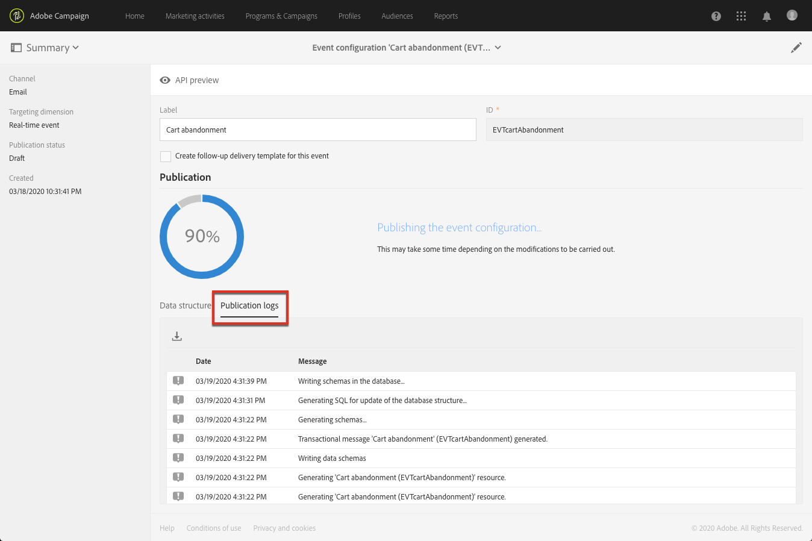

# Publicera en transaktionshändelse {#publishing-transactional-event}

När [konfigurationen](../../channels/using/configuring-transactional-event.md) är klar kan händelsen publiceras. Stegen för att förhandsgranska, publicera, avpublicera och ta bort en händelse beskrivs nedan.

>[!IMPORTANT]
>
>Endast [Funktionsadministratörer](../../administration/using/users-management.md#functional-administrators) <!--being part of the **[!UICONTROL All]** [organizational unit](../../administration/using/organizational-units.md) -->har rätt behörighet för att publicera händelsekonfigurationer.

Ett diagram över hela processen för transaktionsmeddelanden, inklusive publicerings- och avpubliceringshändelsekonfigurationer, finns i [det här avsnittet](../../channels/using/publishing-transactional-message.md).

När publiceringen är klar:
* Motsvarande transaktionsmeddelande skapas automatiskt. Se [Redigera transaktionsmeddelanden](../../channels/using/editing-transactional-message.md).
* Det API som kommer att användas av webbplatsutvecklaren distribueras och transaktionshändelserna kan nu skickas. Se [Integrera händelsen som utlöser](../../channels/using/getting-started-with-transactional-msg.md#integrate-event-trigger).

## Förhandsgranska och publicera en händelse {#previewing-and-publishing-the-event}

Innan du kan använda händelsen måste du förhandsgranska och publicera den.

1. Klicka på knappen **[!UICONTROL API preview]** för att se en simulering av REST API som kommer att användas av webbplatsutvecklaren innan den publiceras.

   När händelsen har publicerats kan du med den här knappen även se en förhandsgranskning av API:t som är i produktion. Se [Integrera händelsen som utlöser](../../channels/using/getting-started-with-transactional-msg.md#integrate-event-trigger).

   

   >[!NOTE]
   >
   >REST API varierar beroende på den valda kanalen och den valda måldimensionen. Mer information om de olika konfigurationerna finns i [det här avsnittet](../../channels/using/configuring-transactional-event.md#transactional-event-specific-configurations).

1. Klicka på **[!UICONTROL Publish]** för att starta publikationen.

   

   Det API som kommer att användas av webbplatsutvecklaren distribueras och transaktionshändelserna kan nu skickas.

1. Du kan visa publikationsloggarna på motsvarande flik.

   

   >[!IMPORTANT]
   >
   >Varje gång du ändrar händelsen måste du klicka på **[!UICONTROL Publish]** igen för att generera det uppdaterade REST API som kommer att användas av webbplatsutvecklaren.

   När händelsen har publicerats skapas automatiskt ett [transaktionsmeddelande](../../channels/using/editing-transactional-message.md) som är länkat till den nya händelsen.

1. Du kan komma åt det här transaktionsmeddelandet direkt via länken i det vänstra området.

   

   >[!NOTE]
   >
   >För att händelsen ska kunna utlösa att ett transaktionsmeddelande skickas måste du ändra och publicera det meddelande som precis skapades. Se [Redigera](../../channels/using/editing-transactional-message.md) och [Publicera ett transaktionsmeddelande](../../channels/using/publishing-transactional-message.md)-avsnitt. Du måste även [integrera den här utlösarhändelsen](../../channels/using/getting-started-with-transactional-msg.md#integrate-event-trigger) på din webbplats.

1. När Adobe Campaign börjar ta emot händelser som är relaterade till den här händelsekonfigurationen kan du klicka på länken **[!UICONTROL Latest transactional events]** under **[!UICONTROL History]**-avsnittet för att få tillgång till de senaste händelser som har skickats av din tredjepartstjänst och bearbetats av Adobe Campaign.

Händelserna (i JSON-format) listas från den senaste till den äldsta. Med den här listan kan du kontrollera data som innehåll eller status för en händelse för kontroll- och felsökningsändamål.

## Avpublicerar en händelse {#unpublishing-an-event}

Med knappen **[!UICONTROL Unpublish]** kan du avbryta publiceringen av händelsen, vilket innebär att den resurs som motsvarar händelsen som du skapade tas bort från REST-API:t.

Även om händelsen utlöses via din webbplats skickas inte längre motsvarande meddelanden och de lagras inte i databasen.

>[!NOTE]
>
>Om du redan har publicerat motsvarande transaktionsmeddelande avbryts även publikationen för transaktionsmeddelandet. Se [Avpublicera ett transaktionsmeddelande](../../channels/using/publishing-transactional-message.md#unpublishing-a-transactional-message).

Klicka på knappen **[!UICONTROL Publish]** för att generera ett nytt REST API.

<!--## Transactional messaging publication process {#transactional-messaging-pub-process}

The chart below illustrates the transactional messaging publication process.

For more on publishing, pausing and unpublishing a transactional message, see [this section](../../channels/using/publishing-transactional-message.md).-->

## Ta bort en händelse {#deleting-an-event}

När en händelse har avpublicerats, eller om en händelse inte har publicerats ännu, kan du ta bort den från händelsekonfigurationslistan. Så här gör du:

1. Klicka på **[!UICONTROL Adobe Campaign]**-logotypen i det övre vänstra hörnet och välj sedan **[!UICONTROL Marketing plans]** > **[!UICONTROL Transactional messages]** > **[!UICONTROL Event configuration]**.
1. Håll muspekaren över den händelsekonfiguration du vill använda och välj knappen **[!UICONTROL Delete element]**.

   

   >[!NOTE]
   >
   >Kontrollera att händelsekonfigurationen har statusen **[!UICONTROL Draft]**, annars kan du inte ta bort den. **[!UICONTROL Draft]**-statusen gäller för en händelse som ännu inte har publicerats eller som har [opublicerats](#unpublishing-an-event).

1. Klicka på knappen **[!UICONTROL Confirm]**.

   

>[!IMPORTANT]
>
>Om du tar bort en händelsekonfiguration som har publicerats och redan använts tas även motsvarande transaktionsmeddelande(n) och dess avsändande och spårningsloggar bort.
