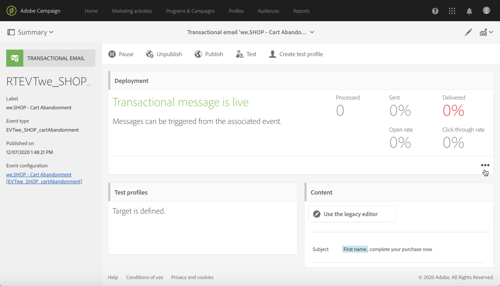

# Livscykeln för ett transaktionsmeddelande {#publishing-transactional-message}

När [transaktionsmeddelandet](../../channels/using/editing-transactional-message.md) är klart att skickas kan det publiceras.

Stegen för att publicera, pausa, avpublicera och ta bort ett transaktionsmeddelande beskrivs nedan.

>[!IMPORTANT]
>
>Endast användare med rollen [Administration](../../administration/using/users-management.md#functional-administrators) kan komma åt och publicera transaktionsmeddelanden.

## Publiceringsprocess för transaktionsmeddelanden {#transactional-messaging-pub-process}

Diagrammet nedan visar den övergripande processen för publicering av transaktionsmeddelanden.

**Relaterade ämnen:**
* [Publicera ett transaktionsmeddelande](#publishing-a-transactional-message)
* [Pausa ett transaktionsmeddelande](#suspending-a-transactional-message-publication)
* [Avpublicera ett transaktionsmeddelande](#unpublishing-a-transactional-message)
* [Publicera en händelse](../../channels/using/publishing-transactional-event.md)

<!--## Testing a transactional message {#testing-a-transactional-message}

You first need to create a specific test profile that will allow you to properly check the transactional message.

### Defining a specific test profile {#defining-specific-test-profile}

Define a test profile that will be linked to your event, which will allow you to preview your message and send a relevant proof.

1. From the transactional message dashboard, click the **[!UICONTROL Create test profile]** button.

   

1. Specify the information to send in JSON format in the **[!UICONTROL Event data used for personalization]** section. This is the content that will be used when previewing the message and when the test profile receives the proof.

   

   >[!NOTE]
   >
   >You can also enter the information relating to the profile table. See [Enriching the event](../../channels/using/configuring-transactional-event.md#enriching-the-transactional-message-content) and [Personalizing a transactional message](../../channels/using/editing-transactional-message.md#personalizing-a-transactional-message).

1. Once created, the test profile will be pre-specified in the transactional message. Click the **[!UICONTROL Test profiles]** block of the message to check the target of your proof.

   

You can also create a new test profile or use one that already exists in the **[!UICONTROL Test profiles]** menu. To do this:

1. Click the **[!UICONTROL Adobe Campaign]** logo, in the top left corner, then select **[!UICONTROL Profiles & audiences]** > **[!UICONTROL Test profiles]**.
1. In the **[!UICONTROL Event]** section, select the event that you have just created. In this example, select "Cart abandonment (EVTcartAbandonment)".
1. Specify the information to send in JSON format in the **[!UICONTROL Event data]** text box.

   

1. Save your changes.
1. Access the message that you created and select the updated test profile.

**Related topics:**

* [Managing test profiles](../../audiences/using/managing-test-profiles.md)
* [Creating audiences](../../audiences/using/creating-audiences.md)

### Sending the proof {#sending-proof}

Once you have created one or more specific test profiles and saved your transactional message, you can send a proof to test it.

The steps for sending a proof are detailed in the [Sending proofs](../../sending/using/sending-proofs.md) section.-->

## Publicera ett transaktionsmeddelande {#publishing-a-transactional-message}

När du har redigerat och testat ditt transaktionsmeddelande kan du publicera det. Klicka bara på knappen **[!UICONTROL Publish]**.

Så snart händelsen &quot;Överge kundvagnen&quot; utlöses får mottagaren automatiskt ett meddelande med mottagarens titel och efternamn, kundvagns-URL, senaste produkt som efterfrågats eller en lista över produkter om du har definierat en produktlista samt det totala kundvagnsbeloppet som ska skickas.

Använd knappen **[!UICONTROL Reports]** för att få åtkomst till rapporter om ditt transaktionsmeddelande. Se [Dynamiska rapporter](../../reporting/using/about-dynamic-reports.md).

**Relaterade ämnen**:
* [Redigera ett transaktionsmeddelande](../../channels/using/editing-transactional-message.md)
* [Testa ett transaktionsmeddelande](../../channels/using/testing-transactional-message.md)
* [Integrera händelseutlösaren](../../channels/using/getting-started-with-transactional-msg.md#integrate-event-trigger)

## Pausa en publikation för transaktionsmeddelanden {#suspending-a-transactional-message-publication}

Du kan pausa publiceringen av ditt transaktionsmeddelande med **[!UICONTROL Pause]**-knappen för att t.ex. ändra data i meddelandet. Händelserna behandlas därför inte längre utan hålls i en kö i Adobe Campaign-databasen.

Händelserna som står i kö behålls under en tidsperiod som definieras i REST API (se [REST API-dokumentationen](../../api/using/managing-transactional-messages.md)) eller i utlösarhändelsen om du använder bastjänsten för utlösare (se [Om Adobe Experience Cloud-utlösare](../../integrating/using/about-adobe-experience-cloud-triggers.md)).

När du klickar på **[!UICONTROL Resume]** bearbetas alla händelser som står i kö (förutsatt att de inte har gått ut). De innehåller nu alla ändringar som utfördes medan mallpubliceringen pausades.

## Avpublicera ett transaktionsmeddelande {#unpublishing-a-transactional-message}

Om du klickar på **[!UICONTROL Unpublish]** kan du avbryta publikationen för transaktionsmeddelandet, men även publikationen för motsvarande händelse, som tar bort resursen som motsvarar händelsen som du skapade från REST-API:t.

Även om händelsen utlöses via din webbplats skickas inte längre motsvarande meddelanden och de lagras inte i databasen.

>[!NOTE]
>
>Om du vill publicera meddelandet igen måste du gå tillbaka till motsvarande händelsekonfiguration, [publicera händelsen](../../channels/using/publishing-transactional-event.md) och sedan [publicera meddelandet](#publishing-a-transactional-message).

Om du avpublicerar ett pausat transaktionsmeddelande kan du behöva vänta upp till 24 timmar innan du kan publicera det igen. Detta gör att alla händelser som skickades till kön kan rensas i arbetsflödet **[!UICONTROL Database cleanup]**.

Stegen för att pausa ett meddelande finns i avsnittet [Pausa en publikation för transaktionsmeddelande](#suspending-a-transactional-message-publication).

Arbetsflödet **[!UICONTROL Database cleanup]**, som körs varje dag kl. 04.00, är tillgängligt via **[!UICONTROL Administration]** > **[!UICONTROL Application settings]** > **[!UICONTROL Workflows]**.

## Ta bort ett transaktionsmeddelande {#deleting-a-transactional-message}

När ett transaktionsmeddelande har avpublicerats, eller om ett transaktionsmeddelande inte har publicerats ännu, kan du ta bort det från transaktionsmeddelandelistan. Så här gör du:

1. Klicka på **[!UICONTROL Adobe Campaign]**-logotypen i det övre vänstra hörnet och välj sedan **[!UICONTROL Marketing plans]** > **[!UICONTROL Transactional messages]** > **[!UICONTROL Transactional messages]**.
1. Håll muspekaren över valfritt meddelande.
1. Klicka på knappen **[!UICONTROL Delete element]**.

Du kan bara ta bort ett transaktionsmeddelande under vissa förhållanden:

* Kontrollera att transaktionsmeddelandet har statusen **[!UICONTROL Draft]**, annars kan du inte ta bort det. Statusen **[!UICONTROL Draft]** gäller för ett meddelande som ännu inte har publicerats eller som har [avpublicerats](#unpublishing-a-transactional-message) (och inte [pausats](#suspending-a-transactional-message-publication)).

* **Transaktionsmeddelanden**: Om inte ett annat transaktionsmeddelande är kopplat till motsvarande händelse måste även händelsekonfigurationen avpubliceras om transaktionsmeddelandet inte har publicerats för att ditt transaktionsmeddelande ska kunna tas bort. Mer information finns i [Avpublicera en händelse](../../channels/using/publishing-transactional-event.md#unpublishing-an-event).

   >[!IMPORTANT]
   >
   >Om du tar bort ett transaktionsmeddelande som redan har skickat meddelanden tas även dess loggar för sändning och spårning bort.

* **Transaktionsmeddelanden från en färdig händelsemall (interna transaktionsmeddelanden)**: Om ett internt transaktionsmeddelande är det enda som är associerat med den motsvarande interna händelsen kan det inte tas bort. Du måste först skapa ett annat transaktionsmeddelande genom att duplicera det eller via menyn **[!UICONTROL Resources]** > **[!UICONTROL Templates]** > **[!UICONTROL Transactional message templates]**.

<!--## Monitoring transactional message delivery {#monitoring-transactional-message-delivery}

Once the message is published and your site integration is done, you can monitor the delivery.

To monitor transactional messaging, you need to access **execution deliveries**. An execution delivery is a non-actionable and non-functional technical message created once a month for each transactional message, and each time a transactional message is edited and published again.

1. To view the message delivery log, click the icon at the bottom right of the **[!UICONTROL Deployment]** block.

   

1. Click the **[!UICONTROL Execution list]** tab.

   

1. Select the execution delivery of your choice.

   

1. Click again the icon at the bottom right of the **[!UICONTROL Deployment]** block.

   

   For each execution delivery, you can consult the delivery logs as you would do for a standard delivery. For more on accessing and using the logs, see [Monitoring a delivery](../../sending/using/monitoring-a-delivery.md).

**Related topics**:
* [Publishing a transactional message](#publishing-a-transactional-message)
* [Integrate the event triggering](../../channels/using/getting-started-with-transactional-msg.md#integrate-event-trigger)

### Profile-based transactional message specificities {#profile-transactional-message-monitoring}

For profile-based transactional messages, you can monitor the following profile information.

Select the **[!UICONTROL Sending logs]** tab. In the **[!UICONTROL Status]** column, **[!UICONTROL Sent]** indicates that a profile has opted in.

Select the **[!UICONTROL Exclusions logs]** tab to view recipients who have been excluded from the message target, such as addresses on denylist.

For any profile that has opted out, the **[!UICONTROL Address on denylist]** typology rule excluded the corresponding recipient.

This rule is part of a specific typology that applies to all transactional messages based on the **[!UICONTROL Profile]** table.

**Related topics**:

* [About typologies and typology rules](../../sending/using/about-typology-rules.md)
* [Monitoring a delivery](../../sending/using/monitoring-a-delivery.md)

## Transactional message retry process {#transactional-message-retry-process}

A temporarily undelivered transactional message is subject to automatic retries that are performed until the delivery expires. For more on the delivery duration, see [Validity period parameters](../../administration/using/configuring-email-channel.md#validity-period-parameters).

When a transactional message fails to be sent, there are two retry systems:

* At the transactional messaging level, a transactional message can fail before the event is assigned to an execution delivery, meaning between the event reception and the delivery preparation. See [Event processing retry process](#event-processing-retry-process).
* At the sending process level, once the event has been assigned to an execution delivery, the transactional message can fail due to a temporary error. See [Message sending retry process](#message-sending-retry-process).

The definition of **execution delivery** can be found in the [Monitoring transactional message delivery](#monitoring-transactional-message-delivery) section.

### Event processing retry process {#event-processing-retry-process}

When an event is triggered, it is assigned to an execution delivery.

If the event cannot be assigned to an execution delivery, the event processing is postponed. Retries are then performed until it is assigned to a new execution delivery.

>[!NOTE]
>
>A postponed event does not appear in the transactional message sending logs, because it is not assigned to an execution delivery yet.

For example, the event could not be assigned to an execution delivery because its content was not correct, there was an issue with access rights or branding, an error was detected on applying typology rules, etc. In this case, you can pause the message, edit it to fix the problem and publish it again. The retry system will then assign it to a new execution delivery.

### Message sending retry process {#message-sending-retry-process}

Once the event has been assigned to an execution delivery, the transactional message can fail due to a temporary error, if the recipient's mailbox is full for example. For more on this, see [Retries after a delivery temporary failure](../../sending/using/understanding-delivery-failures.md#retries-after-a-delivery-temporary-failure).

>[!NOTE]
>
>When an event is assigned to an execution delivery, it appears in the sending logs of this execution delivery, and only at this time. The failed deliveries are displayed in the **[!UICONTROL Execution list]** tab of the transactional message sending logs.

### Retry process limitations {#limitations}

**Sending logs update**

In the retry process, the sending logs of the new execution delivery are not immediately updated (the update is performed through a scheduled workflow). It means that the message could be in **[!UICONTROL Pending]** status even if the transactional event has been processed by the new execution delivery.

**Failed execution delivery**

You cannot stop an execution delivery. However, if the current execution delivery fails, a new one is created as soon as a new event is received, and all new events are processed by this new execution delivery. No new events are processed by the failed execution delivery.

If some events already assigned to an execution delivery have been postponed as part of the retry process and if that execution delivery fails, the retry system does not assign the postponed events to the new execution delivery, which means that these events are lost. Check the [delivery logs](#monitoring-transactional-message-delivery) to see the recipients that may have been impacted.-->
