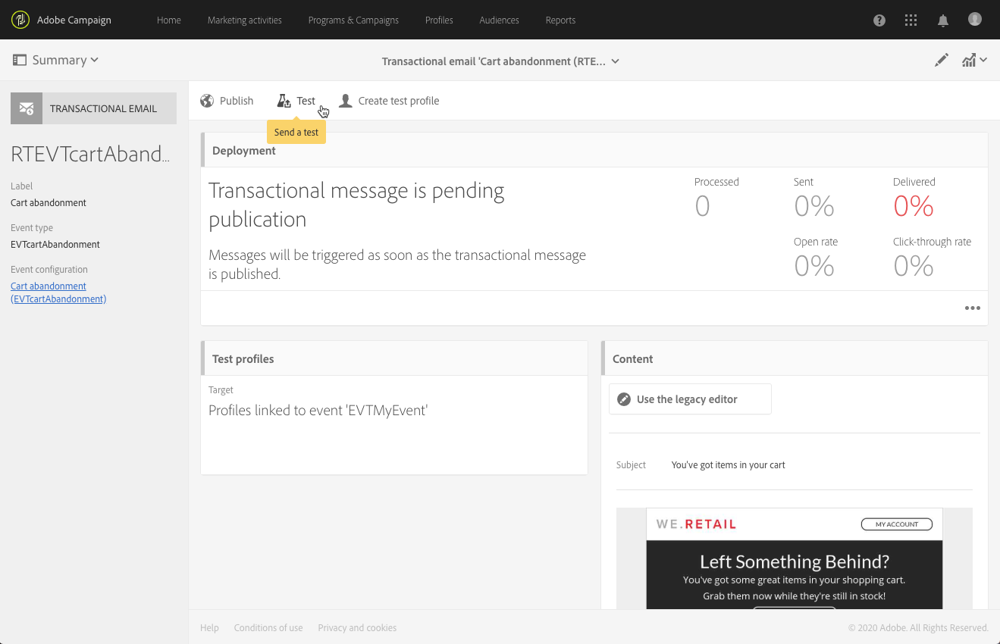

# Livscykel för transaktionsmeddelande {#publishing-transactional-message}

När [transaktionsmeddelandet](../../channels/using/editing-transactional-message.md) är klart att skickas kan det publiceras.

Stegen för att testa, publicera, pausa, avpublicera och ta bort en händelse beskrivs nedan. I det här avsnittet beskrivs även processen för att försöka igen med transaktionsmeddelanden.

## Publiceringsprocess för transaktionsmeddelanden {#transactional-messaging-pub-process}

Diagrammet nedan visar den övergripande processen för publicering av transaktionsmeddelanden.

Mer information om hur du publicerar ett transaktionsmeddelande finns i [det här avsnittet](#publishing-a-transactional-message).
Mer information om hur du pausar ett transaktionsmeddelande finns i [det här avsnittet](#suspending-a-transactional-message-publication).
Mer information om hur du avpublicerar ett transaktionsmeddelande finns i [det här avsnittet](#unpublishing-a-transactional-message).

Mer information om att publicera och avpublicera en händelse finns i [det här avsnittet](../../channels/using/publishing-transactional-event.md).

## Testa ett transaktionsmeddelande {#testing-a-transactional-message}

Du måste först skapa en specifik testprofil som gör att du kan kontrollera transaktionsmeddelandet korrekt.

### Definiera en specifik testprofil {#defining-specific-test-profile}

Definiera en testprofil som ska länkas till din händelse så att du kan förhandsgranska meddelandet och skicka ett relevant bevis.

1. Klicka på knappen **[!UICONTROL Create test profile]** på kontrollpanelen för transaktionsmeddelanden.

   

1. Ange den information som ska skickas i JSON-format i **[!UICONTROL Event data used for personalization]**-avsnittet. Det här är det innehåll som kommer att användas när du förhandsgranskar meddelandet och när testprofilen tar emot meddelandet för korrekturläsning.

   

   >[!NOTE]
   >
   >Du kan också ange information som hör till profiltabellen. Se [Förbättra händelsen](../../channels/using/configuring-transactional-event.md#enriching-the-transactional-message-content)<!--and [Personalizing a transactional message](../../channels/using/editing-transactional-message.md#personalizing-a-transactional-message)-->.

1. När du har skapat testprofilen föranges den i transaktionsmeddelandet. Klicka på **[!UICONTROL Test profiles]**-blocket i meddelandet för att kontrollera målet för korrekturläsningen.

   

Du kan också skapa en ny testprofil eller använda en som redan finns på **[!UICONTROL Test profiles]**-menyn. Så här gör du:

1. Klicka på **[!UICONTROL Adobe Campaign]**-logotypen i det övre vänstra hörnet och välj sedan **[!UICONTROL Profiles & audiences]** > **[!UICONTROL Test profiles]**.
1. I avsnittet **[!UICONTROL Event]** väljer du händelsen som du just har skapat. I det här exemplet väljer du &quot;Överge kundvagnen (EVTcartAbandonment)&quot;.
1. Ange den information som ska skickas i JSON-format i **[!UICONTROL Event data]**-textrutan.

   

1. Spara ändringarna.
1. Öppna meddelandet som du skapade och välj den uppdaterade testprofilen.

**Relaterade ämnen:**

* [Hantera testprofiler](../../audiences/using/managing-test-profiles.md)
* [Skapa målgrupper](../../audiences/using/creating-audiences.md)

### Skicka korrektur {#sending-proof}

När du har skapat en eller flera specifika testprofiler och sparat ditt transaktionsmeddelande kan du skicka ett bevis för att testa det.

Stegen för att skicka ett korrektur beskrivs i avsnittet [Skicka korrektur](../../sending/using/sending-proofs.md).

## Publicera ett transaktionsmeddelande {#publishing-a-transactional-message}

När du har kontrollerat ditt transaktionsmeddelande kan du publicera det.

Så snart händelsen &quot;Överge kundvagnen&quot; utlöses får mottagaren automatiskt ett meddelande med mottagarens titel och efternamn, kundvagns-URL, senaste produkt som efterfrågats eller en lista över produkter om du har definierat en produktlista samt det totala kundvagnsbeloppet som ska skickas.

Använd knappen **[!UICONTROL Reports]** för att få åtkomst till rapporter om ditt transaktionsmeddelande. Se [Dynamiska rapporter](../../reporting/using/about-dynamic-reports.md).

### Pausa en publikation för transaktionsmeddelanden {#suspending-a-transactional-message-publication}

Du kan pausa publiceringen av ditt transaktionsmeddelande med **[!UICONTROL Pause]**-knappen för att t.ex. ändra data i meddelandet. Händelserna behandlas därför inte längre utan hålls i en kö i Adobe Campaign-databasen.

Händelserna som står i kö behålls under en tidsperiod som definieras i REST API (se [REST API-dokumentationen](../../api/using/managing-transactional-messages.md) eller i utlösarhändelsen om du använder huvudtjänsten för utlösare (se [Om Adobe Experience Cloud-utlösare](../../integrating/using/about-adobe-experience-cloud-triggers.md)).

När du klickar på **[!UICONTROL Resume]** bearbetas alla händelser som står i kö (förutsatt att de inte har gått ut). De innehåller nu alla ändringar som utfördes medan mallpubliceringen pausades.

### Avpublicera ett transaktionsmeddelande {#unpublishing-a-transactional-message}

Om du klickar på **[!UICONTROL Unpublish]** kan du avbryta publikationen för transaktionsmeddelandet, men även publikationen för motsvarande händelse, som tar bort resursen som motsvarar händelsen som du skapade från REST-API:t.

Även om händelsen utlöses via din webbplats skickas inte längre motsvarande meddelanden och de lagras inte i databasen.

>[!NOTE]
>
>Om du vill publicera meddelandet igen måste du gå tillbaka till motsvarande händelsekonfiguration, [publicera händelsen](../../channels/using/publishing-transactional-event.md) och sedan [publicera meddelandet](#publishing-a-transactional-message).

Om du avpublicerar ett pausat transaktionsmeddelande kan du behöva vänta upp till 24 timmar innan du kan publicera det igen. Detta gör att alla händelser som skickades till kön kan rensas i arbetsflödet **[!UICONTROL Database cleanup]**.

Stegen för att pausa ett meddelande finns i avsnittet [Pausa en publikation för transaktionsmeddelande](#suspending-a-transactional-message-publication).

Arbetsflödet **[!UICONTROL Database cleanup]**, som körs varje dag kl. 04.00, är tillgängligt via **[!UICONTROL Administration]** > **[!UICONTROL Application settings]** > **[!UICONTROL Workflows]**.

### Ta bort ett transaktionsmeddelande {#deleting-a-transactional-message}

När ett transaktionsmeddelande har avpublicerats, eller om ett transaktionsmeddelande inte har publicerats ännu, kan du ta bort det från transaktionsmeddelandelistan. Så här gör du:

1. Klicka på **[!UICONTROL Adobe Campaign]**-logotypen i det övre vänstra hörnet och välj sedan **[!UICONTROL Marketing plans]** > **[!UICONTROL Transactional messages]** > **[!UICONTROL Transactional messages]**.
1. Håll muspekaren över valfritt meddelande.
1. Klicka på knappen **[!UICONTROL Delete element]**.

Du kan bara ta bort ett transaktionsmeddelande under vissa förhållanden:

* Kontrollera att transaktionsmeddelandet har statusen **[!UICONTROL Draft]**, annars kan du inte ta bort det. Statusen **[!UICONTROL Draft]** gäller för ett meddelande som ännu inte har publicerats eller som har [avpublicerats](#unpublishing-a-transactional-message) (och inte [pausats](#suspending-a-transactional-message-publication)).

* **Transaktionsmeddelanden**: Om inte ett annat transaktionsmeddelande är kopplat till motsvarande händelse måste även händelsekonfigurationen avpubliceras om transaktionsmeddelandet inte har publicerats för att ditt transaktionsmeddelande ska kunna tas bort. Mer information finns i [Avpublicera en händelse](../../channels/using/publishing-transactional-event.md#unpublishing-an-event).

   >[!IMPORTANT]
   >
   >Om du tar bort ett transaktionsmeddelande som redan har skickat meddelanden tas även dess loggar för sändning och spårning bort.

* **Transaktionsmeddelanden från en färdig händelsemall (interna transaktionsmeddelanden)**: Om ett internt transaktionsmeddelande är det enda som är associerat med den motsvarande interna händelsen kan det inte tas bort. Du måste först skapa ett annat transaktionsmeddelande genom att duplicera det eller via menyn **[!UICONTROL Resources]** > **[!UICONTROL Templates]** > **[!UICONTROL Transactional message templates]**.

## Återförsöksprocess för transaktionsmeddelande {#transactional-message-retry-process}

Ett tillfälligt olevererat transaktionsmeddelande kan skickas igen automatiskt tills leveransen löper ut. Mer information om leveransens varaktighet finns i [Parametrar för giltighetsperiod](../../administration/using/configuring-email-channel.md#validity-period-parameters).

När ett transaktionsmeddelande inte skickas finns det två system för återförsök:

* På nivån för transaktionsmeddelanden kan ett transaktionsmeddelande misslyckas innan händelsen tilldelas till en körningsleverans, vilket innebär mellan mottagningen av händelsen och leveransförberedelsen. Se [Återförsöksprocess för händelsebearbetning](#event-processing-retry-process).
* När händelsen har tilldelats en körningsleverans kan transaktionsmeddelandet misslyckas på den sändande processnivån på grund av ett tillfälligt fel. Se [Återförsöksprocess för att skicka meddelande](#message-sending-retry-process).

### Återförsöksprocess för händelsebearbetning {#event-processing-retry-process}

Om händelsen inte kan tilldelas en körningsleverans, senareläggs händelsebearbetningen. Försök utförs sedan igen tills den har tilldelats en ny körningsleverans.

>[!NOTE]
>
>En senarelagd händelse visas inte i utskicksloggar över transaktionsmeddelanden eftersom den ännu inte har tilldelats en körningsleverans.

Händelsen kunde till exempel inte tilldelas en körningsleverans eftersom dess innehåll inte var korrekt, det uppstod ett problem med åtkomsträttigheter eller varumärke, ett fel upptäcktes när regler för typologi tillämpades, o.s.v. I så fall kan du pausa meddelandet, redigera det för att åtgärda problemet och publicera det igen. Återförsökssystemet tilldelar det sedan till en ny körningsleverans.

### Återförsöksprocess för att skicka meddelande {#message-sending-retry-process}

När händelsen har tilldelats en körningsleverans kan transaktionsmeddelandet misslyckas på grund av ett tillfälligt fel, t.ex. om mottagarens brevlåda är full. Mer information finns i [Försök igen efter ett tillfälligt leveransfel](../../sending/using/understanding-delivery-failures.md#retries-after-a-delivery-temporary-failure).

>[!NOTE]
>
>När en händelse tilldelas till en körningsleverans visas den i sändningsloggarna för den här körningsleveransen, och endast vid det här tillfället. De misslyckade leveranserna visas på fliken **[!UICONTROL Execution list]** i transaktionsmeddelandets sändande loggar.

### Försök igen med processbegränsningar {#limitations}

**Uppdatering av utskicksloggar**

Under återförsöksprocessen uppdateras inte de utskicksloggarna för den nya körningsleveransen omedelbart (uppdateringen utförs via ett schemalagt arbetsflöde). Det innebär att meddelandet kan ha statusen **[!UICONTROL Pending]** även om transaktionshändelsen har bearbetats av den nya körningsleveransen.

**Körningen misslyckades**

Du kan inte stoppa en körningsleverans. Om den aktuella körningsleveransen misslyckas skapas en ny så snart en ny händelse tas emot och alla nya händelser bearbetas av den nya körningsleveransen. Inga nya händelser bearbetas av den misslyckade körningsleveransen.

Om vissa händelser som redan har tilldelats en körningsleverans har senarelagts och om körningsleveransen misslyckas, tilldelar inte återförsökssystemet de senarelagda händelserna till den nya körningsleveransen, vilket betyder att dessa händelser går förlorade.
