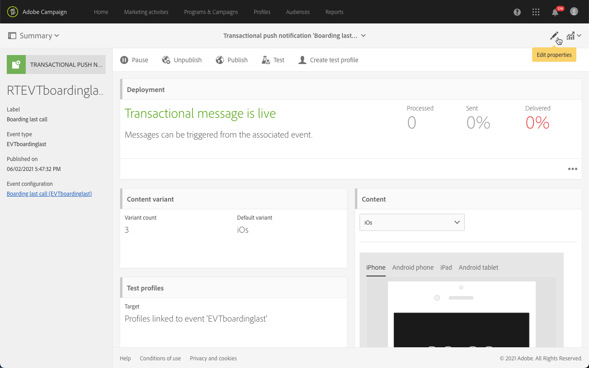

# Push-transaktionsmeddelanden{#transactional-push-notifications}

Du kan använda Adobe Campaign för att skicka push-meddelanden för transaktioner på iOS- och Android-mobilenheter. Dessa meddelanden tas emot i mobilappar som du konfigurerar i Adobe Campaign genom att utnyttja Experience Cloud Mobile SDK.

>[!NOTE]
>
>Push-kanalen är valfri. Kontrollera licensavtalet.  Mer information om vanliga push-meddelanden finns i [Om push-meddelanden](../../channels/using/about-push-notifications.md).

Om du vill kunna skicka push-meddelanden via transaktion måste du konfigurera Adobe Campaign i enlighet med detta. Se [Konfigurera ett mobilprogram](../../administration/using/configuring-a-mobile-application.md).

Du kan skicka två typer av push-meddelanden för transaktioner:

* [Transaktionspush-meddelanden för en händelse](#transactional-push-notifications-targeting-an-event)
* [Transactional push notifications rörande ](#transactional-push-notifications-targeting-a-profile) profiler från Adobe Campaign-databasen

## Transaktionspush-meddelanden för en händelse {#transactional-push-notifications-targeting-an-event}

Du kan använda Adobe Campaign för att skicka **anonyma push-meddelanden för transaktioner till alla användare** som har valt att ta emot meddelanden från ditt mobilprogram.

I det här fallet används bara **data i själva händelsen för att definiera leveransmålet**. Inga data från Adobe Campaign integrerade profildatabas används.

### Konfigurera ett händelsebaserat push-meddelande för transaktioner {#configuring-event-based-transactional-push-notification}

Om du vill skicka ett transaktionsmeddelande till alla användare som har valt att ta emot meddelanden från ditt mobilprogram måste du först skapa och konfigurera en händelse som har de data som finns i själva händelsen som mål.

>[!NOTE]
>
>Du kan fortfarande anpassa innehållet i ett händelsebaserat transaktionspush-meddelande med [händelseattribut](../../channels/using/configuring-transactional-event.md#defining-the-event-attributes) (data från händelsen) och [händelseberikning](../../channels/using/configuring-transactional-event.md#enriching-the-transactional-message-content) (data från Campaign-databasen). Se [exemplet nedan](#sending-event-based-transactional-push-notification).

Händelsen måste innehålla följande tre element:

* En **registreringstoken**, som är användar-ID för ett mobilprogram och en enhet. Den kanske inte motsvarar någon profil från Adobe Campaign-databasen.
* Ett **mobilprogramnamn** (ett för alla enheter - Android och iOS). Detta är ID:t för det mobilprogram som konfigurerats i Adobe Campaign och som ska användas för att ta emot push-meddelanden på användarnas enheter. Mer information finns i [Konfigurera ett mobilprogram](../../administration/using/configuring-a-mobile-application.md).
* En **push-plattform** (&quot;gcm&quot; för Android eller&quot;apns&quot; för iOS).

Följ stegen nedan för att konfigurera händelsen:

1. När du skapar händelsekonfigurationen väljer du kanalen **[!UICONTROL Push notification]** och måldimensionen **[!UICONTROL Real-time event]** (se [Skapa en händelse](../../channels/using/configuring-transactional-event.md#creating-an-event)).
1. Lägg till fält i händelsen. Detta gör att du kan anpassa transaktionsmeddelandet (se [Definiera händelseattribut](../../channels/using/configuring-transactional-event.md#defining-the-event-attributes)). I det här exemplet definierar du fälten&quot;gateNumber&quot;,&quot;lastname&quot; och&quot;firstname&quot;.
1. Du kan också förbättra innehållet i ditt meddelande. Det gör du genom att lägga till fält från tabellen som du länkade till händelsekonfigurationen (se [Förbättra händelsen](../../channels/using/configuring-transactional-event.md#enriching-the-transactional-message-content)).

   <!--Event-based transactional messaging is supposed to use only the data that are in the sent event to define the recipient and the message content personalization. However, you can enrich the content of your transactional message using information from the Adobe Campaign database.-->

1. [Förhandsgranska och publicera händelsen](../../channels/using/publishing-transactional-event.md#previewing-and-publishing-the-event).

   När du förhandsgranskar händelsen innehåller REST API:t attributen registrationToken, application och pushPlatform som ska användas som mål för leveransen.

   

   När händelsen har publicerats skapas automatiskt ett transaktionspush-meddelande som är länkat till den nya händelsen. Du kan nu ändra och publicera det meddelande som skapades (se [det här avsnittet](#sending-event-based-transactional-push-notification)).

1. Integrera händelsen på webbplatsen (se [Integrera händelsen som utlöser](../../channels/using/getting-started-with-transactional-msg.md#integrate-event-trigger)).

### Skicka ett händelsebaserat push-meddelande för transaktioner {#sending-event-based-transactional-push-notification}

Ett flygbolag vill till exempel bjuda in sina användare av mobilappar att fortsätta till den relevanta porten för boarding.

Företaget skickar ett transaktionsmeddelande per användare (identifieras med en registreringstoken) med ett mobilprogram via en enda enhet.

1. Gå till transaktionsmeddelandet som skapades för att redigera det. Se [Åtkomst till transaktionsmeddelanden](../../channels/using/editing-transactional-message.md#accessing-transactional-messages).

   

1. Klicka på **[!UICONTROL Content]**-blocket för att ändra meddelandets titel och brödtext.

1. Du kan infoga anpassningsfält för att lägga till element som du definierade när du skapade händelsen (se [Definiera händelseattributen](../../channels/using/configuring-transactional-event.md#defining-the-event-attributes)).

   

   Om du vill hitta de här fälten klickar du på pennan bredvid ett objekt, klickar på **[!UICONTROL Insert personalization field]** och väljer **[!UICONTROL Context]** > **[!UICONTROL Real-time event]** > **[!UICONTROL Event context]**.

   

   Mer information om hur du redigerar ett push-meddelandeinnehåll finns i [Förbereda och skicka ett push-meddelande](../../channels/using/preparing-and-sending-a-push-notification.md).

1. Du kan även utöka transaktionsmeddelandets innehåll om du vill använda ytterligare information från Adobe Campaign-databasen (se [Förbättra händelsen](../../channels/using/configuring-transactional-event.md#enriching-the-transactional-message-content)).

1. Spara ändringarna och publicera meddelandet.  Se [Publicera ett transaktionsmeddelande](../../channels/using/publishing-transactional-message.md#publishing-a-transactional-message).

1. Med Adobe Campaign Standard REST API skickar du en händelse till en registreringstoken (ABCDEF123456789) med ett mobilprogram (WebFlight) på Android (gcm) som innehåller startdata:

   ```
   {
     "registrationToken":"ABCDEF123456789",
     "application":"WeFlight",
     "pushPlatform":"gcm",
     "ctx":
     {
       "gateNumber":"Gate B18",
       "lastname":"Green",
       "firstname":"Jane"
     }
   }
   ```

   Mer information om hur du integrerar utlösaren av en händelse i ett externt system finns i [Integrera den händelseutlösande](../../channels/using/getting-started-with-transactional-msg.md#integrate-event-trigger).

Om det finns en registreringstoken får motsvarande användare ett transaktionspush-meddelande med följande innehåll:

*&quot;Hej Jane Green, boarding har precis börjat! Fortsätt till Gate B18.&quot;*

## Transaktionspush-meddelanden med en profil som mål {#transactional-push-notifications-targeting-a-profile}

Du kan skicka ett transaktionspush-meddelande **till de Adobe Campaign-profiler som har prenumererat på ditt mobilprogram**. Leveransen kan innehålla [anpassningsfält](../../designing/using/personalization.md#inserting-a-personalization-field), t.ex. mottagarens förnamn, som hämtas direkt från Adobe Campaign-databasen.

I det här fallet måste händelsen innehålla fält **som tillåter avstämning med en profil från Adobe Campaign-databasen**.

När målprofiler används skickas ett transaktionspush-meddelande per mobilprogram och per enhet. Om en Adobe Campaign-användare t.ex. prenumererar på två program får den här användaren två meddelanden. Om en användare prenumererar på samma program med två olika enheter får användaren ett meddelande på varje enhet.

De mobilprogram som en profil prenumererar på visas på fliken **[!UICONTROL Mobile App Subscriptions]** i den här profilen. Om du vill komma åt den här fliken markerar du en profil och klickar på knappen **[!UICONTROL Edit profile properties]** till höger.


Mer information om att komma åt och redigera profiler finns i [Om profiler](../../audiences/using/about-profiles.md).

### Konfigurera ett profilbaserat push-meddelande för transaktioner {#configuring-profile-based-transactional-push-notification}

Om du vill skicka ett transaktionspush-meddelande till de Adobe Campaign-profiler som har prenumererat på ditt mobilprogram måste du först skapa och konfigurera en händelse för Adobe Campaign-databasen.

1. När du skapar händelsekonfigurationen väljer du kanalen **[!UICONTROL Push notification]** och måldimensionen **[!UICONTROL Profile]** (se [Skapa en händelse](../../channels/using/configuring-transactional-event.md#creating-an-event)).

   Som standard skickas transaktionsmeddelandet till alla mobilprogram som mottagarna prenumererar på. Om du vill skicka push-meddelandet till ett visst mobilprogram markerar du det i listan. De andra mobilapparna kommer att adresseras av meddelandet, men kommer inte att kunna skickas.

   

1. Lägg till fält i händelsen om du vill anpassa transaktionsmeddelandet (se [Definiera händelseattributen](../../channels/using/configuring-transactional-event.md#defining-the-event-attributes)).

   >[!NOTE]
   >
   >Du måste lägga till minst ett fält för att skapa en anrikning. Du behöver inte skapa andra fält som **Förnamn** och **Efternamn** eftersom du kan använda anpassningsfält från Adobe Campaign-databasen.

1. Skapa en berikning för att länka händelsen till **[!UICONTROL Profile]**-resursen (se [Förbättra händelsen](../../channels/using/configuring-transactional-event.md#enriching-the-transactional-message-content)) och välj den här anrikningen som **[!UICONTROL Targeting enrichment]**.

   >[!IMPORTANT]
   >
   >Det här steget är obligatoriskt för profilbaserade händelser.

1. [Förhandsgranska och publicera händelsen](../../channels/using/publishing-transactional-event.md#previewing-and-publishing-the-event).

   När händelsen förhandsgranskas innehåller REST API inte något attribut som anger registreringstoken, programnamn och push-plattform så som de hämtas från resursen **[!UICONTROL Profile]**.

   När händelsen har publicerats skapas automatiskt ett transaktionspush-meddelande som är länkat till den nya händelsen. Du kan nu ändra och publicera det meddelande som skapades (se [det här avsnittet](#sending-profile-based-transactional-push-notification)).

1. Integrera händelsen på webbplatsen (se [Integrera händelsen som utlöser](../../channels/using/getting-started-with-transactional-msg.md#integrate-event-trigger)).

### Skicka ett profilbaserat push-meddelande för transaktioner {#sending-profile-based-transactional-push-notification}

Ett flygbolag vill t.ex. skicka en sista förfrågan om introduktion till alla Adobe Campaign-användare som har prenumererat på sin mobilapp.

1. Gå till transaktionsmeddelandet som skapades för att redigera det. Se [Åtkomst till transaktionsmeddelanden](../../channels/using/editing-transactional-message.md#accessing-transactional-messages).

1. Klicka på **[!UICONTROL Content]**-blocket för att ändra meddelandets titel och brödtext.

   I motsats till konfigurationer som baseras på realtidshändelser har du direkt tillgång till all profilinformation för att personalisera meddelandet. Se [Infoga ett personaliserat fält](../../designing/using/personalization.md#inserting-a-personalization-field).

   Mer information om hur du redigerar ett push-meddelandeinnehåll finns i [Förbereda och skicka ett push-meddelande](../../channels/using/preparing-and-sending-a-push-notification.md).

1. Spara ändringarna och publicera meddelandet.  Se [Publicera ett transaktionsmeddelande](../../channels/using/publishing-transactional-message.md#publishing-a-transactional-message).
1. Skicka en händelse till en profil med Adobe Campaign Standard REST API:

   ```
   {
     "ctx":
     {
       "email":"janegreen@email.com",
       "gateNumber":"D16",
     }
   }
   ```

Mer information om hur du integrerar utlösaren av en händelse i ett externt system finns i [Integrera den händelseutlösande](../../channels/using/getting-started-with-transactional-msg.md#integrate-event-trigger).

Motsvarande användare får ett transaktionspush-meddelande som innehåller alla personaliseringselement som hämtats från Adobe Campaign-databasen.

>[!NOTE]
>
>Det finns inga registreringstoken-, program- och push-plattformsfält. I det här exemplet utförs avstämningen med e-postfältet.

## Ändra målmappningen i ett transaktionspush-meddelande {#change-target-mapping}

Transactional push-meddelanden använder en specifik [målmappning](../../administration/using/target-mappings-in-campaign.md) som innehåller de tekniska inställningar som krävs för att skicka den här typen av leveranser.

Följ stegen nedan om du vill ändra målmappningen:

1. Välj ett push-meddelande i transaktionsmeddelandelistan.

1. Klicka på knappen **[!UICONTROL Edit properties]** i meddelandekontrollpanelen.

   

1. Expandera avsnittet **[!UICONTROL Advanced parameters]**.

1. Klicka på **[!UICONTROL Select a 'Target mapping' element]**.

   

1. Välj en målmappning i listan.

   >[!NOTE]
   >
   >Använd målmappningen **[!UICONTROL Profile - Real-time event for Push (mapRtEventAppSubRcp)]** om du vill ha optimal tid och prestanda för förberedelser och prestation vid sändning av **profilbaserade** transaktionsbaserade push-meddelanden.

   

1. Bekräfta ändringen och publicera meddelandet. Se [Publicera ett transaktionsmeddelande](../../channels/using/publishing-transactional-message.md#publishing-a-transactional-message).

   >[!IMPORTANT]
   >
   >Du måste publicera meddelandet igen för att ändringen ska börja gälla, annars kommer den tidigare målmappningen fortfarande att användas.


