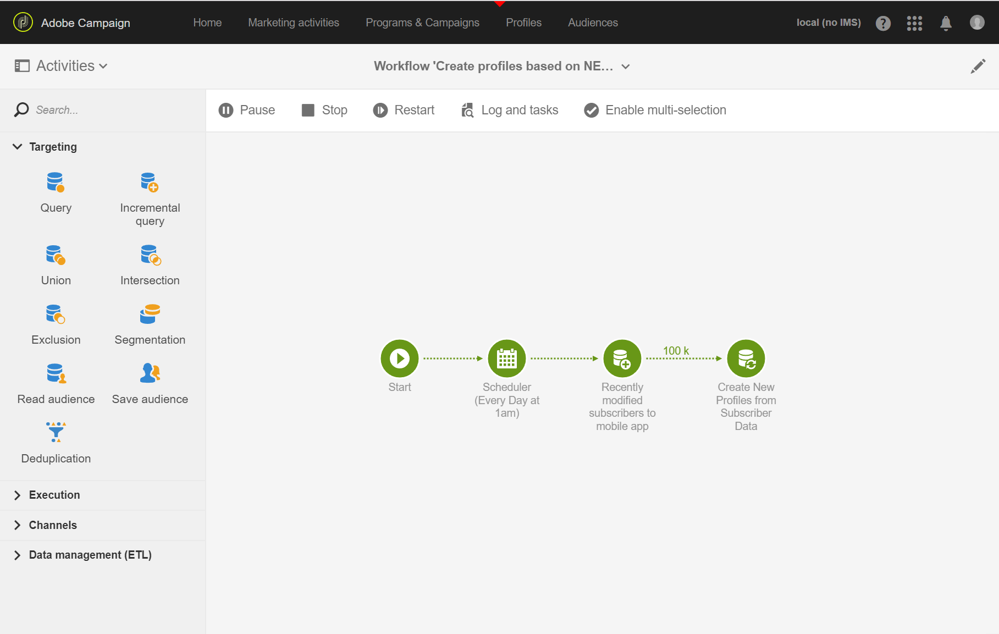

# Skapa och uppdatera profilinformation baserat på mobilapplikationsdata

## Översikt

På den här sidan beskrivs stegen för att utveckla ett arbetsflöde som skapar/uppdaterar profildata efter att ett mobilprogram har skickat samla in PII-data på schemalagd basis.

* **PII** står för&quot;Personligt identifierbar information&quot;. Det kan vara vilken data som helst, inklusive information som inte visas i profiltabellen från din Campaign-databas, till exempel Analytics for Mobile [Points of Interest](../../integrating/using/about-campaign-points-of-interest-data-integration.md). PII definieras av Mobile App Developer, vanligtvis med en marknadsförare.
* **Samla in** PII är en HTTP-POST-åtgärd till ett Rest API i Adobe Campaign Standard från en mobilapp.

Målet med det här användningsexemplet är att skapa eller uppdatera en Campaign Standard-profil om de PII-data som returneras av ett mobilprogram innehåller profilrelaterade data.

## Förhandskrav

Det finns flera konfigurationssteg som ska utföras för att aktivera push-meddelanden i Campaign Standarden, innan profiler kan skapas eller uppdateras baserat på prenumerationsdata för mobilappar:

1. [Skapa ett mobilprogram](../../administration/using/configuring-a-mobile-application.md)
1. [Integrera Adobe Mobile SDK med mobilapplikationen](../../administration/using/supported-mobile-use-cases.md).
1. [Konfigurera Adobe Campaign för att skicka push-meddelanden](../../administration/using/configuring-a-mobile-application.md).

## Steg 1 - Utöka profilresursen för push-meddelanden/prenumerationer

Om du vill kunna skapa eller uppdatera profilresursen med PII-data måste du först utöka profilresursen med de önskade fälten. Så här gör du:

* Identifiera de PII-fält som skickas av mobilprogrammet.
* Identifiera fältet som ska användas för avstämning för att associera PII-data med profildata.

I det här exemplet återspeglar **[!UICONTROL Fields]**-avsnittet de PII-data som skickas av mobilprogrammet. Avsnittet **[!UICONTROL Link to profiles]** anger det fält som används för att associera PII med profildata, där **cusEmail** mappar till **@email**.

Mappningen för profildata när du utökar resursen **[!UICONTROL Subscriptions to an Application]** är SKRIVSKYDDAD. Det används för avstämning. Profilen måste registreras i systemet med de data som krävs för att stämma av profilen med PII-data. I det här fallet måste en e-postadress för profilen matcha ett e-postmeddelande från Hämta PII för att avstämningen ska ske:

* Samla in PII tas emot från en mobilapp för en användare där förnamnet är &quot;Jane, efternamnet är &quot;Doe&quot; och e-postadressen är janedoe@doe.com.
* Profildata måste finnas separat (till exempel måste data anges manuellt eller redan komma från en annan resurs) där profilens e-postadress är janedoe@doe.com.

**Relaterade ämnen:**

* [Utöka prenumerationerna till en programresurs](../../developing/using/extending-the-subscriptions-to-an-application-resource.md).
* [Skapa eller utöka en befintlig resurs](../../developing/using/key-steps-to-add-a-resource.md).

## Steg 2 - Skapa arbetsflödet

Om du använder ett arbetsflöde i Campaign Standard kan en administratör unikt identifiera och synkronisera data mellan AppSubscription-data (prenumerantdata) och Profil- eller mottagardata. En arbetsflödesbaserad uppdatering synkroniserar inte profildata i realtid, men bör inte orsaka onödiga databaslås eller overhead.

De viktigaste stegen för att skapa arbetsflödet är:

1. Använd en **[!UICONTROL Query]**- eller **[!UICONTROL Incremental query]**-aktivitet för att få en lista över de senaste prenumerationerna.
1. Använd en **[!UICONTROL Reconciliation]**-aktivitet för att mappa PII-data till profilen.
1. Lägg till en verifieringsprocess.
1. Använd en **[!UICONTROL Update data]** för att uppdatera eller skapa profilen med PII-data.

Följande krav antas i det här arbetsflödet:

* Alla/alla fält som har utökats bör vara tillgängliga för att skapa/uppdatera profiltabellen.
* Profiltabellen kan utökas till stöd för fält som inte stöds internt (till exempel T-Shirt Size).
* Alla fält från AppSubscription-tabellen som är tomma ska inte uppdateras i profiltabellen.
* Alla poster som har uppdaterats i tabellen AppSubscription ska inkluderas i nästa körning av arbetsflödet.

Om du vill skapa arbetsflödet drar och släpper du följande aktiviteter på arbetsytan och länkar ihop dem: **[!UICONTROL Start]**, **[!UICONTROL Scheduler]**, **[!UICONTROL Incremental query]**, **[!UICONTROL Update data]**.

Följ sedan stegen nedan för att konfigurera varje aktivitet.

### Konfigurera aktiviteten **[!UICONTROL Scheduler]**

På fliken **[!UICONTROL General]** anger du **[!UICONTROL Execution frequency]** (till exempel &quot;Daily&quot;), **[!UICONTROL Time]** (till exempel &quot;1:00:00 AM&quot;) och **[!UICONTROL Start]** (till exempel Dagens datum).

### Konfigurera aktiviteten **[!UICONTROL Incremental query]**.

1. Klicka på ikonen **[!UICONTROL Select an element]** för fältet **[!UICONTROL Resource]** på fliken **[!UICONTROL Properties]** och välj sedan elementet **[!UICONTROL Subscriptions to an application (nms:appSubscriptionRcp:appSubscriptionRcpDetail)]**.

   

1. På fliken **[!UICONTROL Target]** drar du filtret **[!UICONTROL Mobile application]** och väljer sedan ett mobilprogramnamn.

   

1. På fliken **[!UICONTROL Processed data]** väljer du **[!UICONTROL Use a date field]** och lägger sedan till fältet **[!UICONTROL Last modified (lastModified)]** som **[!UICONTROL Path to the date field]**.

   

### Konfigurera aktiviteten **[!UICONTROL Update data]**.

1. Kontrollera att fältet **[!UICONTROL Dimension to update]** är inställt på Profiler (profil) på fliken **[!UICONTROL Identification]** och klicka sedan på knappen **[!UICONTROL Create element]** för att lägga till ett fält som ett avstämningsvillkor.

   

1. I fältet **[!UICONTROL Source]** väljer du ett fält från tabellen appSubscriptionRcp som ett avstämningsfält. Det kan vara profilens e-postadress, crmId, marketingCloudId osv. I det här exemplet använder du fältet&quot;Email (cusEmail)&quot;.

1. I fältet **[!UICONTROL Destination]** väljer du ett fält i profiltabellen för att stämma av data från tabellen appSubscriptionRcp. Det kan vara profilens e-postadress eller ett utökat fält som crmId, marketingCloudId osv. I det här exemplet måste vi markera fältet&quot;E-post (e-post)&quot; för att mappa det med fältet&quot;E-post (cusEmail)&quot; från tabellen appSubscriptionRcp.

   

1. Klicka på knappen **[!UICONTROL Create element]** på fliken **[!UICONTROL Fields to update]** och mappa sedan fälten som kommer från tabellen appSubscriptionRcp (**[!UICONTROL Source]** fält) med fälten som du vill uppdatera i profiltabellen (**[!UICONTROL Destination]** fält).

1. Lägg till ett uttryck i fältet **[!UICONTROL Enabled if]** för att se till att motsvarande fält i profiltabellen bara uppdateras om källfältet innehåller ett värde. Det gör du genom att markera fältet i listan och sedan lägga till &quot;!=&#39;&#39;&quot;-uttryck (om källfältet är `[target/@cusEmail]` i uttrycksredigeraren måste du skriva `[target/@cusEmail] != ''"`).

   

>[!NOTE]
>
>I det här fallet utför arbetsflödet en UPSERT, men eftersom det är baserat på **[!UICONTROL Incremental query]**-data infogas bara. Om du ändrar frågan kan det påverka vilka data som infogas eller uppdateras.
>Inställningarna på fliken Fält som ska uppdateras avgör dessutom vilka fält som infogas eller uppdateras under specifika förhållanden. Dessa inställningar kan vara unika för varje program eller kund.
>Var försiktig när du konfigurerar de här inställningarna eftersom det kan få oönskade konsekvenser, eftersom uppdatering av poster i profilen baserat på appSubscriptionRcp-data kan ändra användarnas personliga information utan validering.

När alla fält som ska infogas/uppdateras i profilen har lagts till klickar du på **[!UICONTROL Confirm]**.

Spara arbetsflödet och klicka sedan på **[!UICONTROL Start]** för att köra arbetsflödet.

