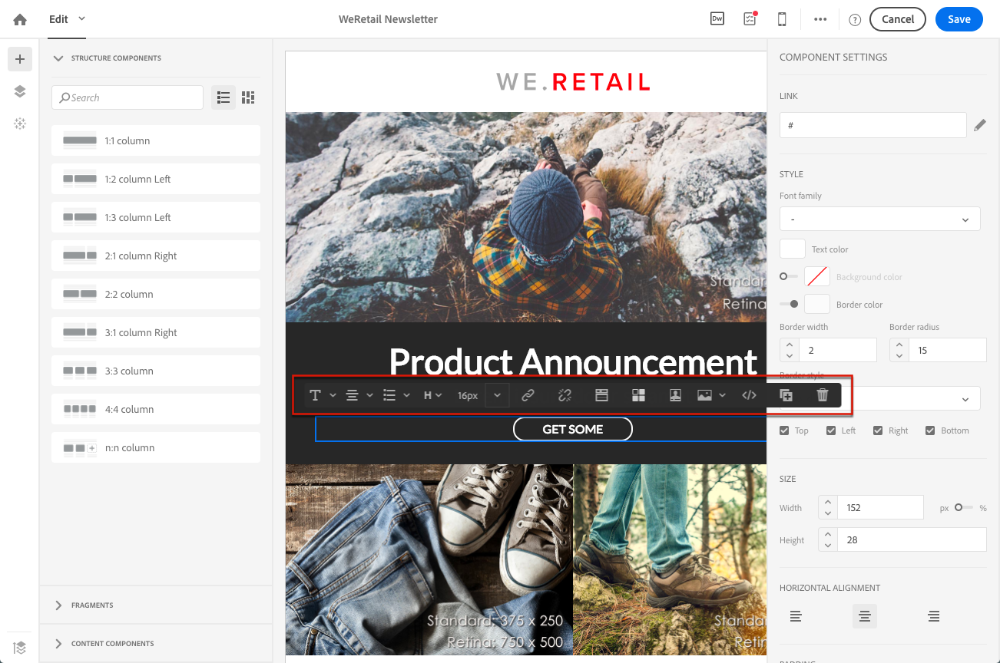
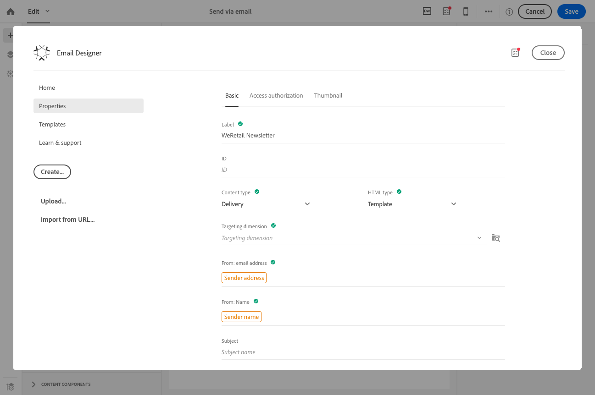
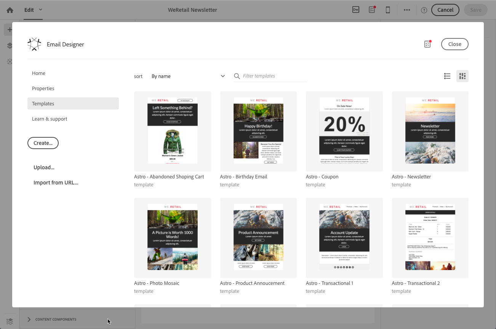

# E-postdesigner för kampanj{#designing-content-in-adobe-campaign}

När du har skapat ett e-postmeddelande i Adobe Campaign måste du definiera dess innehåll.

Med e-postdesignern kan du skapa engagerande, individuellt anpassade e-postmeddelanden genom att dra och släppa
gränssnitt. Oavsett om du börjar med en tom sida eller använder befintliga innehållskomponenter eller -mallar kan du designa och förfina allt innehåll för varje e-postmeddelande – oavsett om det är reklam eller en transaktion.

E-postdesignern är designad för att leverera HTML som är optimerad för responsiv design och du kan enkelt definiera och använda synlighetsvillkor. Du kan även använda dynamiskt innehåll i ett e-postmeddelande, en mall eller ett fragment direkt via användargränssnittet. Du kan smidigt växla mellan dra och släpp-gränssnittet och HTML-koden med en enda knapptryckning

Med E-postdesignern kan du skapa e-postinnehåll och mallar för e-postinnehåll. Den är kompatibel med enkla e-postmeddelanden, transaktionsmeddelanden, A/B-testmeddelanden, flerspråkiga e-postmeddelanden och återkommande e-postmeddelanden.

<!--The Email Designer has more features than the Legacy Editor and is backward compatible.-->

 [Upptäck e-postdesignern i video](#video)

* Se [Kom igång med e-postdesignern](../../designing/using/quick-start.md) för information om hur du skapar e-postinnehåll.
* Se [Använda e-postdesignern](../../designing/using/designing-content-in-adobe-campaign.md) för en översikt över e-postdesignern.
* Mer information om hur du skapar innehåll:
   * Se [Designa e-postmeddelanden från grunden](../../designing/using/designing-from-scratch.md) för att skapa meddelanden från grunden.
   * Se [Designa med befintligt innehåll](../../designing/using/using-existing-content.md) för information om hur du använder befintligt innehåll.
   * Se [Olika lösningar för att designa e-postmeddelanden](../../designing/using/using-integrations.md) om du använder integreringar i Creative Cloud.
* Se [Personalisering](../../designing/using/personalization.md) för mer information om personalisering.

När du skapar ett e-postmeddelande kan du välja att använda en fördefinierad mall eller att läsa in ett befintligt innehåll från en annan källa. Se [Välja befintligt innehåll](../../designing/using/using-existing-content.md#selecting-an-existing-content).

Anpassa ditt innehåll för att öka effektiviteten hos marknadsföringskampanjerna. Se [Infoga ett personaliseringsfält](../../designing/using/personalization.md#inserting-a-personalization-field) och [Lägga till ett innehållsblock](../../designing/using/personalization.md#adding-a-content-block).

Du kan även definiera dynamiskt innehåll som varierar beroende på vilken profil som används. Se [Definiera dynamiskt innehåll i ett e-postmeddelande](../../designing/using/personalization.md#defining-dynamic-content-in-an-email) och [Definiera dynamiskt innehåll på en landningssida](../../channels/using/designing-a-landing-page.md#defining-dynamic-content-in-a-landing-page).

Förbättra meddelanden och landningssidor med både länkar och bilder. Se [Infoga en länk](../../designing/using/links.md#inserting-a-link) och [Infoga bilder](../../designing/using/images.md#inserting-images).

## Gränssnitt i e-postdesignern {#email-designer-interface}

E-postdesignern erbjuder många olika alternativ som du kan använda för att skapa, redigera och anpassa alla delar av ditt innehåll.

Gränssnittet består av flera områden som erbjuder olika funktioner:

Från elementen som finns i **paletten** (1) kan du dra och släppa strukturkomponenter och innehållsfragment till den huvudsakliga **arbetsytan** (2). Välj en komponent eller ett element på **arbetsytan** (2) och anpassa dess huvudsakliga utformning och visningsegenskaper via fönstret **Inställningar** (3).

Du hittar fler allmänna alternativ och inställningar i **Verktygsfältet** (4).

>[!NOTE]
>
>Fönstret **Inställningar** kan flyttas åt vänster enligt skärmupplösningen och bildskärmen.

Det **sammanhangsbaserade verktygsfältet** i redigeringsgränssnittet innehåller olika funktioner beroende på vilken zon som är vald. Det innehåller åtgärdsknappar och knappar som du kan använda för att ändra textens format. De ändringar som görs gäller alltid för den markerade zonen.

### E-postdesigner – startsida {#email-designer-home-page}

När du [skapar ett e-postmeddelande](../../channels/using/creating-an-email.md) visas hemsidan för **[!UICONTROL Email Designer]** automatiskt när du väljer e-postinnehållet.

Med fliken **[!UICONTROL Properties]** kan du redigera e-postinformation såsom etiketten, avsändarens adress och namn eller e-postmeddelandets ämne. Du kan även komma åt den här fliken genom att klicka på e-postetiketten överst på skärmen.

Med fliken **[!UICONTROL Templates]** kan du välja bland det färdiga HTML-innehållet eller mallarna som du redan har skapat för att snabbt börja designa e-postmeddelanden. Se [Innehållsmallar](../../designing/using/using-reusable-content.md#content-templates).

Med fliken **[!UICONTROL Learn & support]** får du enkelt tillgång till relaterad dokumentation och självstudiekurser.

Om du inte väljer någon mall kan du via e-postdesignerns hemsida även välja hur du vill börja designa ditt innehåll:

* Klicka på knappen **[!UICONTROL Create]** för att starta ett nytt innehåll från grunden. Se [Designa ett e-postinnehåll från grunden](../../designing/using/designing-from-scratch.md#designing-an-email-content-from-scratch).
* Klicka på knappen **[!UICONTROL Upload]** för att ladda upp en fil från datorn. Se [Importera innehåll från en fil](../../designing/using/using-existing-content.md#importing-content-from-a-file).
* Klicka på knappen **[!UICONTROL Import from URL]** för att hämta befintligt innehåll från en URL. Se [Importera innehåll från en URL](../../designing/using/using-existing-content.md#importing-content-from-a-url).

## Terminologi {#terminology}

**Mallar**: mallar är e-poststrukturer som du kan skapa och återanvända för flera olika leveranser.

**Fragment**: ett fragment är en återanvändbar komponent som kan refereras i ett eller flera e-postmeddelanden.

**Strukturkomponenter**: strukturella element som definierar layouten i e-postmeddelandet.

**Innehållskomponenter**: innehållskomponenter är tomma och oanvända komponenter som du kan redigera när de har placerats i ett e-postmeddelande.

## Bästa praxis för innehållsdesign {#content-design-best-practices}

Vi rekommenderar att du tillämpar följande principer för att kunna använda e-postdesignern på rätt sätt och skapa de bästa e-postmeddelandena så enkelt som möjligt:

* Använd textbunden formatering i stället för en separat CSS och CSS i &lt;head>-avsnittet i HTML-koden. Genom att använda textbunden formatering kan du optimera innehållets fragment för att sedan spara och återanvända det.

   Se [Lägga till textbundna formateringsattribut](../../designing/using/styles.md#adding-inline-styling-attributes).

* Om du importerar ZIP-filer som innehåller ditt HTML-innehåll ska du använda vanlig CSS. SCSS-formatmallar stöds inte.

* Placera ditt varumärke enkelt genom att skapa och återanvända innehållsfragment för att få enhetliga marknadsföringskampanjer.

   Se [Skapa ett innehållsfragment](../../designing/using/using-reusable-content.md#creating-a-content-fragment).

* När du redigerar **e-postinnehåll**:

   förhandsgranska dina meddelanden innan du skickar dem. Adobe Campaign erbjuder ett sätt att testa e-poståtergivning med Litmus. Se [E-poståtergivning](../../sending/using/email-rendering.md) för mer information.

Mer information om design och allmänna bästa metoder för meddelanden finns i följande avsnitt: [Bästa praxis för leverans](../../sending/using/delivery-best-practices.md).

### Uppdaterar fragment {#email-designer-updates}

E-postdesignern förbättras kontinuerligt. Om du har skapat ett e-postinnehåll från grunden, från en färdig mall eller om du har skapat fragment kan du få följande uppdateringsmeddelande nästa gång du öppnar innehållet:

Adobe rekommenderar att du uppdaterar ditt innehåll till den senaste versionen för att undvika problem såsom CSS-kollisionsvarningar. Klicka på **[!UICONTROL Update now]**.

Om ett fel inträffar under innehållsuppdateringen ska du kontrollera HTML-koden och åtgärda det innan du kör uppdateringen igen.

Observera följande när det gäller fragment:

* Om du vill lägga till ett fragment i ett nytt e-postmeddelande eller en ny mall och det här meddelandet visas måste du uppdatera fragmentet först.

* Om du har flera fragment måste du uppdatera varje fragment som du vill använda i ett e-postmeddelandes innehåll.

* Om du vill undvika inverkan på de aktuella e-postmeddelanden som ännu inte har förberetts kan du välja att inte uppdatera vissa fragment.

* Du kan fortfarande skicka e-postmeddelanden där ett fragment som inte har uppdaterats redan används. Dock kan fragmentet inte redigeras.

* Att uppdatera fragment som används i e-postmeddelanden som redan har förberetts påverkar inte dessa e-postmeddelanden.

## Begränsningar i e-postdesignern {#email-designer-limitations}

* Du kan inte använda personaliseringsfält i ett fragment. Se [det här avsnittet](../../designing/using/using-reusable-content.md#about-fragments) för mer information.

<!--* You cannot save directly as a fragment some content of an email that you are editing within the Email Designer. You need to copy-paste the HTML corresponding to that content into a new fragment. For more on this, see [Saving content as a fragment](../../designing/using/using-reusable-content.md#saving-content-as-a-fragment).-->

* När du redigerar format ger de flesta tillgängliga e-postklienterna endast officiellt stöd för webbtypsnitt.
* Det går inte att spara format som ett tema för framtida återanvändning. CSS-formatet kan dock sparas i en innehållsmall eller i ett e-postmeddelande. Se [det här avsnittet](../../designing/using/styles.md) för mer information om format.
* Referensmeta-taggen stöds inte i e-postdesignern.
* Surrogate-par, tecken som inte ingår i Unicode-teckenuppsättningens grundläggande flerspråkiga plan, kan inte lagras i 2 byte (16 bitar) och måste kodas till 2 UTF-16-tecken. Dessa tecken innehåller vissa CJK-ideogram, de flesta känslolägesikoner och vissa språk. Dessa tecken kan orsaka vissa inkompatibilitetsproblem i dynamisk text. Du måste göra starka tester innan du skickar meddelanden.

**Relaterade ämnen**

* [Skapa ett e-postmeddelande](../../channels/using/creating-an-email.md)
* [Utforma en landningssida](../../channels/using/designing-a-landing-page.md)
* [Skapa ett SMS-meddelande](../../channels/using/creating-an-sms-message.md)
* [Skapa och skicka ett push-meddelande](../../channels/using/preparing-and-sending-a-push-notification.md)

## Självstudievideo {#video}

Den här videon ger en översikt över e-postdesignern.

>[!VIDEO](https://video.tv.adobe.com/v/22771?quality=12)

Kom igång med e-postdesignern genom att titta på den här [uppsättningen videor](https://docs.adobe.com/content/help/sv-SE/campaign-standard/using/integrating-with-adobe-cloud/working-with-campaign-and-experience-manager/creating-email-experience-manager.html) som förklarar de allmänna funktionerna i programmet och hur du designar ett e-postmeddelande från grunden eller använder mallar
