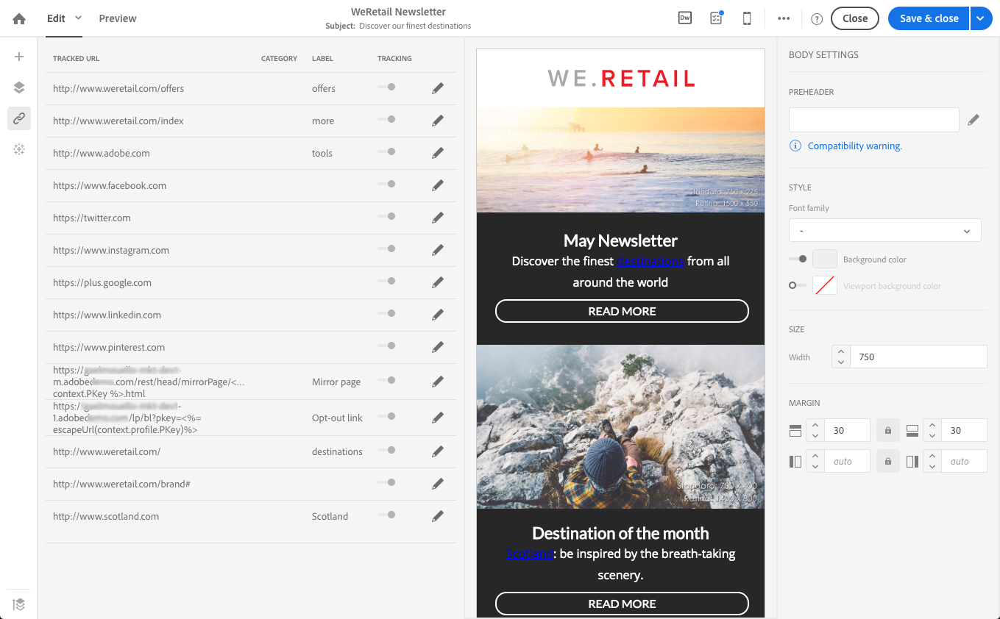
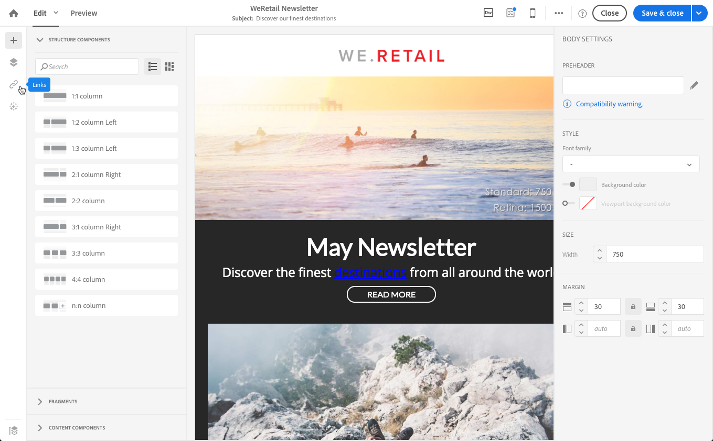

# Lägga till länkar {#links}

## Infoga en länk {#inserting-a-link}

Med redigeraren kan du anpassa en e-post- eller landningssida genom att infoga länkar i HTML-innehållselementen.

Du kan infoga en länk i valfritt sidelement: bild, ord, ordgrupp, textblock osv.

>[!NOTE]
>
>Bilderna nedan visar hur du infogar en länk med [e-postdesignern](../../designing/using/designing-content-in-adobe-campaign.md) i ett e-postmeddelande.

1. Markera ett element och klicka på **[!UICONTROL Insert link]** i det sammanhangsberoende verktygsfältet.

   

1. Välj den typ av länk som du vill skapa:

   * **Extern länk**: infoga en länk till en extern URL.

      Du kan definiera personalisering för dina URL-adresser. Se [Anpassa URL:er](../../designing/using/using-reusable-content.md#creating-a-content-fragment).

   * **Landningssida**: ge tillgång till en Adobe Campaign landningssida.
   * **Prenumerationslänk**: infoga en länk för att prenumerera på en Adobe Campaign-tjänst.
   * **Länk** för avprenumeration: infoga en länk för att avbeställa en Adobe Campaign-tjänst.
   * **Länk som definierar en åtgärd**: Definiera en åtgärd när någon klickar på ett element på landningssidan.

      >[!NOTE]
      >
      >Den här typen av länk är bara tillgänglig för landningssidor.

1. Du kan ändra texten som visas för mottagaren.
1. Du kan ange webbläsarbeteende när användaren klickar på länken (till exempel öppna ett nytt fönster).

   >[!NOTE]
   >
   >När du definierar webbläsarbeteendet gäller det bara landningssidor.

1. Spara ändringarna.

När länken har skapats kan du fortfarande ändra den i inställningspanelen. Klicka på pennikonen för att redigera dess parametrar.

När du redigerar ett e-postmeddelande med [e-postdesignern](../../designing/using/designing-content-in-adobe-campaign.md) kan du enkelt komma åt och ändra länkarna som du skapade från tabellen med alla URL:er som finns i e-postmeddelandet. Med den här listan kan du ha en centraliserad vy och hitta varje URL i e-postinnehållet. Mer information finns i [Om spårade URL:er](#about-tracked-urls).

>[!NOTE]
>
>Det går inte att ändra anpassade URL-adresser som **Spegelsidans URL** eller **Bryt prenumeration**-länkar från den här listan. Alla andra länkar kan redigeras.

**Relaterade ämnen**:

* [Infoga ett personaliserat fält](../../designing/using/personalization.md#inserting-a-personalization-field)
* [Lägga till innehållsblock](../../designing/using/personalization.md#adding-a-content-block)
* [Definiera dynamiskt innehåll](../../designing/using/personalization.md#defining-dynamic-content-in-an-email)

## Om spårade URL:er {#about-tracked-urls}

Med Adobe Campaign kan du spåra mottagarnas beteende när de klickar på en URL som ingår i ett e-postmeddelande. Se [det här avsnittet](../../sending/using/tracking-messages.md#about-tracking) för mer om spårning.

Ikonen **[!UICONTROL Links]** i åtgärdsfältet visar automatiskt listan över alla URL:er för ditt innehåll som ska spåras.

>[!NOTE]
>
>Spårning är aktiverat som standard. Den här funktionen är bara tillgänglig för e-postmeddelanden om spårning har aktiverats i Adobe Campaign. Mer information om spårningsparametrar finns i [det här avsnittet](../../administration/using/configuring-email-channel.md#tracking-parameters).

URL, kategori, etikett och spårningstyp för varje länk kan ändras i den här listan. Om du vill redigera en länk klickar du på motsvarande pennikon.

För varje spårad URL-adress kan du ange spårningsläget till något av följande värden:

* **Spårat**: aktiverar spårning på den här URL:en.
* **Spegelsida**: anser att denna URL är en URL för en speglad sida.
* **Aldrig**: aktiverar aldrig spårning av den här URL:en. Den här informationen sparas: Om URL:en visas igen i ett framtida meddelande inaktiveras spårningen automatiskt.
* **Avanmäl dig**: hanterar denna URL som en avanmälnings- eller avanmälnings-URL.

Du kan även inaktivera eller aktivera spårning för varje URL.

>[!NOTE]
>
>Som standard spåras alla innehålls-URL:er i Adobe Campaign, förutom **Spegelsidans URL** och **Avbeställ**-länken.

Du kan gruppera om dina URL-adresser genom att redigera fältet **[!UICONTROL Category]**, beroende på vilka URL-adresser som används i meddelandet. Dessa kategorier kan visas som i [URL:er och klicka på strömmar](../../reporting/using/urls-and-click-streams.md).

När du skapar en rapport väljer du **[!UICONTROL Dimension]** på fliken **[!UICONTROL Components]** och rullar nedåt i listan för att komma åt spårningskomponenterna. Du kan till exempel dra och släppa **[!UICONTROL Tracking URL Category]** på arbetsytan för att visa resultat enligt spårningskategorin för varje klickad URL.

Mer information om hur du skapar anpassade rapporter finns i [det här avsnittet](../../reporting/using/about-dynamic-reports.md).
