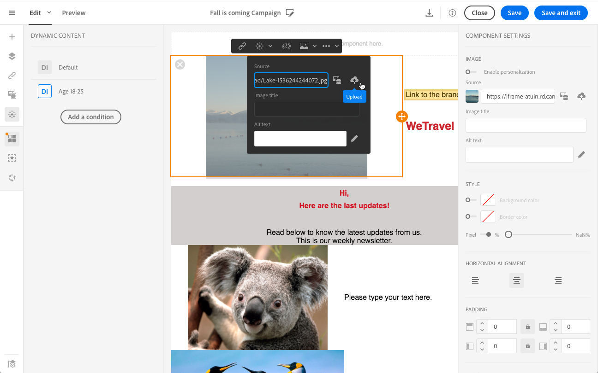

# Anpassa e-postinnehåll {#personalization}

Innehållet i och visningen av meddelanden från Adobe Campaign kan personaliseras på flera olika sätt. Dessa sätt kan kombineras enligt villkor beroende på profilerna. I allmänhet kan du med Adobe Campaign:

* Infoga dynamiska personaliseringsfält. Se [Infoga ett personaliserat fält](#inserting-a-personalization-field).
* Infoga fördefinierade personaliseringsblock. Se [Lägg till ett innehållsblock](#adding-a-content-block).
* Anpassa avsändaren av ett e-postmeddelande. Se [Anpassa avsändaren](#personalizing-the-sender).
* Anpassa ämnet för ett e-postmeddelande. Se [Anpassa ämnesraden i ett e-postmeddelande](../../designing/using/subject-line.md#subject-line).
* Skapa villkorsstyrt innehåll. Se [Definiera dynamiskt innehåll i ett e-postmeddelande](#defining-dynamic-content-in-an-email).

## Avsändaren {#personalizing-the-sender} anpassas

Om du vill definiera namnet på avsändaren som ska visas i huvudet för skickade meddelanden går du till fliken **[!UICONTROL Properties]** på e-postdesignerns hemsida (nås via hemikonen). Mer information finns i [Definiera avsändaren av ett e-postmeddelande](../../designing/using/subject-line.md#email-sender).

Du kan ändra avsändarens namn genom att klicka på **avsändarens namn**-blocket. Fältet kan sedan redigeras och du kan ange det namn du vill använda.

Det här fältet kan anpassas. Om du vill göra det kan du lägga till anpassningsfält, innehållsblock och dynamiskt innehåll genom att klicka på ikonerna under avsändarens namn.

>[!NOTE]
>
>Huvudparametrarna får inte vara tomma. Avsändarens adress är obligatorisk för att tillåta att ett e-postmeddelande skickas (RFC-standard). Adobe Campaign kontrollerar syntaxen för de e-postadresser som anges.

## Anpassa URL:er{#personalizing-urls}

Med Adobe Campaign kan du anpassa en eller flera URL-adresser i meddelandet genom att lägga till fält för anpassning, innehållsblock eller dynamiskt innehåll. Så här gör du:

1. Infoga en extern URL och ange dess parametrar. Se [Infoga en länk](../../designing/using/links.md#inserting-a-link).
1. Om den inte visas klickar du på pennan bredvid den valda URL:en i inställningspanelen för att få tillgång till anpassningsalternativen.
1. Lägg till de anpassningsfält, innehållsblock och dynamiskt innehåll som du vill använda.

   

1. Spara ändringarna.

>[!NOTE]
>
>Det går inte att anpassa URL:er till domännamnet eller till URL-tillägget. Ett felmeddelande visas under meddelandeanalys om personaliseringen är felaktig. När du markerar ett innehållsblock kan du inte markera element som **Länka till spegelsida**. Den här typen av block tillåts inte inuti en länk.

## Infoga ett personaliserat fält{#inserting-a-personalization-field}

Med Adobe Campaign kan du infoga ett fält från databasen på sidan, t.ex. profilens förnamn.

>[!NOTE]
>
>Bilderna nedan visar hur du infogar ett anpassningsfält med [e-postdesignern](../../designing/using/designing-content-in-adobe-campaign.md) för ett e-postmeddelande.

Så här lägger du till ett anpassningsfält i innehållet:

1. Klicka inuti ett textblock, klicka på ikonen **[!UICONTROL Personalize]** i det sammanhangsberoende verktygsfältet och välj **[!UICONTROL Insert personalization field]**. Mer information om gränssnittet för e-postdesignern finns i [det här avsnittet](../../designing/using/designing-content-in-adobe-campaign.md#email-designer-interface).

   

1. Markera det fält som du vill infoga i sidinnehållet.

   

1. Klicka på **[!UICONTROL Confirm]**.

Fältnamnet visas i redigeraren och markeras.

När personaliseringen har genererats (när du till exempel förhandsgranskar och förbereder e-postmeddelandet) ersätts det här fältet av värdet som motsvarar målprofilen.

>[!NOTE]
>
>Om e-postmeddelandet skapas från ett arbetsflöde är de ytterligare data som beräknas i arbetsflödet även tillgängliga i anpassningsfälten. Mer information om hur du lägger till ytterligare data från ett arbetsflöde finns i avsnittet [Förbättra data](../../automating/using/about-targeting-activities.md#enriching-data).

## Lägga till ett innehållsblock{#adding-a-content-block}

Adobe Campaign erbjuder en lista med förkonfigurerade innehållsblock. Dessa innehållsblock är dynamiska, personaliserade och har en specifik rendering. Du kan till exempel lägga till en hälsning eller en länk till spegelsidan.

>[!NOTE]
>
>Bilderna nedan visar hur du infogar ett innehållsblock med [e-postdesignern](../../designing/using/designing-content-in-adobe-campaign.md) för ett e-postmeddelande.

Så här lägger du till ett innehållsblock:

1. Klicka inuti ett textblock, klicka på ikonen **[!UICONTROL Personalize]** i det sammanhangsberoende verktygsfältet och välj **[!UICONTROL Insert content block]**. Mer information om gränssnittet för e-postdesignern finns i [det här avsnittet](../../designing/using/designing-content-in-adobe-campaign.md#email-designer-interface).

   

1. Markera det innehållsblock som du vill infoga. Vilka block som är tillgängliga varierar beroende på sammanhanget (e-post eller landningssida).

   

1. Klicka på **[!UICONTROL Save]**.

Namnet på innehållsblocket visas i redigeraren och markeras med gult. Den anpassar sig automatiskt till profilen när personaliseringen skapas.

De färdiga innehållsblocken är:

* **[!UICONTROL Database URL in emails (EmailUrlBase)]**: Det här innehållsblocket kan bara användas i en  **leverans**.
* **[!UICONTROL Mirror page URL (MirrorPageUrl)]**: Det här innehållsblocket kan bara användas i en  **leverans**.
* **[!UICONTROL Link to mirror page (MirrorPage)]**: Det här innehållsblocket kan bara användas i en  **leverans**.
* **[!UICONTROL Greetings (Greetings)]**
* **[!UICONTROL Unsubscription link (UnsubscriptionLink)]**: Det här innehållsblocket kan bara användas i en  **leverans**.
* **[!UICONTROL Social network sharing links (LandingPageViralLinks)]**: Det här innehållsblocket kan bara användas på en  **landningssida**.
* **[!UICONTROL Default sender name (DefaultSenderName)]**: Det här innehållsblocket kan bara användas i en  **leverans**.
* **[!UICONTROL Name of default reply-to email address (DefaultReplyName)]**: Det här innehållsblocket kan bara användas i en  **leverans**.
* **[!UICONTROL Email address of default sender (DefaultSenderAddress)]**: Det här innehållsblocket kan bara användas i en  **leverans**.
* **[!UICONTROL Default error email address (DefaultErrorAddress)]**: Det här innehållsblocket kan bara användas i en  **leverans**.
* **[!UICONTROL Default reply-to email address (DefaultReplyAddress)]**: Det här innehållsblocket kan bara användas i en  **leverans**.
* **[!UICONTROL Brand name (BrandingUsualName)]**
* **[!UICONTROL Link to the brand website (BrandingWebSiteLink)]**
* **[!UICONTROL Brand logo (BrandingLogo)]**
* **[!UICONTROL Notification style (notificationStyle)]**

### Skapa anpassade innehållsblock {#creating-custom-content-blocks}

Du kan definiera nya innehållsblock som ska infogas på en meddelande- eller landningssida.

Så här skapar du ett innehållsblock:

1. Klicka på **[!UICONTROL Resources > Content blocks]** på den avancerade menyn för att komma åt listan med innehållsblock.
1. Klicka på knappen **[!UICONTROL Create]** eller duplicera ett befintligt innehållsblock.

   

1. Ange en etikett.
1. Markera blockets **[!UICONTROL Content type]**. Det finns tre alternativ:

   * **[!UICONTROL Shared]**: Innehållsblocket kan användas på en leverans- eller landningssida.
   * **[!UICONTROL Delivery]**: Innehållsblocket kan bara användas i en leverans.
   * **[!UICONTROL Landing page]**: Innehållsblocket kan bara användas på en landningssida.

   

1. Du kan välja en **[!UICONTROL Targeting dimension]**. Mer information finns i [Om måldimension](#about-targeting-dimension).

   

1. Du kan välja alternativet **[!UICONTROL Depends on format]** för att definiera två olika block: en för HTML-e-post och en för e-post i textformat. Då visas två flikar i redigeraren (HTML och Text) för att definiera motsvarande innehåll.

   

1. Ange innehållet i innehållsblocken och klicka på knappen **[!UICONTROL Create]**.

Ditt innehållsblock kan nu användas i innehållsredigeraren för ett meddelande eller en landningssida.

>[!CAUTION]
>
>När du redigerar innehållet i ett block ska du kontrollera att det inte finns några extra tomrum mellan början och slutet av *if*-programsatserna. I HTML visas tomrummen på skärmen och påverkar därför innehållslayouten.

### Om måldimension {#about-targeting-dimension}

Med måldimensionen kan du definiera i vilken typ av meddelande som du kan använda innehållsblocket. Detta för att förhindra att olämpliga block används i ett meddelande, vilket kan leda till fel.

När du redigerar ett meddelande kan du bara markera innehållsblock med en måldimension som är kompatibel med det meddelandets måldimension.

Måldimensionen för **[!UICONTROL Unsubscription link]**-blocket är till exempel **[!UICONTROL Profiles]** eftersom det innehåller anpassningsfält som är specifika för **[!UICONTROL Profiles]**-resursen. Du kan därför inte använda ett **[!UICONTROL Unsubscription link]**-block i ett [händelsetransmeddelande](../../channels/using/getting-started-with-transactional-msg.md#transactional-message-types) eftersom måldimensionen för den typen av meddelande är **[!UICONTROL Real-time events]**. Du kan dock använda **Unsubscription link**-blocket i ett [profiltransaktionsmeddelande](../../channels/using/getting-started-with-transactional-msg.md#transactional-message-types) eftersom måldimensionen för den typen av meddelande är **Profiler**. Slutligen har **[!UICONTROL Link to mirror page]**-blocket ingen måldimension, så du kan använda det i alla meddelanden.

Om du lämnar det här fältet tomt kommer innehållsblocket att vara kompatibelt med alla meddelanden, oavsett vilken måldimension du har. Om du anger en målinriktningsdimension kommer det blocket endast att vara kompatibelt med meddelanden som har samma målinriktningsdimension.

Mer information om detta hittar du i [Målinställningar och resurser](../../automating/using/query.md#targeting-dimensions-and-resources).

**Relaterade ämnen:**

* [Infoga ett personaliserat fält](#inserting-a-personalization-field)
* [Lägga till ett innehållsblock](#adding-a-content-block)
* [Definiera dynamiskt innehåll i ett e-postmeddelande](#defining-dynamic-content-in-an-email)

## Anpassa en bildkälla{#personalizing-an-image-source}

Med Adobe Campaign kan du anpassa en eller flera bilder i meddelandet efter ett visst kriterium eller använda spårning. Detta görs genom att infoga anpassningsfält, innehållsblock eller dynamiskt innehåll i bildkällan. Så här gör du:

1. Infoga en bild i innehållet i meddelandet eller markera en bild som redan finns.
1. Markera alternativet **[!UICONTROL Enable personalization]** på paletten Bildegenskaper.

   

   Fältet **[!UICONTROL Source]** visas och den valda bilden visas som **anpassad** i redigeraren.

1. Klicka på pennan bredvid fältknappen **[!UICONTROL Source]** för att komma åt anpassningsalternativen.
1. När du har lagt till bildkällan lägger du till anpassningsfält, innehållsblock och dynamiskt innehåll som du gillar.

   

   >[!NOTE]
   >
   >Domännamnet (http://mydomain.com) kan inte anpassas, det måste anges manuellt. Resten av URL-adressen kan personaliseras. Till exempel: http://mydomain.com/ `[Gender]` .jpg

1. Bekräfta ändringarna.

## Villkorligt innehåll {#conditional-content}

### Definiera ett synlighetsvillkor{#defining-a-visibility-condition}

Du kan ange ett synlighetsvillkor för alla element. Den syns bara om villkoret uppfylls.

Om du vill lägga till ett synlighetsvillkor markerar du ett block och anger det villkor som ska respekteras i fältet **[!UICONTROL Visibility condition]** i inställningarna för det.

Det här alternativet är bara tillgängligt för följande element: ADRESS, BLOCKQUOTE, CENTER, DIR, DIV, DL, FIELDSET, FORM, H1, H2, H3, H4, H5, H6, NOSCRIPT, OL, P, PRE, UL, TR, TD.

Uttrycksredigeraren visas i avsnittet [Avancerad uttrycksredigering](../../automating/using/editing-queries.md#about-query-editor).

De här villkoren använder XTK-uttryckssyntaxen (t.ex. **context.profile.email !=&#39;** eller **context.profile.status=&#39;0&#39;**). Som standard är alla fält synliga.

>[!NOTE]
>
>Ett villkor kan inte definieras för ett block som redan innehåller ett underelement med ett dynamiskt innehåll eller ett block som redan innehåller ett dynamiskt innehåll. Det går inte att redigera icke-synliga dynamiska block som nedrullningsbara listor.

### Definiera dynamiskt innehåll i ett e-postmeddelande{#defining-dynamic-content-in-an-email}

>[!CONTEXTUALHELP]
>id="ac_dynamic_content"
>title="Definiera dynamiskt innehåll"
>abstract="Definiera olika innehåll som bara ska visas för vissa profiler enligt villkor som du definierar."

I ett e-postmeddelande kan du definiera olika innehåll som ska visas dynamiskt för mottagarna enligt villkoren som definieras via uttrycksredigeraren. Från samma e-postadress kan du till exempel se till att varje profil får olika meddelanden beroende på åldersintervall.

Att definiera dynamiskt innehåll skiljer sig från [att definiera synlighetsvillkor](#defining-a-visibility-condition).

1. Markera ett fragment, en komponent eller ett element. I det här exemplet väljer du en bild.
1. Klicka på ikonen **[!UICONTROL Dynamic content]** i det sammanhangsberoende verktygsfältet.

   

   Avsnittet **[!UICONTROL Dynamic content]** visas på paletten till vänster.

   

   Det här avsnittet innehåller som standard två element: standardvarianten och en ny variant.

   >[!NOTE]
   >
   >Innehållet måste alltid ha en standardvariant. Du kan inte ta bort den.

1. Klicka på knappen **[!UICONTROL Edit]** för att definiera visningsvillkoren för den första alternativa varianten.

   

1. Ange en etikett och markera de fält som du vill ange som villkor. I noden **[!UICONTROL General]** väljer du till exempel fältet **[!UICONTROL Age]**

   

1. Ange filtervillkoren. Du vill till exempel att ett annat innehåll ska visas för personer mellan 18 och 25 år.

   

1. När alla villkor är angivna definierar du prioritetsordningen som villkoret ska tillämpas i och sparar ändringarna.

   

   Innehållet visas i prioritetsordning uppifrån och ned på paletten. Mer information om prioriteringar finns i [det här avsnittet](#defining-dynamic-content-in-an-email).

1. Ladda upp en ny bild för den variant du just definierade.

   

   Mottagarna mellan 18 och 25 år kommer att se den nya bilden.

   

1. Klicka på **[!UICONTROL Add a condition]** om du vill lägga till ett nytt innehåll och dess länkade regel.

   

   Du kan till exempel lägga till en annan bild som ska visas för personer mellan 26 och 35 år.

1. Fortsätt på samma sätt för andra element i e-postmeddelandet som du vill ska visas dynamiskt. Det kan vara text, knapp, fragment osv. Spara ändringarna.

>[!CAUTION]
>
>När du har förberett meddelandet och innan du skickar det testar du det med ett korrektur. Om du inte gör det här kanske vissa fel inte identifieras och e-postmeddelandet kanske inte skickas.

**Relaterade ämnen:**

* [Skicka korrektur](../../sending/using/sending-proofs.md)
* [Avancerad redigering av uttryck](../../automating/using/editing-queries.md#about-query-editor)

### Prioritetsordning {#order-of-priority}

När du definierar ett dynamiskt innehåll i uttrycksredigeraren är prioritetsordningen följande.

1. Du definierar två olika dynamiska innehåll med **två olika villkor**, till exempel:

   **Villkor 1:** Profilens kön är maskuline.

   **Villkor 2:** profilen är mellan 20 och 30 år gammal.

   

   Vissa profiler i databasen motsvarar de två villkoren, men det går bara att skicka ett e-postmeddelande med ett dynamiskt innehåll.

1. Därför måste du definiera prioriteten för det dynamiska innehållet. Ett villkor med prioritetsordningen **1** (och därför det motsvarande dynamiska innehållet) skickas till en profil även om ett annat villkor med prioritetsordningen **2** eller **3** också uppfylls av den här profilen.

   

Du kan bara definiera en prioritetsordning per dynamiskt innehåll.

## Exempel: E-postanpassning{#example-email-personalization}

I det här exemplet har en medlem i marknadsföringsteamet skapat ett e-postmeddelande som informerar några av hans kunder om att det finns ett specialerbjudande som är specifikt för dem. Teammedlemmen bestämde sig för att anpassa e-postmeddelandet efter kundens respektive ålder. Kunder mellan 18 och 27 år får ett mejl med en annan bild och slogan än de som kunder över 27 kommer att få.

E-postmeddelandet skapas enligt följande:

* Dynamiskt innehåll används på bilden och det dynamiska innehållet konfigureras enligt åldersintervall.

   

   Det finns information om hur du lägger till och konfigurerar dynamiskt innehåll i avsnittet [Definiera dynamiskt innehåll i ett e-postmeddelande](#defining-dynamic-content-in-an-email).

* Anpassningsfält och dynamiskt innehåll används på texten. Beroende på profilens åldersintervall börjar e-postmeddelandet med antingen profilens förnamn eller profilens titel och efternamn.

   

   Tillägg och konfigurering av anpassningsfälten finns i avsnittet [Infoga ett anpassningsfält](#inserting-a-personalization-field).

### Konfigurerar bilder {#configuring-images}

>[!CONTEXTUALHELP]
>id="ac_dynamic_image"
>title="Hantera dynamiska bilder"
>abstract="Anpassa e-postmeddelandet med dynamiska bilder enligt villkor som du definierar."

I det här exemplet konfigureras det dynamiska innehållet som används på bilderna enligt följande:

**För 18-27 år gamla:**

1. Markera det dynamiska innehållet på paletten **[!UICONTROL Properties]** och klicka på knappen **[!UICONTROL Edit]**.

   

1. Redigera etiketten och välj sedan fältet **[!UICONTROL Age]** från noden **[!UICONTROL Profile]**.

   

1. Välj operatorn **Större än eller lika med** och ange sedan **18** för att skapa uttrycket **äldre än 18**.

   

1. Lägg till ett nytt **[!UICONTROL Age]**-villkor.

   Välj operatorn **mindre än eller lika med** följt av 27 i värdefältet för att skapa uttrycket **yngre än 27**.

   

1. Bekräfta ändringarna.

**Så här målprofiler från 27 år och uppåt:**

1. Markera det dynamiska innehållet på paletten och redigera det.
1. Redigera etiketten och välj sedan fältet **[!UICONTROL Age]** från noden **[!UICONTROL Profile]**.
1. Lägg till operatorn **Större än** följt av 27 i värdefältet för att skapa uttrycket **äldre än 27**.

   

1. Bekräfta ändringarna.

Ditt dynamiska innehåll är korrekt konfigurerat.

### Konfigurera text {#configuring-text}

I det här exemplet konfigureras det dynamiska innehållet som tillämpas på texterna enligt följande:

**Om du vill ha målprofiler mellan 18 och 27:**

1. Markera den strukturkomponent som du vill ha och lägg till ett dynamiskt innehåll.
1. Redigera det dynamiska innehållet och konfigurera måluttrycken. Se [Konfigurera bilder](#configuring-images).
1. I strukturkomponenten klickar du på ikonen **[!UICONTROL Personalize]** i det sammanhangsberoende verktygsfältet vid önskad position och väljer **[!UICONTROL Insert personalization field]**.

   

1. Markera fältet **[!UICONTROL First name]** i listan som visas och bekräfta.

   

1. Ditt anpassningsfält infogas sedan perfekt i det valda dynamiska innehållet.

**Så här målprofiler från 27 år och uppåt:**

1. Markera den strukturkomponent som du vill ha och lägg till ett dynamiskt innehåll.
1. Redigera det dynamiska innehållet och konfigurera måluttrycken. Se [Konfigurera bilder](#configuring-images).
1. I strukturkomponenten klickar du på ikonen **[!UICONTROL Personalize]** i det sammanhangsberoende verktygsfältet vid önskad position och väljer **[!UICONTROL Insert personalization field]**.
1. Välj **[!UICONTROL Title]** i listrutan.
1. Fortsätt på samma sätt om du vill lägga till fältet **[!UICONTROL Last name]**.

   

Dina anpassningsfält bör nu infogas perfekt i det valda dynamiska innehållet.

### Förhandsgranska e-postmeddelanden {#previewing-emails}

Med Förhandsgranskning kan du kontrollera att personaliseringsfälten och det dynamiska innehållet är korrekt konfigurerade innan du skickar **[!UICONTROL Proofs]**. Under förhandsgranskningen kan du välja olika testprofiler som motsvarar e-postmålen.

Utan testprofiler är e-postadressen som visas som standard:

E-postmeddelandet har inga anpassningsfält i slogan och standardbilden används.

Den första testprofilen motsvarar en klient mellan 18 och 27 år. När du väljer den här profilen visas följande e-postmeddelande:

Det anpassningsfält som motsvarar det 18-27-åriga uttrycket, särskilt profilens förnamn, är korrekt konfigurerat och bilden har också ändrats enligt profilen.

Den andra profilen motsvarar en klient över 27 år och genererar följande e-post:

Bilden har ändrats tack vare det dynamiska innehållet, och sloganen som visas är den mer formella slogan som definierats för den här målallmänheten.

**Relaterade ämnen:**

* [Skapa målgrupper](../../audiences/using/creating-audiences.md)
* [Förbered sändningen](../../sending/using/preparing-the-send.md)

