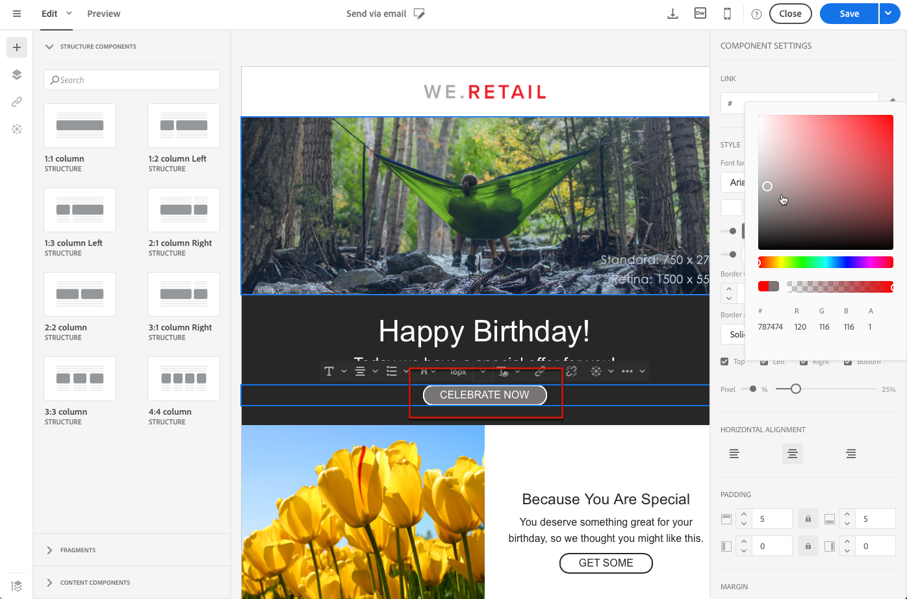

# Redigera oformaterad text, HTML och e-postformat för mobiler {#plain-text-and-html-modes}

Med e-postdesignern kan du redigera flera återgivningar av dina e-postmeddelanden. Du kan generera en textversion av ditt e-postmeddelande, redigera HTML-källan för ett e-postmeddelande och utforma e-postmeddelanden för mobilvyn.

## Generera en textversion av e-postmeddelandet {#generating-a-text-version-of-the-email}

Som standard är **[!UICONTROL Plain text]** versionen av e-postmeddelandet genereras och synkroniseras automatiskt med **[!UICONTROL Edit]** version.

Anpassningsfält och innehållsblock som läggs till i HTML-versionen synkroniseras också med den vanliga textversionen.

>[!NOTE]
>
>Om du vill använda innehållsblock i oformaterad text måste de inte innehålla HTML-kod.

Om du vill ha en annan oformaterad textversion än HTML kan du inaktivera synkroniseringen genom att klicka på **[!UICONTROL Sync with HTML]** växla från **[!UICONTROL Plain text]** visning av din e-post.

Du kan sedan redigera den oformaterade textversionen efter behov.

>[!NOTE]
>
>Om du redigerar **[!UICONTROL Plain text]** version när synkronisering är inaktiverad, nästa gång du aktiverar **[!UICONTROL Sync with HTML]** så ersätts alla ändringar du har gjort i den oformaterade textversionen med HTML. Ändringarna i **[!UICONTROL Plain text]** vyn inte kan återspeglas i **[!UICONTROL HTML]** vy.

## Redigera en e-postinnehållskälla i HTML {#editing-an-email-content-source-in-html}

För de mest avancerade användarna och felsökningsfunktionerna kan du visa och redigera e-postinnehållet direkt i HTML.

Du kan redigera e-postmeddelandets HTML-version på två sätt:

* Välj **[!UICONTROL Edit]** > **[!UICONTROL HTML]** för att öppna HTML-versionen av hela e-postmeddelandet.

   

* I WYSIWYG-gränssnittet väljer du ett element och klickar på **[!UICONTROL Source code]** ikon.

   Endast det markerade elementets källa visas. Du kan redigera källkoden om det markerade elementet är ett **[!UICONTROL HTML]** innehållskomponent. Andra komponenter är skrivskyddade, men kan fortfarande redigeras i den fullständiga HTML-versionen av e-postmeddelandet.

   

Om du ändrar koden HTML kan svarstiden för e-postmeddelandet bli bruten. Se till att testa den med **[!UICONTROL Preview]** -knappen. Se [Förhandsvisa meddelanden](../../sending/using/previewing-messages.md).

## Designa e-postmeddelanden för mobilrendering {#switching-to-mobile-view}

Du kan finjustera den responsiva designen för ett e-postmeddelande genom att redigera alla formatalternativ separat för mobilvisning. Du kan till exempel anpassa marginaler och utfyllnad, använda mindre eller större teckensnittsstorlekar, ändra knappar eller använda olika bakgrundsfärger som är specifika för den mobila versionen av e-postmeddelandet.

Alla formatalternativ är tillgängliga i mobilvyn. Formatinställningarna för e-postdesignern visas tidigare på den här sidan.

1. Skapa ett e-postmeddelande och börja redigera innehållet. Mer information finns i [Designa ett e-postinnehåll från grunden](../../designing/using/designing-from-scratch.md#designing-an-email-content-from-scratch).
1. Om du vill komma åt den dedikerade mobilvyn väljer du **[!UICONTROL Switch to mobile view]** -knappen.

   

   Mobilversionen av e-postmeddelandet visas. Den innehåller alla komponenter och format som har definierats i skrivbordsvyn.

1. Redigera oberoende av varandra alla formatinställningar som bakgrundsfärg, justering, utfyllnad, marginal, teckensnittsfamilj, textfärg och så vidare.

   

1. När du redigerar en formatinställning i mobilvyn används ändringarna bara på den mobila visningen.

   Du kan till exempel minska storleken på en bild, lägga till en grön bakgrund och ändra utfyllnaden i mobilvyn.

   

1. Du kan dölja en komponent när den visas på en mobil enhet. Välj **[!UICONTROL Show only on desktop devices]** från **[!UICONTROL Display options]**.

   Du kan också välja att dölja den här komponenten på skrivbordsenheter, vilket innebär att den bara visas på mobila enheter. Välj **[!UICONTROL Show only on mobile devices]**.

   Med det här alternativet kan du till exempel visa en viss bild på mobila enheter och en annan bild på stationära enheter.

   Du kan antingen ange det här alternativet i mobil- eller skrivbordsvyn.

   

1. Klicka igen **[!UICONTROL Switch to mobile view]** om du vill gå tillbaka till standardskrivbordsvyn. De formatändringar du just gjorde återspeglas inte.

   

   >[!NOTE]
   >
   >Det enda undantaget är **[!UICONTROL Style inline]** inställningar. Alla ändringar av textbundna inställningar för format används även i standardskrivbordsvyn.

1. Andra ändringar av strukturen eller innehållet i e-postmeddelandet, som textredigeringar, överföring av en ny bild, tillägg av en ny komponent osv. används även i standardvyn.

   Du kan till exempel växla tillbaka till mobilvyn, redigera text och ersätta en bild.

   

1. Klicka igen **[!UICONTROL Switch to mobile view]** om du vill gå tillbaka till standardskrivbordsvyn. Ändringarna återspeglas.

   

1. När du tar bort ett format i mobilvyn återgår du till det format som användes i skrivbordsläget.

   I mobilvyn kan du till exempel använda en grön bakgrundsfärg på en knapp.

   

1. Växla till skrivbordsvyn och använd en grå bakgrund på samma knapp.

   

1. Växla igen till mobilvyn och inaktivera nu **[!UICONTROL Background color]** inställning.

   

   Bakgrundsfärgen som definieras i skrivbordsvyn används nu: den blir grå (inte tom).

   Det enda undantaget är **[!UICONTROL Border color]** inställning. När det är inaktiverat i mobilvyn används ingen kantlinje längre, även om en kantfärg har definierats i skrivbordsvyn.

>[!NOTE]
>
>Mobilvyn är inte tillgänglig i [fragment](../../designing/using/using-reusable-content.md#about-fragments).
