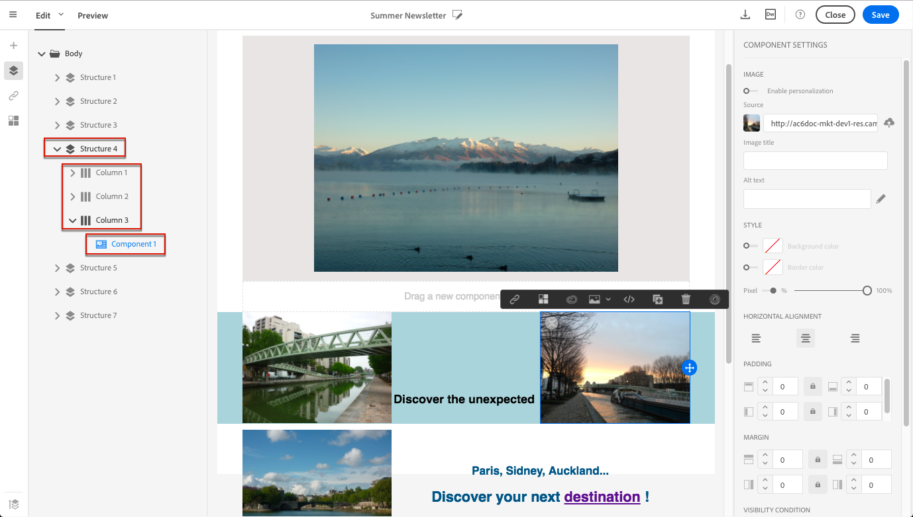

# Hantera e-postformat {#managing-styles}

När du markerar ett element i e-post-Designer visas flera alternativ som är specifika för den valda innehållstypen i rutan **[!UICONTROL Settings]**. Du kan använda de här alternativen för att enkelt ändra formatet på din e-post.

## Markera ett element {#selecting-an-element}

Om du vill välja ett element i e-post-Designer-gränssnittet kan du antingen:

* klicka direkt i e-postmeddelandet
* eller bläddra bland strukturträdet som finns bland alternativen i den vänstra **paletten**.

Genom att bläddra i strukturträdet kan du göra en mer exakt markering. Du kan välja något av följande:

* hela strukturkomponenten,
* en av kolumnerna som utgör strukturkomponenten,
* eller bara en komponent som finns inuti en kolumn.

Om du vill markera en kolumn kan du även göra följande:

1. Välj en strukturkomponent (direkt i e-postmeddelandet eller med strukturträdet som är tillgängligt från den vänstra **paletten**).
1. Klicka på **[!UICONTROL Select a column]** i det **sammanhangsberoende verktygsfältet** för att välja önskad kolumn.

Se ett exempel i [det här avsnittet](#example--adjusting-vertical-alignment-and-padding).

## Justera formatinställningar {#adjusting-style-settings}

1. Markera ett element i e-postmeddelandet. Mer information finns i [Markera ett element](#selecting-an-element).
1. Justera inställningarna efter dina behov. För varje markerat element finns olika inställningar.

   Du kan infoga bakgrunder, ändra storlek, ändra vågrät eller lodrät justering, hantera färger, lägga till [utfyllnad eller marginal](#selecting-an-element) och så vidare.

   Det gör du genom att använda alternativen som visas i rutan **[!UICONTROL Settings]** eller [lägga till textbundna formatattribut](#adding-inline-styling-attributes).

   

1. Spara innehållet.

## Justera utfyllnad och marginal {#about-padding-and-margin}

I e-postgränssnittet i Designer kan du snabbt justera utfyllnads- och marginalinställningar.

**[!UICONTROL Padding]**: Med den här inställningen kan du hantera utrymmet som finns inuti ett elements kant.

Exempel:

* Använd utfyllnad för att ange marginaler till vänster och höger om en bild.
* Använd den övre och nedre utfyllnaden för att lägga till mer avstånd i en **[!UICONTROL Text]**- eller **[!UICONTROL Divider]**-komponent.
* Om du vill ange kantlinjer mellan kolumner inuti ett strukturelement definierar du utfyllnad för varje kolumn.

**[!UICONTROL Margin]**: Med den här inställningen kan du hantera mellanrummet mellan elementets kant och nästa element.

>[!NOTE]
>
>Beroende på vad du har valt (strukturkomponent, kolumn eller innehållskomponent) blir resultatet inte detsamma. Adobe rekommenderar att parametrarna **[!UICONTROL Padding]** och **[!UICONTROL Margin]** ställs in på kolumnnivå.

Klicka på låsikonen för både **[!UICONTROL Padding]** och **[!UICONTROL Margin]** om du vill bryta synkroniseringen mellan parametrarna längst upp, längst ned eller till höger och vänster. På så sätt kan du justera varje parameter separat.

## Formatjustering {#about-alignment}

* **Textjustering**: placera markören på en text och använd det sammanhangsberoende verktygsfältet för att justera den.

  

* **Vågrät justering** kan användas på text, bilder och knappar - för närvarande inte på komponenterna **[!UICONTROL Divider]** och **[!UICONTROL Social]**.

  

* Om du vill ange **lodrät justering** markerar du en kolumn inuti en strukturelement och väljer ett alternativ i inställningspanelen.

  

## Ange bakgrunder {#about-backgrounds}

>[!CONTEXTUALHELP]
>id="ac_edition_backgroundimage"
>title="Bakgrundsinställningar"
>abstract="Med e-post-Designer kan du anpassa bakgrundsfärg eller bakgrundsbild för ditt innehåll.Observera att bakgrundsbilden inte stöds av alla e-postklienter."

När det gäller att ange bakgrunder med e-post-Designer rekommenderar Adobe följande:

1. Använd en bakgrundsfärg på e-postmeddelandets brödtext om det behövs i designen.
1. I de flesta fall anger du bakgrundsfärger på kolumnnivå.
1. Försök att inte använda bakgrundsfärger i bild- eller textkomponenter eftersom de är svåra att hantera.

Nedan visas de tillgängliga bakgrundsinställningarna som du kan använda.

* Ange en **[!UICONTROL Background color]** för hela e-postmeddelandet. Se till att du väljer brödtextinställningarna i navigeringsträdet som du kommer åt från den vänstra paletten.

  

* Ange samma bakgrundsfärg för alla strukturkomponenter genom att välja **[!UICONTROL Viewport background color]**. Med det här alternativet kan du välja en annan inställning från bakgrundsfärgen.

  

* Ange olika bakgrundsfärger för varje strukturelement. Välj en struktur i navigeringsträdet som du kommer åt från den vänstra paletten om du bara vill använda en viss bakgrundsfärg på den strukturen.

  

  Se till att du inte anger någon bakgrundsfärg för visningsrutan eftersom den kan dölja strukturens bakgrundsfärger.

* Ange **[!UICONTROL Background image]** för innehållet i en strukturkomponent.

  

  >[!NOTE]
  >
  >Vissa e-postprogram stöder inte bakgrundsbilder. Om alternativet inte stöds används radens bakgrundsfärg i stället. Se till att du väljer en lämplig bakgrundsfärg om bilden inte kan visas.

* Ange en bakgrundsfärg på kolumnnivå.

  

  >[!NOTE]
  >
  >Detta är det vanligaste användningsfallet. Adobe rekommenderar att du ställer in bakgrundsfärger på kolumnnivå eftersom detta ger större flexibilitet när du redigerar hela e-postinnehållet.

  Du kan också ange en bakgrundsbild på kolumnnivå, men den används sällan.

### Exempel: justera lodrät justering och utfyllnad {#example--adjusting-vertical-alignment-and-padding}

Du vill justera utfyllnaden och den lodräta justeringen inuti en strukturkomponent som består av tre kolumner. Gör så här:

1. Markera strukturkomponenten direkt i e-postmeddelandet eller använd strukturträdet som finns i den vänstra **paletten**.
1. Klicka på **[!UICONTROL Select a column]** i det **sammanhangsberoende verktygsfältet** och välj det som du vill redigera. Du kan också välja det i strukturträdet.

   

   De redigerbara parametrarna för den kolumnen visas i rutan **[!UICONTROL Settings]** till höger.

1. Välj **[!UICONTROL Up]** under **[!UICONTROL Vertical alignment]**.

   

   Innehållskomponenten visas ovanpå kolumnen.

1. Ange den översta utfyllnaden i kolumnen under **[!UICONTROL Padding]**. Klicka på låsikonen om du vill bryta synkroniseringen med den nedre utfyllnaden.

   Definiera vänster och höger utfyllnad för den kolumnen.

   

1. Gör på samma sätt om du vill justera justeringen och utfyllnaden för de andra kolumnerna.

   

1. Spara ändringarna.

## Formatlänkar {#about-styling-links}

Du kan stryka under en länk och välja dess färg och mål i e-postens Designer.

1. I en komponent där en länk infogas, markerar du etikettexten för länken.

1. Markera **[!UICONTROL Underline link]** i komponentinställningarna för att stryka under etikettexten för länken.

   

1. Välj **[!UICONTROL Target]** om du vill välja i vilket webbläsarsammanhang länken ska öppnas.

   

1. Om du vill ändra färg på länken klickar du på **[!UICONTROL Link color]**.

   

1. Välj den färg du behöver.

   

1. Spara ändringarna.

## Lägga till textbundna formatattribut {#adding-inline-styling-attributes}

När du markerar ett element och visar inställningarna på sidopanelen i e-postgränssnittet i Designer kan du anpassa infogade attribut och deras värde för det specifika elementet.

1. Markera ett element i innehållet.
1. På sidopanelen letar du efter inställningarna för **[!UICONTROL Styles Inline]**.

   

1. Ändra värden för befintliga attribut eller lägg till nya med knappen **+**. Du kan lägga till alla attribut och värden som är CSS-kompatibla.

Formateringen används sedan på det markerade elementet. Om de underordnade elementen inte har några definierade formatattribut ärvs det överordnade elementets formatering.
