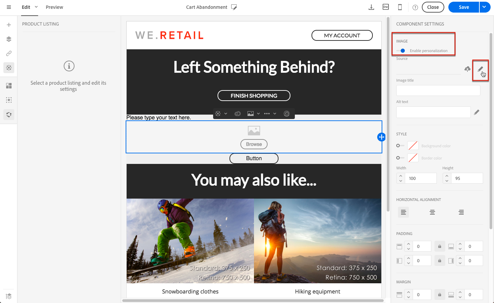

# Använda produktlistor i ett transaktionsmeddelande {#using-product-listings}

>[!IMPORTANT]
>
>Produktlistor är bara tillgängliga för **transaktionsmeddelanden** via gränssnittet [Email Designer](../../designing/using/designing-content-in-adobe-campaign.md#email-designer-interface).

När du redigerar innehållet i ett transaktionsmejl kan du skapa produktlistor som refererar till en eller flera datainsamlingar. I ett e-postmeddelande om att kunden överger en kundvagn kan du till exempel inkludera en lista över alla produkter som fanns i kundvagnen när de lämnade webbplatsen, med en bild, priset och en länk till varje produkt.

Följ stegen nedan om du vill lägga till en lista över övergivna produkter i ett transaktionsmeddelande.

Du kan också titta på [den här uppsättningen videor](https://experienceleague.adobe.com/docs/campaign-standard-learn/tutorials/designing-content/product-listings-in-transactional-email.html?lang=en#configure-product-listings-in-transactional-emails) som förklarar vilka steg som krävs för att konfigurera produktlistor i ett transaktionsmejl.

>[!NOTE]
>
>Adobe Campaign stöder inte kapslade produktlistor, vilket innebär att du inte kan inkludera en produktlista i en annan.

## Definiera en produktlista {#defining-a-product-listing}

Innan du kan använda en produktlista i ett transaktionsmeddelande måste du på händelsenivå definiera listan med produkter och fälten för varje produkt i listan som du vill visa. Mer information finns i [Definiera datasamlingar](../../channels/using/configuring-transactional-event.md#defining-data-collections).

1. Klicka på **[!UICONTROL Content]**-blocket i transaktionsmeddelandet om du vill ändra e-postinnehållet.
1. Dra och släpp en strukturkomponent på arbetsytan. Mer information finns i [Definiera e-poststrukturen](../../designing/using/designing-from-scratch.md#defining-the-email-structure).

   Markera till exempel en strukturkomponent med en kolumn och lägg till en textkomponent, en bildkomponent och en knappkomponent. Mer information finns i [Använda innehållskomponenter](../../designing/using/designing-from-scratch.md#about-content-components).

1. Markera den strukturkomponent som du nyss skapade och klicka på ikonen **[!UICONTROL Enable product listing]** i det sammanhangsberoende verktygsfältet.

   

   Strukturkomponenten är markerad med en orange ram och inställningarna visas på den vänstra paletten **[!UICONTROL Product listing]**.

   

1. Välj hur elementen i samlingen ska visas:

   * **[!UICONTROL Row]**: vågrätt, vilket innebär varje element på en rad under det andra.
   * **[!UICONTROL Column]**: lodrätt, vilket innebär att varje element ligger intill varandra på samma rad.

   >[!NOTE]
   >
   >Alternativet **[!UICONTROL Column]** är bara tillgängligt när du använder en strukturkomponent med flera kolumner (**[!UICONTROL 2:2 column]**, **[!UICONTROL 3:3 column]** och **[!UICONTROL 4:4 column]**). När du redigerar produktlistan ska du bara fylla i den första kolumnen: de övriga kolumnerna kommer inte att beaktas. Mer information om hur du väljer strukturkomponenter finns i [Definiera e-poststrukturen](../../designing/using/designing-from-scratch.md#defining-the-email-structure).

1. Välj den datainsamling du skapade när du konfigurerade händelsen som är relaterad till transaktionsmeddelandet. Du hittar den under noden **[!UICONTROL Context]** > **[!UICONTROL Real-time event]** > **[!UICONTROL Event context]**.

   

   Mer information om hur du konfigurerar händelsen finns i [Definiera datainsamlingar](../../channels/using/configuring-transactional-event.md#defining-data-collections).

1. Använd **[!UICONTROL First item]**-listrutan för att välja vilket element som ska starta listan som visas i e-postmeddelandet.

   Om du till exempel väljer 2 visas inte det första punkten i samlingen i e-postmeddelandet. Produktlistan börjar på den andra punkten.

1. Välj det maximala antalet punkter som ska visas i listan.

   >[!NOTE]
   >
   >Om du vill att elementen i listan ska visas lodrätt (**[!UICONTROL Column]**), begränsas det maximala antalet punkter enligt den valda strukturkomponenten (2, 3 eller 4 kolumner). Mer information om hur du väljer strukturkomponenter finns i [Redigera e-poststrukturen](../../designing/using/designing-from-scratch.md#defining-the-email-structure).

## Fylla i produktlistan {#populating-the-product-listing}

Följ stegen nedan om du vill visa en lista över produkter som kommer från händelsen som är kopplad till transaktionsmeddelandet.

Mer information om hur du skapar en samling och relaterade fält när du konfigurerar händelsen finns i [Definiera datainsamlingar](../../channels/using/configuring-transactional-event.md#defining-data-collections).

1. Markera bildkomponenten som du infogade, markera **[!UICONTROL Enable personalization]** och klicka på pennan i panelen Inställningar.

   

1. Markera **[!UICONTROL Add personalization field]** i **[!UICONTROL Image source URL]**-fönstret som öppnas.

   Öppna noden som motsvarar den samling du skapade (här **[!UICONTROL Context]**) i noden **[!UICONTROL Real-time event]** > **[!UICONTROL Event context]** > **[!UICONTROL Product list]** och markera bildfältet som du definierade (här **[!UICONTROL Product image]**). Klicka på **[!UICONTROL Save]**.

   

   Det anpassningsfält som du har valt visas nu i panelen Inställningar.

1. Välj **[!UICONTROL Insert personalization field]** i det sammanhangsberoende verktygsfältet vid önskad position.

   

1. Öppna noden som motsvarar samlingen du skapade (här **[!UICONTROL Context]**) i noden **[!UICONTROL Real-time event]** > **[!UICONTROL Event context]** > **[!UICONTROL Product list]** och markera fältet som du skapade (här **[!UICONTROL Product name]**). Klicka på **[!UICONTROL Confirm]**.

   

   Det anpassningsfält som du har valt visas nu på önskad plats i e-postinnehållet.

1. Fortsätt på samma sätt om du vill infoga priset.
1. Markera text och välj **[!UICONTROL Insert link]** i det sammanhangsberoende verktygsfältet.

   

1. Markera **[!UICONTROL Add personalization field]** i **[!UICONTROL Insert link]**-fönstret som öppnas.

   Öppna noden som motsvarar den samling du skapade (här **[!UICONTROL Context]**) i noden **[!UICONTROL Real-time event]** > **[!UICONTROL Event context]** > **[!UICONTROL Product list]** och markera URL-fältet som du skapade (här **[!UICONTROL Product URL]**). Klicka på **[!UICONTROL Save]**.

   >[!IMPORTANT]
   >
   >Av säkerhetsskäl måste du infoga anpassningsfältet i en länk som börjar med ett korrekt statiskt domännamn.

   

   Det anpassningsfält som du har valt visas nu i panelen Inställningar.

1. Välj strukturkomponenten som produktlistan ska tillämpas på och välj **[!UICONTROL Show fallback]** för att definiera ett standardinnehåll.

   

1. Dra en eller flera innehållskomponenter och redigera dem efter behov.

   

   Reservinnehållet visas om samlingen är tom när händelsen utlöses, till exempel om en kund inte har något i kundvagnen.

1. Redigera formaten för produktlistan i panelen Inställningar. Mer information finns i [Hantera e-postformat](../../designing/using/styles.md).
1. Förhandsgranska e-postmeddelandet med en testprofil som är kopplad till den relevanta transaktionshändelsen och för vilken du har definierat samlingsdata. Lägg till exempel till följande information i avsnittet **[!UICONTROL Event data]** för den testprofil som du vill använda:

   

   Mer information om hur du definierar en testprofil i ett transaktionsmeddelande finns i [det här avsnittet](../../channels/using/testing-transactional-message.md#defining-specific-test-profile).
