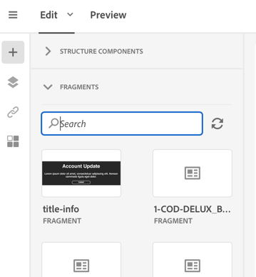
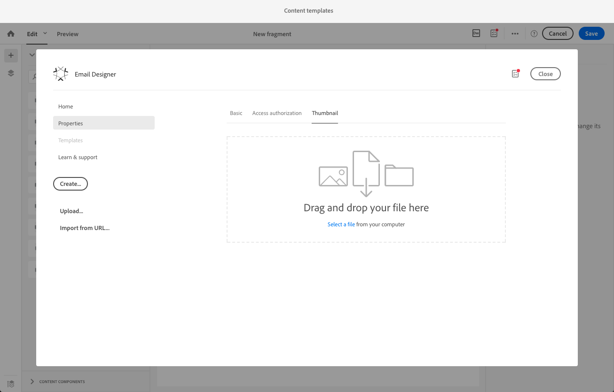
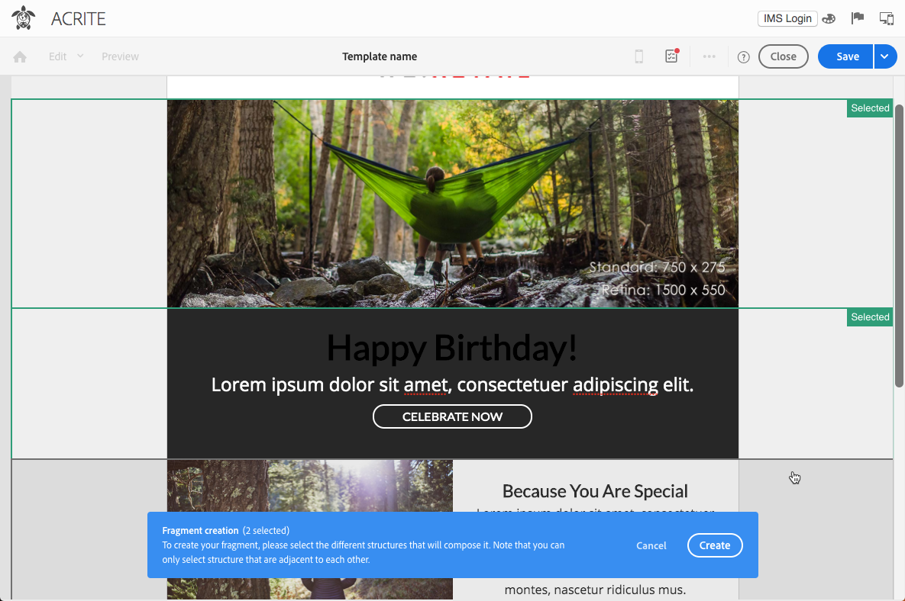

# Skapa och använda återanvändbart innehåll {#using-reusable-content}

Lär dig hur du hanterar utgåvor av e-postinnehåll. Med e-postdesignern kan du skapa mallar och fragment med ditt eget fördefinierade innehåll och återanvända dem för följande leveranser.

## Utforma e-postmeddelanden med mallar {#designing-templates}

>[!NOTE]
>
> I Adobe Campaign Standard kan du skapa olika typer av mallar som du kommer åt via **Resurs** > **Mallar** -menyn. Mallarna som används i e-postdesignern är innehållsmallar. Mer information finns i [Om mallar](../../start/using/marketing-activity-templates.md).

 [Upptäck hur du skapar mallar i video](#video)

### Om innehållsmallar {#content-templates}

Du kan hantera HTML innehåll som finns i **[!UICONTROL Templates]** -fliken i [E-postdesigner](../../designing/using/designing-content-in-adobe-campaign.md) hemsida.

De färdiga mallarna för e-postinnehåll innehåller 18 mobiloptimerade layouter och fyra förstklassiga responsiva mallar som tagits fram av Behance-artister. De motsvarar bland annat de mest aktuella användningsområdena, som välkomstmeddelanden, nyhetsbrev och e-postmeddelanden om återengagemang. De kan enkelt anpassas med ert varumärkes innehåll för att underlätta processen att utforma e-postmeddelanden från grunden.

Mallarna för HTML-innehåll är tillgängliga via **[!UICONTROL Resources]** > **[!UICONTROL Content templates & fragments]** skärmbild för [Avancerad meny](../../start/using/interface-description.md#advanced-menu). Därifrån kan du hantera mallar för landningssidans innehåll, mallar för e-postinnehåll och även fragment.

De färdiga innehållsmallarna är skrivskyddade. Om du vill redigera någon av dem måste du först duplicera den önskade mallen.

Du kan skapa nya mallar eller fragment och definiera ditt eget innehåll. Mer information finns i [Skapa en innehållsmall](#creating-a-content-template) och [Skapa ett innehållsfragment](#creating-a-content-fragment).

När du redigerar innehåll med e-postdesignern kan du även skapa innehållsmallar genom att spara innehållet som fragment eller mall. Mer information finns i [Spara innehåll som mall](#saving-content-as-template) och [Spara innehåll som fragment](../../designing/using/using-reusable-content.md#saving-content-as-a-fragment).

**Relaterade ämnen:**

* Mer information om hur du redigerar innehåll finns i [Om design av e-postinnehåll](../../designing/using/designing-content-in-adobe-campaign.md).

### Skapa en innehållsmall {#creating-a-content-template}

Du kan skapa egna innehållsmallar och använda dem så många gånger som behövs.

I följande exempel visas hur du skapar en mall för e-postinnehåll.

1. Gå till **[!UICONTROL Resources]** > **[!UICONTROL Content templates & fragments]** och klicka **[!UICONTROL Create]**.
1. Klicka på e-postetiketten för att komma åt **[!UICONTROL Properties]** i e-postdesignern.
1. Ange en identifierbar etikett och välj följande parametrar för att kunna använda den här mallen i e-postmeddelanden:

   * Välj **[!UICONTROL Shared]** eller **[!UICONTROL Delivery]** från **[!UICONTROL Content type]** listruta.
   * Välj **[!UICONTROL Template]** från **[!UICONTROL HTML type]** listruta.

   

1. Om det behövs kan du ange en bild som ska användas som miniatyrbild för mallen. Välj det på menyn **[!UICONTROL Thumbnail]** -fliken i mallegenskaperna.

   

   Den här miniatyrbilden visas i **[!UICONTROL Templates]** -fliken i [E-postdesigner](../../designing/using/designing-content-in-adobe-campaign.md) hemsida.

1. Stäng **[!UICONTROL Properties]** för att återgå till huvudarbetsytan.
1. Lägg till strukturkomponenter och innehållskomponenter som du kan anpassa efter behov.
   >[!NOTE]
   >
   > Du kan inte infoga anpassningsfält eller villkorsstyrt innehåll i en innehållsmall.
1. Spara mallen när du har redigerat den.

Den här mallen kan nu användas i alla e-postmeddelanden som skapats med e-postdesignern. Välj det på menyn **[!UICONTROL Templates]** -fliken i [E-postdesigner](../../designing/using/designing-content-in-adobe-campaign.md) hemsida.

### Spara innehåll som mall {#saving-content-as-template}

När du redigerar ett e-postmeddelande med e-postdesignern kan du direkt spara innehållet i det e-postmeddelandet som en mall.

<!--[!CAUTION]
>
>You cannot save as template a structure containing personalization fields or dynamic content.-->

1. Välj **[!UICONTROL Save as template]** i e-postdesignerns huvudverktygsfält.

   

1. Lägg till en etikett och en beskrivning om det behövs och klicka sedan på **[!UICONTROL Save]**.

   

1. Om du vill hitta mallen som du just skapade går du till **[!UICONTROL Resources]** > **[!UICONTROL Content templates & fragments]**.

1. Om du vill använda den nya mallen väljer du den i dialogrutan **[!UICONTROL Templates]** -fliken i [E-postdesigner](../../designing/using/designing-content-in-adobe-campaign.md) hemsida.

   

### Skapa en mall med fragment och komponenter {#template-fragments-components}

Nu kan du skapa en e-postmall med e-postdesignern. Använd innehållskomponenter för att spegla de olika avsnitten i e-postmeddelandet och justera inställningarna så att de ligger så nära det ursprungliga nyhetsbrevet som möjligt. Infoga slutligen fragmenten som du nyss skapade.

1. Skapa en mall med e-postdesignern. Mer information finns i [Innehållsmallar](#content-templates).
1. Infoga flera strukturkomponenter i mallen - som motsvarar sidhuvudet, sidfoten och brödtexten i e-postmeddelandet. Mer information om hur du lägger till strukturkomponenter finns i [Redigera e-poststrukturen med e-postdesignern](../../designing/using/designing-from-scratch.md#defining-the-email-structure).
1. Infoga så många innehållskomponenter som behövs för att skapa nyhetsbrevet. Det här kommer att vara det redigerbara innehållet i e-postmeddelandet som du uppdaterar varje månad.

   

   Om du känner till HTML bör du använda Adobe **[!UICONTROL Html]** där du kan kopiera och klistra in de mer komplexa elementen i det ursprungliga e-postmeddelandet. Använd andra komponenter som **[!UICONTROL Button]**, **[!UICONTROL Image]** eller **[!UICONTROL Text]** för resten av innehållet. Mer information finns i [Om innehållskomponenter](../../designing/using/designing-from-scratch.md#about-content-components).

   >[!NOTE]
   >
   >Använda **[!UICONTROL Html]** resulterar i att komponenter som är redigerbara med begränsade alternativ skapas. Se till att du vet hur du hanterar HTML-kod innan du markerar den här komponenten.

1. Justera innehållskomponenterna så att de matchar ditt ursprungliga e-postmeddelande så mycket du kan.

   

   Mer information om hur du hanterar formatinställningar och infogade attribut finns i [Redigera e-postformat](../../designing/using/styles.md).

1. Infoga de två fragmenten (sidhuvud och sidfot) som du tidigare har skapat i de önskade strukturkomponenterna.

   

1. Spara mallen.  

Du kan nu hantera den här mallen helt och hållet i e-postdesignern för att skapa och uppdatera nyhetsbrevet som du skickar till mottagarna varje månad.

Om du vill använda den skapar du ett e-postmeddelande och väljer den innehållsmall som du just skapade.

**Relaterat ämne**:

* [Skapa ett e-postmeddelande](../../channels/using/creating-an-email.md)
* [Introduktionsvideo till e-postdesignern](../../designing/using/designing-content-in-adobe-campaign.md#video)
* [Designa ett e-postinnehåll från grunden](../../designing/using/designing-from-scratch.md#designing-an-email-content-from-scratch)

### Självstudievideo {#video}

I dessa videofilmer visas hur du skapar en egen mall.

>[!VIDEO](https://video.tv.adobe.com/v/23106?quality=12)

Det finns fler videor med Campaign Standard om hur man gör [här](https://experienceleague.adobe.com/docs/campaign-standard-learn/tutorials/overview.html?lang=sv).

## Om fragment {#about-fragments}

>[!CONTEXTUALHELP]
>id="ac_fragments"
>title="Om fragment"
>abstract="Ett fragment är ett återanvändbart innehållsblock som kan refereras i ett eller flera e-postmeddelanden."

Ett fragment är en återanvändbar komponent som kan refereras i ett eller flera e-postmeddelanden.
De finns i gränssnittet under **Resurs** > **Innehållsfragment och mallar**.

Så här använder du fragment på bästa sätt i e-postdesignern:

* Skapa egna fragment. Se [Skapa ett innehållsfragment](#creating-a-content-fragment) och [Spara innehåll som ett fragment](#saving-content-as-a-fragment).
* Använd dem så många gånger som behövs i e-postmeddelandena. Se [Infoga element i ett e-postmeddelande](#inserting-elements-into-an-email).
* När du redigerar ett fragment synkroniseras ändringarna: de sprids automatiskt till alla e-postmeddelanden (förutsatt att de inte har förberetts eller skickats än) som innehåller det fragmentet.

När fragment läggs till i ett e-postmeddelande låses de som standard. Om du vill ändra ett fragment för ett visst e-postmeddelande kan du bryta synkroniseringen med det ursprungliga fragmentet genom att låsa upp det i det e-postmeddelande där det används. Ändringarna kommer inte att synkroniseras längre.

Om du vill låsa upp ett fragment i ett e-postmeddelande markerar du det och klickar på låsikonen i det sammanhangsberoende verktygsfältet.

Det fragmentet blir en fristående komponent som inte längre är länkad till det ursprungliga fragmentet. Den kan sedan redigeras som en annan innehållskomponent. Se [Om innehållskomponenter](../../designing/using/designing-from-scratch.md#about-content-components).

### Infoga fragment i ett e-postmeddelande {#inserting-elements-into-an-email}

Om du vill definiera innehållet i ditt e-postmeddelande kan du lägga till innehållselement i de strukturelement som du har placerat i förväg. Se [Redigera e-poststrukturen](../../designing/using/designing-from-scratch.md#defining-the-email-structure).

1. Få åtkomst till innehållselementen genom att välja **+** till vänster. Välj [Fragment](#about-fragments) eller [Innehållskomponenter](../../designing/using/designing-from-scratch.md#about-content-components).
1. Om du redan känner till etiketten eller en del av etiketten för det fragment som du vill lägga till kan du söka efter den.

   

1. Dra och släpp ett fragment eller en innehållskomponent från paletten till en strukturkomponent i e-postmeddelandet.

   

   När ett element har lagts till i e-postmeddelandet kan det flyttas inuti strukturkomponenten eller till en annan strukturkomponent i e-postmeddelandet.

   

1. Redigera elementet så att det matchar e-postmeddelandets exakta behov. Du kan lägga till text, länkar, bilder och så vidare.

   >[!NOTE]
   >
   >Fragment låses som standard när de läggs till i ett e-postmeddelande. Du kan avbryta synkroniseringen med det ursprungliga fragmentet om du vill ändra fragmentet för ett visst e-postmeddelande eller göra ändringen direkt i fragmentet. Se [Om fragment](#about-fragments).

1. Upprepa den här proceduren för alla element som du behöver lägga till i e-postmeddelandet.
1. Spara e-postmeddelandet.

Nu när e-poststrukturen är ifylld kan du redigera stilen för varje innehållselement. Se [Redigera ett element](../../designing/using/styles.md).

>[!NOTE]
>
>Om ett fragment ändras sprids ändringarna automatiskt i de e-postmeddelanden där det används. Mer information finns i [Om fragment](#about-fragments).

### Skapa ett innehållsfragment {#creating-a-content-fragment}

Du kan skapa egna innehållsfragment och använda dem efter behov i ett eller flera e-postmeddelanden.

1. Gå till **[!UICONTROL Resources]** > **[!UICONTROL Content templates & fragments]** och klicka **[!UICONTROL Create]**.
1. Klicka på e-postetiketten för att komma åt **[!UICONTROL Properties]** i e-postdesignern.
1. Ange en identifierbar etikett och välj följande parametrar för att hitta fragmentet när du redigerar e-postinnehåll:

   * Eftersom fragment endast är kompatibla med e-post väljer du **[!UICONTROL Delivery]** från **[!UICONTROL Content type]** listruta.
   * Välj **[!UICONTROL Fragment]** från **[!UICONTROL HTML type]** för att kunna använda det här innehållet som ett fragment.

   

1. Om det behövs kan du ange en bild som ska användas som miniatyrbild för fragmentet. Välj det på menyn **[!UICONTROL Thumbnail]** -fliken i mallegenskaperna.

   

   Den här miniatyrbilden visas bredvid fragmentets etikett när du redigerar ett e-postmeddelande.

1. Stäng **[!UICONTROL Properties]** för att återgå till huvudarbetsytan.
1. Lägg till strukturkomponenter och innehållskomponenter som du kan anpassa efter behov.

   >[!CAUTION]
   >
   >Fragment kan inte innehålla anpassningsfält, dynamiskt innehåll eller något annat fragment.
   >
   >Undvik att spara som fragmentinnehåll med tomma strukturkomponenter. När >fragment infogas går det inte att redigera dem.
   >
   >The [mobilvy](../../designing/using/plain-text-html-modes.md#switching-to-mobile-view) är inte tillgängligt i fragment.

1. Spara fragmentet när du har redigerat det.

Detta fragment kan nu användas i alla e-postmeddelanden som skapats med e-postdesignern. Den visas under **[!UICONTROL Fragments]** i paletten.

>[!NOTE]
>
>Du kan inte infoga anpassningsfält i ett fragment om det inte används i ett e-postmeddelande och är olåst. Se [Om fragment](#about-fragments).

### Spara innehåll som ett fragment {#saving-content-as-a-fragment}

När du redigerar ett e-postmeddelande med e-postdesignern kan du spara en del av det som ett fragment direkt.

* Du kan inte spara en struktur som innehåller anpassningsfält, dynamiskt innehåll eller något annat fragment som fragment.
* Du kan bara markera strukturer som ligger intill varandra.
  <!-- - You cannot select an empty structure.-->

1. När du redigerar ett e-postmeddelande i e-postdesignern väljer du **[!UICONTROL Save as fragment]** i huvudverktygsfältet.

   

1. Välj de strukturer som ska utgöra fragmentet på arbetsytan.

   

   >[!NOTE]
   >
   >Se till att du väljer strukturer som ligger intill varandra och som inte innehåller anpassningsfält, dynamiskt innehåll eller något annat fragment.
   <!--You cannot select an empty structure.-->

1. Klicka på **[!UICONTROL Create]**.

1. Lägg till en etikett och en beskrivning om det behövs och klicka sedan på **[!UICONTROL Save]**.

   

1. Om du vill hitta fragmentet som du just har skapat går du till **[!UICONTROL Resources]** > **[!UICONTROL Content templates & fragments]**.

   

1. Om du vill använda det nya fragmentet öppnar du valfritt e-postinnehåll och väljer det i fragmentlistan.

>[!NOTE]
>The [mobilvy](../../designing/using/plain-text-html-modes.md#switching-to-mobile-view) är inte tillgängligt i fragment. Om du vill redigera en e-postmobilvy gör du det innan du sparar innehållet som ett fragment.

<!--You need to copy-paste the HTML corresponding to the section that you want to save into a new fragment.

>[!NOTE]
>
>To do this, you need to be familiar with HTML code.

To save as a fragment some email content that you created, follow the steps below.

1. When editing an email in the Email Designer, select **[!UICONTROL Edit]** > **[!UICONTROL HTML]** to open the HTML version of that email.
1. Select and copy the HTML corresponding to the part that you want to save.
1. Go to **[!UICONTROL Resources]** > **[!UICONTROL Content templates & fragments]** and click **[!UICONTROL Create]**.
1. Click the email label to access the **[!UICONTROL Properties]** tab of the Email Designer and select **[!UICONTROL Fragment]** from the **[!UICONTROL HTML type]** drop-down list.
1. Select **[!UICONTROL Edit]** > **[!UICONTROL HTML]** to open the HTML version of the fragment.
1. Paste the HTML that you copied where appropriate.
1. Switch back to the **[!UICONTROL Edit]** view to check the result and save the new fragment.-->

## Skapa återanvändbara sidhuvuden och sidfötter med fragment {#header-footer-fragments}

Skapa ett fragment för varje återanvändningsbart avsnitt med e-postdesignern. I det här exemplet skapar du två fragment: ett för sidhuvudet och ett för sidfoten. Sedan kan du kopiera relevanta delar från ditt befintliga innehåll till dessa fragment.

Följ stegen nedan för att göra detta:

1. I Adobe Campaign går du till **[!UICONTROL Resources]** > **[!UICONTROL Content templates & fragments]** och skapa ett fragment för sidhuvudet. Mer information finns i [Skapa ett innehållsfragment](#creating-a-content-fragment).
1. Lägg till så många strukturkomponenter du behöver i fragmentet.

   

1. Infoga bild- och textkomponenter i strukturen.

   

1. Överför motsvarande bild, ange texten och justera inställningarna.

   

1. Spara fragmentet.
1. Skapa sidfoten och spara den på liknande sätt.

   

Dina fragment kan nu användas i en mall.
