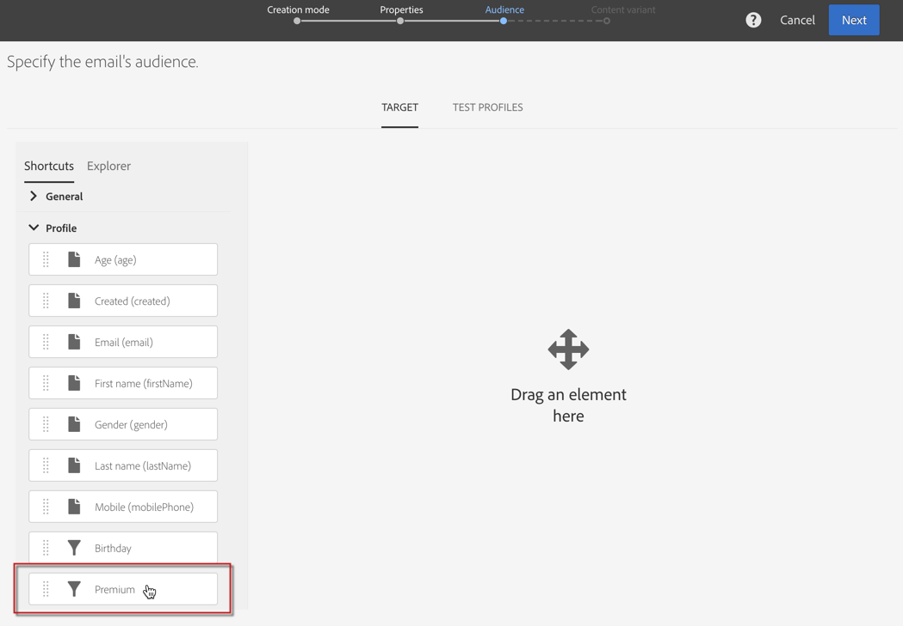

# Konfigurera filterdefinition{#configuring-filter-definition}

Under **[!UICONTROL Filter definition]**-fliken kan du skapa avancerade filter som användare kan komma åt direkt när de skapar komplexa frågor, till exempel när de definierar en målgrupp.

Det här steget är inte obligatoriskt eftersom du fortfarande kan fylla i resursen och komma åt datan via arbetsflöden, målgrupper och REST API.

Dessa filter används i förfrågningsredigeraren i form av förkonfigurerade regler.  Med dessa kan du begränsa antalet steg som krävs för att få önskad konfiguration, vilket kan vara särskilt bra för upprepade segmenteringar.

Du kan till exempel skapa ett filter som gör det möjligt att markera alla transaktioner som är större än ett visst belopp från de senaste tre månaderna.

För att kunna göra detta måste du utöka **[!UICONTROL Profiles]**-resursen och definiera ett filter som länkar till en transaktionstabell (som du tidigare har skapat), med en regel som anger att transaktionspriset måste vara större än eller lika med en angiven parameter, samt att transaktionsdatumet måste ligga inom ett intervall som motsvarar de tre senaste månaderna.

1. Se till att du skapar och publicerar ett transaktionsregister.  Se [Skapa eller utöka resursen](../../developing/using/creating-or-extending-the-resource.md).

   >[!NOTE]
   >
   >Den här proceduren använder exemplet på ett anpassat transaktionsregister.  I ditt fall kan du anpassa den efter dina affärsbehov.

1. Innan du definierar ett filter som är relaterat till transaktionsregistret i **[!UICONTROL Profiles]**-resursen så måste du definiera länken till det här registret och publicera ändringarna.  Se [Definiera länkar med andra resurser](../../developing/using/configuring-the-resource-s-data-structure.md#defining-links-with-other-resources) och [Uppdatera databasstrukturen](../../developing/using/updating-the-database-structure.md).
1. Markera transaktionsregistret under **[!UICONTROL Definition]**-fliken i det nya filtrets definitionsskärm.

   

1. Dra transaktionsregistret till arbetsytan i **[!UICONTROL Add a rule - Profiles/Transactions]**-fönstret.  I nästa fönster som visas markerar du det fält som du vill använda.

   

1. I **[!UICONTROL Optional parameter settings]** av **[!UICONTROL Add a rule - Transactions]**-fönstret, markera **[!UICONTROL Switch to parameters]**-rutan.

   I **[!UICONTROL Filter conditions]** väljer du **[!UICONTROL Greater than or equal to]**-operatören.  Ange ett namn i **[!UICONTROL Parameters]**-fältet och klicka sedan på plustecknet för att skapa den nya parametern.

   

1. Bekräfta ändringarna.  Definitionen motsvarar ett konfigurerbart fält som användaren måste fylla i för att kunna utföra förfrågan.

   

1. Kombinera den här regeln med en annan regel som anger att transaktionsdatumet måste ligga inom ett intervall som motsvarar de senaste tre månaderna.

   

1. Välj den kategori som filtret ska visas i.

   

1. Ändra beskrivningen och etiketten under fliken **[!UICONTROL Parameters]** i filterdefinitions-skärmen för att tydligt ange filterämnet för användarna.  Den här informationen visas i förfrågningsredigeraren.

   

   Om du definierar flera konfigurerbara fält så kan du ändra vilken ordning de visas i gränssnittet.

1. Spara ändringarna och publicera resurserna.  Mer information om detta hittar du i avsnittet [Uppdatera databasstrukturen](../../developing/using/updating-the-database-structure.md) .

När **[!UICONTROL Profiles]** resurstillägget har publicerats så visas det här filtret under fliken Kortkommandon i [förfrågningsredigerings](../../automating/using/editing-queries.md)-gränssnittet.

På så sätt så kan användaren enkelt definiera sin målgrupp när ett e-postmeddelande skapas som ska skickas till alla kunder som spenderat mer än en viss mängd de senaste tre månaderna.

I stället för att själva konfigurera den så behöver de bara ange önskat värde i dialogrutan som visas.

När ett filter har konfigurerats kan du använda det från Campaign Standard-API:er med den här syntaxen:

`GET https://mc.adobe.io/<ORGANIZATION>/campaign/profileAndServicesExt/<resourceName>/by<customFilterName>?<customFilterparam>=<customFilterValue>`

Mer information finns i [Campaign Standard-API:ernas dokumentation](../../api/using/filtering.md#custom-filters).
