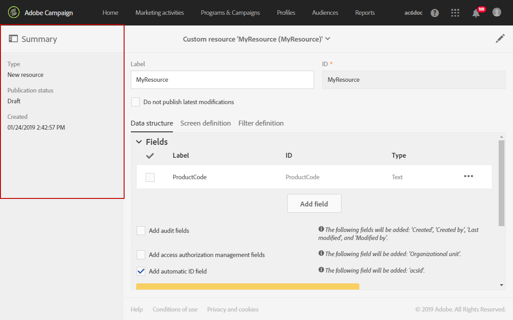

# Konfigurera resursens datastruktur{#configuring-the-resource-s-data-structure}

När du har skapat en ny anpassad resurs måste du konfigurera datastrukturen.

När du redigerar resursen kan du på fliken **[!UICONTROL Data structure]** lägga till:

* [Fält](#adding-fields-to-a-resource)
* [Identifieringsnycklar](#defining-identification-keys)
* [Index](#defining-indexes)
* [Länkar](#defining-links-with-other-resources)
* [Skicka loggar](#defining-sending-logs-extension)

## Lägga till fält i en resurs {#adding-fields-to-a-resource}

Du kan lägga till nya fält i en resurs för att lagra data som inte ingår i den färdiga datamodellen.

1. Skapa ett fält med hjälp av knappen **[!UICONTROL Create element]**.
1. Ange en etikett, ett ID, en fälttyp och definiera den maximala längden som tillåts för det här fältet.

   **[!UICONTROL ID]**-fältet är obligatoriskt och måste vara unikt för varje tillagt fält.

   >[!NOTE]
   >
   >Använd högst 30 tecken.

   

1. Om du vill ändra något av fälten markerar du knappen **[!UICONTROL Edit Properties]**.

   

1. På **[!UICONTROL Field definition]**-skärmen kan du definiera en kategori som ska användas för målgruppen och mål, eller till och med lägga till en beskrivning.

   

1. Markera alternativet **[!UICONTROL Specify a list of authorized values]** om du behöver definiera värden som ska erbjudas användaren (uppräkningsvärden).

   Klicka sedan på **[!UICONTROL Create element]** och ange en **[!UICONTROL Label]** och **[!UICONTROL Value]**. Lägg till så många värden som behövs.

1. När du har lagt till dina fält markerar du **[!UICONTROL Add audit fields]**-kryssrutan för att inkludera fält med information om skapandedatum, användaren som skapade resursen, datum och författaren till den senaste ändringen.
1. Markera **[!UICONTROL Add access authorization management fields]**-rutan om du vill inkludera fälten som anger vem som har behörighet till den aktuella resursen.

   Dessa fält visas i de data och metadata som kan visas när databasuppdateringen har utförts. Mer information om detta hittar du i avsnittet [Uppdatera databasstrukturen](../../developing/using/updating-the-database-structure.md).

1. Markera **[!UICONTROL Add automatic ID]**-fältet för att automatiskt generera ett ID. Observera att befintliga enheter förblir tomma. Mer information om detta hittar du i [Generera ett unikt ID för profiler och anpassade resurser](../../developing/using/configuring-the-resource-s-data-structure.md#generating-a-unique-id-for-profiles-and-custom-resources).
1. Markera **[!UICONTROL Customize the title of the resource elements]**-rutan om du vill ändra hur resurselementens namn visas i listorna och i stegen för att skapa. Välj ett fält bland de du har skapat för den här resursen.

   

   >[!NOTE]
   >
   >Om du inte markerar det här alternativet kommer den automatiska primärnyckeln (som skapas automatiskt varje gång en entitet läggs till i tabellen) att användas när du listar alla entiteter från den här tabellen.

Fälten för resursen är nu definierade.

## Definiera identifieringsnycklar {#defining-identification-keys}

Varje resurs måste ha minst en unik nyckel. Du kan till exempel ange en nyckel så att två produkter inte kan ha samma ID i en inköpstabell.

1. Ange storleken för lagringsutrymmet i avsnittet **[!UICONTROL Automatic primary key]** om du vill att en teknisk nyckel ska genereras automatiskt och stegvis.

   

1. Skapa en nyckel med knappen **[!UICONTROL Create element]**.

   Fälten **[!UICONTROL Label]** och **[!UICONTROL ID]** fylls i som standard, men du kan redigera dem.

   >[!NOTE]
   >
   >Använd högst 30 tecken.

1. Om du vill definiera elementen som utgör den här nyckeln klickar du på **[!UICONTROL Create element]** och väljer fälten som du har skapat för den här resursen.

   

   Skapade tangenter visas i avsnittet **[!UICONTROL Custom keys]**.

Dina identifieringsnycklar för resursen har skapats.

>[!NOTE]
>
>Mer information om de effektivaste strategierna när du skapar identifieringsnycklar finns i det här [avsnittet](../../developing/using/data-model-best-practices.md#keys).

## Definiera index {#defining-indexes}

Ett index kan hänvisa till ett eller flera resursfält. Med index kan databasen sortera poster så att de kan återställas enklare. De optimerar prestanda för SQL-frågor.

Vi rekommenderar att du definierar index, men det är inte obligatoriskt.

1. Använd knappen **[!UICONTROL Create element]** för att skapa ett index.

   

1. Fälten **[!UICONTROL Label]** och **[!UICONTROL ID]** fylls i som standard, men du kan redigera dem.

   >[!NOTE]
   >
   >Använd högst 30 tecken.

1. Om du vill definiera elementen som utgör indexet markerar du fälten från de som du skapade för den här resursen.

   

1. Klicka på **[!UICONTROL Confirm]**.

De index som skapades visas i listan i avsnittet **[!UICONTROL Index]**.

>[!NOTE]
>
>Mer information om de effektivaste strategierna när du skapar index finns i det här [avsnittet](../../developing/using/data-model-best-practices.md#indexes).

## Definiera länkar med andra resurser {#defining-links-with-other-resources}

En länk visar associationen som en tabell har med andra tabeller.

1. Använd knappen **[!UICONTROL Create element]** för att skapa en länk till en målresurs.
1. Klicka på **[!UICONTROL Select a target resource]**.

   

1. Resurserna visas i alfabetisk ordning och kan filtreras efter namn. Deras tekniska namn visas inom parentes.

   Markera ett element i listan och klicka på **[!UICONTROL Confirm]**.

   

1. Välj **[!UICONTROL Link type]** enligt kardinalitet. Beteendet kan variera om posterna tas bort eller dupliceras beroende på vilken kardinalitetstyp som har valts.

   De olika länktyperna är följande:

   * **[!UICONTROL 1 cardinality simple link]**: En förekomst av källtabellen kan ha högst en motsvarande förekomst av måltabellen.
   * **[!UICONTROL N cardinality collection link]**: En förekomst av källtabellen kan ha flera motsvarande förekomster av måltabellen, men en förekomst av måltabellen kan ha högst en motsvarande förekomst av källtabellen.
   * **[!UICONTROL 0 or 1 cardinality simple link]**: En förekomst av källtabellen kan ha högst en motsvarande förekomst av måltabellen eller ingen. Observera att den här typen av **[!UICONTROL Link type]** kan orsaka prestandaproblem.

   

1. På **[!UICONTROL New link]**-skärmen är fälten **[!UICONTROL Label]** och **[!UICONTROL ID]** som standard ifyllda, men du kan redigera dem.

   >[!NOTE]
   >
   >Använd högst 30 tecken.
   >
   >Det går inte att byta namn på en länk när den har skapats. Om du vill byta namn på en länk måste du ta bort den och skapa den igen.

1. I listan **[!UICONTROL Category for the audience and targeting]** kan du tilldela den här länken till en kategori så att den blir mer synlig i frågeredigeringsverktyget. 
1. Om det behövs kan du i avsnittet **[!UICONTROL Reverse link definition]** visa etiketten och ID:t för resursen i målresursen.
1. Definiera beteendet för de poster som länken hänvisar till i avsnittet **[!UICONTROL Behavior if deleted/duplicated]**.

   Som standard tas målposten bort när länken inte längre hänvisar till den.

   

1. I avsnittet **[!UICONTROL Join definition]** är standardalternativet **[!UICONTROL Use the primary keys to make the join]** markerat, men du kan välja mellan två alternativ:

   * **[!UICONTROL Use the primary key to make the join]**: Med den här kopplingsdefinitionen kan du använda profilens primärnyckel för att stämma av mot inköpets primärnyckel.
   * **[!UICONTROL Define specific join conditions]**: Med den här kopplingsdefinitionen kan du manuellt välja de fält som ska anslutas till båda resurserna. Observera att om data inte är korrekt konfigurerade visas inte posten **Inköp**.

   

Länkarna som skapas visas i listan i avsnittet **[!UICONTROL Links]**.

>[!NOTE]
>
>Mer information om de effektivaste strategierna när du skapar index finns i det här [avsnittet](../../developing/using/data-model-best-practices.md#links).

**Exempel: Koppla en skapad resurs med resursen &quot;Profiler&quot;**

I det här exemplet vill vi koppla en ny resurs för **Inköp** till den anpassade resursen **Profiler**:

1. Skapa en ny resurs för **Inköp**.
1. Om du vill koppla den till den anpassade resursen för **Profiler**, öppnar du avsnittet **[!UICONTROL Links]** på fliken **[!UICONTROL Data structure]** och klickar på **[!UICONTROL Create element]**.
1. Välj målresurs här **[!UICONTROL Profiles (profile)]**.
1. I det här exemplet ska du behålla standardtypen för **[!UICONTROL 1 cardinality simple link]**-länk markerad.

   

1. Välj en kopplingsdefinition. Här behåller du standardinställningen **[!UICONTROL Use the primary key to make the join]**.

   

1. Vid behov kan du definiera en detaljskärm för att kunna redigera **Inköp** och koppla den till en profil.

   Visa upp avsnittet **[!UICONTROL Detail screen configuration]** och kontrollera **[!UICONTROL Define a detail screen]** för att konfigurera skärmen som motsvarar varje element i resursen. Om du inte markerar den här rutan är detaljvyn för den här resursens element inte tillgänglig.

1. Klicka på **[!UICONTROL Create element]**.
1. Markera den kopplade resursen och klicka på **[!UICONTROL Add]**.

   Den nya resursen blir sedan tillgänglig på den avancerade menyn genom att välja **[!UICONTROL Client data]** > **[!UICONTROL Purchase]**.

   

1. När konfigurationen är klar klickar du på **[!UICONTROL Confirm]**.

   Nu kan du publicera din nya resurs.

Genom att lägga till den här länken läggs fliken **Inköp** till på skärmen för information om profiler på menyn **[!UICONTROL Profiles & audiences]** > **[!UICONTROL Profiles]**. Observera att detta är specifikt för resursen **[!UICONTROL Profile]**.

## Definiera tillägget för sändningsloggar {#defining-sending-logs-extension}

Med tillägget för sändningsloggar kan du:

* utöka dynamiska rapportfunktioner genom **att lägga till anpassade profilfält**
* utöka skickade loggdata med **segmentkod och profildata**

**Utöka med en segmentkod**

Användaren kan utöka loggarna med segmentkoden som kommer från arbetsflödesmotorn.

Segmentkoden måste definieras i arbetsflödet.

Markera alternativet om du vill aktivera tillägget **[!UICONTROL Add segment code]**.

Mer information om segmentkod finns i avsnittet [Segmentering](../../automating/using/segmentation.md).

**Utöka med ett profilfält**

>[!NOTE]
>
>Administratören ska ha utökat profilresursen med ett anpassat fält.

Klicka på **[!UICONTROL Add field]** och välj ett anpassat fält i profilresursen.

Markera alternativet **[!UICONTROL Add this field in Dynamic reporting as a new dimension]** om du vill generera en ny underdimension som är kopplad till profildimensionen.

Från Dynamisk rapportering kan du dra och släppa den anpassade fältdimensionen i en frihandstabell.

Mer information om dynamisk rapportering finns i [Komponentlistan](../../reporting/using/list-of-components-.md).

>[!IMPORTANT]
>
>Antalet fält som skickas till Dynamisk rapportering är begränsat till 20.

## Redigera resursegenskaper {#editing-resource-properties}

På skärmen för anpassade resurser visas status för den nyligen skapade resursen i rutan **[!UICONTROL Summary]**. Du kan hantera åtkomsten och dess allmänna egenskaper.

1. Klicka på knappen **[!UICONTROL Edit properties]** för att lägga till en beskrivning.

   

1. Ändra resursens etikett och ID om det behövs.

   >[!NOTE]
   >
   >Använd högst 30 tecken.

1. Om du behöver begränsa åtkomsten till den här resursen till vissa organisationsenheter anger du dem här. Endast användare från auktoriserade enheter kan arbeta med den här resursen i programmet.
1. Spara ändringarna.

Ändringarna sparas. Du måste publicera resursen igen för att tillämpa dem.

## Generera ett unikt ID för profiler och anpassade resurser {#generating-a-unique-id-for-profiles-and-custom-resources}

Som standard har profiler och anpassade resurser inget företags-ID när de skapas. Du kan aktivera ett alternativ som automatiskt genererar ett unikt ID när element skapas. Detta ID kan användas för att:

* enkelt identifiera exporterade poster i ett externt verktyg.
* rensa poster när du importerar uppdaterade data som bearbetats i ett annat program.

Det kan bara aktiveras för profiler och anpassade resurser.

1. Skapa ett tillägg till profilresursen eller skapa en ny resurs.
1. I datastruktursdefinitionen markerar du alternativet **[!UICONTROL Add automatic ID field]** under avsnittet **[!UICONTROL Fields]**.

   

   >[!NOTE]
   >
   >Endast nya poster har ett ACS-ID. Fältet **[!UICONTROL ACS ID]** är tomt för profiler eller element som skapats innan det här alternativet aktiveras.

1. Spara och publicera ändringen som gjorts i resursen. Om du vill att den här funktionen ska gälla för element som skapats via API:t markerar du alternativet för att utöka API:t.

Fältet **[!UICONTROL ACS ID]** är nu tillgängligt och fylls i automatiskt när nya element skapas manuellt, från API:t eller genom att infogas från ett importarbetsflöde. ACS-ID-fältet är ett UUID-fält och indexeras.

När du exporterar profiler eller anpassade resurser kan du nu lägga till **[!UICONTROL ACS ID]**-kolumnen om den har aktiverats för den resursen. Du kan återanvända detta ID i dina externa verktyg för att identifiera poster.

När du återimporterar data som har bearbetats/uppdaterats i ett annat program (till exempel ett CRM-program) kan du enkelt matcha dem med detta unika ID.

>[!NOTE]
>
>Fältet **[!UICONTROL ACS ID]** uppdateras inte för profiler eller element som skapats innan du aktiverade alternativet. Endast nya poster har ett ACS-ID.
>
>Det här fältet är i skrivskyddat läge. Du kan inte ändra det.
