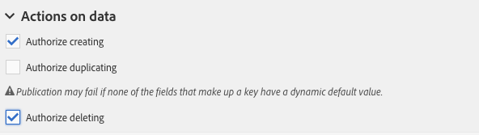

# Konfigurera skärmdefinitionen{#configuring-the-screen-definition}

När du skapar en resurs eller lägger till nya fält till en befintlig resurs kan du definiera hur de ska visas i gränssnittet.

Det här steget är inte obligatoriskt eftersom du fortfarande kan fylla i resursen och komma åt dess data via arbetsflöden, målgrupper och REST API.

På **[!UICONTROL Screen definition]** fliken kan du:

* Lägg till åtkomst till den anpassade resursen i navigeringsrutan
* Anpassa hur listan med element som utgör resursen presenteras
* Definiera hur detaljvyn för varje element i resursen visas

## Aktivera åtkomst från navigeringsmenyn {#enabling-access-from-the-navigation-menu}

Om du vill att resursen ska ha en dedikerad skärm kan du göra den tillgänglig via navigeringsmenyn.

1. Öppna resursens flik och visa **[!UICONTROL Screen definition]** upp **[!UICONTROL Navigation]** avsnittet.
1. Markera **[!UICONTROL Add an entry in the 'Client data' section]** rutan om du vill tillåta åtkomst till den här resursen från navigeringsrutan.

   

Resursen visas som en underpost i **[!UICONTROL Client data]** avsnittet.

## Definiera standardlistkonfigurationen {#defining-the-default-list-configuration}

I avsnittet **[!UICONTROL List configuration]** i skärmdefinitionen kan du definiera kolumner och information som ska visas som standard i översikten för en resurs.

1. Markera **[!UICONTROL Customize the list configuration]** rutan för att definiera hur resursens kolumner ska visas.
1. Använd **[!UICONTROL Create element]** knappen för att välja ett fält bland dem som du har skapat.
1. Fältet som skapas visas i listan. Du kan redigera etiketten och dess bredd.

   

1. I **[!UICONTROL Simple search]** avsnittet markerar du **[!UICONTROL Specify the fields to be taken into account in the search]** för att definiera vilka fält som ska ingå i sökningen.

   >[!CAUTION]
   >
   >Den här konfigurationen ersätter de fält som används i standardsökningen.

1. I **[!UICONTROL Advanced filtering]** avsnittet markerar du **[!UICONTROL Add search fields]** rutan för att lägga till fler fält utöver det enkla sökfältet. Om du t.ex. väljer datumfältet i de fält som du har skapat, kan användaren göra en sökning som bara refererar till datumet.
1. Du kan ändra fältordningen för de två söktyperna.
1. Om du vill göra en avancerad sökning kan du lägga till fält som länkar till en länkad resurs. Dessa filter visas på den genererade skärmens **[!UICONTROL Search]** meny.

Översiktsskärmen för resursen är nu definierad.

## Definiera detaljskärmens konfiguration {#defining-the-detail-screen-configuration}

I avsnittet **[!UICONTROL Detail screen configuration]** i skärmdefinitionen kan du definiera de kolumner och den information som ska visas på detaljskärmen för varje element i resursen.

1. Visa upp avsnittet och kontrollera **[!UICONTROL Detail screen configuration]** **[!UICONTROL Define a detail screen]** för att konfigurera skärmen som motsvarar varje element i resursen. Om du inte markerar den här rutan är detaljvyn för den här resursens element inte tillgänglig.
1. Du kan lägga till alla fält från din anpassade resurs med ett klick. Klicka på  ikonen eller använd **[!UICONTROL Add an element]** knappen för att göra detta.
1. Välj ett element från de som skapats för den här resursen och ange en fälttyp:

   * **[!UICONTROL Input field]**: är ett redigerbart fält.
   * **[!UICONTROL Value]**: är ett skrivskyddat fält.
   * **[!UICONTROL List]**: är ett bord.
   * **[!UICONTROL Separator]**: delar upp elementen i kategorier.
   

1. Det element som läggs till visas i listan. Du kan redigera etiketten för den.

   

1. Lägg till så många **[!UICONTROL Separator]** som behövs för att dela upp elementen i olika kategorier.

   På så sätt kan du visa avgränsare för att bättre ordna dina fönster.

   

Detaljskärmen för resursen har nu konfigurerats.

## Åtgärder i dataavsnittet {#actions-on-data-section}

Med de här inställningarna kan du visa ett kontrollfält på den anpassade resursskärmen. Det finns tre alternativ:

* **[!UICONTROL Authorize creating]**: Med det här alternativet kan du aktivera skapande av resurselement. Användaren kan därför lägga till fler poster.

   >[!NOTE]
   >
   >Du måste först aktivera detaljskärmen som är länkad till resursen för att göra det här alternativet tillgängligt.

* **[!UICONTROL Authorize duplicating]**: Med det här alternativet kan du aktivera dubblettposter som är länkade till den anpassade resursen.
* **[!UICONTROL Authorize deleting]**: Med det här alternativet kan du aktivera borttagning av poster som är länkade till den anpassade resursen.

