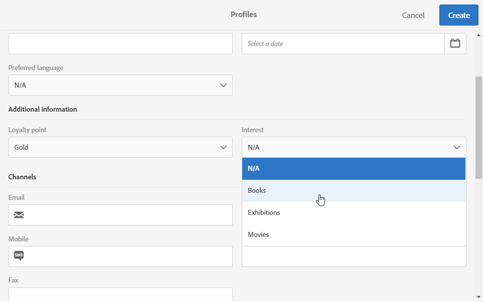
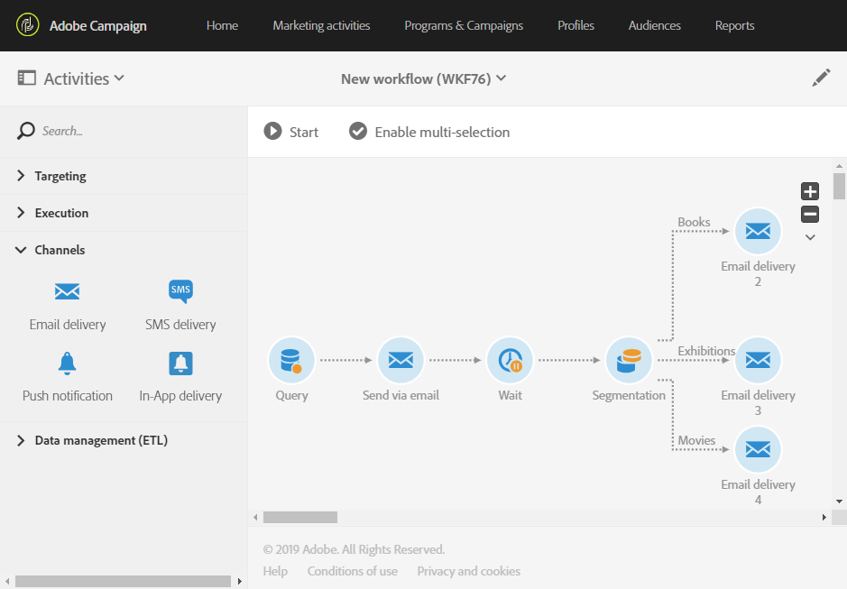

# Utöka profilresursen med ett nytt fält{#extending-the-profile-resource-with-a-new-field}

## Om att utöka profiler {#about-extending-profiles}

Här beskrivs hur du utökar en profil och en testprofil med ett dedikerat fält.

Här vill vi uppdatera våra profiler med ett nytt fält med hjälp av en landningssida och sedan rikta in oss på profiler med ett nyhetsbrev som är specificerat enligt deras intressen.

För att göra detta, följ nedanstående steg:

* [Steg 1: Utöka profilresursen](#step-1--extend-the-profile-resource)
* [Steg 2: Utöka testprofilen](#step-2--extend-the-test-profile)
* [Steg 3: Publicera din anpassade resurs](#step-3--publish-your-custom-resource)
* [Steg 4: Uppdatera och ange målprofiler med ett arbetsflöde](#step-4--update-and-target-profiles-with-a-workflow)

Följande fält läggs sedan till i våra profiler och kan användas vid en leverans:

Relaterade ämnen:

* [Om anpassade resurser](../../developing/using/data-model-concepts.md)
* [Hantera profiler](../../audiences/using/about-profiles.md)
* [Hantera testprofiler](../../audiences/using/managing-test-profiles.md)

## Steg 1: Utöka profilresursen {#step-1--extend-the-profile-resource}

Om du vill skapa fältet **Intresse** för våra profiler måste du först utöka den inbyggda **[!UICONTROL Profiles (profile)]**-resursen.

1. I den avancerade menyn via Adobe Campaign-logotypen väljer du **[!UICONTROL Administration]** > **[!UICONTROL Development]** och sedan **[!UICONTROL Custom resources]**.
1. Om du inte har utökat **[!UICONTROL Profiles]** resursen ännu klickar du på **[!UICONTROL Create]**.
1. Välj alternativet **[!UICONTROL Extend an existing resource]**.
1. Välj resursen **[!UICONTROL Profile (profile)]**.
1. Klicka på **[!UICONTROL Create]**.

   

1. I kategorin **[!UICONTROL Fields]** under fliken **[!UICONTROL Data structure]**, klicka på **[!UICONTROL Create element]**.

   >[!NOTE]
   >
   >Notera att om du redan har utökat resursen **[!UICONTROL Profile]** för tidigare syften kan du börja med det här steget genom att klicka på **[!UICONTROL Add field]**.

   

1. Lägg till en **[!UICONTROL Label]** och en **[!UICONTROL ID]**. Markera typen **[!UICONTROL Text]** och klicka på **[!UICONTROL Add]**.

   

1. Om du vill konfigurera fältet går du till fliken **[!UICONTROL Data structure]** och under listrutan **[!UICONTROL Fields]** klickar du på  och sedan på  i fältet som du skapade tidigare.
1. I det här exemplet vill vi lägga till specifika värden. För att göra detta, klicka på **[!UICONTROL Specify a list of authorized values]**.

   

1. Klicka **[!UICONTROL Add an element]** och lägg sedan till så många värden som behövs genom att lägga till en **[!UICONTROL Label]** och en **[!UICONTROL ID]** och sedan klicka **[!UICONTROL Add]**.

   I det här exemplet kan du välja mellan de här alternativen genom att skapa bokmärken, utställningar, filmer och N/A-värden för profiler.

   

1. Om du vill lägga till det här fältet på skärmen **[!UICONTROL Profile]** klickar du på fliken **[!UICONTROL Screen definition]**.
1. Klicka på **[!UICONTROL Detail screen configuration]** i rullgardinsmenyn **[!UICONTROL Add a personalized fields section]** och klicka sedan på **[!UICONTROL Create element]**.

   

1. Välj en **[!UICONTROL Type]**.  Här vill vi lägga till ett inmatningsfält.  Markera sedan det fält du tidigare skapat och klicka på **[!UICONTROL Add]**.

   

1. Om du vill lägga till en avgränsare för att bättre organisera profilrutan klickar du på **[!UICONTROL Create an element]** och väljer **[!UICONTROL Separator]** i **[!UICONTROL Type]** rullgardinsmenyn.

   

Fältet är nu konfigurerat.  Nu återstår att utöka den till testprofilen.

>[!NOTE]
>
>Om du inte behöver utöka resursen för testprofiler kan du hoppa till publiceringssteget.

## Steg 2: Utöka testprofilen {#step-2--extend-the-test-profile}

Om du vill testa om det nya skapade fältet är korrekt konfigurerat kan du testa detta genom att skicka leveransen till testprofilerna.  För det första så måste det nya fältet även läggas till i testprofilerna.

1. I den avancerade menyn via Adobe Campaign-logotypen väljer du **[!UICONTROL Administration]** > **[!UICONTROL Development]** och sedan **[!UICONTROL Custom resources]**.
1. Om du inte har utökat **[!UICONTROL Profiles]** resursen ännu klickar du på **[!UICONTROL Create]**.
1. Välj alternativet **[!UICONTROL Extend an existing resource]**.
1. Välj resursen **[!UICONTROL Test profile (seedMember)]**.
1. Klicka på **[!UICONTROL Create]**.

   

1. På fliken **[!UICONTROL Data structure]** klickar du på **[!UICONTROL Create element]**.

   

1. Markera det resursfält du tidigare skapade och klicka på **[!UICONTROL Add]**.

   

1. Utför samma steg från steg 11 till 13 som profilgenomgången ovan för att lägga till det här fältet på skärmen **[!UICONTROL Test profile]**.
1. Klicka på **[!UICONTROL Save]**.

Ditt nya fält är nu tillgängligt för både profiler och testprofiler.  För att den ska kunna konfigureras på rätt sätt måste du publicera din anpassade resurs.

## Steg 3: Publicera din anpassade resurs {#step-3--publish-your-custom-resource}

Om du vill tillämpa ändringarna som gjorts på resurserna och kunna använda dem måste du utföra en databasuppdatering.

1. I den avancerade menyn väljer du **Administration** > **Utveckling** och sedan **Publicering**.
1. Som standard är alternativet **[!UICONTROL Determine modifications since the last publication]** markerat vilket innebär att endast de ändringar som utförts sedan den senaste uppdateringen kommer att tillämpas.

   

1. Klicka **[!UICONTROL Prepare publication]** för att starta analysen som uppdaterar databasen.
1. När publiceringen är klar klickar du på knappen **Publicera** för att använda de nya konfigurationerna.

   

1. När den publicerats visar **Sammanfattningen** för varje resurs att statusen nu är **Publicerad** och anger datumet för den senaste publiceringen.

   

1. Markera fliken **[!UICONTROL Profiles]** och klicka **[!UICONTROL New]** för att se om ändringarna korrekt har implementerats.

   

Ditt nya resursfält är nu klart att användas som mål vid exempelvis en leverans.

## Steg 4: Uppdatera och ange målprofiler med ett arbetsflöde {#step-4--update-and-target-profiles-with-a-workflow}

För att uppdatera profiler med data för det nya anpassade fältet kan du skapa en landningssida med hjälp av mall **[!UICONTROL Profile acquisition]**.  Mer information om landningssidor hittar du på den här [sidan](../../channels/using/getting-started-with-landing-pages.md).

Här vill vi rikta in oss mot arbetsflödesprofiler som valde att inte fyllde i det här fältet.  De får ett e-postmeddelande där de ombeds att uppdatera sina profiler för att få personliga nyhetsbrev och erbjudanden.  Varje profil får sedan ett personligt nyhetsbrev beroende deras intressen.

Först måste vi skapa en landningssida som uppdaterar fälten **Intressen** för målprofilerna:

1. Klicka på **[!UICONTROL Marketing activities]** och **[!UICONTROL Create]** och välj sedan **[!UICONTROL Landing page]**.
1. Välj typ av landningssida.  Här väljer du **[!UICONTROL Profile acquisition]** eftersom vi vill uppdatera våra profiler.
1. Klicka på **[!UICONTROL Create]**.
1. Klicka på blocket **[!UICONTROL Content]** för att börja redigera innehållet på landningssidan.

   

1. Anpassa landningssidan efter behov.
1. Klicka på fältet som är konfigurerat för dina profiler för att välja mellan bland olika intressen.  I den vänstra rutan väljer du den tidigare skapade kundresursen **Intresse** .

   

1. Spara landningssidan och testa den för att kontrollera att fälten är korrekt konfigurerade.
1. Klicka **[!UICONTROL Publish]** när landningssidan är klar.

Din landningssida är nu klar.  Om du vill uppdatera profilerna kan du skapa ett arbetsflöde som sedan skickar ett specialerbjudande beroende på valt Intresse.

1. På fliken **[!UICONTROL Marketing activities]**, klicka på **[!UICONTROL Create]** och välj sedan **[!UICONTROL Workflow]**.
1. Dra och släpp en **[!UICONTROL Query]**-aktivitet för att rikta dig mot de profiler eller målgrupper ni behöver.
1. Dra och släpp en **[!UICONTROL Email delivery]**-aktivitet för att börja konfigurera e-postmeddelandet som ska innehålla en länk till landningssidan.  Markera **[!UICONTROL Add an outbound transition with the population]**.

   

1. Skapa och utforma e-postmeddelanden efter behov.  För mer information om personaliserade e-postmeddelanden finns på den här [sidan](../../designing/using/quick-start.md).
1. Lägg till en knapp i e-postmeddelandet som dirigerar om profiler till landningssidan.
1. Markera knappen som lagts till och klicka  i **[!UICONTROL Link]**-avsnittet i den vänstra rutan.

   

1. I fönstret **[!UICONTROL Insert link]** väljer du **[!UICONTROL Landing page]** i **[!UICONTROL Link type]** rullgardinsmenyn och väljer sedan den tidigare skapade landningssidan.

   

1. Klicka på **[!UICONTROL Save]**.  Ditt e-postmeddelande är nu klart. Du kan återgå till arbetsflödet.
1. Lägg till en **[!UICONTROL Wait]**-aktivitet så att dina profiler hinner fylla i landningssidan.
1. Lägg till en **[!UICONTROL Segmentation]**-aktivitet för att dela den utgående övergången beroende på deras **intressen**.
1. Skapa ett utgående segment för varje **intresse**.

   

1. Lägg till en **[!UICONTROL Email delivery]**-aktivitet efter varje övergång och skapa ett personaliserat e-postmeddelande beroende på valt **Intresse**.
1. Starta arbetsflödet när konfigurationen är klar.

   

Profiler får nu ett e-postmeddelande där de ombeds fylla i Intressefältet följt av ett personligt e-postmeddelande beroende på deras val.
