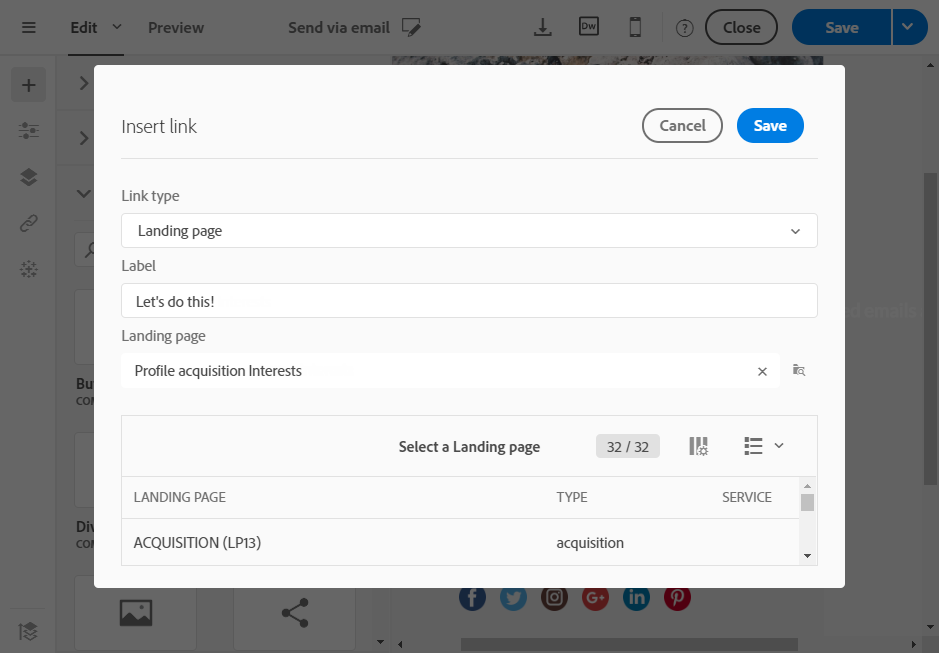

# Utöka profilresursen med ett nytt fält{#extending-the-profile-resource-with-a-new-field}

## Om att utöka profiler {#about-extending-profiles}

Här beskrivs hur du utökar en profil och en testprofil med ett dedikerat fält.

Här vill vi uppdatera våra profiler med det nya fältet med hjälp av en landningssida och sedan rikta in oss på profiler med ett nyhetsbrev som är specifikt för deras intressen.

Gör så här:

* [Steg 1: Utöka profilresursen](#step-1--extend-the-profile-resource)
* [Steg 2: Utöka testprofilen](#step-2--extend-the-test-profile)
* [Steg 3: Publicera din anpassade resurs](#step-3--publish-your-custom-resource)
* [Steg 4: Uppdatera och ange målprofiler med ett arbetsflöde](#step-4--update-and-target-profiles-with-a-workflow)

Följande fält läggs sedan till i våra profiler och kan användas i en leverans:

Relaterade ämnen:

* [Om anpassade resurser](../../developing/using/data-model-concepts.md)
* [Hantera profiler](../../audiences/using/about-profiles.md)
* [Hantera testprofiler](../../audiences/using/managing-test-profiles.md)

## Steg 1: Utöka profilresursen {#step-1--extend-the-profile-resource}

Om du vill skapa det nya fältet **Intresse** för våra profiler måste du först utöka den körklara **[!UICONTROL Profiles (profile)]** resursen.

1. På den avancerade menyn, via Adobe Campaign-logotypen, väljer du **[!UICONTROL Administration]** > **[!UICONTROL Development]** och sedan **[!UICONTROL Custom resources]**.
1. Om du inte har förlängt **[!UICONTROL Profiles]** resursen ännu klickar du på **[!UICONTROL Create]**.
1. Choose the **[!UICONTROL Extend an existing resource]** option.
1. Välj **[!UICONTROL Profile (profile)]** resurs.
1. Klicka på **[!UICONTROL Create]**.

   

1. Klicka på **[!UICONTROL Fields]** i kategorin på **[!UICONTROL Data structure]** fliken **[!UICONTROL Create element]**.

   >[!NOTE]
   >
   >Observera att om du redan har utökat **[!UICONTROL Profile]** resursen för tidigare syften kan du börja i det här steget genom att klicka på **[!UICONTROL Add field]**.

   

1. Lägg till en **[!UICONTROL Label]** och en **[!UICONTROL ID]**. Markera **[!UICONTROL Text]** texten och klicka på **[!UICONTROL Add]**.

   

1. Om du vill konfigurera fältet, på fliken **[!UICONTROL Data structure]** under listrutan **[!UICONTROL Fields]**, klickar du på  och sedan på  från fältet som du skapade tidigare.
1. I det här exemplet vill vi lägga till specifika värden. Klicka för att göra det **[!UICONTROL Specify a list of authorized values]**.

   

1. Klicka **[!UICONTROL Add an element]** och lägg sedan till så många värden som behövs genom att lägga till en **[!UICONTROL Label]** och en **[!UICONTROL ID]** och klicka **[!UICONTROL Add]**.

   Här skapar vi bokerna, utställningarna, filmerna och N/A-värdena för profiler att välja mellan dessa alternativ.

   

1. Om du vill lägga till det här fältet på **[!UICONTROL Profile]** skärmen klickar du på **[!UICONTROL Screen definition]** fliken.
1. Klicka på **[!UICONTROL Detail screen configuration]** och klicka i listrutan i **[!UICONTROL Add a personalized fields section]** listrutan **[!UICONTROL Create element]**.

   

1. Välj en **[!UICONTROL Type]**. Här vill vi lägga till ett inmatningsfält. Markera sedan det fält du skapat tidigare och klicka på **[!UICONTROL Add]**.

   

1. Om du vill lägga till en avgränsare för att bättre ordna profilfönstret klickar du på **[!UICONTROL Create an element]** och väljer **[!UICONTROL Separator]** i **[!UICONTROL Type]** listrutan.

   

Fältet är nu konfigurerat. Nu måste vi utöka den till testprofilen.

>[!NOTE]
>
>Om du inte behöver utöka testprofilresursen kan du hoppa till publiceringssteget.

## Steg 2: Utöka testprofilen {#step-2--extend-the-test-profile}

Om du vill testa om det nya skapade fältet är korrekt konfigurerat kan du testa det genom att skicka leveransen till testprofilerna. För det första måste det nya fältet också utföras på provningsprofilerna.

1. På den avancerade menyn, via Adobe Campaign-logotypen, väljer du **[!UICONTROL Administration]** > **[!UICONTROL Development]** och sedan **[!UICONTROL Custom resources]**.
1. Om du inte har förlängt **[!UICONTROL Profiles]** resursen ännu klickar du på **[!UICONTROL Create]**.
1. Choose the **[!UICONTROL Extend an existing resource]** option.
1. Välj **[!UICONTROL Test profile (seedMember)]** resurs.
1. Klicka på **[!UICONTROL Create]**.

   

1. In the **[!UICONTROL Data structure]** tab, click **[!UICONTROL Create element]**.

   

1. Markera det resursfält du skapat tidigare och klicka på **[!UICONTROL Add]**.

   

1. Utför samma steg från steg 11 till 13 som profilgenomgången ovan för att lägga till det här fältet på **[!UICONTROL Test profile]** skärmen.
1. Klicka på **[!UICONTROL Save]**.

Ditt nya fält är nu tillgängligt för både profiler och testprofiler. För att den ska kunna konfigureras på rätt sätt måste du publicera din anpassade resurs.

## Steg 3: Publicera din anpassade resurs {#step-3--publish-your-custom-resource}

Om du vill tillämpa ändringarna som gjorts på resurserna och kunna använda dem måste du utföra en databasuppdatering.

1. På den avancerade menyn väljer du **Administration** > **Utveckling** och sedan **Publicering**.
1. Som standard **[!UICONTROL Determine modifications since the last publication]** är alternativet markerat, vilket innebär att endast de ändringar som utförts sedan den senaste uppdateringen kommer att tillämpas.

   

1. Klicka **[!UICONTROL Prepare publication]** för att starta analysen som uppdaterar databasen.
1. När publikationen är klar klickar du på knappen **Publicera** för att använda de nya konfigurationerna.

   

1. När den publicerats visar rutan **Sammanfattning** för varje resurs att statusen nu är **Publicerad** och anger datumet för den senaste publikationen.

   

1. Markera **[!UICONTROL Profiles]** fliken och klicka **[!UICONTROL New]** för att se om ändringarna har implementerats korrekt.

   

Ditt nya resursfält är nu klart att användas och är riktat mot en leverans, till exempel.

## Steg 4: Uppdatera och ange målprofiler med ett arbetsflöde {#step-4--update-and-target-profiles-with-a-workflow}

Om du vill uppdatera profiler med data för det nya anpassade fältet kan du skapa en landningssida med hjälp av **[!UICONTROL Profile acquisition]** mallen. Mer information om landningssidor finns på den här [sidan](../../channels/using/getting-started-with-landing-pages.md).

Här vill vi ha en arbetsflödesprofil som inte fyllde i det här fältet som mål. De får ett mejl där de ombeds uppdatera sina profiler för att få personliga nyhetsbrev och erbjudanden. Varje profil får sedan ett personligt nyhetsbrev beroende på vad de har valt.

Först måste vi skapa en landningssida som uppdaterar fälten **Intresse** i målprofilerna:

1. Klicka på **[!UICONTROL Marketing activities]** och **[!UICONTROL Create]** markera **[!UICONTROL Landing page]**.
1. Välj typ av landningssida. Här väljer du **[!UICONTROL Profile acquisition]** eftersom vi vill uppdatera våra profiler.
1. Klicka på **[!UICONTROL Create]**.
1. Klicka på **[!UICONTROL Content]** blocket för att börja redigera innehållet på landningssidan.

   

1. Anpassa landningssidan efter behov.
1. Klicka på fältet som är konfigurerat för dina profiler för att välja mellan val av intressen. I den vänstra rutan väljer du den tidigare skapade anpassade resursen **Intresse** .

   

1. Spara landningssidan och testa den för att kontrollera att fälten är korrekt konfigurerade.
1. Klicka **[!UICONTROL Publish]** när landningssidan är klar.

Din landningssida är nu klar. Om du vill uppdatera profilerna kan du skapa ett arbetsflöde som sedan skickar ett specialerbjudande beroende på vald Intresse.

1. Klicka på **[!UICONTROL Marketing activities]** fliken **[!UICONTROL Create]** och välj sedan **[!UICONTROL Workflow]**.
1. Dra och släpp en **[!UICONTROL Query]** aktivitet för att rikta in er på de profiler eller målgrupper ni behöver.
1. Dra och släpp en **[!UICONTROL Email delivery]** aktivitet för att börja konfigurera e-postmeddelandet som ska innehålla en länk till landningssidan. Markera **[!UICONTROL Add an outbound transition with the population]**.

   

1. Skapa och utforma e-postmeddelanden efter behov. Mer information om anpassning av e-post finns på den här [sidan](../../designing/using/quick-start.md).
1. Lägg till en knapp i e-postmeddelandet som dirigerar om profiler till landningssidan.
1. Markera knappen som lagts till och klicka  i avsnittet **[!UICONTROL Link]** i den vänstra rutan.

   

1. I **[!UICONTROL Insert link]** fönstret väljer du **[!UICONTROL Landing page]** i **[!UICONTROL Link type]** listrutan och sedan den tidigare skapade landningssidan.

   

1. Klicka på **[!UICONTROL Save]**. Din e-post är nu klar. Du kan återgå till arbetsflödet.
1. Lägg till en **[!UICONTROL Wait]** aktivitet så att dina profiler hinner fylla landningssidan.
1. Lägg till en **[!UICONTROL Segmentation]** aktivitet för att dela den utgående övergången beroende på deras **intressen**.
1. Skapa ett utgående segment för varje **ränta**.

   

1. Lägg till en **[!UICONTROL Email delivery]** aktivitet efter varje övergång och skapa en personlig e-postadress beroende på vald **Intresse**.
1. Starta arbetsflödet när konfigurationen är klar.

   

Profiler får nu ett e-postmeddelande där de ombeds fylla i Intressefältet följt av ett personligt e-postmeddelande beroende på det valda värdet.
