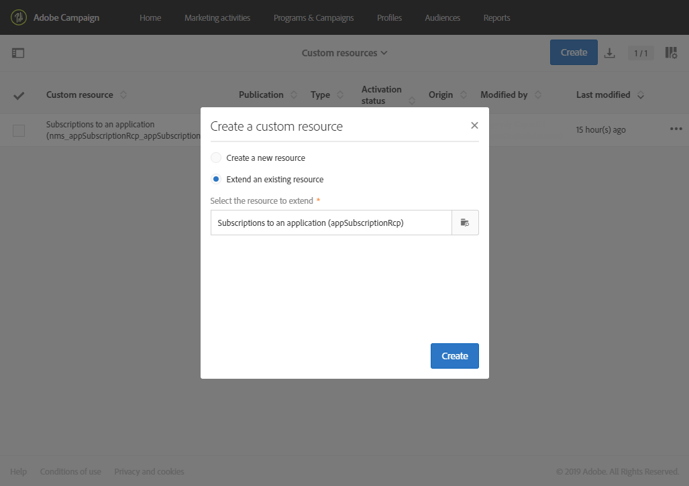

# Utöka prenumerationerna till en applikationsresurs{#extending-the-subscriptions-to-an-application-resource}

I Adobe Campaign lagras data för attribut för mobilprofiler som skickas från mobila enheter i **[!UICONTROL Subscriptions to an application (appSubscriptionRcp)]** en resurs som gör att du kan definiera de data som du vill samla in från programprenumeranterna. Mer information om anpassade resurser finns i [den här sidan](../../developing/using/key-steps-to-add-a-resource.md).

Resursen kan utökas till att samla in data som du vill skicka från den mobila enheten till Adobe Campaign.

1. I den avancerade menyn, via Adobe Campaign-logotypen, väljer du **[!UICONTROL Administration]** > **[!UICONTROL Development]** och sedan **[!UICONTROL Custom resources]**.
1. Klicka **[!UICONTROL Create]** och väljer **[!UICONTROL Extend an existing resource]** alternativ.
1. Välj **[!UICONTROL Subscriptions to an application (appSubscriptionRcp)]** resurs och klicka på **[!UICONTROL Create]**.

   

1. I **[!UICONTROL Fields]** kategori för **[!UICONTROL Data structure]** kan du definiera kunddata som du vill hämta från ditt mobilprogram genom att klicka på **[!UICONTROL Add field]** -knappen.

   >[!NOTE]
   >
   >Om du hanterar flera mobilprogram måste alla fält som används av alla dina program listas. Samla in PII-anrop från iOS eller Android anger vilka fält som hämtas av respektive program.

   

1. Lägg till en **[!UICONTROL Label]** och **[!UICONTROL ID]** till det nya fältet. Välj fältets **[!UICONTROL Type]**.

   

1. I **[!UICONTROL Link to profiles]** konfigurerar du avstämningsnyckeln som används för att länka profilerna från Adobe Campaign-databasen till programprenumeranterna, t.ex. e-postmeddelandet.

   Observera att för meddelanden i appen kan du bara definiera en avstämningsnyckel för alla dina mobilprogram.

   

1. **[!UICONTROL Save]** och publicera din anpassade resurs. Mer information om anpassad resurspublikation finns i [page](../../developing/using/updating-the-database-structure.md#publishing-a-custom-resource).
